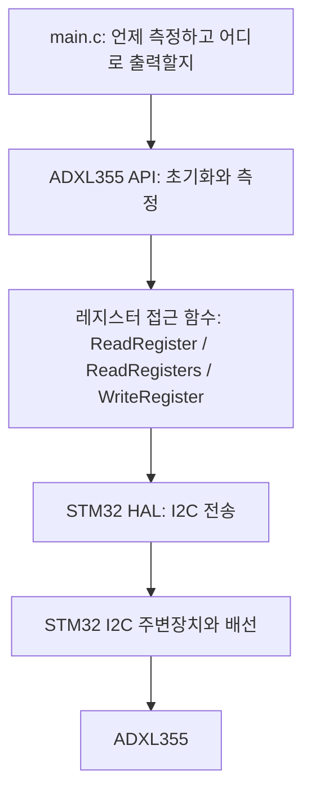
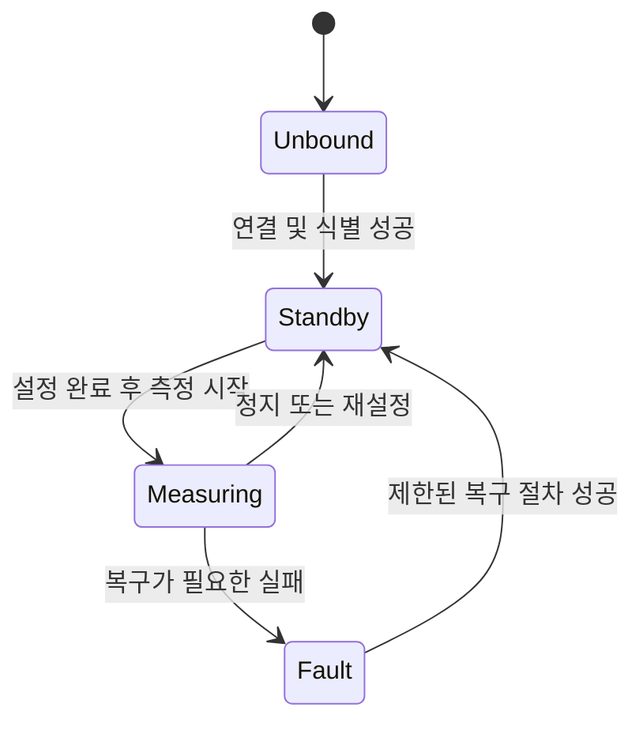
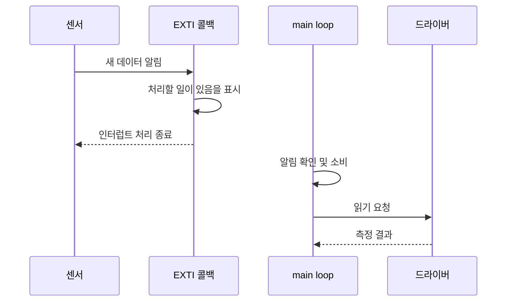
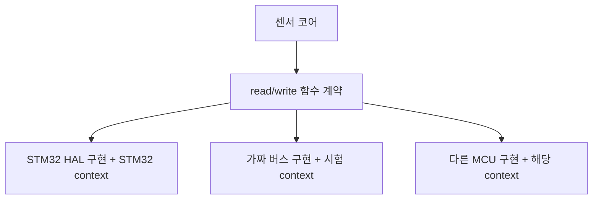

# 영상으로 배우는 드라이버 설계 패턴

> 목적: 패턴 이름을 외우는 것이 아니라, 새 센서나 주변장치의 데이터시트를 받았을 때 어떤 파일·구조체·함수부터 만들지 판단하는 능력을 기른다.
>
> 근거: [영상 전체](https://www.youtube.com/watch?v=_JQAve05o_0), 영어 자동 자막, 주요 코드 화면 재확인, [제작자의 공개 예제](https://github.com/pms67/LittleBrain-STM32F4-Sensorboard/tree/master/LittleBrain_DriverExample). 영상 내용은 **관찰**, 구조에서 읽어낸 의미는 **해석**, 재사용을 위한 변경은 **확장**으로 구분한다. 공개 저장소의 현재 코드와 영상 속 코드는 일부 다르다.

## 1. 먼저 드라이버가 하는 일을 한 문장으로 정의하기

드라이버는 **애플리케이션의 의도를 장치가 이해하는 거래로 바꾸고, 장치가 준 비트를 애플리케이션이 이해하는 값으로 바꾸는 모듈**이다.

예를 들어 애플리케이션은 “125 Hz로 가속도를 측정하고 싶다”고 생각한다. ADXL355는 그런 문장을 이해하지 못하고 `FILTER` 레지스터의 특정 비트 조합만 이해한다. 반대 방향에서 ADXL355가 주는 것은 `m/s²` 실수가 아니라 여러 바이트에 나뉜 20비트 값이다.

따라서 드라이버에는 두 방향의 번역이 있다.


첫 드라이버에서는 이 흐름이 잘 보이게 만드는 것만으로도 설계의 상당 부분이 정리된다.

## 2. 영상의 구조를 네 층으로 읽기

**관찰 — [06:40 파일 구성](https://www.youtube.com/watch?v=_JQAve05o_0&t=400s), [16:11 통신 함수](https://www.youtube.com/watch?v=_JQAve05o_0&t=971s).** 영상은 `main.c`, `ADXL355.h`, `ADXL355.c`, STM32 HAL을 사용한다.



| 층 | 알아야 할 것 | 이 층에서 결정하지 않을 것 |
|---|---|---|
| 애플리케이션 | 측정 주기, 사용 목적, 로그 형식 | 센서 비트 배치와 I²C 프레임 |
| 센서 드라이버 | ID, 설정, 데이터 형식, 변환식 | UART/USB 로그 문자열 |
| 통신 어댑터/래퍼 | 버스 핸들, 장치 주소, 전송 길이 | 가속도 값의 의미 |
| MCU HAL/BSP | 핀, 클록, MCU 주변장치 제어 | 센서의 FILTER 값 |

**해석.** 이것은 계층화와 관심사 분리다. `ADXL355.c`에서 USB 출력까지 하면 다른 제품에서 그 센서를 쓸 때 USB 의존성도 따라온다. 반대로 `main.c`에 레지스터 비트 연산을 넣으면 장치를 교체할 때 애플리케이션이 크게 바뀐다.

**첫 구현의 기준.** 반드시 네 개의 별도 라이브러리를 만들 필요는 없다. 처음에는 센서 `.h/.c` 한 쌍 안에서 “공개 API → 작은 레지스터 함수”로 구분해도 충분하다. 파일 수보다 변경 이유를 분리하는 것이 중요하다.

## 3. 패턴 A — 구조체를 장치 한 개의 문맥으로 사용하기

**관찰 — [13:04 구조체](https://www.youtube.com/watch?v=_JQAve05o_0&t=784s).** 영상의 `ADXL355` 구조체에는 I²C 핸들 포인터, 3축 가속도, 온도가 들어간다. 함수들은 `ADXL355 *dev`를 받는다.

아래는 같은 개념을 설명하기 위해 이름을 바꾼 코드다.

```c
typedef struct {
    I2C_HandleTypeDef *bus; /* 이미 만들어진 MCU I2C 핸들을 참조 */
    float accel_mps2[3];   /* 마지막으로 읽은 X, Y, Z */
    float temperature_c;
} accelerometer_t;

HAL_StatusTypeDef accelerometer_read(accelerometer_t *dev);
```

여기서 구조체는 센서 자체가 아니다. **소프트웨어가 센서 한 개를 다루기 위해 기억할 정보**다. 하드웨어 레지스터와 C 구조체는 서로 다른 장소에 있다.

| 구조체 멤버 후보 | 필요해지는 이유 |
|---|---|
| 버스 핸들 | 어느 MCU 통신 주변장치를 사용할지 |
| 장치 주소 또는 chip-select | 동일 버스에서 어느 장치를 사용할지 |
| 현재 range | raw 값을 올바른 단위로 바꾸기 위해 |
| 준비 상태 | 초기화 전 읽기를 구분하기 위해 |
| 마지막 샘플과 유효 여부 | 호출자에게 데이터 상태를 전달하기 위해 |
| 보정 계수 | 장치마다 다른 offset/gain을 적용하기 위해 |
| 버스 함수와 context | 플랫폼을 교체하거나 PC에서 시험하기 위해 |

**해석.** C에서 자주 쓰는 instance/context 패턴이며, “상태 + 그 상태를 받는 함수”라는 객체 기반 구성이다. C++ `class`가 없어도 객체 단위로 코드를 구성할 수 있다. 다만 구조체 내부가 헤더에 모두 노출되면 강한 정보 은닉까지 이뤄지는 것은 아니다.

**확장.** 여러 장치를 지원하려면 고정 장치 주소를 매크로 하나에만 두지 말고 인스턴스 설정에 넣는다. 단, 같은 버스에 실제로 연결 가능한지는 해당 부품의 전기·프로토콜 제약을 별도로 확인한다.

## 4. 패턴 B — 핸들을 외부에서 받아 의존성을 연결하기

**관찰 — [18:41 초기화](https://www.youtube.com/watch?v=_JQAve05o_0&t=1121s).** `main.c`가 장치 구조체와 HAL 핸들을 만들고, 초기화 함수가 HAL 핸들 포인터를 장치 구조체에 저장한다.

```c
/* 개념 예제: HAL이 생성한 hi2c1의 초기화가 먼저 끝나 있어야 한다. */
I2C_HandleTypeDef hi2c1;
accelerometer_t sensor;

void bind_sensor(accelerometer_t *dev, I2C_HandleTypeDef *bus)
{
    dev->bus = bus;
}

/* 호출 */
/* bind_sensor(&sensor, &hi2c1); */
```

이 한 줄 `dev->bus = bus;`에는 세 가지 중요한 의미가 있다.

1. `hi2c1` 전체를 복사하지 않는다. 그 객체의 주소를 저장한다.
2. 이후 함수들은 `dev`만 받아도 버스에 접근할 수 있다.
3. `dev`가 그 핸들을 사용하는 동안 핸들 객체가 살아 있어야 한다.


**해석.** 이것은 구체 의존성을 외부에서 주입하는 방법이다. 드라이버가 `extern hi2c1`이라는 전역 이름에 직접 의존하지 않게 한다. 따라서 다른 I²C 핸들을 연결하기 쉬워진다.

**아직 하지 않은 것.** 영상의 헤더는 STM32 HAL 타입을 알고, 구현은 HAL 함수를 직접 부른다. 따라서 핸들을 넘긴다는 이유만으로 MCU와 완전히 독립적인 드라이버가 되는 것은 아니다.

**처음 외울 구분.** 핸들은 “어떤 대상을 다룰지”, 함수 포인터는 “어떤 구현을 실행할지”를 전달한다. 둘은 함께 쓰이지만 같은 개념이 아니다.

## 5. 패턴 C — 반복되는 HAL 호출을 작은 레지스터 API로 감싸기

**관찰 — [16:11–18:40](https://www.youtube.com/watch?v=_JQAve05o_0&t=971s).** 영상은 단일 레지스터 읽기, 여러 레지스터 읽기, 단일 레지스터 쓰기 함수를 만든다.

`HAL_I2C_Mem_Read()`를 직접 쓸 때마다 호출자는 다음을 지정해야 한다.

| 인수 | 의미 | 센서 함수가 매번 알 필요가 있는가? |
|---|---|---|
| I²C 핸들 | MCU의 통신 문맥 | 구조체에서 가져오면 됨 |
| 장치 주소 | 버스에서 센서 선택 | 인스턴스/상수에서 가져오면 됨 |
| 레지스터 주소 | 센서 내부에서 읽을 위치 | 필요 |
| 레지스터 주소 길이 | 여기서는 8비트 주소 | 보통 어댑터가 고정 가능 |
| 버퍼 | 읽은 데이터를 넣을 곳 | 필요 |
| 데이터 길이 | 몇 바이트를 읽을지 | 필요 |
| timeout | 언제 기다리기를 그만둘지 | 통신 정책으로 관리 가능 |

**해석.** 작은 래퍼는 변하지 않는 인수를 감춰 상위 코드를 읽기 쉽게 만든다. 이를 어댑터/파사드 역할로 해석할 수 있지만, 영상이 정형화된 GoF 클래스 구조를 구현한 것은 아니다.

다음과 같은 호출을 보면 의도가 바로 읽힌다.

```c
/* 아래는 호출 모양을 설명하는 의사 예제다. */
/* read_regs(dev, TEMP_HIGH_REG, bytes, 2); */
/* read_regs(dev, ACCEL_X_HIGH_REG, bytes, 9); */
```

첫날에는 이 래퍼 세 개만 만들어도 충분하다. 나중에 timeout을 바꾸거나 통신 로그를 넣을 때도 공통 지점이 생긴다.

**꼭 구분할 것.** `I2C_MEMADD_SIZE_8BIT`는 센서 레지스터 주소가 8비트라는 뜻이다. 읽는 데이터가 8비트 하나라는 뜻은 아니다. 길이는 별도 인수다. 또한 STM32F4의 해당 HAL API는 7비트 I²C 주소를 왼쪽으로 한 비트 이동한 값을 받는다. 이 규칙은 HAL 경계에 속하며 모든 I²C API에 적용되는 규칙은 아니다. [ST의 HAL 구현과 API 주석](https://github.com/STMicroelectronics/stm32f4xx-hal-driver/blob/master/Src/stm32f4xx_hal_i2c.c)

## 6. 패턴 D — 데이터시트의 이름과 비트 의미를 코드에 보존하기

**관찰 — [10:35 레지스터 맵](https://www.youtube.com/watch?v=_JQAve05o_0&t=635s), [21:38 설정 대상 선정](https://www.youtube.com/watch?v=_JQAve05o_0&t=1298s).** 영상은 레지스터 주소에 이름을 붙이고, 원하는 동작에서 설정 바이트를 계산한다.

다음 네 가지는 서로 다르다.

| 항목 | ADXL355 예 | 질문 |
|---|---|---|
| 장치 주소 | `0x1D` | 어느 칩에 말하는가? |
| 레지스터 주소 | `FILTER = 0x28` | 그 칩의 어느 위치인가? |
| 필드 위치 | HPF 필드, ODR 필드 | 그 바이트에서 어느 비트인가? |
| 써 넣을 값 | 영상의 `0x05` | 어떤 동작을 요청하는가? |

초보자가 가장 쉽게 섞는 것이 `0x28`과 `0x05`다. `0x28`은 쓰러 가는 곳이고 `0x05`는 그곳에 쓸 내용이다.

### 6.1 사용자 링크의 시작 구간을 실제 업무로 번역하기

영상의 설정과 그 학습상 의미를 표로 풀면 다음과 같다.

| 요구사항 | 찾아볼 데이터시트 부분 | 코드 산출물 |
|---|---|---|
| 천천히 갱신되는 측정값 | ODR 설정 표 | ODR 인코딩 선택 |
| 높은 주파수 성분 완화 | low-pass 설정 표 | ODR와 연결된 LPF 설정 이해 |
| DC·중력 성분 보존(추가 학습 해석) | high-pass enable/disable | HPF 끔 |
| 실제 측정을 시작함 | power-control 비트 | standby 해제 |

여기서 배울 핵심은 `0x05`를 외우는 일이 아니라 **요구사항 → 필드 선택 → 비트 배치 → 바이트 → 쓰기**라는 순서다.

### 6.2 이름 있는 값으로 한 단계 발전시키기

```c
#include <stdint.h>

enum {
    FILTER_REG = 0x28,
    POWER_REG = 0x2D
};

/* 이 예제에서만 사용하는 고정 구성이다. */
static const uint8_t filter_no_hpf_odr125 = 0x05u;
static const uint8_t power_measure_temp_drdy_on = 0x00u;
```

설정 종류가 하나라면 설명이 붙은 상수로 충분하다. 설정 종류가 늘면 enum과 변환 함수를 추가한다. 설정 검증, 필드 인코딩, 레지스터 전송을 별도 작업으로 생각하면 코드가 덜 복잡해진다.

고정된 초기 설정에서 바이트 전체를 쓰는 방식과, 운전 중 한 필드만 바꾸는 방식은 다르다. 후자에는 다른 필드 보존이 필요할 수 있다. 그때 read-modify-write를 검토하되, 해당 레지스터가 일반 RW이고 읽기/쓰기 부작용이 없는지 먼저 확인한다. 상세 판단표는 03 문서에 있다.

## 7. 패턴 E — 초기화를 장치와의 대화 순서로 설계하기

**관찰 — [18:41–26:17](https://www.youtube.com/watch?v=_JQAve05o_0&t=1121s).** 영상의 큰 순서는 다음과 같다.


초기화는 단순한 레지스터 쓰기 목록이 아니다. **호출 전의 불확실한 상태를 호출 후 사용할 수 있는 상태로 바꾸는 절차**다.

첫 구현에서 다음 질문에 답해보면 된다.

1. MCU의 I²C 설정과 센서의 전원 안정화가 먼저 끝났는가?
2. 내 코드가 기대하는 장치인지 확인할 수 있는가?
3. 설정 변경은 어느 전원/동작 모드에서 허용되는가?
4. 모든 필요한 설정 후 측정을 켜는가?
5. 성공을 반환한 뒤 어떤 기능을 사용해도 되는가?

**해석.** 영상은 절차형 초기화와 간단한 probe, 즉 장치 식별을 보여준다. 이를 “초기화 프로토콜”이라고 부를 수 있다. GoF의 Template Method를 구현했다고 부를 필요는 없다.

**확장.** 제품에서 재초기화·절전·복구가 필요해지면 상태를 명시한다.



이 상태도는 영상에 그대로 나온 코드가 아니라 확장 방향이다. 처음부터 상태머신 프레임워크를 도입할 필요는 없다. 상태 enum 하나와 함수의 전제조건으로 시작할 수 있다.

## 8. 패턴 F — 측정은 읽기·해석·변환·전달로 나누기

**관찰 — [26:18 온도](https://www.youtube.com/watch?v=_JQAve05o_0&t=1578s), [30:21 가속도](https://www.youtube.com/watch?v=_JQAve05o_0&t=1821s).** 센서에서 바이트를 받아 raw 값을 조립한 뒤 단위 변환을 한다.

| 단계 | 입력 | 출력 | 이 단계의 책임 |
|---|---|---|---|
| acquire | 장치와 레지스터 주소 | 바이트 배열 | 전송 성공 여부 |
| decode | 바이트 배열 | signed/unsigned raw | 비트 위치와 부호 해석 |
| scale | raw와 설정/보정 정보 | 물리량 | 단위와 계수 |
| publish | 완성된 샘플 | 호출자의 결과 | 유효성, 시점, 일관성 |

### 8.1 온도 데이터로 바이트 조립 이해하기

상위 바이트의 아래 4비트와 하위 바이트 8비트를 합치면 12비트가 된다.

```text
첫 바이트       둘째 바이트
xxxx aaaa       bbbb bbbb
     └──────┬────────┘
        aaaa bbbb bbbb   → 12비트 unsigned raw
```

```c
static uint16_t decode_u12_be(const uint8_t bytes[2])
{
    return (uint16_t)((((uint16_t)bytes[0] & 0x0Fu) << 8)
                      | (uint16_t)bytes[1]);
}
```

함수에 하드웨어 의존성이 없으므로 배열 두 바이트만 넣어 시험할 수 있다. “I²C가 맞는가?”와 “비트 조립이 맞는가?”를 따로 확인할 수 있는 것이 이 분리의 실용적 장점이다.

### 8.2 가속도로 부호 복원 이해하기

ADXL355 가속도 값 한 축은 3바이트에 담긴다. 상위 20비트가 데이터이고 가장 아래 4비트는 해당 출력 형식의 데이터에 포함하지 않는다. 20비트 raw의 bit 19가 부호 역할을 한다.

```text
byte 0          byte 1          byte 2
ssss ssss       mmmm mmmm       llll xxxx
└──────────────────────────┘
             20비트
```

이 교육용 함수는 unsigned로 조립한 다음 수학적으로 부호를 복원한다.

```c
static int32_t decode_s20_be(const uint8_t bytes[3])
{
    uint32_t u = ((uint32_t)bytes[0] << 12)
               | ((uint32_t)bytes[1] << 4)
               | ((uint32_t)bytes[2] >> 4);

    if ((u & UINT32_C(0x80000)) != 0u) {
        return (int32_t)u - INT32_C(0x100000);
    }
    return (int32_t)u;
}
```

`u`의 범위는 0부터 1,048,575까지라서 먼저 `int32_t`로 표현할 수 있다. 부호 비트가 켜져 있으면 2²⁰을 빼서 −524,288부터 −1까지로 바꾼다. 이 설명을 이해하면 12·14·18·24비트 센서도 같은 방식으로 읽을 수 있다.

| 세 바이트 | 20비트 값 | 해석 결과 |
|---|---|---:|
| `00 00 00` | `0x00000` | 0 |
| `00 00 10` | `0x00001` | 1 |
| `7F FF F0` | `0x7FFFF` | 524287 |
| `80 00 00` | `0x80000` | -524288 |
| `FF FF F0` | `0xFFFFF` | -1 |

### 8.3 단위 변환은 현재 설정과 함께 이해하기

영상의 기본 range에서 변환 계수는 `1 / 256000 g/LSB`와 같은 값이다. raw에 이를 곱하면 `g`, 다시 중력 가속도 상수를 곱하면 `m/s²`다. 영상의 단위 표기 `acc_mps2`, `temp_C`는 사용자가 값을 해석하기 쉽게 한다.

**확장.** range를 바꾸는 기능을 만들면 변환 계수도 같은 설정에서 선택해야 한다. “센서 설정은 ±8 g인데 계산은 ±2 g 계수”처럼 둘이 어긋나지 않게 range와 scale의 관계를 한 곳에서 관리한다. 더 정밀한 시스템에서는 offset과 gain 보정을 추가한다.

## 9. 패턴 G — 상태 반환과 데이터 출력을 분리하기

**관찰.** 저수준 읽기 함수는 HAL 상태를 반환하고, 실제 읽은 바이트는 `uint8_t *data`가 가리키는 곳에 쓴다. 측정 함수는 결과를 장치 구조체에 저장한다.

```text
return 값       → 작업이 성공했나?
출력 포인터     → 성공했다면 어떤 데이터를 얻었나?
```

이것이 흔한 status + output parameter API다. 읽은 데이터 0은 정상 측정값일 수 있으므로 “0이면 오류”로 사용할 수 없는 경우에 특히 유용하다.

**확장 예제 — 계약을 먼저 읽기.** 아래 인터페이스는 새로 제안하는 형태이며 영상 API는 아니다.

```c
typedef enum {
    SENSOR_OK = 0,
    SENSOR_E_ARGUMENT,
    SENSOR_E_IO,
    SENSOR_E_NOT_READY
} sensor_status_t;

typedef struct {
    float xyz_mps2[3];
} sensor_sample_t;

/* 계약: 성공했을 때만 *out을 갱신한다. */
/* sensor_status_t sensor_read(sensor_t *dev, sensor_sample_t *out); */
```

여기서 호출자는 실패하면 이전 값이 그대로 남아 있더라도 그것을 새 데이터로 사용하지 않는다. API의 반환값과 데이터의 유효성이 연결되기 때문이다.

**중요한 설계 선택.** 구조체 내부에 마지막 측정을 보관하는 방식도, 호출자가 준 샘플 구조체에 쓰는 방식도 가능하다. 전자는 작고 직관적이고, 후자는 샘플 소유권과 데이터 흐름이 더 명확하다. 팀의 기존 드라이버 스타일에 맞추되 계약을 일관되게 유지한다.

## 10. 패턴 H — 인터럽트는 알림, 실제 처리는 바깥에서

**관찰 — [34:10 이후](https://www.youtube.com/watch?v=_JQAve05o_0&t=2050s).** 영상은 data-ready 인터럽트에서 플래그를 세우고, main loop에서 측정을 읽는 방식을 설명한다.



**해석.** 이것은 interrupt-driven notification과 deferred processing이다. ISR에서 긴 통신·로그 출력을 끝내려 하지 않고 처리할 일을 다른 실행 문맥으로 넘긴다.

**처음 구현할 때.** 우선 폴링으로 ID와 측정 읽기를 확인한 다음 data-ready를 연결하면 디버깅 범위를 줄일 수 있다. 인터럽트 도입 후에는 “몇 번 발생했는지 모두 보존해야 하는지”를 정한다.

| 목적 | 어울리는 알림 형태 |
|---|---|
| 가장 최근 값 하나면 됨 | pending 플래그 |
| 발생 횟수를 추적해야 함 | 카운터 또는 RTOS counting notification |
| 모든 샘플이 필요함 | 장치 FIFO, DMA, 큐 등과 결합 |

단순 플래그는 여러 알림을 하나로 합칠 수 있다. `volatile`만 붙이면 알림 소비가 원자적으로 된다고 볼 수도 없다. 제품 코드에서는 MCU의 짧은 임계구역이나 적절한 RTOS/atomic 메커니즘으로 알림을 소비한다. 구체 방법은 03·04 문서에서 다룬다.

## 11. 패턴 I — 함수 포인터 + context로 통신 구현 교체하기

**확장.** 영상은 HAL 핸들을 넘기지만, 센서 통신을 함수 포인터 표로 추상화하지는 않는다. 다른 프로젝트에서 흔히 보는 아래 구조가 영상에서 한 단계 발전한 형태다.

```c
typedef int (*reg_read_fn)(void *ctx, uint8_t reg,
                           uint8_t *dst, uint16_t count);
typedef int (*reg_write_fn)(void *ctx, uint8_t reg,
                            const uint8_t *src, uint16_t count);

typedef struct {
    reg_read_fn read;
    reg_write_fn write;
} register_io_t;

typedef struct {
    const register_io_t *io;
    void *io_ctx;
} portable_sensor_t;
```

이 구조를 읽는 순서는 다음과 같다.

1. `io->read`는 호출할 함수다.
2. `io_ctx`는 그 함수가 일할 때 사용할 구체 정보다.
3. STM32 구현이라면 context에 `I2C_HandleTypeDef *`, 장치 주소, timeout을 넣는다.
4. PC 시험 구현이라면 context에 가짜 레지스터 배열과 전송 기록을 넣는다.
5. 센서 코어는 둘 중 무엇인지 몰라도 동일한 `read()`를 호출한다.



**패턴 이름과 실제 의미.** 선택 가능한 통신 구현은 Strategy 역할이고, HAL API를 공통 계약에 맞추는 함수는 Adapter 역할이다. `io`와 `io_ctx`를 외부에서 연결하는 것은 의존성 주입이다. 이 셋은 같은 구조를 서로 다른 관점에서 설명한다.

**언제 도입하나?** 다른 MCU 지원, I²C/SPI 변형, PC 단위시험, 팀 표준 API 요구가 있을 때 유용하다. 한 MCU에서 동작 확인만 하는 첫날에는 영상의 HAL 래퍼로 시작해도 된다. 공통 인터페이스가 실제 장치의 버스 framing 차이를 감추도록 만들되, I²C와 SPI의 의미가 다른 부분까지 억지로 같게 만들지는 않는다.

**수명 계약.** `io`, `io_ctx`, context 안의 핸들은 사용 기간 내내 유효해야 한다. 함수 포인터는 동작을 교체하는 도구이지 메모리 수명을 관리하는 도구가 아니다.

## 12. 패턴 J — 초기 동작 확인을 작은 증거의 사슬로 만들기

**관찰 — [36:10 디버깅](https://www.youtube.com/watch?v=_JQAve05o_0&t=2170s).** 영상은 ID, 초기화 결과, 온도 변화, 보드 방향에 따른 가속도를 차례로 확인한다.

| 확인 | 얻는 증거 | 아직 증명하지 않은 것 |
|---|---|---|
| I²C 전송 성공 | 버스 거래가 완료됨 | 올바른 장치/값인지 |
| ID 일치 | 예상 장치와 통신할 가능성이 높음 | 설정이 모두 반영됐는지 |
| 온도 변화 | 데이터 경로와 변환의 기본 동작 | 절대 온도 정확도 |
| 중력 축 이동 | 축 매핑과 대략적 scale | 모든 부호·범위·속도 조건 |

**해석.** 이것은 bring-up 절차다. 처음부터 완전한 시험 환경을 만드는 대신, 실패했을 때 원인을 좁힐 수 있는 순서로 증거를 쌓는다.

**빠른 실습 확장.** 보드를 여섯 방향으로 놓아 각 축의 양·음 중력 응답을 보고, 읽기 실패를 한 번 유도해 호출자가 오류를 구분하는지 확인한다. 이후 실제 제품의 ODR, 버스 부하, FIFO 조건을 시험한다.

## 13. 영상에서 관찰한 것과 앞으로 익힐 것 정리

| 개념 | 영상에서의 수준 | 온보딩에서 기억할 내용 |
|---|---|---|
| 계층화 | main / sensor / HAL 구분 | 바뀌는 이유를 분리한다 |
| instance/context | 구조체 + `dev` 포인터 | 장치별 정보를 한곳에 묶는다 |
| 의존성 주입 | HAL 핸들 전달 | 하드코딩된 전역 의존성을 줄인다 |
| 어댑터/파사드 역할 | 작은 HAL 래퍼 | 반복되는 통신 인수를 감춘다 |
| 설정 인코딩 | 데이터시트 표 → 설정 바이트 | 주소와 내용을 구분한다 |
| 초기화 프로토콜 | 식별 → 설정 → 측정 | 순서와 성공 조건이 중요하다 |
| 측정 파이프라인 | read → raw → 단위 | 하드웨어 접근과 계산을 분리한다 |
| 지연 처리 | IRQ 알림 → main 처리 설명 | ISR에서 할 일을 작게 한다 |
| Strategy/ops table | 직접 구현하지 않음 | 이식·시험 필요 시 추가한다 |
| 상태머신 | 암묵적인 초기화/측정 상태 | 절전·복구가 생기면 명시한다 |
| RAII/템플릿/union | 이 C 드라이버의 중심이 아님 | 04에서 필요에 맞춰 배운다 |

## 14. 내 드라이버에 바로 적용하는 설계 질문

새 장치를 맡았을 때 다음 빈칸을 채워보자.

```text
장치 한 개를 나타내는 타입: __________________
장치 문맥에 필요한 정보: ____________________
통신을 담당하는 하위 API: ___________________
ID를 읽는 레지스터와 기대값: _________________
초기화 성공의 의미: ________________________
설정 변경이 허용되는 상태: __________________
한 샘플의 바이트 수와 비트 배치: _____________
raw 값의 signed/unsigned 및 폭: ______________
단위 변환에 필요한 설정/보정: ________________
read 실패 시 output의 상태: _________________
호출 가능한 문맥(main/task/ISR): ______________
소유자와 필요한 객체 수명: __________________
```

이 질문에 답할 수 있으면 다른 사람이 만든 드라이버도 빠르게 읽을 수 있다. 함수 이름을 모두 외우기보다 `init()`과 `read()` 한 경로를 끝까지 따라가는 것이 먼저다.

## 15. 학습을 방해하지 않을 정도로 알아둘 버전 주의사항

이 절은 오류 목록이 아니라, 예전 강의와 현재 자료를 함께 볼 때 혼동을 줄이는 참고다.

- 영상의 온도 변환은 1852 LSB 기준이다. 현재 데이터시트의 기준은 1885 LSB이며 제조사가 정정을 확인했다. 새 코드는 사용하는 데이터시트 판을 기준으로 작성한다. [제조사 설명](https://ez.analog.com/mems/f/q-a/575682/adxl355-temperature-sensor-output-at-25c-1852-or-1885-lsb)
- 레지스터 여러 개를 한 번에 읽는 것과 동일 시점 샘플 보장은 별개다. 해당 장치의 갱신·래치 규칙을 확인한다. ADXL355의 관련 설명은 현행 데이터시트 29쪽에 있다. [ADXL354/ADXL355 데이터시트](https://www.analog.com/media/en/technical-documentation/data-sheets/adxl354_adxl355.pdf)
- 주소가 다른 두 칩이 항상 같은 버스를 안전하게 공유하는 것은 아니다. ADXL355에는 별도 I²C 공유 제약이 있으므로 실제 배선 단계에서 같은 데이터시트의 Serial Communications 절을 확인한다.
- 현재 공개 저장소는 영상과 가속도 부호 변환 코드 및 main loop 측정 위치가 다르다. 영상의 흐름 설명과 저장소의 현재 구현을 같은 스냅샷으로 취급하지 않는다. 본문의 새로운 예제는 원본 전체를 복제한 코드가 아니다.

다음 단계는 **03의 데이터시트 추출표를 내 장치에 채우기**, 문법이 막힐 때 **04에서 해당 표현을 찾아보기**다.
