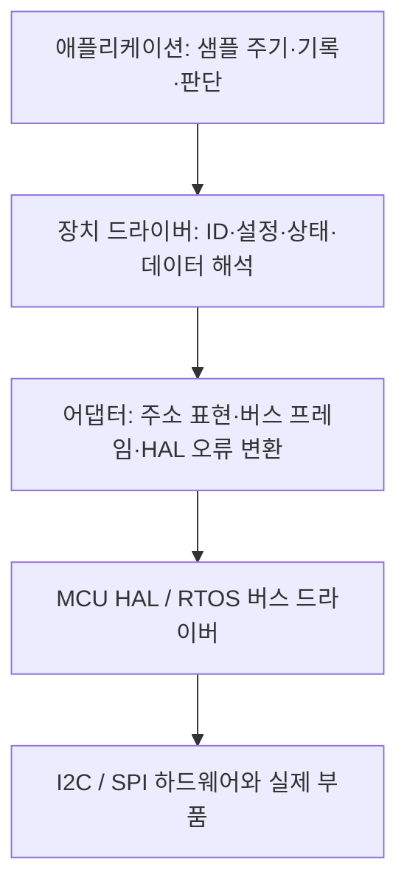

# 데이터시트에서 드라이버 설계로: 공통 패턴과 구현 순서

이 문서는 ADXL355 영상에서 배운 작업을 **다른 센서·ADC·EEPROM·통신 칩에도 옮겨 쓰기 위한 온보딩 자료**다. 영상의 발언을 재구성한 문서가 아니라, 데이터시트와 공식 문서를 확인하여 정리한 **추가 도출·일반화**다. 영상 자체의 구성과 설계 해석은 앞 문서에서 읽고, 여기서는 “내가 맡은 부품을 어떤 순서로 구현할까?”에 집중한다.

목표는 처음부터 모든 경우를 처리하는 드라이버 프레임워크를 만드는 것이 아니다. 먼저 **ID를 읽고 → 필요한 설정을 적용하고 → 유효한 데이터를 읽어 단위까지 변환하는 작은 드라이버**를 완성한다. 다중 장치·RTOS·DMA가 필요해질 때 다음 구조를 덧붙인다.

코드 조각은 계약을 설명하기 위한 C 예제다. `SENSOR_X`, `X_*`, `DRV_*` 등은 교육용 이름이며 특정 부품의 완성 드라이버가 아니다. 장치별 주소·초기화 시퀀스·타이밍·레지스터 동작은 실제 데이터시트로 채워야 한다. 예제에 없는 lock·보드 초기화·전원 제어가 자동으로 해결되는 것은 아니다.

## 1. 먼저 읽을 범위: 필수와 확장

| 단계 | 지금 익힐 내용 | 완료의 기준 |
|---|---|---|
| 첫 구현에 필수 | 데이터시트 추출표, 레지스터 read/write, 주소, ID 검사, 초기화 순서, 비트 필드, raw 값 해석, 반환값 | 실제 부품에서 ID와 설명 가능한 측정값을 얻는다 |
| 재사용할 때 유용 | 장치별 handle, 플랫폼 어댑터, 설정과 상태의 분리, 출력값 갱신 규칙, 테스트용 fake bus | 같은 드라이버를 두 장치나 다른 MCU에 연결할 수 있다 |
| 필요가 생기면 추가 | RTOS lock, IRQ, DMA, 비동기 상태 머신, FIFO, cache, register descriptor | 해당 기능의 시간·수명·동시성 요구를 만족한다 |
| 해당 장치에서만 확인 | bank/page, W1C/RC, unlock sequence, CRC/PEC, MMIO barrier, DMA cache | 데이터시트에 있는 특수 동작을 안전하게 처리한다 |

가장 중요한 원칙은 다음과 같다.

> 드라이버는 “레지스터 주소에 값을 쓰는 함수 모음”에서 출발하지만, 실제 책임은 **하드웨어의 접근 규칙·상태·데이터 형식을 프로그램이 사용할 수 있는 계약으로 바꾸는 것**이다.

## 2. 데이터시트를 읽는 순서

### 2.1 첫날에는 모든 페이지를 같은 깊이로 읽지 않는다

1. **부품과 연결 확인**: 정확한 모델, 패키지, 보드 회로, 전원과 IO 전압, 인터페이스 선택 핀.
2. **통신 인터페이스**: I2C 주소 또는 SPI mode, 최대 속도, 명령/주소 형식, read/write 타이밍.
3. **ID·reset·power control**: 통신 확인 방법과 부품을 알려진 상태로 만드는 방법.
4. **필요한 설정 레지스터**: 범위, 출력 데이터 속도, 필터, 채널, 측정 모드.
5. **데이터 레지스터**: 주소, 길이, 바이트 순서, 유효 비트, 부호, 단위 변환.
6. **상태·타이밍**: 새 데이터 판단, 첫 데이터가 유효해지는 시점, busy가 해제되는 조건.
7. **필요한 추가 기능**: 인터럽트, FIFO, self-test, calibration, 전원 관리.

레지스터 맵은 빠른 목차이고, 상세 설명은 동작 규칙이다. 맵에 `R/W`라고 쓰여 있어도 “standby에서만 변경 가능” 같은 조건은 별도 절에 있을 수 있다. 따라서 사용할 레지스터는 **맵의 행과 상세 설명을 한 쌍으로 읽는다**.

### 2.2 데이터시트 → 설계 요구사항 추출표

이 표를 부품마다 한 번 채우면 구현 중 검색하는 시간이 크게 줄어든다. 처음에는 현재 필요한 행만 채워도 된다.

| 추출 항목 | 데이터시트에서 찾을 질문 | 코드·문서에 남길 결과 |
|---|---|---|
| 문서 식별 | 정확한 부품명, 문서 revision, 해당 silicon revision은? | 드라이버 README의 기준 문서 |
| 보드 조건 | 전원/IO 전압, 인터페이스 선택 핀, 주소 핀은? | 보드 초기화의 전제조건 |
| 통신 주소 | 7-bit I2C 주소인가, R/W 비트 포함 표기인가? | `addr7` 같은 의미 있는 이름 |
| SPI 형식 | CPOL/CPHA, bit order, read bit, dummy cycle은? | 어댑터의 프레임 계약 |
| 레지스터 주소 | 8-bit인가 16-bit인가, bank/page가 있는가? | 주소형과 직렬화 함수 |
| 레지스터 데이터 | 8/16/24/32-bit인가, 접근 폭 제한이 있는가? | read/write 길이와 byte codec |
| 바이트 순서 | 낮은 주소가 MSB인가 LSB인가? | `decode_*_be/le()` |
| 연속 접근 | auto-increment인가, FIFO는 예외인가? | burst 함수의 사용 범위 |
| 신원 확인 | 어떤 ID를 어떤 값/마스크로 비교하는가? | `probe()` 또는 init의 ID 검사 |
| reset | 명령 값, reset 후 지연/완료 표시, 보존 영역은? | reset 함수와 cache 무효화 |
| 접근 권한 | RO/RW/WO인가, 필드마다 다른가? | 허용되는 접근과 private helper |
| 접근 부작용 | 읽어서 clear, 써서 start, FIFO pop인가? | 별도의 명령/이벤트 함수 |
| 예약 비트 | 0/1 고정, reset값 유지, 보존 중 어떤 규칙인가? | 쓰기 마스크·구성 규칙 |
| 설정 허용 상태 | standby·idle·unlock 이후에만 쓸 수 있는가? | 설정 순서와 상태 검사 |
| 설정 의존성 | range가 scale에, ODR이 filter에 영향을 주는가? | 설정 검증과 파생값 계산 |
| 타이밍 | 전원 후, reset 후, mode 변경 후 언제 유효한가? | 지연·poll·timeout의 근거 |
| 데이터 준비 | status/DRDY/FIFO count 중 무엇으로 확인하는가? | `is_ready()` 또는 이벤트 경로 |
| 데이터 일관성 | 여러 byte/axis가 같은 샘플로 보장되는 조건은? | 읽기 순서·burst·동기화 |
| raw 형식 | signed/unsigned, 유효 bit 수, 정렬은? | 명시적인 부호 확장 |
| 물리 단위 | LSB/g, µg/LSB, code/°C 중 무엇인가? | 변환식과 API 단위 |
| 보정 | 공장 계수, 사용자 offset, 온도 보정이 필요한가? | 장치별 calibration 상태 |
| 오류 판정 | ID mismatch, CRC, FIFO overflow는 어떻게 검출하는가? | status와 복구 정책 |
| 시간 예산 | 데이터 생성 속도 대비 버스가 충분한가? | 주기·전송 길이·FIFO 설계 |
| 진단 제한 | dump해도 되는가, reset이 다른 기능에 영향을 주는가? | 안전한 debug 방법 |

### 2.3 레지스터 한 개를 코드로 옮기는 사고 과정

가상의 설정 레지스터가 아래와 같다고 하자.

```text
CTRL, address 0x20, 8-bit, reset 0x00
bit [7:5] reserved: write 0
bit [4:2] rate: 0..4 valid
bit [1:0] mode: 0=standby, 1=continuous, 2=one-shot
쓰기: standby 상태에서만 허용
```

이 표에서 바로 도출되는 요구는 네 가지다.

1. `rate`는 3-bit 공간에 들어간다는 이유만으로 0..7을 모두 허용하면 안 된다. **유효한 encoding은 0..4**다.
2. 예약 비트는 기존 read값을 무조건 보존하지 않고, 명시된 대로 **0으로 만든다**.
3. `CTRL`에 쓰기 전에 **standby 상태라는 전제조건**이 필요하다.
4. `mode=one-shot`은 장치에 따라 행동을 시작하는 명령이다. 이 쓰기를 일반 cache 복원 대상으로 취급하기 전에 의미를 확인한다.

```c
/* 교육용 순수 함수: 하드웨어 접근은 하지 않는다. */
static bool x_encode_ctrl(uint8_t rate, uint8_t mode, uint8_t *out)
{
    if (out == NULL || rate > 4u || mode > 2u) {
        return false;
    }
    *out = (uint8_t)((rate << 2u) | mode);
    return true;
}
```

이처럼 **값을 만드는 함수**와 **하드웨어에 적용하는 함수**를 분리하면 데이터시트 해석을 작은 단위로 검증할 수 있다.

## 3. 첫 드라이버 구현 순서

### 3.1 최소 파일과 API

처음에는 세 파일이면 충분하다.

```text
sensor_x.h             공개 handle/config/sample/status와 함수 선언
sensor_x.c             레지스터 상수, 초기화, 설정, 읽기, 변환
main.c 또는 board.c    I2C/SPI 초기화, 핀, handle 생성, 호출 예제
```

처음부터 MCU HAL을 직접 사용해도 된다. 재사용이나 PC 테스트가 필요할 때 `sensor_x_port_stm32.c`를 분리한다. 파일 수 자체가 좋은 설계의 기준은 아니다. **어느 코드가 장치 규칙을 알고, 어느 코드가 보드/HAL을 아는지**가 드러나면 된다.

예를 들어 공개 기능은 다음 정도로 시작한다.

```c
drv_status_t sensor_x_init(sensor_x_t *dev, const sensor_x_config_t *cfg);
drv_status_t sensor_x_read(sensor_x_t *dev, sensor_x_sample_t *out);
drv_status_t sensor_x_set_range(sensor_x_t *dev, sensor_x_range_t range);
```

`read_register()`를 공개할지는 별도 선택이다. 애플리케이션이 임의의 레지스터를 쓰면 내부에 저장한 range와 실제 하드웨어 range가 달라질 수 있다. 일반 앱에는 의미 있는 API를 제공하고, raw 접근은 내부용 또는 “상태 무효화를 동반하는 진단 기능”으로 제한하는 편이 이해하기 쉽다.

### 3.2 단계별로 하나씩 성공시킨다

| 순서 | 구현 | 가장 먼저 확인할 것 |
|---|---|---|
| 1 | 1-byte register read | 실제 버스 파형, 주소 ACK, ID 값 |
| 2 | register write | 쓰기 가능한 안전한 설정에 원하는 값이 적용되는가 |
| 3 | 초기화 | reset/standby/config/measurement 순서가 맞는가 |
| 4 | 여러 byte 읽기 | 시작 주소와 길이, MSB/LSB 위치가 맞는가 |
| 5 | raw 조합 | 양수·음수·0과 경계값을 올바르게 해석하는가 |
| 6 | 단위 변환 | range와 scale을 맞췄는가, 단위가 API에 나타나는가 |
| 7 | 반환값·출력 규칙 | 통신 실패 시 계산하지 않고 실패를 반환하는가 |
| 8 | 작은 검증 | 디코딩 경계값과 실패 경로를 확인했는가 |

처음부터 “정상값 하나 출력”만 보지 말고 raw hex도 잠시 함께 기록하면 byte 순서와 부호 문제를 빠르게 구분할 수 있다. 제품에서는 통신 드라이버 내부의 무제한 `printf()` 대신 선택적 진단 경로를 둔다.

## 4. 레지스터 접근 정책: 주소보다 먼저 분류할 것

### 4.1 기본 분류

| 종류 | 의미 | 일반적인 API·접근 방법 | 주의할 점 |
|---|---|---|---|
| RO | 소프트웨어는 읽기만 허용 | ID, 측정값, 상태 read | 읽기에도 부작용이 있을 수 있다 |
| RW | 읽고 쓰는 설정/상태 | 명시적 write 또는 조건부 RMW | 장치가 동시에 수정하는 필드가 있는지 확인 |
| WO | 쓰기만 의미가 있음 | command/write helper | 읽어서 이전값을 복구할 수 없다 |
| W1C | 1을 쓴 비트가 clear됨 | clear할 비트 마스크만 write | 읽은 전체 값을 그대로 쓰면 다른 이벤트도 지울 수 있다 |
| W0C | 0을 쓴 비트가 clear됨 | 문서가 정한 비트 패턴 write | W1C용 helper를 재사용하면 안 된다 |
| W1S | 1을 쓴 비트가 set됨 | set mask write | 일반 값 덮어쓰기와 의미가 다르다 |
| RC / read-to-clear | 읽으면 상태가 clear됨 | 이벤트 소비 함수로 read | debugger·register dump·중복 poll도 동작을 바꾼다 |
| self-clearing | 쓰면 동작을 시작하고 HW가 bit를 clear | start 후 완료 조건 확인 | write 직후 같은 값이 readback되지 않을 수 있다 |
| FIFO data port | 읽을 때 데이터가 빠져나옴 | FIFO 전용 read | 일반 연속 주소 read와 구분 |
| reserved | 정의되지 않거나 사용 금지인 bit | 문서의 fixed/preserve 규칙 적용 | “항상 0” 또는 “항상 유지”로 일반화하지 않는다 |

Arm CMSIS-SVD도 접근 권한과 별도로 `modifiedWriteValues`, `readAction`, `resetValue`, `resetMask`를 기술한다. 이는 레지스터가 단순한 RAM과 다르다는 것을 도구 차원에서도 표현하는 예다. 표의 적용 방법은 그 구분을 드라이버 구현으로 옮긴 지침이다. [Arm CMSIS-SVD register 정의](https://arm-software.github.io/CMSIS_5/5.8.0/SVD/html/elem_registers.html)

**처음에는 사용할 레지스터 몇 개에만 이 표를 적용하면 된다.** 장치가 단순한 RW 설정과 RO 측정값만 제공한다면 W1C·bank 처리 코드는 만들 필요가 없다.

### 4.2 실제 부품을 읽을 때의 예

ADXL355에서는 ID와 데이터 레지스터를 읽고, 범위·전원 설정을 쓰는 흐름으로 시작할 수 있다. 한 단계 더 읽으면 status의 일부 flag는 읽기로 clear되고, 설정 변경에는 standby 조건이 있음을 알게 된다. 여기서 도출할 패턴은 **“읽기 전용이라고 해서 읽기가 무해한 것은 아니다”**, **“쓰기 함수 성공과 설정 가능한 상태는 별개다”** 두 가지다. [ADXL354/ADXL355 데이터시트, Interrupts 및 Register Definitions](https://www.analog.com/media/en/technical-documentation/data-sheets/adxl354_adxl355.pdf)

Linux regmap은 cache하면 안 되는 레지스터와, 일반 진단 과정에서 함부로 읽지 말아야 할 레지스터를 별도로 구분한다. bare-metal에서 Linux regmap을 가져올 필요는 없지만, “항상 최신값을 읽어야 함”과 “읽기 자체를 제한해야 함”을 구분하는 발상은 유용하다. [Linux regmap의 `volatile_reg`·`precious_reg`](https://github.com/torvalds/linux/blob/master/include/linux/regmap.h)

### 4.3 RMW는 무엇이고 언제 쓰는가

RMW(read-modify-write)는 기존 값을 읽어 일부 비트만 바꾼 뒤 다시 쓰는 방식이다.

```c
new_value = (old_value & ~mask) | (field_value & mask);
```

예를 들어 mode는 유지하고 range 필드만 바꾸려는 **일반 RW 설정 레지스터**에서 유용하다. 다만 아래 조건을 확인한다.

- read가 허용되고 부작용이 없다.
- 읽은 값을 다시 써도 이벤트를 지우거나 명령을 재실행하지 않는다.
- 바꾸지 않는 비트는 문서상 보존해야 하는 비트다.
- 장치가 read와 write 사이에 그 값을 독립적으로 바꾸지 않는다. 그렇지 않다면 별도의 atomic set/clear 규칙이 필요하다.
- 다른 소프트웨어 실행 흐름이 같은 레지스터를 동시에 바꾸지 않도록 보호한다.
- 해당 상태에서 쓰기가 허용된다.

```c
/* 전제: 이 레지스터는 부작용 없는 일반 8-bit RW 설정이다.
 * 전제: 호출자가 동일 장치에 대한 동시 접근을 막았다.
 * value는 이미 mask 위치에 배치된 값이다.
 */
static drv_status_t update_plain_rw8(sensor_x_t *dev, uint16_t reg,
                                     uint8_t mask, uint8_t value,
                                     uint32_t timeout_ms)
{
    uint8_t old_value;
    drv_status_t st = read_reg(dev, reg, &old_value, 1u, timeout_ms);
    if (st != DRV_OK) {
        return st;
    }

    uint8_t next = (uint8_t)((old_value & (uint8_t)~mask) |
                             (value & mask));
    return write_reg(dev, reg, &next, 1u, timeout_ms);
}
```

반면 **전용 W1C 레지스터**의 한 flag를 지우려면 읽은 값에 OR하지 않고 지울 bit만 쓴다.

```c
/* 전제: 순수 W1C 레지스터이며 나머지 bit에 0을 써도 안전하다. */
uint8_t clear_mask = X_IRQ_OVERRUN;
status = write_reg(dev, X_IRQ_STATUS, &clear_mask, 1u, timeout_ms);
```

RW와 W1C가 같은 레지스터에 섞여 있다면 위 두 helper 어느 쪽도 무조건 적용하지 않는다. **필드마다 쓰기의 의미가 다르므로 장치 전용 조합 규칙**이 필요하다. 이것은 함수 하나로 감출 수 없는 하드웨어 계약이다.

### 4.4 reset 값과 실제 값은 다르다

데이터시트의 reset 값은 정해진 reset 조건 뒤의 값이다. 이미 부트로더나 다른 코드가 설정한 장치의 현재 값이 그 값이라는 뜻이 아니다. soft reset, power reset, standby 진입에서 초기화되는 영역도 다를 수 있다.

따라서 초기화 방법을 명시한다.

- **내가 reset을 수행하고 알려진 상태에서 설정한다.** 단순하고 재현하기 쉽지만 기존 동작을 중단한다.
- **reset 없이 현재 상태를 읽고 필요한 부분만 적용한다.** 기존 동작 보존에 유리하지만 현재 상태를 해석하는 코드가 필요하다.

센서 실습에서는 첫 번째가 쉬울 때가 많다. 공유 장치·전원 관리·warm restart가 있는 제품에서는 이 선택이 시스템 요구사항이 된다.

## 5. 장치 상태와 handle: 모든 함수가 같은 맥락을 사용하게 한다

### 5.1 장치마다 묶어둘 것

```c
typedef struct {
    /* 연결 대상: HAL 직접 결합 또는 추상화된 io */
    sensor_x_io_t io;

    /* 실제로 적용 완료된 설정과 변환에 필요한 값 */
    sensor_x_config_t applied_config;
    float units_per_lsb;

    /* 소프트웨어가 현재 알고 있는 상태 */
    sensor_x_state_t state;
    bool config_valid;
} sensor_x_t;
```

핵심은 `struct` 자체보다 **장치 A의 연결·설정·보정값·상태를 한 객체에 묶고, 함수에 그 객체의 주소를 전달한다는 점**이다.

```c
sensor_x_read(&left_sensor, &left_sample);
sensor_x_read(&right_sensor, &right_sample);
```

전역 `range`나 전역 보정값 하나를 공유하면 두 장치 중 하나를 설정할 때 다른 장치의 변환 결과도 바뀔 수 있다. 장치별 handle은 이 문제를 구조적으로 줄인다.

### 5.2 handle이 소유하는 것과 빌리는 것

| 구성 요소 | 흔한 정책 | 필요한 약속 |
|---|---|---|
| 장치 handle | 앱이 static/지역 객체로 보관 | 사용하는 동안 존재한다 |
| HAL I2C/SPI handle | 보드 코드 소유, 드라이버가 pointer만 보관 | 센서 드라이버보다 먼저 초기화되고 더 오래 산다 |
| callback table | 보통 `static const` | 드라이버 사용 중 교체·해제되지 않는다 |
| callback context | 앱/어댑터 소유 | callback이 호출되는 동안 유효하다 |
| 보정 계수 | 장치 handle에 복사 | 어느 장치·어느 reset 상태에 대한 값인지 안다 |
| 동기 read 출력 buffer | 호출자가 소유 | 함수가 반환할 때까지 유효하다 |
| 비동기 buffer | 호출자 또는 요청 객체가 소유 | 완료/취소 확인 시점까지 유효하다 |

포인터를 저장했다고 대상 객체가 자동 복제되거나 수명이 연장되는 것은 아니다. C++ reference나 C++20의 `std::span`도 소유권을 자동으로 만들어주지 않는다.

### 5.3 상태를 크게 잡는 것으로 시작한다

처음부터 복잡한 상태 머신은 필요 없다. 최소한 **초기화 전 / 사용 가능 / 복구 필요**를 구분하면 실패 후 잘못된 데이터 사용을 줄일 수 있다.

```text
UNINITIALIZED -> INITIALIZING -> READY
                       |
                       +------> NEEDS_REINIT

READY -- 설정 성공 --> READY
READY -- 상태 불확실 --> NEEDS_REINIT
```

`READY`는 “한 번 init을 호출했다”가 아니라 **필요한 초기화와 설정을 성공적으로 마쳤고, 변환에 사용하는 정보가 유효하다**는 뜻으로 정의한다.

## 6. 계층 분리: 어디까지가 센서 코드인가



| 계층 | 알아야 하는 것 | 보통 맡기지 않는 것 |
|---|---|---|
| 애플리케이션 | 무엇을 언제 측정하고 어떻게 사용할지 | 레지스터 bit 위치 |
| 장치 드라이버 | 장치의 register map, 설정 순서, raw 형식, 단위 | 특정 보드의 GPIO pin 번호 |
| 플랫폼/프로토콜 어댑터 | HAL 호출, I2C 주소 변환, SPI CS·프레임, 전송 길이 제한 | 측정값을 서비스에 게시하는 정책 |
| 버스 드라이버 | MCU controller, interrupt/DMA, 물리 전송 | 센서 range와 보정식 |
| 보드 코드 | 핀 mux, clock, 전원, pull-up, 공유 버스 연결 | 센서 raw-to-unit 계산 |

분리를 판단하는 질문은 간단하다. **“MCU를 바꾸면 이 코드가 바뀌는가?”** 그렇다면 어댑터 또는 보드 쪽 책임일 가능성이 높다. **“같은 버스로 다른 부품을 연결하면 바뀌는가?”** 그렇다면 장치 규칙일 가능성이 높다.

다만 SPI의 read command encoding처럼 장치와 버스가 함께 결정하는 규칙도 있다. 이 부분은 `sensor_x_spi_port`처럼 **해당 장치의 전송 형식을 아는 어댑터**에 둘 수 있다. 계층 경계를 맞추려고 존재하지 않는 범용 프로토콜을 만들 필요는 없다.

### 6.1 함수 포인터 + context로 의존성 주입하기

HAL 직접 호출이 불편해지는 시점에 아래 형태를 도입한다. 핵심은 **무엇을 읽을지**와 **어떤 환경에서 읽을지**를 나누는 것이다.

```c
typedef enum {
    DRV_OK = 0,
    DRV_INVALID_ARG,
    DRV_NOT_READY,
    DRV_BUSY,
    DRV_TIMEOUT,
    DRV_IO_ERROR,
    DRV_ID_MISMATCH,
    DRV_VERIFY_FAILED
} drv_status_t;

typedef struct {
    drv_status_t (*read_reg)(void *ctx, uint16_t reg,
                             uint8_t *dst, size_t len,
                             uint32_t timeout_ms);
    drv_status_t (*write_reg)(void *ctx, uint16_t reg,
                              const uint8_t *src, size_t len,
                              uint32_t timeout_ms);
} sensor_x_bus_ops_t;

typedef struct {
    const sensor_x_bus_ops_t *ops;
    void *ctx;
} sensor_x_io_t;
```

동기 callback의 계약은 다음처럼 쓴다.

- `DRV_OK`는 **요청한 전체 전송이 완료됨**을 뜻한다. “시작했다”가 아니다.
- callback은 반환한 뒤 `src`나 `dst` pointer를 보관하지 않는다.
- 실패 시 `dst` 일부가 변경될 수 있다. 장치 드라이버는 실패한 buffer를 해석하지 않는다.
- `reg`는 논리적 레지스터 주소다. 이 예제는 한 번의 연속 register 접근을 표현하며 모든 command 프로토콜을 표현하지는 않는다.
- 길이 0 허용 여부, 최대 길이, timeout 단위, ISR에서 호출 가능한지를 정한다.
- `ctx`의 실제 타입은 해당 callback이 알고 있다. 다른 타입의 context를 연결하지 않는다.

호출은 이렇게 된다.

```c
st = dev->io.ops->read_reg(dev->io.ctx, X_ID_REG, &id, 1u, timeout_ms);
```

`ops`는 수행할 함수, `ctx`는 그 함수가 사용할 연결 정보다. 같은 함수에 서로 다른 context를 넘기면 여러 버스·여러 주소의 장치를 처리할 수 있다. Bosch의 공개 BME280 API도 read/write/delay callback과 interface pointer를 장치 객체에 보관한다. 아래 예제는 그 코드를 복제한 것이 아니라 같은 구조적 필요를 설명한 것이다. [Bosch BME280 SensorAPI의 callback과 device 구조](https://github.com/boschsensortec/BME280_SensorAPI/blob/master/bme280_defs.h)

### 6.2 추상화가 실제로 바꾸는 부분

| 연결 환경 | `ops` | `ctx` 예 |
|---|---|---|
| STM32 I2C | STM32 HAL 기반 read/write | `hi2c` pointer + `addr7` |
| STM32 SPI | SPI transfer + CS 제어 | `hspi` pointer + CS 정보 |
| RTOS 공통 I2C | RTOS bus API 기반 read/write | OS의 bus/device 객체 |
| PC 단위 테스트 | 예상 전송을 검사하는 fake read/write | register 모델 + trace + 오류 주입 상태 |

함수 포인터는 C에서 자주 쓰는 실용적인 간접 호출이다. 모든 경우를 GoF 패턴 이름으로 분류할 필요는 없다. 이 경우에는 **플랫폼 어댑터·의존성 주입**이라고 설명하면 목적이 충분히 드러난다.

## 7. I2C/SPI 접근: 함수 이름보다 전송 계약을 확인한다

### 7.1 I2C 주소는 한 가지 표현으로 저장한다

드라이버/설정에서는 가능하면 7-bit 주소를 그대로 저장하고, HAL이 다른 표현을 요구할 때 **어댑터 한 곳에서만 변환**한다.

```c
typedef struct {
    I2C_HandleTypeDef *hi2c;
    uint8_t addr7;
} stm32_i2c_port_t;

/* STM32 HAL의 해당 API가 요구하는 주소 표현으로 변환 */
uint16_t hal_addr = (uint16_t)((uint16_t)port->addr7 << 1u);
```

ST의 HAL I2C 문서는 해당 `DevAddress` 인자에 데이터시트의 7-bit 주소를 왼쪽으로 shift한 값을 전달하도록 설명한다. 이 규칙을 다른 제조사의 I2C API나 모든 SDK에 그대로 적용하면 안 된다. [ST UM1786, HAL I2C API](https://www.st.com/resource/en/user_manual/um1786-stm32-hal-and-ll-routines-stmicroelectronics.pdf)

확인할 주소는 세 가지다.

| 이름 | 의미 | 예시 |
|---|---|---|
| I2C target address | 버스 위에서 어느 장치를 선택하는가 | `addr7` |
| register address | 그 장치 내부의 어느 위치인가 | `X_ID_REG` |
| CPU pointer | MCU RAM/주변장치 중 어느 객체인가 | `&hi2c1`, `buffer` |

셋 모두 “주소”라고 부르지만 같은 값도, 같은 주소 공간도 아니다. `HAL_I2C_Mem_Read()`의 memory라는 이름도 외부 장치 레지스터를 읽지 못한다는 뜻은 아니다. **장치의 프로토콜이 그 함수의 register-address 형식과 맞는지**가 기준이다.

### 7.2 repeated START가 필요한 register read

흔한 I2C 레지스터 읽기는 다음 형태다.

```text
S | Addr+W | ACK | Register | ACK | Sr | Addr+R | ACK | Data ... | NACK | P
```

여기서 `Sr`은 repeated START다. 중간에 STOP을 넣지 않고 읽기로 방향을 바꾸며, 버스는 계속 해당 transaction에 사용된다. 필요한 waveform은 대상 장치의 데이터시트로 결정한다. [NXP UM10204, START/STOP 및 combined format](https://www.nxp.com/docs/en/user-guide/UM10204.pdf)

`transmit(register)` 다음 `receive(data)`를 호출했다고 항상 위 waveform이 되는 것은 아니다. 두 호출 사이에 STOP이 들어갈 수 있다. STM32F4의 memory-read 구현처럼 목적에 맞는 API를 사용하거나, SDK의 combined/sequence transaction 기능으로 구성하고 logic analyzer로 확인한다. [ST STM32F4 HAL I2C 소스](https://github.com/STMicroelectronics/stm32f4xx-hal-driver/blob/master/Src/stm32f4xx_hal_i2c.c)

### 7.3 SPI는 장치의 프레임까지 맞춰야 한다

SPI 어댑터에서 확인할 것:

- clock polarity/phase와 bit order.
- command bit와 register address의 배치.
- command/address 이후 dummy byte 또는 dummy clock 유무.
- read 데이터가 어느 수신 byte부터 유효한가.
- CS가 command와 payload 전체에서 유지되어야 하는가.
- 연속 읽기와 연속 쓰기의 주소 증가 규칙.
- bus를 공유할 때 장치별 mode/속도를 언제 바꾸는가.

```text
CS LOW ── command/address ── optional dummy ── payload ── CS HIGH
```

센서 드라이버의 `read_reg(reg, dst, n)`은 간단해 보여도, 어댑터는 이 프레임을 보장해야 한다. command만 전송하고 CS를 올린 뒤 다시 내려 payload를 읽으면 장치가 두 개의 별도 명령으로 해석할 수 있다.

### 7.4 전송 길이를 줄이거나 나눌 때의 조건

`size_t len`을 HAL의 `uint16_t Size`로 cast하기 전에 표현 범위를 검사한다. 너무 긴 전송을 나누려면 **프로토콜도 나누기를 허용해야 한다**. 자동 증가 주소의 끝, EEPROM page, FIFO entry 경계, CRC 범위, CS 유지 조건을 확인한다.

예를 들어 bus adapter가 요청 길이 70,000을 4,464로 잘라 전송한 뒤 성공이라고 반환하면 드라이버 계약이 깨진다. 길이 초과를 명시적으로 거절하거나 의미를 보존하는 분할을 수행한다.

## 8. 초기화 패턴: 알려진 상태를 만든 뒤 사용 가능으로 표시한다

### 8.1 초기화에서 일반적으로 하는 일

```text
인자/연결 검사
  -> 전원 안정화 조건 확인
  -> ID 확인
  -> 필요하면 reset
  -> reset 완료/ready 확인
  -> 설정 가능한 상태 진입
  -> 필요한 설정 적용
  -> 읽어 검증 가능한 설정만 확인
  -> 측정 시작
  -> 필요한 안정화 시간/첫 샘플 조건 처리
  -> READY로 표시
```

이것은 **순서의 틀**이다. ID보다 reset이 먼저 필요한 부품, ID 접근 전에 wake-up이 필요한 부품도 있다. 실제 순서는 데이터시트를 따른다.

### 8.2 reset에는 소프트웨어 상태 정리도 포함한다

장치를 reset하면 다음이 달라질 수 있다.

- 적용된 설정과 scale.
- 현재 bank/page.
- FIFO와 미처리 interrupt.
- 보정값을 읽어온 상태.
- 진행 중인 비동기 요청.
- 마지막 샘플의 유효성.

그래서 reset 함수는 레지스터 하나를 쓰는 데서 끝나지 않는다. 성공 또는 결과 불확실 상황에 맞춰 `config_valid=false`, `sample_valid=false` 등으로 소프트웨어가 더 이상 과거 정보를 신뢰하지 않게 한다. 보정값을 다시 읽어야 하는지는 장치의 reset 의미에 따라 결정한다.

### 8.3 실패하면 어디까지 되돌릴 것인가

초기화 중 실패했다고 이미 쓰인 하드웨어 값이 자동으로 되돌아가지 않는다. 처음에는 다음처럼 단순하고 분명한 정책이 적절하다.

1. 실패한 단계와 원인을 반환한다.
2. `READY`로 표시하지 않는다.
3. 가능하고 안전하면 standby로 복귀시킨다.
4. standby 복귀마저 실패하면 상태를 불확실로 표시한다.
5. 다음 사용 전에 전체 init을 다시 수행하게 한다.

복구용 쓰기가 실패했다고 **최초 실패 원인을 덮어쓰지 않는다**. 예를 들어 `primary_error`와 `recovery_error`를 진단 정보에서 별도로 남길 수 있다.

초기화를 반복 호출할 수 있게 만들려면 “두 번째 호출은 무시”, “현재 상태에서 재설정”, “reset 후 재초기화” 중 어느 계약인지 정한다. 특히 측정·DMA가 진행 중일 때 무조건 init을 다시 실행하지 않는다.

## 9. 설정 패턴: 검증 → encoding → 적용 → 상태 갱신

### 9.1 앱의 표현과 레지스터 표현을 구분한다

```c
typedef enum {
    SENSOR_X_RANGE_2G,
    SENSOR_X_RANGE_4G,
    SENSOR_X_RANGE_8G
} sensor_x_range_t;
```

사용자는 `2g`를 고르고, 드라이버는 그것을 하드웨어 encoding으로 변환한다. enum 숫자를 레지스터에 바로 쓰려면 **일부러 같은 encoding을 채택했다는 계약**이 있어야 한다. enum의 선언 순서를 바꿨을 뿐인데 다른 범위가 설정되는 구조는 피한다.

설정 값은 필드 하나의 범위뿐 아니라 조합도 검증한다. 예를 들어 “이 ODR에서 해당 filter 불가”, “채널 하나 이상 활성화”, “FIFO watermark는 용량 이하” 같은 조건이다. 검증 실패는 통신 전에 반환하면 하드웨어를 건드리지 않는다.

### 9.2 설정을 성공시킨 뒤 변환 계수를 바꾼다

```text
requested range
  -> 유효성 확인
  -> 레지스터 값과 새 scale 계산
  -> 필요한 대기/standby
  -> 하드웨어 설정 write
  -> 가능한 경우 의미 있는 readback
  -> 측정 재개/데이터 경계 처리
  -> applied range와 scale 갱신
```

range를 쓰기 **전에** `units_per_lsb`를 바꾸면 write 실패 후 “하드웨어는 2g, 계산은 8g”가 될 수 있다. 반대로 하드웨어 설정이 일부 적용된 뒤 실패했다면 이전 scale도 안전하지 않을 수 있다. 이때는 값 하나를 이전 것으로 돌리는 대신 `config_valid=false`로 표시하고 재설정한다.

### 9.3 여러 레지스터 설정은 자동으로 원자적이지 않다

범위·ODR·필터를 각각 다른 레지스터에 쓰는 중간 상태가 존재한다. 장치가 shadow/config-commit 기능을 제공하면 그것을 활용할 수 있다. 없다면 보통 다음 중 하나를 택한다.

- standby에서 모두 적용하고 측정을 재개한다.
- 새 설정 적용 전후의 샘플을 구분하고 중간 샘플을 버린다.
- 오류가 나면 사용 불가로 표시하고 다시 초기화한다.

소프트웨어 lock은 다른 task의 접근을 막지만 장치 내부에서 이미 발생한 write들을 하나의 하드웨어 동작으로 바꾸지는 않는다.

### 9.4 readback은 필요한 곳에만 한다

일반 RW 설정은 readback으로 검증할 수 있다. 하지만 다음 값은 단순 `written == read` 비교에 맞지 않는다.

- self-clearing start/reset bit.
- 읽기 값이 정의되지 않은 WO register.
- 읽기나 쓰기에 따라 변하는 status.
- 예약 bit가 포함된 값.
- 하드웨어가 값을 반올림하거나 다른 encoding으로 보고하는 설정.

검증 가능한 bit mask만 비교하거나, 완료 flag·동작 상태·실제 출력 같은 **장치가 제공하는 검증 방식**을 사용한다.

### 9.5 단위와 보정값도 설정 계약의 일부다

API 이름과 타입에 단위를 드러낸다. 예: `temperature_c`, `acceleration_m_s2`, `pressure_pa`, `timeout_ms`, `odr_hz`. `value`, `factor`, `time`만 있으면 사용자와 구현자가 서로 다른 단위를 생각할 수 있다.

공장 calibration과 사용자가 측정한 offset은 분리한다. 제조사 변환식에 필요한 계수, 보드 장착 축 변환, 사용자 zeroing은 서로 목적이 다르다. 처음에는 **raw → 물리 단위**까지만 드라이버 책임으로 두고, 좌표 변환·응용 필터는 상위 계층에서 시작해도 좋다.

## 10. 데이터 읽기 패턴: 전송 → 해석 → 변환 → 공개

### 10.1 네 단계를 구분하면 디버깅이 쉬워진다

```text
read bytes -> decode raw integer -> convert units -> publish complete sample
```

| 단계 | 입력 | 출력 | 실패/검증 기준 |
|---|---|---|---|
| 전송 | 주소·길이 | byte 배열 | ACK, 길이, timeout, CRC |
| raw 해석 | byte 배열 | signed/unsigned 정수 | byte 순서·유효 bit·부호 |
| 단위 변환 | raw + 적용 설정 + 보정값 | 물리량 | 유효 계수·overflow·단위 |
| 샘플 공개 | 완성된 측정값 | caller의 output | 부분 결과 공개 금지, 유효성/시간 표시 |

각 단계의 중간 값을 볼 수 있으면 “I2C가 실패했는지”, “-1이 큰 양수로 보이는지”, “배율이 틀렸는지”를 빠르게 분리한다.

### 10.2 byte 배열을 정수 포인터로 바꾸지 않고 조합한다

```c
static uint16_t decode_u16_be(const uint8_t b[2])
{
    return (uint16_t)(((uint16_t)b[0] << 8u) | (uint16_t)b[1]);
}

static uint16_t decode_u16_le(const uint8_t b[2])
{
    return (uint16_t)((uint16_t)b[0] | ((uint16_t)b[1] << 8u));
}
```

`*(uint16_t *)buffer`는 byte 순서·정렬·별칭 규칙에 의존한다. 위처럼 명시적으로 조합하면 CPU endian과 상관없이 전송 형식을 표현한다. 24-bit·20-bit처럼 C의 기본 정수형과 다른 폭의 데이터도 같은 방식으로 해석한다.

### 10.3 20-bit signed 값의 안전한 부호 확장

아래 예는 3-byte 안에 **상위 정렬된 20-bit 2의 보수 정수**를 담은 형식이다. 마지막 byte의 하위 4-bit는 측정값에 사용하지 않는다는 전제다.

```c
static int32_t decode_s20_left_aligned(const uint8_t b[3])
{
    uint32_t u = ((uint32_t)b[0] << 12u) |
                 ((uint32_t)b[1] << 4u)  |
                 ((uint32_t)b[2] >> 4u);

    if ((u & UINT32_C(0x80000)) != 0u) {
        return (int32_t)u - INT32_C(1048576); /* u - 2^20 */
    }
    return (int32_t)u;
}
```

여기서는 `u`가 0..1,048,575여서 `int32_t`로 변환할 때 표현 범위를 벗어나지 않는다. 이후 빼기로 음수를 만든다. 음수 정수의 right shift 동작이나 범위 밖 unsigned-to-signed cast에 기대지 않는 방식이다.

| 입력 byte | 20-bit bit pattern | 기대 raw 값 |
|---|---|---:|
| `00 00 00` | `0x00000` | 0 |
| `00 00 10` | `0x00001` | 1 |
| `7F FF F0` | `0x7FFFF` | 524287 |
| `80 00 00` | `0x80000` | -524288 |
| `FF FF F0` | `0xFFFFF` | -1 |

20-bit 부호를 올바르게 해석하는 것과 물리적으로 ±2g 범위 안에 있다는 것은 별개다. 디지털 표현의 범위, 데이터시트의 nominal sensitivity, 센서의 측정 범위를 구분한다.

### 10.4 단위 변환은 실제 적용된 설정을 사용한다

데이터시트가 `LSB/unit`를 주면 raw를 그 값으로 나누고, `unit/LSB`를 주면 곱한다.

```text
데이터시트: counts_per_g   -> acceleration_g = raw / counts_per_g
데이터시트: g_per_count    -> acceleration_g = raw * g_per_count
SI 단위가 필요함           -> acceleration_m_s2 = acceleration_g * 9.80665
```

`range / 2^(N-1)`로 모든 센서의 scale을 만들 수 있다고 가정하지 않는다. 제조사의 nominal sensitivity나 calibration 식을 사용한다. 데이터시트의 typ 값은 개별 부품이 그 값과 정확히 일치한다는 보증도 아니다.

고정소수점으로 변환한다면 **중간 곱셈이 어느 폭에서 계산되는지**를 확인한다.

```c
/* raw * scale_num이 int64_t 범위 안이라는 사전 검증이 필요하다. */
int64_t scaled = (int64_t)raw * scale_num;
int32_t result = (int32_t)(scaled / scale_den);
```

`scale_den`의 0 여부, 최종 `int32_t` 표현 범위, 반올림/절삭 정책은 별도로 정한다. `float`를 쓴다면 프로젝트가 요구하는 정밀도와 실행 시간을 확인한다. 처음에는 읽기 쉬운 정확한 식으로 구현하고 필요한 부분만 최적화한다.

### 10.5 완성된 샘플만 output에 반영한다

```c
/* 구조 설명용: 실제 read/단위변환 함수와 타입은 장치에 맞춰 작성한다. */
drv_status_t sensor_x_read(sensor_x_t *dev, sensor_x_sample_t *out)
{
    uint8_t bytes[X_SAMPLE_BYTES];
    sensor_x_sample_t next;

    if (dev == NULL || out == NULL) {
        return DRV_INVALID_ARG;
    }
    if (dev->state != SENSOR_X_READY || !dev->config_valid) {
        return DRV_NOT_READY;
    }

    drv_status_t st = read_sample_bytes(dev, bytes, sizeof bytes);
    if (st != DRV_OK) {
        return st;
    }

    st = decode_and_convert(dev, bytes, &next);
    if (st != DRV_OK) {
        return st;
    }

    *out = next;
    return DRV_OK;
}
```

계약은 **실패하면 `out`을 변경하지 않는다**다. 실패하면서 0을 반환값처럼 넣으면 정상적인 0g·0°C와 통신 실패를 구분하기 어렵다. 호출자는 status를 먼저 검사한다.

`*out = next`는 논리적으로 완성된 결과만 공개하는 구조이며, C가 큰 struct의 복사를 원자적으로 보장한다는 뜻은 아니다. 다른 task/ISR가 동시에 output을 읽는다면 lock·queue·안전한 buffer 교체 등 별도의 공개 방법이 필요하다.

### 10.6 “연속 읽기”와 “같은 시점의 샘플”은 구분한다

burst는 overhead를 줄이고 여러 byte를 가까운 시간에 읽게 한다. 그러나 **같은 변환 주기의 데이터를 얻는 조건**은 장치마다 다르다.

| 장치의 기능 | 드라이버가 이용할 방법 |
|---|---|
| 전체 burst 동안 결과를 latch/shadow | 지정된 burst 범위와 종료 조건을 지킨다 |
| DRDY 기준 일정 시간 내 읽기 | ready 이벤트에 맞추고 읽기 시간 예산을 맞춘다 |
| sample counter/sequence 제공 | counter와 데이터의 일관성을 확인한다 |
| FIFO에 sample별 저장 | entry 경계·태그·overflow를 처리한다 |
| double buffer 없음 | 데이터시트가 권장하는 재읽기/시점 제어 방법을 적용한다 |

실제 대비 예로 BMP280은 지정된 단일 burst 읽기를 통한 shadow 동작을 설명한다. ADXL355는 데이터 읽기 방식과 DRDY/ODR 관계를 확인해야 한다. 여기서 배울 공통점은 **burst 함수 호출 자체가 일관성의 증명이 아니라는 것**이다. [Bosch BMP280, Data register shadowing](https://www.bosch-sensortec.com/media/boschsensortec/downloads/datasheets/bst-bmp280-ds001.pdf), [ADXL355, Reading Acceleration or Temperature Data](https://www.analog.com/media/en/technical-documentation/data-sheets/adxl354_adxl355.pdf)

첫날에는 장치가 권장하는 가장 단순한 읽기 방식을 따른다. 높은 ODR·여러 센서 동기화가 요구되면 sample timestamp, sequence, FIFO 같은 기능을 추가한다.

## 11. 반환값과 timeout: 실패해도 호출자가 판단할 수 있게 한다

### 11.1 성공/실패와 측정값을 분리한다

```c
sensor_x_sample_t sample;
drv_status_t st = sensor_x_read(&sensor, &sample);
if (st == DRV_OK) {
    consume_sample(&sample);
} else {
    record_read_failure(st);
}
```

status의 목적은 모든 하드웨어 세부 오류를 공개 enum으로 만드는 것이 아니라 **상위 코드가 필요한 결정을 하도록 돕는 것**이다.

| 상태 | 호출자가 판단할 내용 |
|---|---|
| invalid argument/config | 코드나 설정을 수정해야 한다 |
| not ready | 초기화·데이터 준비 조건이 아직 만족하지 않았다 |
| busy | 장치 또는 버스에 진행 중인 작업이 있다 |
| timeout | 정해진 시간 안에 완료되지 않았다 |
| IO error | 통신 계층에서 실패했다 |
| ID mismatch | 연결된 부품이 기대와 다르다 |
| verify failed | 적용 후 확인 결과가 기대와 다르다 |
| overflow/data invalid | 데이터 손실 또는 샘플 무효를 고려해야 한다 |

제품에서 원인 구분이 필요하면 공개 status와 별도로 원래 HAL error code, 실패 register, 처리 단계, retry 횟수를 보존한다. 모든 `HAL_ERROR`를 정확한 “NACK”으로 단정할 수 있는 것은 아니다. 사용하는 HAL이 제공하는 정보 수준에서 분류한다.

### 11.2 무한 대기 대신 시간 근거가 있는 대기

데이터시트의 typ 시간이 아니라 **필요한 worst-case 조건과 시스템 여유**를 근거로 timeout을 정한다. startup, 한 번의 bus transaction, 변환 완료, 전체 init은 서로 다른 시간 범위다.

다음 계약을 구분한다.

- `transfer_timeout_ms`: read 또는 write 한 번의 제한.
- `operation_timeout_ms`: polling과 여러 전송을 포함한 기능 전체의 제한.
- `poll_interval_ms`: 상태 확인 사이의 간격.

read와 write 각각에 100ms를 준 RMW는 100ms 안에 끝난다는 보장이 없다. 전체 작업 제한이 필요하면 시작 시간을 기록하고 **남은 시간만 다음 호출에 전달**한다. timeout이 남지 않았으면 다음 전송을 시작하지 않는다.

### 11.3 unsigned tick의 wraparound를 다룬다

```c
static bool elapsed_at_least(uint32_t now, uint32_t start,
                             uint32_t interval)
{
    return (uint32_t)(now - start) >= interval;
}
```

이 방식은 `now >= start + interval`과 달리 덧셈으로 만든 deadline이 wrap되는 문제를 피한다. 전제는 tick이 같은 단위로 단조 증가하고, 관측하는 경과시간이 counter의 한 전체 주기를 넘어 의미를 잃지 않는다는 것이다. 프로젝트에서는 긴 대기를 제한하고 충분히 자주 확인하도록 정한다. signed deadline 비교를 쓰는 다른 방식과 제한 조건을 섞지 않는다.

추가로 확인할 실무 조건:

- tick이 어떤 interrupt로 증가하는가.
- interrupt가 금지된 상황에서도 시간이 흐르는가.
- sleep 동안 tick이 멈추거나 보정되는가.
- timeout=0과 무한대 상수의 의미는 무엇인가.
- polling 간격이 너무 짧아 다른 작업의 버스 시간을 잡아먹지 않는가.

ISR 안에서 낮은 우선순위 tick interrupt에 의존하는 blocking timeout을 사용하면 timeout 자체가 진행되지 않을 수 있다. ISR에서는 별도로 허용된 짧은 작업만 수행하는 편이 단순하다.

### 11.4 데이터 속도와 버스 속도를 함께 본다

예를 들어 I2C에서 1-byte register address를 지정한 뒤 9-byte를 읽는 전송은, 장치 주소 2회와 register 1-byte를 포함하면 ACK/NACK clock까지 대략 `12 × 9 = 108` clock이 필요하다. start/stop timing, stretching, 소프트웨어 지연은 추가된다.

```text
400 kHz: 순수 clock 시간 약 270 µs
100 kHz: 순수 clock 시간 약 1.08 ms
```

이는 해당 형식의 계산 예이지 모든 읽기의 고정 시간은 아니다. 여러 장치·재시도·logging이 같은 bus/CPU를 쓰면 여유를 남겨야 한다. 설정 가능한 최대 ODR와 시스템이 실제로 수집 가능한 ODR가 같다고 가정하지 않는다.

## 12. 첫 구현의 검증: 작은 증거부터 쌓는다

### 12.1 최소 검증 세트

처음 드라이버를 맡았다면 다음 정도를 우선 실행한다.

1. **ID 검사**: 정상 부품을 인식하고, 기대와 다른 ID를 거절한다.
2. **raw decode 경계**: 0, 1, -1, 최댓값, 최솟값을 확인한다.
3. **설정과 scale**: range를 바꿨을 때 register 값과 변환 계수가 함께 바뀐다.
4. **전송 실패**: 실패한 buffer를 계산하지 않고 caller에게 실패를 돌려준다.
5. **초기화 실패**: 중간 단계 실패 뒤 READY가 되지 않는다.
6. **실물 타당성**: 정지·방향 전환·알려진 입력 등 부품에 맞는 상황에서 값이 설명 가능하다.

이 정도가 성공하면 첫 구현의 핵심 경로를 확보한 것이다. 모든 optional 기능의 테스트를 미리 만들 필요는 없다.

### 12.2 fake bus는 “항상 성공” 이상을 표현한다

callback 어댑터를 쓰면 센서 없이 다음과 같은 전송 trace를 기록할 수 있다.

```text
READ  ID      -> expected ID
WRITE MODE   -> standby
WRITE RANGE  -> requested range encoding
WRITE MODE   -> measurement
READ  SAMPLE -> prepared byte vector
```

중요한 것은 실제 코드와 똑같은 호출 목록을 test에 다시 써 놓는 것이 아니다. **데이터시트에서 도출한 행동**을 검증한다.

| 검증할 계약 | fake 동작 | 확인할 결과 |
|---|---|---|
| 설정은 standby에서 | measurement 상태 write를 거절 | driver가 올바른 순서로 접근 |
| ID mismatch에서 중단 | 예상과 다른 ID 반환 | 이후 설정 write가 없다 |
| 전송 실패에 output 보존 | byte 일부를 바꾼 뒤 error 반환 | caller의 sample은 변경되지 않음 |
| range 적용 실패 | range write에 error 주입 | 새 scale로 계산하지 않음 |
| W1C 쓰기 | 1을 받은 flag만 clear | 의도한 이벤트만 clear |
| RC 읽기 | 읽은 뒤 flag 소멸 | 불필요한 중복 read가 없는지 확인 |
| FIFO | read마다 entry 소비 | retry/길이 처리로 샘플을 잘못 맞추지 않음 |
| timeout | fake clock 진행, busy 유지 | 제한 시간에 종료 |
| tick wrap | 최대값 근처에서 tick 시작 | wrap 이후에도 종료 조건이 맞음 |
| 복수 인스턴스 | 두 context에 다른 ID/config | 서로의 설정·scale을 오염시키지 않음 |

데이터시트에 없는 동작을 fake 모델이 임의로 보장하면 test는 통과해도 하드웨어에서 실패할 수 있다. 특히 **burst가 항상 원자적인 sample snapshot을 준다**고 fake가 가정하지 않도록 한다.

### 12.3 실물에서만 확인할 수 있는 것

PC 테스트는 전기적·시간적 특성을 증명하지 못한다. 실제 보드에서는 필요한 범위에서 다음을 확인한다.

- 전압, 핀 mux, pull-up, CS, reset/power sequence.
- logic analyzer로 I2C 주소·register·repeated START 또는 SPI framing.
- 실제 전송 시간과 데이터 준비 주기.
- 설정 변경 후 안정화·첫 sample 처리.
- 부품에 맞는 물리 입력과 값의 크기·방향.
- 재부팅·전원 차단 후 정상 복귀.

하드웨어 없이 작성한 문서는 “분석·구조 검토 완료”와 “실물 동작 확인 완료”를 구분해야 한다. 본 문서의 일반 코드 조각은 실물 검증된 드라이버를 뜻하지 않는다.

## 13. 여러 드라이버에서 반복되는 핵심 패턴

다음 이름은 암기할 GoF 목록이 아니라 설계할 때 다시 사용할 질문이다.

| 공통 패턴 | 해결하는 문제 | 간단한 구현 형태 |
|---|---|---|
| 데이터시트 계약 추출 | 중요한 조건을 코드 작성 중 놓침 | 요구사항 표 + 근거 절 |
| 작은 register primitive | HAL 호출 형식이 여러 곳에 흩어짐 | private read/write helper |
| 장치별 handle | 연결·설정·보정값이 전역으로 섞임 | `struct` + `dev *` 전달 |
| 플랫폼 어댑터 | 장치 로직과 MCU API가 함께 바뀜 | wrapper 또는 `ops + ctx` |
| 명시적 상태 전이 | 실패/standby 중에도 read 실행 | state와 precondition 검사 |
| 설정 변환 분리 | API 값과 bit encoding 혼동 | validate/encode/apply |
| 설정 성공 후 commit | 실제 설정과 software scale 불일치 | 적용 완료 뒤 cached state 갱신 |
| 부작용별 접근 함수 | W1C/RC/FIFO를 일반 RW로 처리 | command/clear/event/FIFO helper |
| byte codec 분리 | endian·sign 처리가 통신과 얽힘 | 순수 decode/encode 함수 |
| 완성된 output 공개 | 부분 결과를 정상 샘플로 사용 | local candidate + 성공 시 복사 |
| 시간 제한과 오류 전파 | 무한 대기·실패 은폐 | timeout/status/diagnostic |
| 대체 가능한 bus 테스트 | 실물 연결 전 검증이 어려움 | fake ops + trace/fault injection |

첫날 우선순위는 위 표의 앞부분과 **오류 전파·byte codec**이다. 다음 절은 시스템 요구가 생길 때 찾아보는 확장 내용이다.

## 14. 확장: RTOS와 동시 접근

### 14.1 lock의 대상은 두 가지다

**bus lock**은 같은 I2C/SPI controller에 두 전송이 겹치지 않게 한다. **device lock**은 같은 장치의 의미 있는 동작이 중간에 섞이지 않게 한다.

```text
device lock 획득
  read CTRL      (bus lock으로 전송 보호)
  값 수정
  write CTRL     (bus lock으로 전송 보호)
device lock 해제
```

read와 write 각각 bus lock이 있어도 다른 task가 사이에 같은 장치의 CTRL을 변경할 수 있다. 이때 RMW 전체에는 device 단위 보호가 필요하다. bank 선택 후 register 접근, 여러 설정 적용, FIFO의 count 확인 후 drain도 같은 질문을 받는다.

다른 장치를 막지 않으면서 한 장치의 긴 절차를 보호하려면 device lock은 유지하되 bus lock은 각 transaction 동안만 유지할 수 있다. 단, bank나 mux가 bus 전체에 영향을 주는 구조라면 보호 범위도 그에 맞춘다.

### 14.2 원자성의 네 가지 의미

| 원자성 | 의미 | 일반적인 수단 |
|---|---|---|
| 메모리 원자성 | 공유 flag/count 갱신이 찢어지지 않음 | 지원되는 atomic 또는 critical section |
| bus transaction 원자성 | command와 data 사이에 다른 전송이 끼지 않음 | combined transfer·bus lock |
| 장치 동작 원자성 | RMW·bank-select/read가 다른 task와 섞이지 않음 | device lock |
| sample 일관성 | x/y/z 등이 같은 측정 묶음에 속함 | HW latch/DRDY/FIFO 등 장치 규칙 |

이 네 가지 중 하나를 만족했다고 나머지가 자동으로 해결되지는 않는다. 특히 interrupt를 잠깐 막는 것으로 수 ms의 I2C 전송을 보호하는 방식은 시간 요구에 맞지 않을 수 있다.

### 14.3 lock 계약에 쓸 내용

- 공개 API가 내부적으로 lock하는지, caller가 lock해야 하는지.
- 여러 lock이 필요할 때의 획득 순서.
- callback에서 동일 driver API로 재진입 가능한지.
- error·timeout 경로에서도 lock이 해제되는지.
- ISR에서 사용할 수 있는 API인지.
- shared HAL handle을 사용하는 다른 코드도 같은 보호 정책을 따르는지.

ISR에서는 RTOS가 명시한 ISR-safe API만 사용한다. mutex를 기다리는 대신 이벤트를 기록하고 task에서 sensor read를 진행하는 구조가 보통 이해하기 쉽다.

## 15. 확장: IRQ·FIFO·DMA와 비동기 수명

### 15.1 interrupt handler의 첫 역할은 일을 예약하는 것이다

흔한 출발 구조는 다음과 같다.

```text
DRDY GPIO interrupt
  -> 필요한 MCU interrupt 처리
  -> event/notification 전달
  -> task 또는 main loop가 register/FIFO 읽기
  -> sample 변환·사용
```

sensor의 interrupt flag를 언제 어떻게 해제하는지는 따로 확인한다. status read가 clear하는 장치, 데이터를 읽어야 clear되는 장치, W1C에 써야 clear되는 장치가 있다. ISR에서 값을 읽고 task에서 다시 읽으면 이벤트가 이미 사라질 수 있으므로 소비 주체를 하나로 정한다.

ISR에서 많은 계산·긴 busy wait·무제한 logging을 하지 않는 이유는 “ISR에서 아무것도 하면 안 된다”가 아니라 **다른 실시간 작업의 지연을 예측 가능하게 만들기 위해서**다. 실제 ISR의 허용 시간 예산을 정한다.

### 15.2 비동기 API의 반환 성공은 완료 성공이 아니다

```text
submit() -> 요청 접수/시작 성공
           ... hardware 진행 ...
completion -> 최종 성공/실패 + 유효한 데이터
```

STM32 HAL에도 blocking, interrupt, DMA 경로가 구분되어 있다. 비동기 API로 바꿀 때는 호출 이름만 `_DMA`로 바꾸는 것으로 끝나지 않고, 완료 통지와 buffer 수명을 같이 바꿔야 한다. [ST STM32F4 HAL I2C API 선언](https://github.com/STMicroelectronics/stm32f4xx-hal-driver/blob/master/Inc/stm32f4xx_hal_i2c.h)

아래는 일반적으로 위험한 수명 패턴이다.

```c
/* 사용하지 말 것: async 함수가 pointer를 보관하는 계약인 경우 */
void start_read_bad(sensor_x_t *dev)
{
    uint8_t bytes[9];
    async_read(dev, bytes, sizeof bytes);
} /* bytes의 수명이 끝나지만 전송은 계속될 수 있다. */
```

해결책은 목적에 맞게 고른다.

- handle 내부의 고정 buffer: 동시 요청 하나로 시작할 때 단순하다.
- caller 소유 요청 객체: caller가 완료까지 객체를 유지한다.
- buffer pool: 여러 요청을 동시에 처리할 때 수명·반납 규칙을 둔다.

static buffer 하나는 수명만 길게 한다. 여러 장치/요청의 동시 사용까지 안전해지는 것은 아니다.

### 15.3 취소와 timeout도 완료 경로다

비동기 작업의 최소 상태 흐름:

```text
IDLE -> IN_FLIGHT -> COMPLETED -> IDLE
           |
           +-> CANCELLING -> CANCELLED -> IDLE
           |
           +-> ERROR -> 정리/복구 -> IDLE 또는 NEEDS_REINIT
```

timeout을 발견했다고 buffer를 즉시 재사용하면 DMA가 여전히 쓰고 있을 수 있다. cancel/abort를 요청한 뒤 **하드웨어 접근이 멈췄다는 확인**을 받아야 수명을 끝낼 수 있다. reset·deinit에도 같은 규칙을 적용한다.

오래된 completion이 새 요청과 섞일 가능성이 있다면 요청 ID/generation을 사용한다. completion callback을 호출하기 전에 내부 lock 해제 여부, callback의 실행 context, callback에서 다음 요청을 보낼 수 있는지를 정한다.

### 15.4 FIFO에는 데이터 손실 정책이 필요하다

FIFO를 추가할 때 확인할 항목:

- FIFO count의 단위가 byte, axis word, sample 중 무엇인가.
- 한 sample의 크기와 tag/marker 구성.
- FIFO address의 auto-increment 여부.
- burst 중 FIFO가 채워질 때의 count 의미.
- overflow가 오래된 데이터를 버리는지, 새 데이터를 버리는지, 측정을 멈추는지.
- 읽기 실패 후 몇 byte/entry가 이미 소비되었는지 알 수 있는지.
- 설정 변경·standby·reset이 FIFO에 미치는 영향.

불완전한 read를 처음부터 재시도하면 같은 데이터를 다시 받는 대신 **다음 entry를 소비**할 수 있다. 잃은 sample을 표시할지, FIFO를 재동기화할지, flush할지 장치와 애플리케이션에 맞게 결정한다.

## 16. 확장: 직렬 레지스터와 MMIO를 구분한다

### 16.1 같은 register라는 말, 다른 접근 경로

| 항목 | I2C/SPI 외부 장치 레지스터 | MCU 내부 MMIO 레지스터 |
|---|---|---|
| 주소 공간 | 외부 프로토콜의 논리적 주소 | CPU가 접근하는 memory-mapped 영역 |
| 접근 | transaction 요청 | 해당 플랫폼의 MMIO accessor/주변장치 선언 |
| 실패 형태 | NACK, timeout, CRC, bus error | 접근 fault, 준비/순서 조건, peripheral 상태 |
| endian/폭 | 전송 byte 순서와 길이로 처리 | CPU·bus·peripheral의 허용 access width |
| `volatile` | buffer에 붙여도 I2C read가 생기지 않음 | 적절한 MMIO 접근을 표현하는 데 사용될 수 있음 |
| 추가 규칙 | START/STOP, CS, dummy, burst | 메모리 속성, ordering, barrier, posted write |

외부 센서의 register `0x08`은 MCU의 주소 `0x08`에 있는 C 객체가 아니다. sensor handle 전체를 `volatile`로 만든다고 외부 측정값이 자동 갱신되지도 않는다.

### 16.2 volatile은 동시성·DMA cache 해결책이 아니다

`volatile`은 컴파일러가 특정 접근을 다루는 방식에 관여한다. mutex, atomic, 메모리 barrier, DMA cache 관리와 역할이 다르다. 공유 상태의 경쟁을 막고 싶다면 해당 실행 환경이 제공하는 동기화 수단을 사용한다. Linux 문서도 `volatile`을 공유 데이터의 간단한 atomic 대용으로 취급하지 말라고 설명한다. [Linux의 volatile와 동시성 설명](https://kernel.org/doc/html/next/process/volatile-considered-harmful.html)

bare-metal MMIO는 제조사 CMSIS device header/HAL/LL을 출발점으로 삼는다. Linux에서는 임의의 `volatile *` dereference 대신 `readl()`/`writel()` 같은 환경의 I/O accessor 계약을 따른다. 접근 폭과 순서·endianness 보장은 플랫폼별로 확인해야 한다. [Linux Bus-Independent Device Accesses](https://www.kernel.org/doc/html/latest/driver-api/device-io.html)

`DMB`, `DSB`, `ISB`도 모든 register write 뒤에 습관적으로 넣는 도구가 아니다. **어떤 관측 순서나 완료 조건을 보장해야 하는지**를 Arm/MCU 문서에서 확인하고 해당 위치에 사용한다. 컴파일러 barrier와 CPU memory barrier의 효과도 동일하지 않다.

### 16.3 DMA를 사용할 때만 필요한 cache 점검

CPU가 보는 cache 내용과 DMA가 접근하는 memory 내용이 자동으로 일치하지 않는 시스템이 있다. 이 경우 TX/RX 방향, memory 속성, ownership 전환 시점에 맞춰 clean/invalidate가 필요하다. STM32F7/H7 관련 설명은 ST의 cache application note를 기준으로 확인할 수 있다. [ST AN4839](https://www.st.com/resource/en/application_note/an4839-level-1-cache-on-stm32f7-series-and-stm32h7-series-stmicroelectronics.pdf)

실무 체크:

- 사용하는 DMA controller가 그 RAM 영역에 접근 가능한가.
- buffer 주소·길이에 alignment 제약이 있는가.
- CPU와 DMA가 buffer를 동시에 수정하지 않는가.
- cache line을 다른 변수와 공유하여 invalidate 시 그 변수의 변경을 잃지 않는가.
- transfer 시작 전, 완료 후 어느 단계에 cache maintenance가 필요한가.
- 플랫폼 API가 이미 수행하는 관리를 중복하거나 잘못 적용하지 않는가.

CMSIS의 Cortex-M7 cache API는 주소 단위 clean/invalidate 기능과 alignment 조건을 제공한다. 정확한 함수 계약은 사용 중인 CMSIS 버전으로 확인한다. Linux DMA 환경에서는 CPU pointer와 DMA address를 구분하고 OS의 mapping/synchronization API를 따른다. **Linux의 메모리 할당 규칙을 bare-metal에 그대로 복사하는 것은 아니다.** [Arm CMSIS D-Cache API](https://arm-software.github.io/CMSIS_6/latest/Core/group__Dcache__functions__m7.html), [Linux DMA mapping guide](https://www.kernel.org/doc/html/latest/core-api/dma-api-howto.html)

cache가 없는 MCU의 동기 I2C driver를 처음 작성한다면 이 절의 코드를 미리 넣을 이유는 없다.

## 17. 확장: bank·window·register metadata·cache

### 17.1 bank/page가 있으면 주소는 두 단계다

```text
bank 선택 register에 B 쓰기
  -> bank B의 window 안에서 offset R 읽기
```

다른 작업이 중간에 bank를 바꾸면 똑같은 offset이 다른 의미가 된다. 선택과 접근을 하나의 장치 동작으로 보호한다. 현재 bank를 cache할 수 있지만 reset·외부 raw access·오류로 상태가 불확실해지면 무효화해야 한다.

Linux regmap의 range 설정도 selector register와 data window를 구분하여 표현한다. 이를 통해 배울 것은 거대한 프레임워크가 필요하다는 결론이 아니라 **물리적인 register offset과 논리적 register identity가 다를 수 있다는 점**이다. [Linux `regmap_range_cfg`](https://github.com/torvalds/linux/blob/master/include/linux/regmap.h)

### 17.2 register descriptor는 필요할 때만 도입한다

장치가 크거나 여러 variant를 지원하면 정보를 표로 모을 수 있다.

```c
typedef struct {
    uint16_t address;
    uint8_t width_bytes;
    uint32_t writable_mask;
    uint32_t reset_value;
    uint32_t flags;  /* 프로젝트에서 정의한 read/write/cache 정책 */
} reg_descriptor_t;
```

도입해서 얻는 점:

- 지원 범위 밖 read/write를 거절하기 쉽다.
- 문서·진단·테스트에서 같은 metadata를 사용할 수 있다.
- cache 가능/불가능, precious, no-increment 영역을 구분할 수 있다.
- variant별 register 차이를 data table로 모을 수 있다.

도입 비용:

- flash/RAM과 간접 처리 비용.
- descriptor 내용 자체의 검증 필요.
- 상태 전이·unlock sequence·mixed side effect를 작은 flags로 다 표현하기 어려움.
- 단순한 부품에서는 코드보다 표를 이해하는 데 더 오래 걸릴 수 있음.

레지스터 몇 개짜리 driver에서는 명명된 상수와 private helper가 더 명확할 수 있다. SVD나 자동 생성 header도 출발점이지 상세 데이터시트와 errata 확인을 완전히 대체하지 않는다.

### 17.3 무엇을 cache하는지 이름을 붙인다

| 저장한 정보 | 의미 | 무효화할 계기 |
|---|---|---|
| requested config | 앱이 원하는 목표 | 새 요청·정책 변경 |
| applied config | 적용 성공을 확인한 값 | reset·불확실한 write 실패·외부 변경 |
| register cache | register read/write의 사본 | 장치 자체 변화·reset·외부 writer |
| calibration cache | 개별 장치의 보정 계수 | 장치 교체·계수 변경·해당 reset 규칙 |
| last sample | 마지막 성공한 측정값 | 만료·설정 변경·reset·데이터 유효성 정책 |

cached sample을 제공할 때는 측정 시각 또는 age와 validity를 함께 다루면 유용하다. 마지막 정상값을 현재 정상값처럼 숨겨서 돌려주지 않는다. cache 조회 함수와 새로운 measurement를 수행하는 함수를 구분할 수도 있다.

restore 기능은 보통 **재생해도 안전한 설정만** 대상으로 한다. reset/start/clear/FIFO write를 과거 write 목록이라는 이유로 다시 실행하지 않는다.

## 18. 확장: 오류 복구와 재시도 정책

### 18.1 재시도 전에 “다시 해도 같은 의미인가?”를 묻는다

| 동작 | 재시도 판단 |
|---|---|
| 부작용 없는 ID read | 일시 오류라면 제한된 재시도 가능 |
| 일반 설정을 같은 값으로 write | 설정이 멱등적이고 적용 조건이 유지되면 가능 |
| FIFO read | 이미 소비된 entry가 있을 수 있어 단순 반복 주의 |
| read-to-clear status | 첫 read가 이미 이벤트를 소비했을 수 있음 |
| start conversion/trigger | 이미 명령을 받았는지 확인 후 판단 |
| W1C clear | 나중에 생긴 동일 flag까지 지울 수 있어 정책 필요 |
| 비휘발성 write/erase | 실행 여부·완료·수명 조건까지 고려 |

bus에서 오류가 났다는 사실과 장치가 아무 일도 하지 않았다는 사실은 같지 않다. write payload 뒤 응답을 놓친 경우처럼 **효과가 있었는지 불확실한 실패**가 있다. 이를 무조건 자동 반복하기보다 상태 확인·재동기화로 처리한다.

### 18.2 복구 책임을 나눈다

```text
장치 드라이버: 의미 있는 상태 확인, 재설정 필요 표시
버스 계층: controller 오류 정리, transaction abort, 필요 시 bus recovery
보드/시스템: 전원 재인가, 공유 장치 영향 조정, 운영 정책
```

센서 read 한 번 실패했다고 driver가 몰래 공유 I2C controller를 reset하거나 전원을 껐다 켜면 다른 장치까지 영향을 받는다. 복구 범위가 넓어질수록 상위 계층의 조정이 필요하다.

I2C SDA stuck-low에 대해 NXP 사양은 조건에 맞는 clock pulse와 reset/power 복구 절차를 설명한다. 이런 bus clear는 아무 task가 임의의 GPIO 토글로 실행할 기능이 아니다. controller 상태·다른 통신·전기적 제한·multi-controller 사용 여부를 확인하고 bus 계층에서 수행한다. [NXP UM10204, Bus clear](https://www.nxp.com/docs/en/user-guide/UM10204.pdf)

### 18.3 실용적인 기본 정책

- 인자 오류·ID mismatch는 자동 반복하지 않는다.
- 통신 재시도는 횟수와 총 시간 예산을 제한한다.
- 설정 상태가 불확실하면 새 샘플을 정상값으로 변환하지 않는다.
- 실패 원인과 복구 결과를 분리하여 보관한다.
- 반복 실패는 상위 코드가 장치 offline·재초기화·기능 축소를 판단하게 한다.
- 제품의 logging에는 빈도 제한을 둔다.

안전 관련 제어 장치라면 출력의 안전 상태·복구 절차는 시스템 요구사항에 따라 설계해야 한다. 일반 센서 튜토리얼의 “다시 init”을 모든 장치의 안전한 복구로 간주하지 않는다.

## 19. 포팅할 때 자주 확인하는 경계

| 경계 | 확인할 내용 |
|---|---|
| C 정수형 | `int`/`long` 폭 가정 대신 필요한 `uint*_t`/`int*_t` 확인 |
| shift | shift 전에 충분한 unsigned 폭 확보, bit 수 이상 shift 금지 |
| endian | host byte 순서와 wire byte 순서 분리 |
| alignment | byte buffer를 큰 정수 pointer로 강제 변환하지 않기 |
| struct 배치 | packing/bit-field 배치를 wire format으로 가정하지 않기 |
| HAL 길이형 | `size_t`를 더 작은 길이형으로 바꾸기 전 검사 |
| HAL 주소형 | 7-bit 값과 shift된 표현의 경계 한 곳으로 통일 |
| const | SDK가 non-const pointer를 받는 이유와 실제 수정 여부 확인 |
| 시간 | tick 단위·counter 폭·sleep·ISR 우선순위 확인 |
| 동시성 | HAL 내부 busy 상태가 앱 수준 lock을 대체하는지 별도 확인 |
| 오류 | SDK return code와 장치 상태를 구분 |
| DMA | buffer 수명·접근 가능한 RAM·alignment·cache 확인 |
| C/C++ 혼용 | C API의 `extern "C"`, callback signature, 객체 수명 확인 |
| 최적화 | undefined behavior를 최적화 설정으로 숨기지 않기 |
| variant | 이름이 비슷한 부품의 ID/map/reset/scale 차이를 확인 |

언어 차원에서 왜 이런 점을 확인하는지는 C/C++ 핵심 문서에서 이어서 학습한다. 여기서는 **하드웨어 경계에서 언어의 암묵적 가정이 특히 잘 드러난다**는 점을 기억하면 된다.

## 20. 구현 체크리스트

### 20.1 오늘: 작은 드라이버 한 개 완성

- [ ] 부품명·문서 revision·보드 연결을 확인했다.
- [ ] I2C 주소 또는 SPI framing을 한 줄로 설명할 수 있다.
- [ ] 사용하는 ID·설정·데이터 register를 표로 정리했다.
- [ ] `read_reg`와 `write_reg`가 status를 반환한다.
- [ ] ID read를 실제 보드에서 확인했다.
- [ ] reset/standby/config/measurement 순서를 구현했다.
- [ ] 실패한 read 결과를 계산하지 않는다.
- [ ] byte 순서·유효 bit·부호를 명시적으로 해석한다.
- [ ] raw 값과 물리 단위 값을 구분해서 확인했다.
- [ ] 초기화 실패 뒤 사용 가능 상태로 표시하지 않는다.
- [ ] 무한 대기를 두지 않았거나, 의도한 정책을 문서화했다.
- [ ] 물리적으로 설명 가능한 입력에서 값이 맞는지 확인했다.

### 20.2 다음: 다른 프로젝트에서도 쓰게 만들기

- [ ] 장치 상태·설정·보정값을 handle별로 분리했다.
- [ ] HAL 의존 부분을 wrapper/adapter로 모았다.
- [ ] 공개 API의 단위·실패 시 output 정책·수명 계약을 적었다.
- [ ] 설정 write 성공과 software 상태 갱신 순서를 확인했다.
- [ ] raw decode 경계값·ID mismatch·전송 실패를 검증했다.
- [ ] reset 이후 cache/state를 무효화한다.
- [ ] 데이터시트의 읽기 부작용·reserved bit 규칙을 반영했다.
- [ ] 실제 측정/전송 시간이 요구 주기를 만족한다.

### 20.3 해당 기능이 생겼을 때만

- [ ] RTOS: bus lock과 device lock의 범위·순서를 정했다.
- [ ] IRQ: flag 소비 주체와 ISR의 시간 예산을 정했다.
- [ ] DMA: 완료·취소까지의 buffer/context 수명을 보장했다.
- [ ] cache: 플랫폼 문서에 따른 memory/maintenance 정책이 있다.
- [ ] FIFO: sample 경계·overflow·부분 read 실패를 처리한다.
- [ ] bank: selector와 window 접근을 함께 보호한다.
- [ ] recovery: 재시도해도 되는 동작과 장치/버스/시스템 책임을 나눴다.
- [ ] 여러 variant: 차이를 명시적으로 기술하고 해당 ID로 선택한다.

## 21. ADXL355에 다시 적용해 보는 짧은 연습

영상의 부품을 다음 질문으로 다시 읽어보면 일반 패턴을 구체적인 코드로 연결할 수 있다. 이 절은 결함 찾기 목록이 아니라 학습한 설계를 적용해 보는 연습이다.

1. ID를 읽는 경로에서 **센서 주소·register 주소·buffer pointer**가 각각 무엇인가?
2. range를 바꿀 때 **hardware 설정과 software scale**을 어디에서 함께 관리할까?
3. 3-byte acceleration을 읽었을 때 **20-bit 값과 부호**를 어떤 순서로 복원할까?
4. 3축을 읽은 결과를 **한 sample로 간주할 조건**은 어디에 설명되어 있는가?
5. read 실패 시 이전 sample을 유지할지, caller output을 변경하지 않을지 API에 어떻게 쓸까?
6. 두 번째 ADXL355를 붙이면 전역 변수 없이 **두 handle로 표현**할 수 있는가?
7. SPI나 PC fake bus로 바꿀 때 어떤 함수만 바꾸면 되는가?

부품별 주의는 짧게 기억하면 된다. ADXL355는 일반 설정 변경의 standby 조건, status 일부 bit의 읽기 부작용, 데이터 일관성의 시간 조건을 확인해야 한다. 온도 데이터는 두 byte로 나뉘며 이 데이터 경로의 buffering 설명도 별도로 읽는다. 자세한 장치 규칙은 데이터시트와 필요한 경우 제조사 errata를 기준으로 구현한다. [ADXL354/ADXL355 공식 데이터시트](https://www.analog.com/media/en/technical-documentation/data-sheets/adxl354_adxl355.pdf)

## 22. 근거 문서를 사용하는 방법

본문의 단계별 구현 순서·API 분리·오류 정책·테스트 항목은 여러 장치에 적용하기 위한 설계 지침이다. 특정 제조사가 모든 드라이버에 이 구조를 의무화한다는 뜻이 아니다. 정확한 숫자·bit 동작·허용 시퀀스는 대상 장치 문서를 우선한다.

| 1차 자료 | 이 문서에서 확인한 범위 |
|---|---|
| [Analog Devices ADXL354/ADXL355 데이터시트](https://www.analog.com/media/en/technical-documentation/data-sheets/adxl354_adxl355.pdf) | 실제 영상 부품의 접근·설정·데이터 읽기 조건 |
| [NXP UM10204](https://www.nxp.com/docs/en/user-guide/UM10204.pdf) | I2C transaction, repeated START, bus clear |
| [ST HAL I2C 설명](https://www.st.com/resource/en/user_manual/um1786-stm32-hal-and-ll-routines-stmicroelectronics.pdf) | 해당 HAL의 주소와 API 인자 계약 |
| [ST STM32F4 HAL I2C 소스](https://github.com/STMicroelectronics/stm32f4xx-hal-driver/blob/master/Src/stm32f4xx_hal_i2c.c) | HAL 구현 경로와 memory-read 동작 확인 |
| [Bosch BME280 SensorAPI](https://github.com/boschsensortec/BME280_SensorAPI/blob/master/bme280_defs.h) | callback/context를 이용한 장치 연결 예 |
| [Bosch BMP280 데이터시트](https://www.bosch-sensortec.com/media/boschsensortec/downloads/datasheets/bst-bmp280-ds001.pdf) | burst와 shadowing의 장치별 조건 예 |
| [Arm CMSIS-SVD](https://arm-software.github.io/CMSIS_5/5.8.0/SVD/html/elem_registers.html) | 접근 권한·read/write side effect metadata |
| [Linux regmap 정의](https://github.com/torvalds/linux/blob/master/include/linux/regmap.h) | cache/precious/no-increment/window 구분 |
| [Linux device I/O 문서](https://www.kernel.org/doc/html/latest/driver-api/device-io.html) | OS 환경의 MMIO accessor와 접근 계약 |
| [ST AN4839](https://www.st.com/resource/en/application_note/an4839-level-1-cache-on-stm32f7-series-and-stm32h7-series-stmicroelectronics.pdf) | STM32F7/H7 cache coherency 고려 사항 |
| [Arm CMSIS D-Cache API](https://arm-software.github.io/CMSIS_6/latest/Core/group__Dcache__functions__m7.html) | cache maintenance API와 alignment 계약 |
| [Linux DMA mapping guide](https://www.kernel.org/doc/html/latest/core-api/dma-api-howto.html) | DMA memory·mapping·ownership의 환경별 제약 |

자료 확인일: 2026-08-31. 저장소의 `master` 및 문서의 `latest` 링크는 이후 바뀔 수 있으므로 실제 제품 개발에서는 사용한 SDK 버전·commit·데이터시트 revision을 프로젝트에 기록한다.
