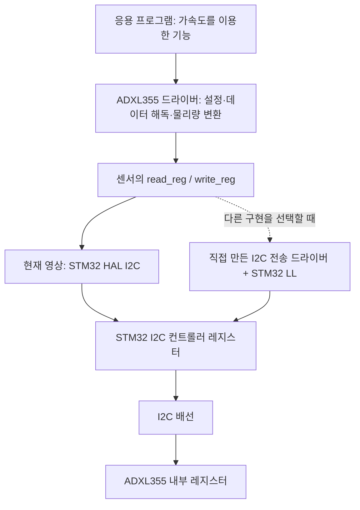

# STM32 HAL과 LL — 드라이버 개발자를 위한 설명

**HAL은 주변장치의 기능과 통신 절차를 묶어서 제공하고, LL은 주변장치의 레지스터와 개별 기능을 조작하는 작은 연산을 제공한다.** 따라서 선택의 핵심은 함수 이름이나 코드 길이보다 **통신 진행 상태와 순서를 누가 관리하는가**에 있다.

이 문서는 앞선 영상과 같은 **STM32F4 계열의 기존 STM32Cube HAL·LL**을 중심으로 설명한다. 모든 제조사의 HAL이 같은 API를 쓰는 것은 아니며, STM32에서도 시리즈·주변장치·SDK 버전에 따라 세부 동작이 다르다. 2026-08-31에 ST 공식 문서와 공개 구현을 확인했다. 아래 코드는 개념 설명용 조각이며, 프로젝트 전체로 컴파일하거나 실물에서 검증하지 않았다.

## 1. HAL과 LL이라는 이름

| 이름 | 풀어 쓰면 | STM32에서의 역할 |
|---|---|---|
| HAL | Hardware Abstraction Layer | 주변장치를 기능 중심으로 사용하는 API와 처리 절차 |
| LL | Low-Layer | 레지스터에 가까운 설정·조회·데이터 접근 API |
| CMSIS-Core 및 device header | Cortex 계열의 코어 인터페이스와 장치 정의 | 코어 기능, 인터럽트 번호, 주변장치 레지스터 구조체·주소·비트 정의 |
| 직접 레지스터 접근 | Register-level programming | 개발자가 레지스터 읽기·쓰기를 직접 구성 |

예를 들어 I²C에서는 HAL에 “이 주소의 장치에서 이 레지스터부터 N바이트 읽어 달라”고 요청할 수 있다. LL에서는 START 요청, 상태 플래그 확인, 데이터 레지스터 접근 같은 연산을 조합한다. **LL을 사용해도 I²C 신호는 MCU의 I²C 하드웨어가 생성한다.** 소프트웨어로 SDA·SCL을 하나씩 토글하는 bit-banging과는 구분한다.

HAL은 일반적인 소프트웨어 설계 용어이기도 하다. STM32에서는 ST가 제공하는 구체적인 라이브러리 이름으로 쓰인다. LL 역시 비트 위치와 주소 표기를 함수로 감싸므로, 추상화가 전혀 없는 것은 아니다. 추상화의 단위가 HAL보다 작다. ST는 두 라이브러리를 상호 보완적인 선택지로 설명한다. [ST UM1725 개요](https://www.st.com/resource/en/user_manual/um1725-description-of-stm32f4-hal-and-lowlayer-drivers-stmicroelectronics.pdf)

## 2. 영상의 “low-level 함수”와 ST LL은 다른 말이다

영상의 `ADXL355_ReadRegister()`는 센서 드라이버 안에서 낮은 계층에 위치하는 함수다. 하지만 그 안에서는 **`HAL_I2C_Mem_Read()`를 사용한다.** 따라서 “영상에서 low-level 함수를 작성했다”는 말은 “ST의 LL 라이브러리를 사용했다”는 뜻이 아니다. [제작자의 센서 드라이버](https://github.com/pms67/LittleBrain-STM32F4-Sensorboard/blob/master/LittleBrain_DriverExample/Core/Src/ADXL355.c)



그림의 두 경로는 선택 가능한 구현이다. 같은 전송을 HAL과 LL이 동시에 담당한다는 뜻은 아니다.

드라이버 개발 업무도 구분된다.

| 업무 | 주로 이해해야 하는 것 |
|---|---|
| ADXL355 같은 외부 장치 드라이버 | 장치 ID, 초기화 순서, 레지스터 필드, 데이터 형식, 단위 변환 |
| STM32 I²C 컨트롤러 드라이버 | START/STOP, 주소 단계, ACK/NACK, 이벤트 플래그, 전송 종료, 오류 처리 |

HAL을 사용하면 두 번째 업무의 상당 부분을 ST 구현에 맡기고 첫 번째 업무를 진행할 수 있다. 이것이 HAL로 센서 드라이버를 개발할 때 얻는 실질적인 이점이다.

## 3. HAL 아래에는 반드시 LL이 있는가?

**STM32F4의 기존 HAL에 `응용 → HAL → LL → 레지스터`라는 호출 구조를 일괄 적용하면 안 된다.** 실제 F4 HAL I²C 구현은 `hi2c->Instance`를 통해 레지스터에 접근하고 비트 조작 매크로를 사용한다. HAL GPIO도 직접 `BSRR`에 쓴다. [F4 HAL I²C 구현](https://github.com/STMicroelectronics/stm32f4xx-hal-driver/blob/master/Src/stm32f4xx_hal_i2c.c), [F4 HAL GPIO 구현](https://github.com/STMicroelectronics/stm32f4xx-hal-driver/blob/master/Src/stm32f4xx_hal_gpio.c)

개념적으로 더 높은 계층이라는 말과, 소스 코드에서 반드시 다른 라이브러리를 호출한다는 말은 별개다.

반대로 “HAL은 저수준 공통 구현을 전혀 사용하지 않는다”는 뜻도 아니다. F4의 HAL PCD처럼 `stm32f4xx_ll_usb.h`의 저수준 구현을 이용하는 모듈도 있다. 실제 호출 관계는 주변장치별로 확인한다. [공식 HAL PCD 헤더](https://github.com/STMicroelectronics/stm32f4xx-hal-driver/blob/master/Inc/stm32f4xx_hal_pcd.h)

```text
기존 STM32F4에서 이해할 기본 경로

내 코드 ── HAL API ────────── 레지스터 접근
내 코드 ── LL API ─────────── 레지스터 접근
내 코드 ── 직접 레지스터 접근
```

최근 HAL2 문서는 적용 가능한 경우 HAL이 LL 연산을 호출한다고 설명한다. 동시에 버스 획득 API 등 기존 F4 HAL과 다른 계약도 소개한다. **HAL2의 구조나 동시성 기능을 영상의 기존 HAL에 그대로 있다고 가정하지 않는다.** 프로젝트가 사용하는 SDK 소스와 문서를 기준으로 판단한다. [ST HAL2 아키텍처](https://dev.st.com/stm32cube-docs/embedded-software/2.1.0/en/architecture/hal2-architecture.html)

## 4. 가장 작은 비교: GPIO 핀을 High로 만들기

다음은 GPIOA 클록과 PA5 출력 설정이 이미 끝났다는 전제다. PA5가 실제 보드의 LED라는 뜻은 아니다.

```c
/* HAL */
HAL_GPIO_WritePin(GPIOA, GPIO_PIN_5, GPIO_PIN_SET);

/* LL: 위 HAL 호출 대신 선택 */
LL_GPIO_SetOutputPin(GPIOA, LL_GPIO_PIN_5);

/* 레지스터 직접 접근: 위 두 호출 대신 선택, STM32F4 기준 */
GPIOA->BSRR = (1UL << 5);
```

셋 다 같은 GPIO 하드웨어를 제어한다. 차이는 개발자가 요청을 표현하는 방식이다.

- HAL은 “이 핀의 상태를 SET으로 바꾸기”라는 인터페이스를 제공한다.
- LL은 “선택한 핀을 SET하는 레지스터 동작”에 가깝다.
- 직접 접근에서는 개발자가 `BSRR`의 의미와 비트 위치를 명시한다.

F4 구현에서 LL의 위 함수는 `BSRR` 쓰기를 수행하는 `static inline` 함수다. HAL의 위 함수도 SET/RESET 선택 후 `BSRR`에 쓴다. 이 사례의 차이는 작다. **GPIO 사례 하나만 보고 I²C·UART·DMA의 HAL도 동일한 두께라고 판단하지는 않는다.** [LL GPIO](https://github.com/STMicroelectronics/stm32f4xx-hal-driver/blob/master/Inc/stm32f4xx_ll_gpio.h), [HAL GPIO](https://github.com/STMicroelectronics/stm32f4xx-hal-driver/blob/master/Src/stm32f4xx_hal_gpio.c)

`inline`은 최종 기계어와 실행 시간을 보장하는 문구가 아니다. 실제 호출 제거 여부와 생성 코드는 컴파일러·최적화·LTO·호출 형태를 보고 판단한다. 단순 API의 비용을 비교하려면 빌드 결과의 disassembly와 실제 측정을 사용한다.

## 5. HAL handle과 LL의 instance 포인터

초기에 가장 자주 혼동하는 것은 `&hi2c1`과 `I2C1`이다.

```c
I2C_HandleTypeDef hi2c1;   /* RAM에 놓이는 HAL 관리 객체 */

/* 초기화 코드의 일부: 이것만으로 통신 준비가 끝나는 것은 아니다. */
hi2c1.Instance = I2C1;
```

| 표현 | 무엇을 가리키는가 | 의미 |
|---|---|---|
| `hi2c1` | RAM의 HAL 구조체 값 | 설정·진행 상태·전송 자원 |
| `&hi2c1` | 위 구조체의 주소 | HAL이 해당 객체를 읽고 수정하는 통로 |
| `hi2c1.Instance` | I²C 레지스터 블록 | 해당 handle이 제어할 하드웨어 |
| `I2C1` | MCU 주소 공간의 I²C1 레지스터 블록 | 일반 RAM 객체를 생성하는 코드가 아닌 장치 정의 |

F4의 I²C handle에는 `Instance`, `Init`, 전송 버퍼 포인터, 전송 길이와 남은 개수, `State`, `Mode`, 오류 코드, DMA handle 등이 있다. 콜백 등록 설정을 켜면 함수 포인터도 포함된다. [공식 I²C handle 정의](https://github.com/STMicroelectronics/stm32f4xx-hal-driver/blob/master/Inc/stm32f4xx_hal_i2c.h)

HAL 함수에 주소를 전달하는 이유는 같은 객체에 처리 결과를 남기기 위해서다. 비동기 전송이라면 함수가 반환된 뒤에도 IRQ 처리 코드가 같은 handle을 사용한다. 이를 매번 값으로 복사해 서로 독립적인 상태를 만들면 하나의 하드웨어를 일관되게 관리하기 어렵다.

LL의 대표적인 사용은 다음 형태다.

```c
LL_I2C_Enable(I2C1);
```

여기서는 하드웨어 레지스터 블록의 포인터를 받는다. 이 호출 자체가 “9바이트 중 4바이트 수신했다” 같은 소프트웨어 전송 상태를 보존해 주지는 않는다. LL 기반 비동기 드라이버에도 그러한 상태가 필요하면 **개발자가 context 구조체를 만든다.** handle이라는 설계 패턴은 HAL만의 전유물이 아니다.

두 포인터의 차이는 C 문법과도 연결된다. `I2C_TypeDef`는 레지스터 배치를 표현하고, `I2C_HandleTypeDef`는 HAL의 소프트웨어 관리 정보를 표현한다. CMSIS device header는 레지스터 구조체, 기준 주소와 접근 정의를 제공한다. [Arm device header 설명](https://arm-software.github.io/CMSIS_6/main/Core/device_h_pg.html), [STM32F405 장치 헤더](https://github.com/STMicroelectronics/cmsis-device-f4/blob/master/Include/stm32f405xx.h)

단, **모든 HAL 함수가 handle을 받는 것은 아니다.** 앞의 `HAL_GPIO_WritePin()`처럼 GPIO 포인터와 핀을 바로 받는 함수도 있다. “HAL은 항상 상태 객체를 가진다”보다 “통신 등 복잡한 주변장치의 HAL은 handle을 통해 상태를 관리한다”가 정확하다.

## 6. I²C 레지스터 읽기에서 드러나는 책임의 차이

### 6.1 HAL을 사용하는 쪽

ADXL355의 I²C 7비트 주소가 `0x1D`이고, 기존 F4 HAL과 I²C 초기화가 준비되어 있다는 예다. 주소는 실제 회로의 ASEL 연결에 따라 확인한다.

```c
uint8_t raw[9];

HAL_StatusTypeDef status = HAL_I2C_Mem_Read(
    &hi2c1,                    /* STM32 I2C 버스의 HAL handle */
    (uint16_t)(0x1DU << 1),     /* 기존 HAL이 요구하는 주소 형식 */
    0x08U,                     /* ADXL355 XDATA3 시작 레지스터 */
    I2C_MEMADD_SIZE_8BIT,       /* 레지스터 주소가 8비트 */
    raw,                       /* 수신할 RAM 버퍼 */
    (uint16_t)sizeof raw,      /* 수신 데이터는 9바이트 */
    20U                        /* HAL tick 기준 시간 제한, 기본 ms */
);

if (status == HAL_OK) {
    /* 이제 raw를 해독한다. 이 함수가 가속도 단위 변환까지 하지는 않는다. */
}
```

`Mem_Read`의 `Mem`은 외부 장치의 내부 주소를 먼저 지정하는 통신 형태다. EEPROM뿐 아니라 해당 형태를 쓰는 센서에도 사용할 수 있다. `I2C_MEMADD_SIZE_8BIT`는 **전송 데이터 길이도, 센서 분해능도 아닌 내부 주소 길이**다. 기존 F4 HAL은 7비트 장치 주소를 왼쪽으로 한 비트 이동한 인수를 요구하며 읽기/쓰기 방향은 API가 처리한다. [HAL I²C API와 구현](https://github.com/STMicroelectronics/stm32f4xx-hal-driver/blob/master/Src/stm32f4xx_hal_i2c.c)

ADXL355의 주소·데이터 레지스터·전송 조건은 센서 데이터시트의 계약이다. 다른 장치가 명령 바이트, dummy byte, 특별한 STOP 조건을 요구한다면 그 프로토콜에 맞는 API나 버스 연산을 골라야 한다. [ADXL355 데이터시트](https://www.analog.com/media/en/technical-documentation/data-sheets/adxl354_adxl355.pdf)

### 6.2 버스에서는 무엇이 일어나는가?

일반적인 8비트 레지스터 주소 기반 I²C 읽기를 개념적으로 표현하면 다음과 같다.

```text
START → 장치 주소+W → ACK → 레지스터 주소 → ACK
      → repeated START → 장치 주소+R → ACK
      → 데이터 수신 → … → 마지막 데이터에 NACK → STOP
```

주소·데이터 바이트와 ACK/NACK, START·STOP의 의미는 I²C 프로토콜에 속한다. 이 흐름을 실제 MCU 레지스터와 상태 플래그로 만드는 순서는 해당 MCU의 주변장치 설계에 달려 있다. [NXP I²C 규격](https://www.nxp.com/docs/en/user-guide/UM10204.pdf)

### 6.3 LL을 사용하는 쪽

LL은 다음과 같은 부품을 제공한다.

```c
/* 서로 이어 붙여 완성 전송이 되는 예제가 아니라, API 역할의 예다. */
LL_I2C_GenerateStartCondition(I2C1);
LL_I2C_TransmitData8(I2C1, value);
value = LL_I2C_ReceiveData8(I2C1);
LL_I2C_GenerateStopCondition(I2C1);
```

이 API들에는 “어느 단계에 도달했는지”, “다음 호출을 지금 해도 되는지”, “오류가 나면 어디로 이동할지”를 판단하는 사용자의 제어 흐름이 필요하다. START 요청을 썼다는 사실과 START 단계가 끝났다는 사실도 구분한다. 특히 **`LL_I2C_ReceiveData8()`는 외부 장치에 읽기 거래를 시작하는 함수가 아니다.** 적절한 수신 상태에서 MCU의 데이터 레지스터를 읽는 함수이며, 새 데이터가 도착할 때까지 기다리지도 않는다. [F4 LL I²C API](https://github.com/STMicroelectronics/stm32f4xx-hal-driver/blob/master/Inc/stm32f4xx_ll_i2c.h)

사용자가 구성할 전송 드라이버의 질문은 다음과 같다.

- 현재 버스가 사용 가능한가? 누가 소유하고 있는가?
- 어떤 플래그를 확인한 뒤 주소나 데이터를 써야 하는가?
- 수신 길이에 따라 ACK/NACK·POS·STOP을 언제 조절하는가?
- NACK, bus error, arbitration loss, timeout을 어떻게 보고하고 정리하는가?
- 성공·실패 뒤 다음 요청을 받을 수 있는 상태는 무엇인가?

특히 F4의 해당 I²C 하드웨어에서는 수신 마지막 1~3바이트 처리가 중요하다. 인터넷의 다른 STM32 시리즈 예제와 플래그·종료 절차가 같다고 가정하지 않는다. 실제 구현에서는 해당 부품의 reference manual과 errata를 기준으로 검토한다. [STM32F405 등 RM0090](https://www.st.com/resource/en/reference_manual/rm0090-stm32f405415-stm32f407417-stm32f427437-and-stm32f429439-advanced-armbased-32bit-mcus-stmicroelectronics.pdf)

LL을 선택할 때 생기는 코드는 하드웨어에 필요한 동작 자체를 새로 발명하는 것이 아니다. HAL이 묶어 제공하던 전송 절차를 제품에 필요한 범위로 직접 구성하는 것이다.

## 7. HAL/LL 선택과 polling/interrupt/DMA 선택은 별개의 축이다

| 진행 방식 | HAL에서의 모습 | LL로 구성할 때 |
|---|---|---|
| Polling | `HAL_I2C_Mem_Read()`가 완료 또는 실패까지 처리 | 사용자의 루프가 플래그와 시간 제한을 확인 |
| Interrupt | `_IT()`로 시작하고 HAL IRQ handler가 처리 진행 | 사용자가 ISR과 전송 상태 머신 구현 |
| DMA | `_DMA()`로 시작하고 DMA·주변장치 종료 처리 연결 | 사용자가 DMA 설정, IRQ, 종료·오류 처리를 연결 |

HAL이라고 polling만 쓰는 것이 아니고, LL이라고 자동으로 비동기가 되는 것도 아니다. LL 함수 뒤에 무한 대기 루프를 쓰면 그 코드도 CPU를 점유한다. DMA의 데이터 이동은 HAL/LL 선택과 별개로 DMA 하드웨어가 수행한다.

기존 F4 HAL의 비동기 호출이 반환하는 성공은 **전송 시작 요청의 성공**이다. 전체 데이터의 성공은 완료 이벤트로 판단한다. `_IT`나 `_DMA`라는 이름이 시작 함수 내부에 어떤 조건 대기도 없다는 보장은 아니다. 해당 구현에는 시작 단계의 BUSY 확인이 포함될 수 있다. [HAL I²C 동작 설명](https://github.com/STMicroelectronics/stm32f4xx-hal-driver/blob/master/Src/stm32f4xx_hal_i2c.c)

### 비동기 처리의 연결 구조

```text
응용 코드: 비동기 읽기 요청
    ↓
HAL: handle에 전송 정보 기록, 하드웨어·IRQ/DMA 시작
    ↓ 함수 반환
다른 작업 수행
    ↓ 하드웨어 이벤트
프로젝트의 IRQ handler → HAL의 IRQ handler
    ↓
완료 또는 오류 callback → 작업에 완료 사실 전달
```

이때 알아야 할 구현 계약은 다음과 같다.

| 항목 | 이유 |
|---|---|
| handle과 버퍼가 완료 때까지 살아 있어야 함 | 나중의 IRQ/DMA가 그 객체에 접근함 |
| 완료 전 버퍼를 재사용하지 않음 | 데이터 이동과 사용자가 같은 메모리를 수정할 수 있음 |
| 프로젝트 IRQ가 HAL handler로 연결되어야 함 | 하드웨어 이벤트만 발생하고 소프트웨어 처리가 진행되지 않을 수 있음 |
| 정상 완료와 오류 완료를 구분 | 데이터 일부만 들어온 버퍼를 정상 샘플로 취급하지 않음 |
| 취소 후 하드웨어 접근 종료까지 확인 | 취소 요청을 했다는 사실만으로 버퍼 반환이 안전해지지 않음 |

예를 들어 함수의 지역 배열을 `_DMA()`에 전달하고 즉시 반환하면, 그 배열의 수명이 전송보다 먼저 끝날 수 있다. 영구 버퍼, 장치 객체의 버퍼 또는 수명 계약이 분명한 전송 객체를 사용한다. 이것은 HAL/LL 모두에 적용되는 비동기 설계 문제다.

콜백은 일반적인 HAL IRQ 처리 경로에서는 인터럽트 문맥에서 호출된다. 센서 단위 변환이나 긴 로그 출력 등을 전부 콜백에 넣기 전에, 팀의 ISR 규칙에 맞춰 이벤트·큐·작업 알림으로 후속 처리를 분리한다. 일부 오류가 시작 함수에서 바로 반환되는 경로도 있으므로, 모든 결과가 반드시 나중에 콜백으로만 온다고 가정하지 않는다.

## 8. 무엇을 초기화해야 하는가?

초기화는 서로 다른 대상의 준비 작업이다.

```text
MCU 실행 기반 준비
    → 클록·핀·주변장치·필요한 IRQ/DMA 준비
    → 외부 센서의 준비 시간·ID·동작 설정
    → 측정 읽기
```

`HAL_Init()`만 호출했다고 I²C1의 핀과 외부 센서가 전부 초기화되는 것은 아니다. 기존 F4 HAL에서는 공통 HAL 초기화와 time base 준비 등이 여기에 속한다. 기본 tick은 SysTick을 이용하지만 다른 time base로 바꿀 수 있다. [F4 HAL 공통 구현](https://github.com/STMicroelectronics/stm32f4xx-hal-driver/blob/master/Src/stm32f4xx_hal.c)

프로젝트에서 확인할 역할은 다음과 같다. 정확한 파일 배치는 코드 생성 옵션과 팀 구조에 따라 다르다.

| 위치·이름의 예 | 확인할 내용 |
|---|---|
| `SystemClock_Config()` | 시스템·버스·주변장치 클록 설정 |
| `MX_GPIO_Init()` | 보드 신호의 GPIO 설정 |
| `MX_I2C1_Init()` | I²C1 handle 설정과 주변장치 초기화 호출 |
| `HAL_I2C_MspInit()` | 프로젝트에 맞는 저수준 자원 설정 연결 지점 |
| `stm32f4xx_it.c` | IRQ 진입점과 HAL handler 연결 |
| 센서의 `init()` | 센서 자체의 리셋·ID·레지스터 설정 |

`MSP`는 여기서는 MCU Support Package를 가리킨다. HAL이 보드별 클록·핀 등의 설정과 연결되는 자리로 이해하면 된다. `MX_*`는 흔히 생성 코드에서 사용하는 이름이며 HAL 표준 함수명과 구분한다.

LL은 레지스터 조작용 header API 외에도 초기화 구조체와 `LL_*_Init()` 같은 초기화 함수를 제공할 수 있다. 기존 F4에서는 관련 구조체·함수에 `USE_FULL_LL_DRIVER`가 관여하며 `.c` 파일도 있다. 따라서 “LL은 전부 매크로이고 헤더만 있으면 모든 초기화까지 끝난다”는 설명은 정확하지 않다. [LL GPIO 헤더](https://github.com/STMicroelectronics/stm32f4xx-hal-driver/blob/master/Inc/stm32f4xx_ll_gpio.h), [LL GPIO 초기화 구현](https://github.com/STMicroelectronics/stm32f4xx-hal-driver/blob/master/Src/stm32f4xx_ll_gpio.c)

## 9. 상태 관리와 오류 처리

HAL handle의 소프트웨어 상태와 주변장치의 하드웨어 상태는 서로 연관되지만 같은 값은 아니다.

```text
소프트웨어: 현재 요청·버퍼·남은 길이·모드·오류
하드웨어:  레지스터·플래그·진행 중인 전송·IRQ/DMA 요청
```

잘 동작하는 드라이버는 두 상태를 일관되게 유지한다. 예를 들어 RAM의 상태를 READY로 바꿨다고 물리적인 SCL/SDA나 DMA 전송이 자동으로 정리되는 것은 아니다. 반대로 레지스터만 초기화했다고 상위 코드가 가진 진행 중 요청이 자동 취소되는 것도 아니다.

HAL의 `HAL_OK`는 호출한 API가 정의한 성공이다. 다음까지 보장하는 표현은 아니다.

- 센서 ID가 내가 기대한 부품과 일치한다.
- 받은 데이터가 최신 샘플이다.
- XYZ가 같은 측정 시점에 속한다.
- 사용한 range와 단위 변환 계수가 일치한다.
- 제품의 실시간 마감 시간과 안전 조건을 만족한다.

이 조건들은 센서 드라이버·버스 관리·응용 계층이 각각 검증한다. HAL을 이용하더라도 데이터시트 기반 장치 계약은 사라지지 않는다.

LL 쪽에서는 플래그를 조회할 수 있지만 플래그를 읽었다는 사실만으로 timeout과 복구 정책이 생기지는 않는다. 애플리케이션에 필요한 결과 타입, 오류 분류, 재시도 여부와 상태 정리 경로를 직접 설계한다.

기존 HAL에는 `assert_param` 검사도 있으나, 설정에 따라 비활성화될 수 있고 모든 잘못된 사용을 검출하는 장치는 아니다. 입력의 유효성·버퍼 범위·호출 문맥을 호출자 계약으로 관리한다.

## 10. HAL lock과 LL atomic을 어떻게 이해해야 하는가?

### HAL의 lock

기존 F4의 `__HAL_LOCK`은 handle의 필드를 검사하고 변경하는 형태다. **RTOS mutex나 원자적인 test-and-set을 대신하지 않는다.** 따라서 같은 버스를 여러 task가 사용할 때 HAL handle이 있다는 이유만으로 동시 접근 문제가 해결되었다고 생각하면 안 된다. [F4 HAL lock 정의](https://github.com/STMicroelectronics/stm32f4xx-hal-driver/blob/master/Inc/stm32f4xx_hal_def.h)

제품에서는 버스 mutex, 단일 버스 작업자, 요청 큐 등으로 소유권을 관리할 수 있다. 비동기 전송은 “시작 함수를 호출하는 동안”뿐 아니라 “전송이 종료될 때까지”의 소유권을 정의해야 한다. 어떤 방식이 맞는지는 RTOS와 팀 설계에 따른다.

### LL의 atomic

LL 문서의 작은 단위 연산이나 atomic이라는 표현을 “모든 API가 모든 문맥에서 동시성 안전하다”로 넓혀 읽지 않는다. F4의 GPIO SET은 BSRR에 쓸 수 있지만 GPIO mode 변경은 read-modify-write를 수행한다. Toggle도 기존 출력 상태를 읽는 단계가 있다. [LL GPIO 구현](https://github.com/STMicroelectronics/stm32f4xx-hal-driver/blob/master/Inc/stm32f4xx_ll_gpio.h)

구분할 대상은 다음과 같다.

1. 특정 하드웨어 레지스터의 set/reset 기능이 제공하는 원자성.
2. CPU의 한 번의 load/store가 제공하는 범위.
3. 여러 연산으로 이루어진 read-modify-write의 동시성.
4. I²C 거래 전체 또는 여러 레지스터 설정 절차의 독점성.

첫 번째가 성립해도 네 번째까지 자동으로 성립하지 않는다. `volatile` 역시 접근에 대한 컴파일러 의미를 부여할 뿐 버스 mutex나 상태 머신을 대신하지 않는다.

## 11. HAL과 LL을 함께 사용할 수 있는가?

**프로젝트 전체에서 함께 사용할 수 있다.** 예를 들어 I²C1은 HAL, USART2의 UART 통신은 사용자가 LL로 구성한 드라이버에 맡길 수 있다. LL만 사용하는 주변장치가 있다고 해서 다른 주변장치의 HAL을 모두 제거할 필요는 없다.

관리 경계는 **주변장치 instance와 그 상태의 소유권**이다.

| 상황 | 온보딩 시 판단 |
|---|---|
| 서로 다른 instance를 각각 HAL·LL로 담당 | 역할 구분이 비교적 명확함 |
| HAL 초기화 이후 그 instance를 LL 코드만 운영 | 필요한 자원·handle·IRQ 관계를 정리한 뒤 소유권 전환으로 설계 |
| HAL이 전송 중인데 LL로 같은 주변장치의 플래그를 소비하거나 설정 변경 | HAL 진행 상태와 실제 하드웨어가 어긋날 수 있음 |
| HAL과 LL이 같은 instance의 통신을 번갈아 수행 | 전송·IRQ·DMA·상태를 함께 검토해야 하므로 기본 입문 구조로 삼지 않음 |

읽기 동작에도 side effect가 있을 수 있다. 상태 플래그를 지우거나 데이터 레지스터를 읽는 LL 호출을 “조회이므로 무해하다”고 단정하지 않는다. 혼용은 이름이 다른 함수를 같이 쓰는 문제가 아니라, 누가 해당 하드웨어 상태를 변경할 권한을 갖는가의 문제다. ST도 HAL handle과 레지스터의 불일치를 경고한다. [ST UM1725 §5 — HAL·LL 공존](https://www.st.com.cn/resource/en/user_manual/um1725-description-of-stm32f4-hal-and-lowlayer-drivers-stmicroelectronics.pdf)

실무에서 먼저 적용할 규칙은 **한 instance의 전송 상태 머신은 한 구현이 책임지게 한다**이다. 프로젝트가 이미 정한 혼용 규칙이 있다면 그 규칙과 해당 SDK의 동작을 먼저 읽는다.

## 12. LL은 얼마나 빠른가?

비교할 성능을 구체화해야 한다.

| 측정 항목 | 확인할 질문 |
|---|---|
| 호출 오버헤드 | 주변장치 동작을 시작하는 데 CPU가 몇 사이클 쓰는가? |
| CPU 점유율 | 전송 중 기다리는가, 다른 일을 하는가? |
| 인터럽트 비용 | 바이트마다 IRQ가 필요한가, 어느 정도로 묶는가? |
| 최악 지연 시간 | 중요한 이벤트를 얼마나 늦게 처리할 수 있는가? |
| 코드·RAM 크기 | 링크 후 실제로 얼마를 쓰는가? |
| 버스 전송 시간 | SCL/SCK 속도, 데이터 길이, 프로토콜과 대기 조건은 무엇인가? |

LL의 작은 연산은 라이브러리의 일반적인 상태 관리 비용을 줄일 여지가 있다. 그러나 필요한 오류·timeout·동시성·복구 코드를 직접 더하면 최종 시스템 크기와 시간은 달라진다. 동일한 기능과 실패 조건을 처리하는 코드끼리 비교한다.

예를 들어 400 kHz I²C에서 8비트 레지스터 주소 뒤 9바이트를 읽는 거래를 단순 계산하면, 장치 주소 W·레지스터 주소·장치 주소 R·데이터 9개로 총 12바이트다. ACK/NACK까지 바이트당 9클록으로 잡으면 **108클록, 약 270 μs**다. 이는 START/STOP의 추가 시간, clock stretching, 소프트웨어 공백을 제외한 계산이다. [I²C 프레임 형식의 근거](https://www.nxp.com/docs/en/user-guide/UM10204.pdf)

같은 버스 설정과 프레임이라면 HAL 함수를 LL로 바꾼 것만으로 이 108클록이 없어지지 않는다. 높은 CPU 점유율이 문제라면 polling에서 IRQ/DMA로 진행 방식을 바꾸는 것이 더 직접적인 개선일 수도 있다. 단, 짧은 전송에서는 DMA 준비·IRQ 비용도 있으므로 측정으로 선택한다.

## 13. 이식성은 어느 범위인가?

HAL은 STM32 시리즈 사이에서 익숙한 API 형태를 제공하지만 모든 하드웨어 차이를 없애지는 않는다. 핀·클록·DMA 연결·기능·초기화 필드·제약이 달라질 수 있다. STM32 HAL 코드를 다른 제조사 MCU에 그대로 컴파일할 수 있다는 뜻도 아니다.

LL은 주변장치의 실제 기능과 프로그래밍 모델을 더 많이 노출하므로, IP가 다른 MCU로 이동할 때 제어 흐름까지 다시 살펴볼 가능성이 크다. 이름이 비슷한 I²C라도 레지스터와 종료 처리가 다를 수 있다. [ST HAL·LL 개요](https://www.st.com/resource/en/user_manual/um1725-description-of-stm32f4-hal-and-lowlayer-drivers-stmicroelectronics.pdf)

센서 드라이버에서 이식성을 확보하는 방법은 버스 계약을 분리하는 것이다.

```c
typedef int (*ReadRegFn)(void *ctx,
                         uint8_t reg,
                         uint8_t *dst,
                         size_t len);

typedef struct {
    void *ctx;
    ReadRegFn read_reg;
    /* write_reg, delay 같은 의존성은 필요에 따라 추가 */
} SensorBus;
```

이 코드는 인터페이스 설계 예이며 `<stdint.h>`, `<stddef.h>` 등 필요한 헤더와 오류 계약은 별도로 정의한다.

HAL 구현의 `ctx`에는 I²C handle과 장치 주소를 가진 객체를 연결할 수 있다. LL 구현의 `ctx`에는 직접 작성한 전송 드라이버의 context를 연결할 수 있다. 센서 코드가 호출하는 `read_reg()`의 완료·오류·길이·동기성 계약을 같게 유지하면 센서의 비트 해독과 물리량 변환은 재사용하기 쉬워진다.

단순히 callback 이름만 같게 만들고 한쪽은 동기 완료, 다른 쪽은 비동기 시작을 뜻하게 만들면 같은 인터페이스라고 볼 수 없다. **HAL을 LL로 교체하는 경계는 함수 이름보다 동작 계약으로 정의한다.**

## 14. 데이터시트와 레지스터 맵은 두 종류를 읽는다

| 알고 싶은 것 | 읽을 자료 |
|---|---|
| 센서의 ODR, range, ID, raw 데이터 형식 | 외부 장치 데이터시트·레지스터 맵 |
| MCU I²C 컨트롤러의 CR/SR/DR 의미와 조작 순서 | 해당 STM32 reference manual |
| 핀 전압·전기 특성·클록 한계 | 부품 데이터시트 |
| 해당 실리콘 판의 예외·우회 절차 | errata |
| HAL/LL 함수의 인수·반환·전제 조건 | 해당 SDK 문서·헤더·구현 |
| NVIC·예외·메모리 장벽 등 CPU 관점 | Arm 코어 문서·CMSIS 문서 |

센서의 `0x08`은 I²C로 전송할 외부 장치의 내부 주소다. `I2C1->DR`은 MCU 주소 공간에 매핑된 컨트롤러 레지스터다. 둘 다 레지스터라고 부르지만 접근 경로가 다르다. 이 차이를 이해하면 “센서 레지스터를 읽기 위해 왜 I²C 레지스터를 조작하는가”가 자연스럽게 연결된다.

## 15. 온보딩에서 추천하는 학습 순서

아래는 ST의 의무 규칙이 아니라, 이 영상에서 시작해 외부 장치 드라이버 업무에 적응하기 위한 학습 제안이다.

1. **팀 코드의 HAL/LL 선택을 먼저 따른다.** MCU 부품명, SDK 버전, 버스 소유자와 IRQ 경로를 파악한다.
2. **HAL 기반 센서 읽기 한 경로를 추적한다.** 센서 API → `read_reg` → HAL → handle → MCU I²C 순서로 본다.
3. **성공·오류·timeout을 관찰한다.** 읽힌 값과 반환 상태를 구분하고, 센서 ID부터 확인한다.
4. **GPIO 하나를 HAL·LL·직접 접근으로 비교한다.** 레지스터 이름이 실제 함수 동작과 연결되는 경험을 만든다.
5. **비동기 전송의 소유권을 익힌다.** 버퍼 수명과 IRQ→callback→작업의 연결을 이해한다.
6. **LL이 필요한 구간을 좁혀 구현한다.** 특수 시퀀스, 지연 요구, 측정된 오버헤드 등 구체적인 이유를 둔다.

처음부터 STM32 I²C 상태 머신 전체를 다시 구현해야 센서 드라이버를 개발할 수 있는 것은 아니다. 당장 맡은 장치의 데이터시트 계약을 정확히 구현하고, 그 아래 버스 API의 계약을 읽을 수 있으면 개발을 시작할 수 있다.

학습 후 다음을 스스로 설명할 수 있으면 첫 단계는 충분하다.

- `&hi2c1`과 `I2C1`은 각각 무엇인가?
- 영상의 low-level 함수가 왜 ST LL을 사용한다는 뜻은 아닌가?
- HAL의 센서 읽기 함수가 어떤 일은 하고, 어떤 일은 센서 드라이버에 남기는가?
- 비동기 API가 성공을 반환한 직후 버퍼를 읽어도 되는가?
- LL 기반 드라이버에도 왜 상태 객체가 필요할 수 있는가?
- 같은 주변장치를 HAL과 LL이 동시에 변경하면 무엇이 불일치할 수 있는가?
- 성능 문제는 CPU 비용인가, 버스 속도인가, 스케줄링 지연인가?

관련 학습: [영상 패턴 분석](02-video-design-patterns.md) · [공통 드라이버 패턴](03-datasheet-driver-patterns.md) · [C/C++ 문법](04-c-cpp-core.md)
