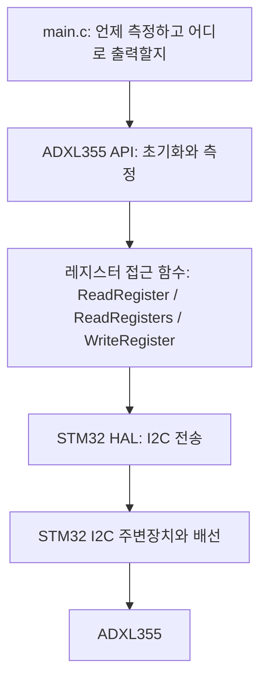
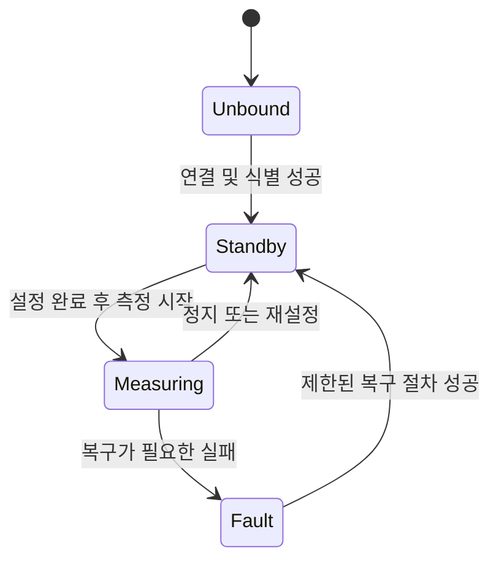
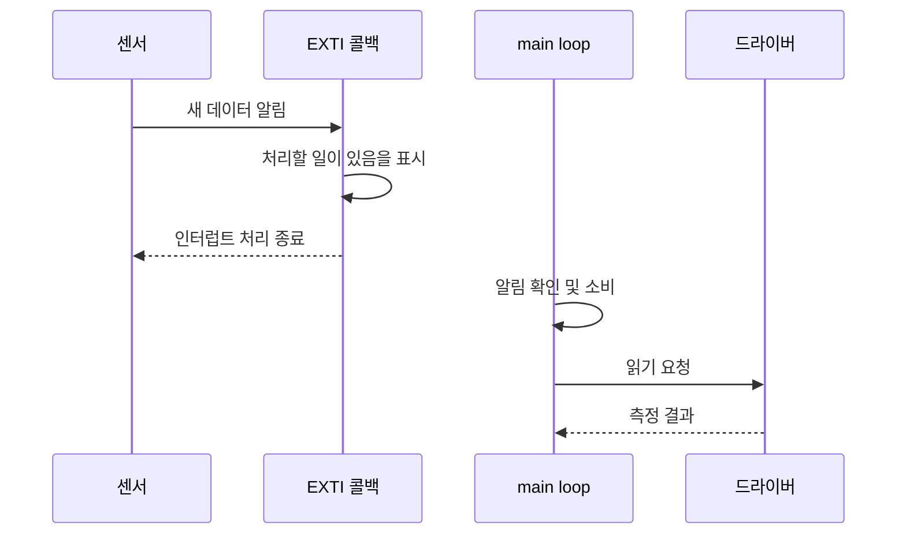
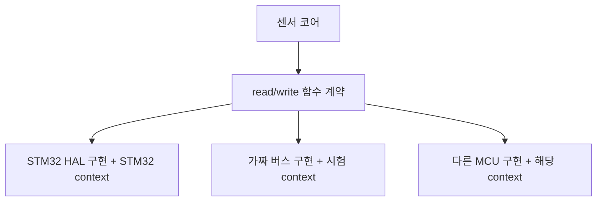
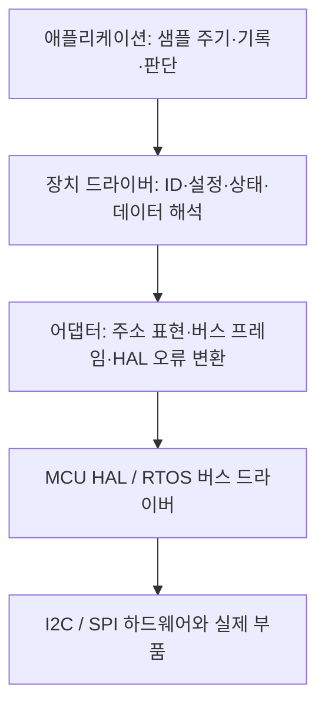
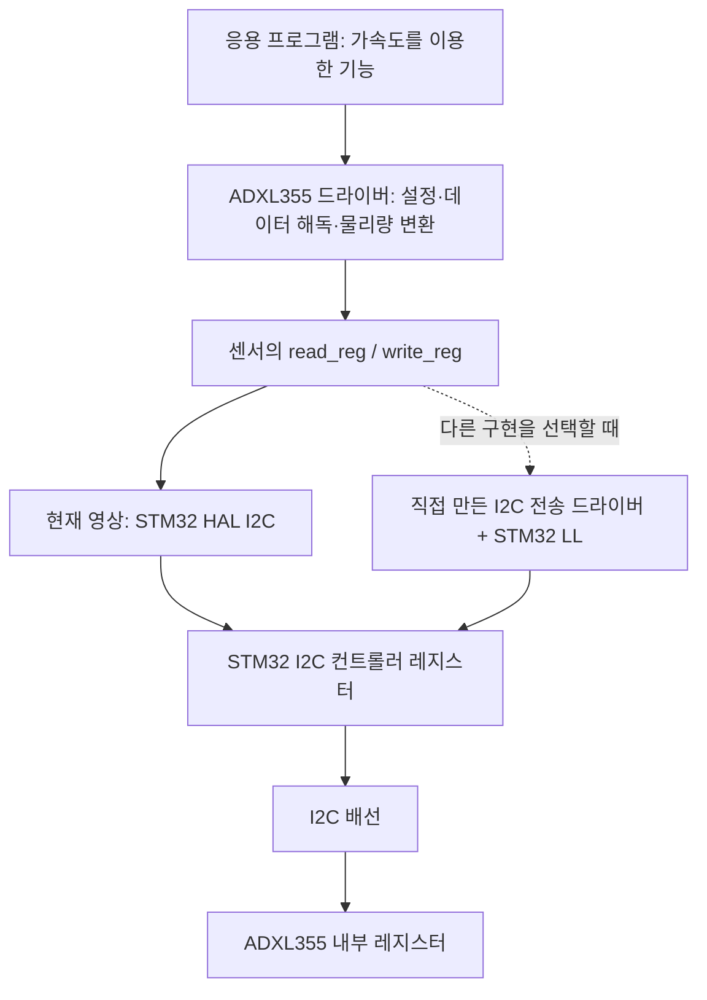

# 임베디드 드라이버 개발 온보딩 — 통합본

데이터시트·레지스터 맵에서 출발해 드라이버 코드를 읽고 직접 구현하기 위한 학습 자료다. 영상의 상세 해설과 설계 분석에 더해, 다른 장치에 적용할 패턴과 C/C++ 문법을 담았다.

대상 영상: [Phil’s Lab #30 — How To Write A Driver](https://www.youtube.com/watch?v=_JQAve05o_0). 링크의 시작점은 21:38이며, 자료는 영상 전체를 다룬다.

빠른 학습 순서: **00 → 02 → 내 장치에 03 적용**, 문법은 **04**에서 찾아본다. 영상을 따라갈 때는 **01**을 사용한다.

| 부분 | 내용 |
|---|---|
| 00 | 2~3시간 온보딩 경로와 구현 순서 |
| 01 | 영상 시간대별 상세 학습 노트 |
| 02 | 영상 코드에 나타나는 디자인 패턴 |
| 03 | 데이터시트·레지스터 맵 기반 공통 드라이버 패턴 |
| 04 | C/C++ 핵심 문법과 드라이버 코드 읽기 |
| 05 | HAL과 LL의 책임·핸들·전송 방식·선택 기준 |
| 06 | UART 핸들 템플릿과 C 가변 인자 |

[개별 문서 목차](README.md) · [출처와 검토 범위](sources/README.md) · [해독 실습 코드](examples/measurement_decode.c)

영상에서 직접 확인한 내용과 추가 학습 해석은 본문에서 구분한다. 전체 자동 자막, 주요 코드 화면, 공개 소스와 공식 자료를 대조했으며, 모든 프레임을 연속 재생하여 확인한 것은 아니다. 예제는 교육용이고 실제 보드에서 검증된 드라이버가 아니다.


---

# 임베디드 드라이버 개발 빠른 온보딩

이 문서는 “오늘부터 드라이버 코드를 읽고 작은 기능을 구현해야 한다”는 상황을 위한 시작점이다. 모든 내용을 먼저 외울 필요는 없다. **한 장치의 ID를 읽고, 설정하고, 측정값 하나를 얻는 경로**를 먼저 완성한다.

영상의 대상은 STM32F405 + ADXL355 + I²C + C다. 센서 드라이버의 입문 사례로 읽고, C++·DMA·RTOS·MMIO는 필요에 따라 확장한다. Linux 커널 드라이버의 probe/remove, device tree, 커널 수명 관리 전체를 다루는 자료는 아니다.

## 1. 먼저 이 그림을 이해하기

```text
애플리케이션:   가속도를 읽어줘
                    ↓
센서 드라이버:  데이터 레지스터의 주소와 길이를 선택
                    ↓
버스/HAL:       I2C 전송을 실행해 바이트를 받음
                    ↓
센서 드라이버:  바이트 조립 → 부호 해석 → 단위 변환
                    ↓
애플리케이션:   성공 여부를 확인하고 결과를 사용
```

“드라이버를 작성한다”는 말이 항상 I²C 컨트롤러를 레지스터부터 구현한다는 뜻은 아니다. 이 영상에서는 MCU 통신 제어를 HAL에 맡기고, ADXL355의 장치 동작과 데이터 의미를 구현한다.

## 2. 첫 2~3시간의 권장 경로

아래 시간은 학습 순서를 잡기 위한 제안이다. C 포인터가 익숙하지 않으면 문법 구간에 더 시간을 쓰면 된다.

| 순서 | 시간 예시 | 할 일 | 끝났다고 판단할 기준 |
|---|---:|---|---|
| 1 | 15분 | 이 문서와 02의 구조 그림 읽기 | main / sensor / HAL의 역할을 설명할 수 있음 |
| 2 | 30분 | 04에서 포인터, struct, handle, 배열, 비트 연산 읽기 | `dev->bus`, `&value`, `buffer` 인수를 설명할 수 있음 |
| 3 | 25분 | 영상 07:55–21:28 및 01의 해당 절 | init에서 ID 확인까지 호출 경로를 따라갈 수 있음 |
| 4 | 20분 | 영상 21:29–26:17와 02의 설정 절 | 요구 동작을 레지스터 값으로 바꿀 수 있음 |
| 5 | 25분 | 영상 26:18–34:09와 decoder 예제 | 바이트 배열을 signed raw와 단위로 변환할 수 있음 |
| 6 | 30분 | 내 장치의 데이터시트 추출표 작성 | ID/설정/출력 레지스터와 접근 조건을 찾음 |
| 7 | 20분 | 팀의 기존 드라이버 하나 읽기 | `init → read → bus` 경로와 에러 계약을 표시함 |

링크의 시작점 [21:38](https://www.youtube.com/watch?v=_JQAve05o_0&t=1298s)은 특히 “레지스터 맵에서 설정에 필요한 부분을 골라 코드로 옮기는 과정”을 배우기에 좋다. 그 앞의 struct와 HAL 래퍼를 먼저 이해하면 훨씬 잘 보인다.

## 3. 오늘 필수인 것과 나중에 배워도 되는 것

| 우선순위 | 개념 | 이유 |
|---|---|---|
| 오늘 필수 | 포인터·주소·구조체·배열·정수 폭 | 드라이버 함수 선언을 읽는 데 필요 |
| 오늘 필수 | 레지스터 주소와 값, mask/shift | 설정과 데이터 변환의 기본 |
| 오늘 필수 | HAL/버스 API 계약, status 반환 | 전송과 실패를 다루는 기본 |
| 오늘 필수 | 객체·버퍼 수명, `const`의 의미 | 잘못된 포인터 사용을 피하기 위해 |
| 첫 주 권장 | 함수 포인터 + context | 제조사 드라이버의 이식 계층에서 자주 등장 |
| 첫 주 권장 | data-ready, ISR와 task 분리 | 주기적 데이터 수집에 필요 |
| 필요할 때 | FIFO/DMA/cache/멀티태스크 잠금 | 처리량과 실행 문맥이 복잡해질 때 |
| 프로젝트에 따라 | C++ RAII, template, virtual interface | 팀이 C++ 추상화를 사용할 때 |
| 나중에 자세히 | union의 언어별 세부 규칙, packed, aliasing | 바이너리 레이아웃을 직접 다룰 때 |

나중에 배워도 된다는 것은 무시해도 된다는 뜻이 아니다. 아직 DMA를 쓰지 않는 동기식 I²C 읽기를 배우는 단계에서 DMA cache 처리부터 시작할 필요가 없다는 뜻이다.

## 4. 기존 코드베이스를 받았을 때 읽는 순서

전체 소스 폴더를 위에서부터 읽기보다 다음 여덟 지점을 찾는다.

1. **공개 헤더:** `init`, `read`, `set_config`, status enum은 무엇인가?
2. **장치 구조체:** bus, address, configuration, state, buffer를 누가 보관하는가?
3. **생성·연결 지점:** 누가 장치 구조체와 통신 핸들을 만들고 연결하는가?
4. **init 함수:** 전원/리셋/ID/설정/측정 시작 순서는 무엇인가?
5. **read 함수 하나:** 몇 바이트를 어디서 읽고 어떻게 해석하는가?
6. **통신 함수:** I²C/SPI/메모리 접근의 구체 구현은 어디인가?
7. **호출자:** main loop, RTOS task, ISR 중 어디서 호출하는가?
8. **시험:** 어떤 정상값과 실패 상황으로 동작을 확인하는가?

함수 포인터 호출을 만나면 해당 포인터에 실제 함수를 대입한 곳까지 이동한다. `read()`라는 이름만 보고 통신 방식이나 동기/비동기 여부를 추측하지 않는다.

## 5. 새 장치 구현 순서: 작은 성공을 하나씩 만들기

### 단계 1 — 필요한 자료를 한곳에 모으기

- 사용 부품의 정확한 품명과 변형.
- 데이터시트 판, 관련 errata, 보드 회로도.
- 팀이 사용하는 HAL/SDK 버전과 기존 드라이버 하나.
- 전원, reset/enable, I²C 주소 핀 또는 SPI chip-select 연결.

이 단계의 산출물은 긴 보고서가 아니라 “지금 구현하는 장치와 연결을 내가 정확히 알고 있다”는 한 페이지다.

### 단계 2 — ID 읽기를 먼저 구현하기

`bus_read()` 또는 HAL 래퍼 하나를 만들고, 데이터시트가 읽기를 허용하는 ID 레지스터를 읽는다. 칩에 ID가 없다면 제조사가 권장하는 안전한 식별/상태 확인 절차를 사용한다.

로그에는 최소한 기대값, 실제값, 통신 상태를 따로 남긴다. ID가 기대값과 같으면 데이터시트와 보드, 통신 코드 사이의 첫 연결이 완성된다.

### 단계 3 — 최소 구성으로 동작 시작하기

가장 단순한 range와 낮은 ODR 등 현재 목적에 맞는 구성을 선택한다. 전원·reset·standby 등 필요한 선행 조건을 충족한 뒤 설정하고, 마지막에 측정을 시작한다.

첫 구현에서 모든 레지스터의 setter를 만들 필요는 없다. 지금 필요한 설정만 구현하고, 나머지는 데이터시트에서 위치를 알 수 있게 표시한다.

### 단계 4 — raw 값 하나를 읽기

가공하기 전에 원시 바이트를 확인한다. 데이터 레지스터의 주소, 읽기 길이, 자동 주소 증가, 유효 비트 위치를 확인한다. 이때 애플리케이션에 복잡한 필터를 더하지 않는다.

### 단계 5 — 해독과 단위 변환 추가하기

비트 조립 함수에는 배열만 전달하도록 만들면 하드웨어 없이도 이해와 시험이 쉽다. 부호 경계와 대표값을 확인한 다음 단위 변환을 연결한다.

이 폴더의 `examples/measurement_decode.c`는 그 부분만 분리한 교육용 예제다. 센서 통신이나 완성 드라이버를 제공하는 파일은 아니다.

### 단계 6 — 호출 주기와 유효성을 정하기

폴링으로 정상값을 확인한 다음 data-ready나 FIFO를 연결한다. 성공한 측정만 새 값으로 사용하고, 데이터 수집과 로그 전송의 속도를 별도로 정한다.

### 단계 7 — 팀 기준에 맞춰 마무리하기

인수 검사, 유한 timeout, 상태 계약, 반환값 처리, 공개/비공개 함수 구분을 적용한다. 플랫폼 분리나 DMA는 실제 요구사항에 맞춰 도입한다.

## 6. 회의나 코드 리뷰에서 바로 쓰는 질문

| 질문 | 답에서 확인할 것 |
|---|---|
| 이 API는 blocking인가요? | 반환하면 버퍼를 재사용해도 되는지 |
| 이 handle의 소유자는 누구인가요? | 생성/파괴와 수명 |
| 주소는 7비트인가요, shift된 값인가요? | 버스 어댑터의 계약 |
| 같은 버스의 다른 장치와 누가 직렬화하나요? | lock 또는 버스 관리자 |
| 이 read는 최신값 하나인가요, FIFO 샘플인가요? | 샘플 손실과 시점 의미 |
| 설정을 바꾸려면 먼저 standby로 가나요? | 상태 전제조건 |
| 실패하면 output은 어떤 상태인가요? | 이전 값/부분값 사용 방지 |
| ISR에서 호출해도 되나요? | 대기, 잠금, 함수 실행 시간 |
| range/보정값은 누가 관리하나요? | 단위 변환의 일관성 |

## 7. 스스로 설명할 수 있으면 기본 온보딩 완료

- [ ] `device_t *dev`가 왜 거의 모든 함수의 첫 인수인지 설명할 수 있다.
- [ ] `&value`를 넘기는 이유와 `dev->field`의 의미를 안다.
- [ ] 장치 주소, 레지스터 주소, 레지스터 값의 차이를 안다.
- [ ] HAL이 해 주는 일과 센서 드라이버가 해야 할 일을 구분한다.
- [ ] 데이터시트에서 reset 값, RW/RO, bit field 설명을 찾을 수 있다.
- [ ] init의 순서와 성공 후 보장 상태를 설명할 수 있다.
- [ ] 여러 바이트를 조립하고 유효 비트와 부호를 처리할 수 있다.
- [ ] 단위 변환 계수가 어느 설정에서 유효한지 안다.
- [ ] status와 실제 데이터가 각각 어디로 전달되는지 안다.
- [ ] ISR, task, main loop 중 코드가 실행되는 위치를 안다.
- [ ] 함수 포인터와 context가 각각 무엇을 전달하는지 안다.

완료 기준은 문서 전체를 읽은 시간이 아니라, **내 장치의 `init()`과 `read()`를 데이터시트와 연결해 설명할 수 있는가**다.

---

# ADXL355 드라이버를 처음부터 만드는 과정 — 영상 상세 학습 노트

> 대상: [(Sponsored) How To Write A Driver (STM32, I2C, Datasheet) — Phil's Lab #30](https://www.youtube.com/watch?v=_JQAve05o_0), 약 38분 20초.
>
> 사용자 링크의 시작 지점은 [21:38, 설정할 레지스터를 고르는 부분](https://www.youtube.com/watch?v=_JQAve05o_0&t=1298s)이다. 이 노트는 그 앞의 준비 과정부터 실제 측정 확인까지 **영상 전체**를 다룬다.
>
> 목적은 영상의 코드 한 줄씩을 외우는 것이 아니라, **데이터시트에서 필요한 정보를 찾고 → 작은 C 드라이버를 만들고 → 보드에서 동작을 확인하는 순서**를 익히는 것이다. 전체 영어 자동 자막을 읽고 기술 내용을 재구성했다. 제작자의 현재 공개 코드도 참고했지만 영상과 동일한 버전으로 간주하지 않았다. 원문 발언의 직역이나 전체 대본이 아니라, 기술 챕터별 요약과 별도로 표시한 학습 보충이다.

## 1. 이 영상을 보고 나면 만들 수 있어야 하는 것

영상의 결과물은 STM32F405가 I²C로 ADXL355의 레지스터를 읽고 써서, 온도와 3축 가속도를 물리 단위로 얻는 작은 C 드라이버다. 개발 환경은 STM32CubeIDE이며, MCU의 I²C 전송 자체는 STM32 HAL에 맡긴다.

| 영역 | 영상에서 사용하는 것 | 학습할 질문 |
|---|---|---|
| 호스트 MCU | STM32F405가 실장된 LittleBrain 보드 | 내 코드가 어느 I²C 주변장치를 사용하는가? |
| 대상 장치 | ADXL355 3축 MEMS 가속도계 | ID, 설정, 데이터는 어느 레지스터에 있는가? |
| 버스 | I²C | 장치 주소와 레지스터 주소를 어떻게 전달하는가? |
| 개발 도구 | STM32CubeIDE, STM32 HAL | 생성 코드와 직접 작성할 코드의 경계는 어디인가? |
| 디버깅 | ST-Link, SWD, breakpoint, 변수 관찰 | 통신·설정·변환 중 어디까지 동작했는가? |
| 측정 알림 | data-ready 핀, EXTI | 새 데이터가 생겼다는 사실을 어떻게 전달하는가? |
| 결과 활용 | 구조체에 저장, USB virtual COM 출력 | 드라이버 값과 애플리케이션 동작을 어떻게 연결하는가? |

영상의 흐름은 다음과 같다.

```text
회로와 데이터시트 확인
    → MCU 핀·클록·I²C 준비
    → 센서 .h/.c와 장치 구조체 작성
    → 레지스터 읽기·쓰기 구현
    → ID 확인과 측정 설정
    → raw 데이터 조립과 단위 변환
    → main loop에 연결
    → 보드에서 물리적으로 확인
```

**온보딩 관점의 핵심:** 센서 드라이버 개발은 C 문법만의 문제가 아니다. 전기 연결, 버스 거래, 레지스터 의미, 데이터 표현, 실행 시점이 하나의 경로로 이어져야 한다.

## 2. 시간대별 찾아보기

| 시간 | 기술 챕터 | 이 부분에서 얻을 산출물 |
|---|---|---|
| [00:01](https://www.youtube.com/watch?v=_JQAve05o_0&t=1s) | 프로젝트 목표 | MCU·센서·통신 방식의 큰 그림 |
| [01:44](https://www.youtube.com/watch?v=_JQAve05o_0&t=104s) | ADXL355 breakout 회로 | 전원, 신호, 핀 기능에 대한 이해 |
| [03:39](https://www.youtube.com/watch?v=_JQAve05o_0&t=219s) | LittleBrain 회로 | 사용할 MCU 주변장치와 디버깅 연결 |
| [04:17](https://www.youtube.com/watch?v=_JQAve05o_0&t=257s) | CubeIDE 설정 | 핀, 클록, I²C, EXTI, USB 초기 코드 |
| [06:40](https://www.youtube.com/watch?v=_JQAve05o_0&t=400s) | `.h`·`.c` 파일 분리 | 드라이버의 기본 파일 구조 |
| [07:55](https://www.youtube.com/watch?v=_JQAve05o_0&t=475s) | 헤더 구성 | include guard, 상수, 타입, API 선언 |
| [09:11](https://www.youtube.com/watch?v=_JQAve05o_0&t=551s) | I²C 주소 | 7비트 주소와 HAL 표현의 구분 |
| [10:35](https://www.youtube.com/watch?v=_JQAve05o_0&t=635s) | 레지스터 맵 | 주소·이름·접근 속성·리셋값 읽기 |
| [13:04](https://www.youtube.com/watch?v=_JQAve05o_0&t=784s) | 장치 구조체 | 버스 핸들과 측정 결과를 묶는 문맥 |
| [13:46](https://www.youtube.com/watch?v=_JQAve05o_0&t=826s) | 함수 인터페이스 | init·측정·레지스터 접근의 구분 |
| [16:12](https://www.youtube.com/watch?v=_JQAve05o_0&t=972s) | 저수준 통신 구현 | 단일 읽기, 연속 읽기, 단일 쓰기 |
| [18:40](https://www.youtube.com/watch?v=_JQAve05o_0&t=1120s) | 초기화 시작 | 핸들 연결과 장치 식별 |
| [21:38](https://www.youtube.com/watch?v=_JQAve05o_0&t=1298s) | 설정 대상 선정 | 필요한 레지스터만 고르는 방법 |
| [22:26](https://www.youtube.com/watch?v=_JQAve05o_0&t=1346s) | FILTER 설정 | `0x05`가 되는 과정 |
| [24:47](https://www.youtube.com/watch?v=_JQAve05o_0&t=1487s) | POWER_CTL 설정 | standby 해제와 측정 시작 |
| [26:18](https://www.youtube.com/watch?v=_JQAve05o_0&t=1578s) | 온도 읽기 | 2바이트 → 12비트 → °C |
| [30:21](https://www.youtube.com/watch?v=_JQAve05o_0&t=1821s) | 가속도 읽기 | 3바이트/축 → signed 20비트 |
| [32:44](https://www.youtube.com/watch?v=_JQAve05o_0&t=1964s) | 가속도 단위 변환 | LSB → g → m/s² |
| [34:10](https://www.youtube.com/watch?v=_JQAve05o_0&t=2050s) | 애플리케이션 연결 | DRDY 플래그와 main loop |
| [36:10](https://www.youtube.com/watch?v=_JQAve05o_0&t=2170s) | 보드 검증 | ID, 온도 변화, 중력 방향 확인 |

## 3. 00:01–04:16 — 코드보다 먼저 하드웨어 경계를 확인한다

### 3.1 무엇을 직접 만들고 무엇을 재사용하는가

**영상 내용.** 제작자는 ADXL355 breakout 보드와 STM32F4 기반 LittleBrain 보드를 연결한다. ADXL355는 저잡음·저드리프트·저전력 3축 가속도계로 소개된다. 직접 작성할 것은 센서의 레지스터 의미를 이해하는 드라이버이고, STM32의 주변장치를 구동하는 기본 코드는 HAL을 활용한다.

여기서 “처음부터 드라이버를 만든다”는 것은 모든 I²C 파형을 소프트웨어로 직접 생성한다는 뜻이 아니다. MCU HAL 위에서 **어느 장치의 어느 레지스터를 어떻게 설정하고 해석할지** 작성한다는 뜻이다.

### 3.2 breakout 회로에서 먼저 보는 세 영역

**영상 내용 — [01:44](https://www.youtube.com/watch?v=_JQAve05o_0&t=104s).** 회로는 전원 입력/보호·필터·레귤레이터, 가속도계, 외부 연결 헤더로 나뉜다. P채널 MOSFET을 이용한 역극성 보호, 게이트 보호 부품, ferrite bead와 커패시터를 이용한 필터, 3.3 V 레귤레이터와 디커플링이 설명된다. 센서 주변 회로는 데이터시트의 핀 설명과 응용 회로를 바탕으로 구성한다. 헤더에는 전원과 통신·인터럽트 신호가 연결되며 신호 보호도 고려한다.

**왜 드라이버 개발자가 회로를 보는가 — 학습 보충.** 레지스터 값이 맞아도 전원, 핀 모드, 주소 선택 핀 또는 배선이 다르면 통신은 시작되지 않는다. 드라이버를 맡으면 최소한 다음 항목은 회로도에서 찾을 수 있어야 한다.

| 확인 항목 | 코드와 연결되는 지점 |
|---|---|
| 센서 전원과 I/O 전압 | GPIO·I²C 신호의 전기적 조건 |
| SDA/SCL이 연결된 MCU 핀 | CubeIDE의 주변장치 및 alternate function 선택 |
| 주소 선택 핀의 high/low | 드라이버에서 사용할 I²C 주소 |
| 통신 모드 선택 핀 | I²C 또는 SPI 사용 전제 |
| data-ready/interrupt 연결 | EXTI 핀, 트리거, IRQ 설정 |
| 외부 클록 주파수 | MCU clock tree 설정 |
| 디버깅 핀 | ST-Link를 통한 다운로드와 실행 관찰 |

실제 I²C 연결에서는 풀업과 버스 전압·속도 조건도 함께 확인한다. 이 표는 업무용 확인 순서를 보충한 것이며, 영상이 모든 항목을 동일한 깊이로 설명한 것은 아니다.

### 3.3 LittleBrain 보드에서 사용하는 기능

**영상 내용 — [03:39](https://www.youtube.com/watch?v=_JQAve05o_0&t=219s).** MCU에 연결된 외부 고속 크리스털은 16 MHz다. 센서 통신에는 I²C1을 사용하고, 상태 표시에는 LED를 사용한다. USB는 전원 공급과 virtual COM 통신에 쓰며, SWD를 통해 프로그램을 디버깅한다.

**이해 포인트.** 드라이버 본체는 I²C 통신과 센서 동작을 알아야 한다. LED를 언제 토글하고 USB로 어떤 문자열을 보낼지는 애플리케이션의 역할이다. 처음부터 이 둘을 구분하면 센서 코드를 다른 보드로 옮기기 쉬워진다.

## 4. 04:17–06:39 — CubeIDE에서 MCU가 통신할 수 있는 상태를 만든다

**영상 내용.** STM32F405 프로젝트에서 다음 항목을 설정한다.

1. 외부 고속 클록 HSE를 선택한다.
2. SWD와 필요한 trace 기능을 활성화한다.
3. I²C1의 SCL/SDA를 선택한다.
4. USB full-speed를 device mode로 설정하고 virtual COM용 USB device middleware를 활성화한다.
5. LED 핀을 GPIO 출력으로 만들고 읽기 좋은 사용자 이름을 붙인다.
6. 센서 data-ready용 핀을 외부 인터럽트 입력으로 만들고 NVIC에서도 관련 인터럽트를 활성화한다.
7. 16 MHz HSE를 바탕으로 PLL과 clock tree를 설정한다. 영상은 시스템 클록으로 168 MHz를 선택한다.
8. 저장하여 기본 초기화 코드를 생성하고 보드들을 연결한다.

**왜 순서가 중요한가 — 학습 보충.** 센서 드라이버가 `HAL_I2C_Mem_Read()`를 호출할 때 MCU의 핀과 I²C 주변장치가 이미 초기화되어 있어야 한다. 센서 드라이버의 init과 MCU의 I²C init은 이름이 비슷해도 대상이 다르다.

```text
MCU 쪽 초기화: 클록·GPIO·I²C 주변장치가 통신할 준비
센서 쪽 초기화: 연결된 ADXL355가 원하는 측정을 할 준비
```

EXTI도 핀 선택만으로 끝나는 것이 아니다. GPIO 입력의 트리거 설정, IRQ 활성화, IRQ에서 HAL 처리로 이어지는 경로, 사용자 callback이 연결되어야 한다. 처음에는 인터럽트와 USB를 모두 한꺼번에 디버깅하기보다, ID 한 바이트를 읽는 최소 경로부터 확인하면 이해하기 쉽다. 이 최소 실습 순서는 온보딩을 위한 제안이다.

## 5. 06:40–09:10 — `.h`와 `.c`로 드라이버의 외형을 정한다

### 5.1 파일별 책임

**영상 내용.** `ADXL355.h`와 `ADXL355.c`를 만들고, 애플리케이션의 `main.c`에서 헤더를 포함해 함수를 사용한다. 구현 언어는 C다.

| 파일 | 담는 내용 | 새 동료가 이 파일을 읽는 목적 |
|---|---|---|
| `ADXL355.h` | 상수, 레지스터 이름, 장치 타입, 함수 선언 | 무엇을 호출할 수 있고 어떤 데이터를 받는가? |
| `ADXL355.c` | 초기화, 읽기·쓰기, raw 조립, 단위 변환 구현 | 실제로 어떻게 동작하는가? |
| `main.c` | 인스턴스 생성, init 호출, 측정 시점과 출력 | 드라이버가 시스템에서 어떻게 사용되는가? |

### 5.2 include guard

**영상 내용.** 헤더에 `#ifndef`, `#define`, `#endif`를 넣어 중복 포함을 막는다. 파일 목적, 작성자 등 설명 주석도 추가한다.

**C 문법 포인트.** `#include`는 전처리 과정에서 헤더 내용을 해당 번역 단위에 가져온다. 같은 헤더가 여러 경로로 포함될 때 include guard가 동일 선언·타입 정의의 중복 처리를 막는다. 이는 프로그램 전체에서 헤더가 딱 한 번만 등장한다는 뜻이 아니다. 각 `.c`의 번역 단위마다 독립적으로 적용된다.

```c
/* 학습용 형태: 영상 전체 코드의 복제가 아니다. */
#ifndef SENSOR_EXAMPLE_H
#define SENSOR_EXAMPLE_H

/* 타입 정의와 공개 함수 선언 */

#endif
```

### 5.3 HAL 헤더를 포함하는 이유

**영상 내용.** STM32F4 HAL 헤더를 포함한다. 센서 드라이버에서 `I2C_HandleTypeDef`, `HAL_StatusTypeDef`, HAL I²C 함수를 사용하기 때문이다.

**이해 포인트.** 이렇게 시작하면 구현이 간단하다. 다만 센서 헤더가 STM32 타입을 알아야 하므로 완전한 MCU 독립 드라이버는 아니다. 처음 온보딩할 때는 이 경계를 이해하는 것으로 충분하고, 함수 포인터로 플랫폼을 분리하는 확장은 02·03 문서에서 다룬다.

## 6. 09:11–13:03 — 데이터시트의 주소·레지스터·ID를 코드로 옮긴다

### 6.1 세 종류의 숫자를 먼저 구분하기

| 종류 | 예 | 의미 |
|---|---|---|
| I²C 장치 주소 | `0x1D` | 버스에 연결된 어느 장치를 선택하는가? |
| 레지스터 주소 | `0x28` | 그 장치 내부의 어느 레지스터를 선택하는가? |
| 레지스터 값 | `0x05` | 해당 레지스터에 어떤 내용을 쓰는가? |

이 구분이 잡히면 드라이버 함수의 인수가 훨씬 쉽게 읽힌다. “주소가 맞다”는 말도 장치 주소인지 레지스터 주소인지 분리해서 생각해야 한다.

### 6.2 I²C 7비트 주소와 STM32 HAL 인수

**영상 내용 — [09:11](https://www.youtube.com/watch?v=_JQAve05o_0&t=551s).** ADXL355의 ASEL 핀 상태에서 주소를 찾는다. 영상은 ASEL을 low로 두고 7비트 주소 `0x1D`를 선택한다. HAL 호출에 넣는 주소 상수는 이를 왼쪽으로 한 비트 이동한 형태다.

```text
7비트 주소:          0011101       = 0x1D
HAL에 전달하는 형태: 00111010      = 0x3A
버스 주소 바이트:    [7비트 주소][R/W]
```

**C 문법 포인트.** `x << 1`은 비트를 왼쪽으로 한 칸 이동한다. 여기서는 하위 비트 자리를 R/W 비트에 대응하는 위치로 비워 두는 표현이다. 해당 STM32F4 HAL API가 기대하는 주소 형식을 맞추는 것이며, 다른 MCU·운영체제 API까지 반드시 시프트한다고 일반화하면 안 된다. [STM32F4 HAL I²C 소스와 API 주석](https://github.com/STMicroelectronics/stm32f4xx-hal-driver/blob/master/Src/stm32f4xx_hal_i2c.c)

ASEL은 다른 주소도 선택할 수 있게 한다. 다만 실제 여러 ADXL355를 같은 버스에 연결하는 설계는 장치별 공유 제약을 별도로 확인해야 한다. 이 노트의 실습은 센서 한 개를 전제로 한다.

### 6.3 레지스터 맵에서 읽어야 하는 네 가지

**영상 내용 — [10:35](https://www.youtube.com/watch?v=_JQAve05o_0&t=635s).** 데이터시트의 register map에서 주소, 이름, 각 비트 내용, 읽기/쓰기 속성, reset 값을 확인한다. 헤더에는 레지스터 이름과 주소를 매크로로 정의한다. 영상은 전체 레지스터를 정의하지만, 간단한 드라이버라면 사용하는 것부터 정의해도 된다고 설명한다.

| 정보 | 드라이버에서의 사용 |
|---|---|
| 주소와 이름 | `ReadRegister()`·`WriteRegister()`의 대상 |
| 비트 배치 | 필드 마스크, 시프트, 조합 |
| 접근 속성 | 읽을 수 있는지, 쓸 수 있는지 판단 |
| reset 값 | 초기 상태와 변경해야 할 부분 판단 |

**학습 보충.** 레지스터 맵은 목차이고 개별 레지스터 설명은 세부 규칙이다. 맵에서 `RW`를 봤다고 곧바로 임의 값으로 써도 된다는 뜻은 아니다. 예약 비트 처리, 특정 모드에서만 변경 가능한 조건, 읽기 부작용 등의 설명을 해당 절에서 확인한다.

### 6.4 ID를 읽는 이유

**영상 내용.** ADXL355의 식별 레지스터에서 기대하는 값은 다음과 같이 정의된다.

| 레지스터 | 주소 | 기대값 | 목적 |
|---|---:|---:|---|
| `DEVID_AD` | `0x00` | `0xAD` | Analog Devices 식별 |
| `DEVID_MST` | `0x01` | `0x1D` | MEMS 식별 |
| `PARTID` | `0x02` | `0xED` | ADXL355 부품 식별 |

초기화에서 이 값을 읽어 비교하면 “I²C 함수가 돌아왔다”에 더해 “내가 예상한 장치의 식별값을 받았다”는 증거를 얻는다. 이 표의 값은 [ADXL354/ADXL355 데이터시트](https://www.analog.com/media/en/technical-documentation/data-sheets/adxl354_adxl355.pdf)의 식별 레지스터와도 대응한다.

**온보딩 실습.** 처음 보드를 받으면 가속도를 바로 계산하기 전에 `DEVID_AD` 한 바이트를 읽어 보자. 값이 다르면 복잡한 변환식보다 전원, 연결, 주소, 전송 결과부터 살펴볼 수 있다.

## 7. 13:04–16:11 — 구조체와 함수 인터페이스를 이해한다

### 7.1 장치 구조체는 무엇을 담는가

**영상 내용.** `ADXL355` 구조체에 I²C 핸들 포인터, 3축 가속도 배열, 온도 값을 넣는다. 가속도에는 `m/s²`, 온도에는 `°C`에 해당하는 단위를 멤버 이름이나 주석으로 남긴다. 이 구조체를 main에서 만들고 각 드라이버 함수에 포인터로 전달한다.

**C 문법 포인트.** 구조체는 관련된 정보를 하나의 타입으로 묶는다. 이 사례에서는 센서 한 개를 제어할 때 필요한 소프트웨어 문맥이다. MCU의 I²C 핸들 자체를 센서 구조체에 복사하지 않고, 이미 존재하는 핸들의 주소를 저장한다.

```text
main이 보유한 센서 구조체
    ├─ 버스 핸들 포인터 ───→ HAL의 I²C 핸들
    ├─ X/Y/Z 가속도
    └─ 온도
```

`dev->temp_C`는 `dev`가 가리키는 구조체의 온도 멤버에 접근한다. `dev`만 넘겨도 함수 안에서 버스와 결과 저장 위치를 알 수 있다. 그래서 호출할 때마다 버스 핸들과 세 축의 출력 포인터를 따로 나열하지 않아도 된다.

### 7.2 핸들 전달을 읽는 순서

**영상의 개념을 풀어 쓰면 다음과 같다.**

1. Cube가 사용하는 HAL 핸들은 MCU I²C 주변장치의 설정·상태를 담는다.
2. 애플리케이션은 센서 구조체를 만든다.
3. 센서 init에 센서 구조체 주소와 HAL 핸들 주소를 전달한다.
4. 센서 init은 HAL 핸들 포인터를 구조체 멤버에 저장한다.
5. 이후 read 함수는 센서 구조체에서 HAL 핸들을 찾아 전송한다.

**C 문법 포인트.** 함수 인수의 포인터도 값으로 전달된다. C에서 “참조로 넘긴다”는 표현은 이 경우 보통 **객체의 주소를 전달하여 원본에 접근한다**는 뜻이다. C++의 `T&` 참조 인수와 문법적으로 같은 것은 아니다. 핸들을 사용하는 동안 실제 핸들 객체의 수명도 유지되어야 한다.

### 7.3 API를 세 묶음으로 읽기

| 함수 묶음 | 역할 | 주요 입력 | 결과 전달 |
|---|---|---|---|
| 초기화 | ID 확인, 필터 설정, 측정 시작 | 장치 포인터, I²C 핸들 포인터 | 초기화 결과 코드 |
| 데이터 획득 | 온도·가속도 읽기와 변환 | 장치 포인터 | 구조체에 측정 저장, 상태 반환 |
| 저수준 접근 | 단일/연속 읽기, 단일 쓰기 | 장치, 주소, 버퍼, 길이 | 버퍼와 HAL 상태 |

영상은 측정 함수와 저수준 함수에서 `HAL_StatusTypeDef`를 반환한다. `HAL_OK`, `HAL_ERROR`, `HAL_BUSY`, `HAL_TIMEOUT` 등의 상태를 호출자가 확인할 수 있다. 초기화는 여러 거래를 수행하므로 간단한 오류 개수 방식의 `uint8_t` 결과를 사용한다.

**이해 포인트.** 반환값이 “온도”인 것은 아니다. 반환값은 통신 결과이며, 온도 자체는 `dev`가 가리키는 구조체에 저장된다. 이처럼 **상태와 데이터의 출력 경로를 나누는 방식**을 드라이버에서 자주 보게 된다.

## 8. 16:12–18:40 — 레지스터 읽기·쓰기를 작게 감싼다

**영상 내용.** 실제 I²C 전송에는 `HAL_I2C_Mem_Read()`와 `HAL_I2C_Mem_Write()`를 사용한다. 센서 드라이버는 그 위에 단일 읽기, 연속 읽기, 단일 쓰기의 작은 wrapper를 만든다.

### 8.1 HAL 호출 인수를 하나씩 해석하기

| 인수 개념 | 이 영상에서의 값 또는 출처 | 의미 |
|---|---|---|
| 버스 핸들 | 장치 구조체에 저장된 포인터 | 어느 MCU I²C 주변장치인가? |
| 장치 주소 | `0x1D`를 HAL 표현으로 변환 | 어느 외부 센서인가? |
| memory/register address | 호출자가 전달한 레지스터 | 센서 내부의 어느 위치인가? |
| memory address size | `I2C_MEMADD_SIZE_8BIT` | 레지스터 주소 필드의 길이 |
| data pointer | 호출자가 준 버퍼 주소 | 읽은 데이터를 저장하거나 쓸 데이터를 가져올 곳 |
| transfer size | 1 또는 요청 길이 | 데이터 몇 바이트를 옮기는가? |
| timeout | 영상에서는 `HAL_MAX_DELAY` | 완료를 얼마나 기다리는가? |

`Mem_Read`라는 이름의 memory는 이 센서에서 레지스터 주소를 다루는 형태로 이해하면 된다. MCU RAM을 센서 RAM처럼 직접 읽는다는 뜻이 아니다.

### 8.2 단일 읽기와 연속 읽기의 차이

단일 읽기는 보통 ID·설정 확인처럼 한 바이트가 필요할 때 쓴다. 연속 읽기는 시작 주소와 길이를 주어 여러 바이트를 받으며, 영상에서는 온도 2바이트와 가속도 9바이트에 사용한다.

**C 문법 포인트.** `uint8_t *data`는 함수가 결과를 기록할 메모리의 주소다. 한 바이트 변수에 결과를 받으려면 그 변수의 주소를 전달하고, 배열에 받으려면 보통 배열 이름을 전달한다. 포인터만으로는 버퍼 크기를 알 수 없으므로 연속 읽기에는 길이가 필요하다.

### 8.3 wrapper의 이점

**영상 내용.** 반복되는 장치 주소, 레지스터 주소 길이 등의 인수를 작은 함수 안에 모아 상위 코드를 간단하게 만든다. HAL 반환값은 그대로 호출자에게 전달한다.

**이해 포인트.** 상위 측정 함수는 “온도 레지스터부터 2바이트 읽는다”만 표현하면 된다. I²C 주변장치 제어의 세부 절차는 HAL에 있고, ADXL355의 레지스터 의미는 센서 드라이버에 있다. 이 경계를 따라 읽으면 다른 사람이 만든 driver도 빠르게 파악할 수 있다.

## 9. 18:40–21:28 — 초기화는 문맥 연결과 식별부터 시작한다

**영상 내용.** init 함수는 다음 순서로 시작한다.

1. 인수로 받은 I²C 핸들 포인터를 장치 구조체에 저장한다.
2. 구조체의 측정값을 초기값으로 설정한다.
3. 오류 개수를 기록할 변수를 0으로 시작한다.
4. 식별 레지스터 세 개를 차례로 읽는다.
5. 거래 결과와 기대 ID를 확인한다.
6. ID가 기대와 다르면 특별한 실패 값 `255`를 반환한다.
7. 통과하면 센서 동작 설정으로 이동한다.

**왜 ID가 먼저인가.** 설정 레지스터를 쓰기 전에 통신 대상이 기대한 장치인지 확인하면 실수 범위를 줄일 수 있다. 같은 장치 주소에 다른 부품이 있거나 통신 자체가 안 되는 경우, 뒤의 가속도 변환식을 분석할 이유가 없다.

**C 문법 포인트.** 영상의 오류 개수 계산에서는 비교식의 결과를 활용한다. C의 `status != HAL_OK`는 조건이 맞으면 1, 아니면 0이다. 여기에 `+=`를 적용하면 실패한 거래 수를 누적할 수 있다. 이것은 작은 예제를 간단히 보여주기 위한 설계이며, 업무에서는 기존 프로젝트의 오류 코드 규칙을 따르는 것이 우선이다.

**처음 구현할 성공 조건 — 학습 보충.** “init이 성공했다”의 의미를 스스로 한 문장으로 써 보자. 이 실습에서는 “예상 장치와 통신했고, 원하는 필터 설정을 전달했으며, 측정 모드로 전환했다”가 된다. 구조체 메모리를 0으로 만든 것만으로는 센서 하드웨어가 초기화된 것이 아니다.

## 10. 21:38–26:17 — 사용자 링크의 핵심: 요구사항을 설정 비트로 바꾼다

### 10.1 모든 레지스터를 설정할 필요는 없다

**영상 내용 — [21:38](https://www.youtube.com/watch?v=_JQAve05o_0&t=1298s).** 다시 레지스터 맵을 보고 초기화에 필요한 대상을 고른다. X/Y/Z 데이터 레지스터는 나중에 읽을 대상이지 초기 설정을 써 넣을 대상이 아니다. 필터, 출력 데이터율, 인터럽트, 동작 모드 등의 설정 중 이 간단한 드라이버에 필요한 부분을 선택한다.

영상이 실제로 적용하는 핵심 설정은 두 가지다.

| 설정 목적 | 대상 레지스터 | 영상에서 쓰는 값 |
|---|---|---:|
| high-pass 끄기, ODR 125 Hz, LPF 31.25 Hz | `FILTER`, 주소 `0x28` | `0x05` |
| 온도 및 data-ready를 사용하며 측정 시작 | `POWER_CTL`, 주소 `0x2D` | `0x00` |

**온보딩 포인트.** 레지스터 맵을 받았을 때 처음 할 일은 모든 값을 바꾸는 것이 아니다. 내 요구사항이 기본값과 어떻게 다른지 찾는다. 필요한 기능만 먼저 구현하면 읽기 경로를 빠르게 완성할 수 있다.

### 10.2 FILTER의 `0x05`가 나오는 과정

**영상 내용 — [22:26](https://www.youtube.com/watch?v=_JQAve05o_0&t=1346s).** `FILTER`의 리셋값은 `0x00`이고, 영상은 이를 HPF 꺼짐·ODR 4000 Hz·LPF 코너 1000 Hz로 설명한다. 예제에서는 더 낮은 갱신율인 125 Hz와 이에 대응하는 31.25 Hz LPF를 선택한다.

| 비트 | 필드 의미 | 선택 | 비트 값 |
|---|---|---|---|
| 7 | 예약 | 규정된 상태 유지 | `0` |
| 6:4 | HPF 설정 | 사용하지 않음 | `000` |
| 3:0 | ODR/LPF 선택 코드 | 125 Hz / 31.25 Hz | `0101` |

```text
예약    HPF     ODR/LPF
  0     000       0101
       합치면 0000 0101₂ = 0x05
```

그 뒤 레지스터 쓰기 함수를 호출해 주소 `0x28`에 값 `0x05`를 전달한다. 이 정보는 [데이터시트의 FILTER 설명](https://www.analog.com/media/en/technical-documentation/data-sheets/adxl354_adxl355.pdf)에 대응한다.

**이해 포인트 1 — ODR와 LPF.** 여기서는 ODR와 LPF 설정이 데이터시트의 코드 표로 연결된다. 두 숫자를 별도 레지스터에 마음대로 쓰는 방식이 아니다. 원하는 물리적 동작을 먼저 고르고, 그 조합에 대응하는 인코딩을 선택한다.

**이해 포인트 2 — HPF를 끄는 이유.** 영상은 HPF를 사용하지 않는 예제를 선택한다. 보드를 기울여 중력 성분을 보는 학습에서는 DC·저주파 성분을 유지한다는 점도 도움이 된다. 이 중력 관점의 해설은 추가 학습 설명이다.

**이해 포인트 3 — 이진수와 16진수.** 16진수 한 자리는 4비트다. `0000`은 `0`, `0101`은 `5`이므로 `0x05`다. 변환 도구를 쓸 수도 있지만, 업무에서 중요한 것은 숫자 변환보다 각 비트가 어떤 설정에 대응하는지 기록하는 일이다.

### 10.3 POWER_CTL에서 standby를 해제한다

**영상 내용 — [24:47](https://www.youtube.com/watch?v=_JQAve05o_0&t=1487s).** `POWER_CTL` 주소는 `0x2D`, 리셋값은 `0x01`이다. 하위 비트를 살펴보면 초기 상태가 standby임을 알 수 있다.

| 비트 | 의미 | 영상의 선택 |
|---|---|---|
| 7:3 | 예약 | 0 |
| 2 | `DRDY_OFF` | 0: data-ready 출력을 끄지 않음 |
| 1 | `TEMP_OFF` | 0: 온도 처리를 끄지 않음 |
| 0 | `STANDBY` | 0: measurement mode |

모든 해당 비트를 0으로 하는 `0x00`을 쓰면 측정 모드로 진입한다. [POWER_CTL 정의](https://www.analog.com/media/en/technical-documentation/data-sheets/adxl354_adxl355.pdf)

**왜 중요한가.** ID 레지스터를 읽을 수 있다는 사실만으로 측정이 켜졌다고 볼 수 없다. 센서가 standby이면 통신은 되더라도 기대하는 새 측정값은 나오지 않을 수 있다. “센서가 존재함”과 “센서가 측정 중임”은 별도 조건이다.

### 10.4 이 장면을 내 업무에 적용하는 방법

아래 표를 자신의 장치로 바꾸어 채워 보면 된다. 이 표는 영상의 의사결정을 일반화한 학습 도구다.

| 질문 | 이 영상의 답 | 내 장치의 답 |
|---|---|---|
| 어떤 물리량을 얼마의 속도로 읽을까? | 3축 가속도, 125 Hz ODR |  |
| 기본 설정 중 무엇을 바꿀까? | FILTER와 standby |  |
| 설정 표에서 어떤 코드가 필요한가? | ODR/LPF 코드 `0101` |  |
| 어느 모드에서 설정하고 언제 시작할까? | 설정 후 측정 모드로 전환 |  |
| 시작 후 새 데이터를 어떻게 알까? | data-ready |  |

## 11. 26:18–30:20 — 온도: 여러 바이트를 하나의 값으로 만든다

### 11.1 읽을 데이터의 형태

**영상 내용.** 온도 데이터는 `TEMP2`(`0x06`)와 `TEMP1`(`0x07`) 두 레지스터에 걸쳐 있다. 전송하는 양은 16비트지만 유효한 데이터는 12비트다. 상위 레지스터의 낮은 4비트와 하위 레지스터 8비트를 사용한다.

```text
TEMP2 0x06        TEMP1 0x07
xxxx hhhh         llll llll
     └───────────────────┘
          hhhh llll llll   → 12비트 raw
```

| 단계 | 연산 | 이유 |
|---|---|---|
| 1 | 시작 주소 `TEMP2`에서 2바이트 읽기 | 연속된 상·하위 레지스터 확보 |
| 2 | 상위 바이트에 `& 0x0F` | 사용하지 않는 상위 4비트 제외 |
| 3 | 마스크 결과를 `<< 8` | 12비트 결과의 상위 위치로 이동 |
| 4 | 하위 바이트와 `|` | 겹치지 않는 두 비트 영역 결합 |
| 5 | `uint16_t`에 저장 | 12비트를 담을 충분한 폭 확보 |

**학습용 계산 예.** 상위 바이트가 `0xA7`, 하위 바이트가 `0x3C`라면 마스크 후 상위 유효 부분은 `0x07`이다. 따라서 raw는 `0x073C`, 십진수 1852가 된다. `0xA` 부분은 유효 온도 비트가 아니므로 결과에 포함하지 않는다.

**C 문법 포인트.** 여기서 필요한 것은 논리 연산 `&&`, `||`가 아니라 **비트 연산 `&`, `|`**다. `&`로 필요한 비트를 남기고 `|`로 서로 다른 위치의 비트를 합친다. 주소를 얻는 단항 `&variable`과도 사용 문맥이 다르다.

### 11.2 raw에서 섭씨로 변환하기

**영상 내용.** 영상에서 사용한 당시 설명은 기준값 1852 LSB가 25 °C에 대응하고, 기울기가 −9.05 LSB/°C라는 것이다. 따라서 영상의 변환식은 다음과 같다.

```text
T_video [°C] = 25 + (raw − 1852) / (−9.05)
```

raw에서 기준값을 빼면 기준 온도와의 차이에 해당하는 LSB가 된다. 여기에 LSB당 온도, 즉 기울기의 역수를 곱하고 기준 온도 25를 더한다. 영상은 이 변환을 계산한 뒤 구조체의 온도 멤버에 저장하고 통신 상태를 반환한다.

**이해 포인트.** 기울기의 단위를 먼저 보면 곱셈과 나눗셈을 판단할 수 있다.

```text
[LSB] ÷ [LSB/°C] = [°C]
```

기울기가 음수이므로 온도가 올라가면 raw 값은 내려가는 방향이다. 실제 센서 온도는 미보정 출력이므로, 주변 공기의 정확한 온도를 측정하는 용도로 곧바로 해석하지 않는다.

**새로 구현할 때의 짧은 주의.** 현행 자료에서는 기준값이 **1885 LSB**로 정정되어 있다. 위 식은 영상 이해용으로 당시 값을 남긴 것이다. 새 코드는 사용하는 데이터시트의 값을 적용한다. 제조사의 정정 확인 링크는 마지막 참고 절에 있다.

## 12. 30:21–34:09 — 가속도: 20비트 부호와 단위를 해석한다

### 12.1 한 축은 3바이트지만 유효 데이터는 20비트다

**영상 내용.** X/Y/Z 각각에 3개의 데이터 레지스터가 있다. 상위 2바이트의 16비트와 마지막 바이트의 상위 4비트를 사용한다. 마지막 바이트의 하위 4비트는 가속도 raw 조립에서 제외한다. X부터 9바이트를 읽으면 세 축의 전송 데이터를 얻는다.

| 축 | 레지스터 범위 | 한 축의 전송량 | 유효 데이터 |
|---|---|---:|---:|
| X | `XDATA3`–`XDATA1`, `0x08`–`0x0A` | 3바이트 | 20비트 |
| Y | `YDATA3`–`YDATA1`, `0x0B`–`0x0D` | 3바이트 | 20비트 |
| Z | `ZDATA3`–`ZDATA1`, `0x0E`–`0x10` | 3바이트 | 20비트 |

```text
DATA3            DATA2            DATA1
hhhh hhhh        mmmm mmmm        llll xxxx
└───────────────────────────────────┘
         부호를 포함한 20비트
```

온도와 다른 점은 이 20비트 값이 **2의 보수 signed 값**이라는 것이다. 바이트 조립과 부호 해석을 모두 해야 음의 가속도를 제대로 표현할 수 있다. 데이터 배치는 [ADXL355 가속도 데이터 레지스터 설명](https://www.analog.com/media/en/technical-documentation/data-sheets/adxl354_adxl355.pdf)에 대응한다.

### 12.2 바이트 조립과 부호 해석은 서로 다른 단계다

**영상 내용.** 설명은 바이트를 시프트·마스크·OR로 조합하고, 20비트 signed 값을 더 큰 정수형에서 표현하는 과정에 초점을 둔다. 영상 설명의 한 방법은 유효 비트를 32비트 상위 쪽에 맞춰 배치한 뒤 오른쪽으로 이동하여 위치와 부호를 맞추는 흐름이다. 현재 공개 코드는 아래쪽 20비트로 조립한 뒤 부호 비트를 검사하는 형태라 구현 모양이 다르다.

**학습 보충 — 가장 먼저 이해할 수학.** 20비트 패턴을 unsigned `u`로 먼저 만들었다고 하자.

```text
0 ≤ u < 2¹⁹ 이면     signed_value = u
2¹⁹ ≤ u < 2²⁰ 이면   signed_value = u − 2²⁰
```

| 비트 패턴 | unsigned로 읽은 값 | signed 20비트 해석 |
|---|---:|---:|
| `0x00000` | 0 | 0 |
| `0x00001` | 1 | 1 |
| `0x7FFFF` | 524287 | 524287 |
| `0x80000` | 524288 | −524288 |
| `0xFFFFF` | 1048575 | −1 |

예를 들어 `FF FF F0`의 하위 예약 4비트를 제외하면 `0xFFFFF`다. 이 값을 unsigned 정수로만 저장하면 1048575지만, 센서가 의미하는 값은 −1이다. “read가 성공했다”와 “signed 해석이 맞다”를 따로 확인해야 하는 이유가 여기에 있다.

**C 문법 포인트.** 버스 버퍼는 보통 `uint8_t[]`, 비트 조립은 충분히 넓은 unsigned 타입, 최종 raw는 `int32_t`처럼 부호 있는 타입으로 생각하면 흐름이 분명하다. 시프트 연산 전에 타입 폭을 확보하고, 부호 해석 규칙을 명시하는 구체 예제는 04 문서와 `examples`에 있다.

### 12.3 LSB에서 g, 그리고 m/s²로 변환한다

**영상 내용 — [32:44](https://www.youtube.com/watch?v=_JQAve05o_0&t=1964s).** 기본 range에서 ±2.048 g에 대응하는 디지털 범위를 바탕으로 계수를 설명한다. 20비트 2의 보수의 음수 최솟값은 −2¹⁹이고 양수 최댓값은 2¹⁹−1이다. 영상의 계산은 다음과 같다.

```text
가속도 계수 = 2.048 / 2¹⁹
             = 0.00000390625 g/LSB
             = 1 / 256000 g/LSB

accel_g     = signed_raw × 0.00000390625
accel_mps2  = accel_g × 9.81
```

영상은 각 축의 raw에 계수와 `9.81`을 곱해 구조체의 가속도 배열에 저장한다.

**이해 포인트 1 — signed 범위.** “한 비트가 부호라서 19비트”라는 설명은 스케일을 이해하기 위한 축약이다. 실제 데이터는 부호를 포함한 20비트이며, 양·음 범위가 완벽하게 대칭인 것은 아니다.

**이해 포인트 2 — range와 scale은 한 쌍이다.** 현재 센서 설정에 맞는 계수를 사용해야 한다. 이후 측정 범위를 바꾸는 함수를 추가한다면 단위 변환도 그 설정을 따라 바뀌어야 한다. 기본 설정에 맞는 상수 하나만 있는 드라이버와 range를 바꿀 수 있는 드라이버는 필요한 상태 정보가 다르다.

**이해 포인트 3 — 단위를 이름에 남긴다.** `raw`, `g`, `m/s²`는 같은 숫자가 아니다. 변수나 API 이름에 단위를 드러내면 애플리케이션이 중복 변환하거나 잘못 해석하는 일을 줄일 수 있다.

## 13. 34:10–36:09 — 드라이버를 main loop에 연결한다

### 13.1 생성·초기화·반복 사용

**영상 내용.** main에서 장치 구조체를 만들고 센서 init에 그 구조체와 I²C 핸들을 전달한다. 측정값 출력용 버퍼와 출력·LED 타이밍에 필요한 변수도 준비한다. 드라이버를 만든 목적은 결국 애플리케이션이 이 공개 함수들을 사용하게 하는 것이다.

```text
한 번 수행: MCU 초기화 → 센서 init
반복 수행: 새 데이터 확인 → 센서 read → 결과 활용
별도 주기: USB 로그 출력, LED 토글
```

### 13.2 data-ready는 실제 처리가 아닌 알림으로 사용한다

**영상 설명.** 센서의 data-ready가 올라오면 EXTI 쪽에서 플래그를 1로 만든다. main의 반복 루프는 플래그를 보고 온도와 가속도를 읽은 다음 플래그를 정리한다. USB 전송과 LED는 별도의 시간 조건으로 실행하는 흐름을 설명한다.

```text
ADXL355에 새 데이터 생성
        ↓
data-ready 핀 / MCU 외부 인터럽트
        ↓
처리할 일이 있다는 플래그 설정
        ↓
main loop가 센서 읽기 수행
```

**왜 도움이 되는가 — 학습 보충.** 인터럽트에서는 알림만 남기고 복잡한 전송과 출력은 main에서 수행하면 실행 흐름을 이해하기 쉽다. 온보딩 때는 “이 함수는 ISR에서 호출되는가, main/task에서 호출되는가?”를 계속 확인하는 습관이 중요하다.

**플래그의 의미.** 값이 1이라는 것은 적어도 한 번 알림이 있었다는 뜻이다. 여러 번 발생한 이벤트의 개수나 모든 샘플을 보관한다는 뜻은 아니다. 모든 샘플이 필요한 제품에서는 FIFO·큐·카운터 등 요구사항에 맞는 경로를 추가한다. 공유 변수의 `volatile`과 동기화 차이는 04 문서에서 따로 설명한다.

**자료 버전 참고.** 현재 공개 저장소의 main은 영상 설명과 측정 함수의 호출 위치가 일부 다르다. 위 흐름은 영상의 설명을 정리한 것이며, 저장소를 그대로 내려받아 따라갈 때는 실제 read 호출 위치도 확인한다.

## 14. 36:10–38:20 — 작은 증거를 차례로 확인한다

### 14.1 ID와 초기화 결과

**영상 내용.** ST-Link를 통해 코드를 내려받고 식별 레지스터 읽기 뒤에 breakpoint를 둔다. HAL 상태가 성공인지, 읽은 ID가 `0xAD`인지 확인한다. 이어 초기화가 끝날 때 오류 개수가 0인지 확인한다.

**학습 포인트.** 최종 출력 문자열만 보는 것보다 중간 결과를 관찰하면 문제가 통신인지, 장치 식별인지, 설정인지 좁힐 수 있다. 특히 한 바이트 raw와 반환 상태를 함께 보는 것이 좋다.

### 14.2 온도 변화를 물리적으로 확인

**영상 내용.** 온도가 약 24.3 °C로 표시되고, 센서에 손가락을 대고 몇 차례 읽자 약 25 °C 방향으로 올라가는 것을 확인한다.

**이 결과가 보여주는 것.** 온도 데이터가 읽히고 물리적 자극에 따라 그럴듯하게 변한다는 초기 동작 증거다. 미보정 센서의 절대 정확도나 현행 데이터시트 기준의 정확한 계수를 검증한 실험으로까지 해석할 필요는 없다.

### 14.3 보드를 돌려 가속도 축을 확인

**영상 내용.** 보드를 평평하게 놓았을 때 Z축이 약 9.8 m/s²에 대응한다. 보드를 회전하면 큰 값이 Y축, 다시 X축으로 이동하는 것을 확인한다.

**왜 좋은 첫 검증인가.** 중력은 별도 운동 장비 없이 축 매핑과 대략적인 단위 변환을 확인할 수 있는 입력이다. 보드가 정지했다고 가속도계 세 축이 모두 0이 되어야 하는 것은 아니다. 정지 자세에서도 중력에 대응하는 가속도계 출력이 나타난다.

**직접 이어 할 실습 — 학습 보충.** 각 축을 위·아래로 두는 여섯 방향을 천천히 확인하면 양수와 음수 해석도 볼 수 있다. 이어 자신의 제품에서 사용할 ODR와 출력 경로로 계속 읽어 보며, 새 데이터가 기대한 속도로 들어오는지 확인한다. 이는 영상의 기본 검증 다음에 하기 좋은 확장이다.

## 15. 첫 드라이버를 읽거나 작성할 때의 따라하기 순서

이 순서는 영상에서 얻은 내용을 빠른 온보딩용으로 재배치한 제안이다. 영상의 모든 주변 기능을 한꺼번에 재현할 필요는 없다.

| 순서 | 할 일 | 끝났다고 볼 기준 |
|---|---|---|
| 1 | 회로에서 전원·버스·주소·모드 핀 찾기 | 어떤 MCU 핀과 센서 주소인지 설명 가능 |
| 2 | 데이터시트에서 ID·reset·설정·data 위치 찾기 | 최소 레지스터 표를 직접 작성 |
| 3 | MCU I²C를 준비하고 한 바이트 read 구현 | 상태 성공과 ID 일치 확인 |
| 4 | 장치 구조체와 `.h/.c` 경계 만들기 | main은 공개 API로 장치를 사용 |
| 5 | init에서 필요한 설정만 적용 | measurement mode 진입 조건 설명 가능 |
| 6 | raw 데이터 읽기 | 원시 바이트와 레지스터 배치 대응 가능 |
| 7 | 마스크·조립·부호 해석 | 0, 양수, 음수 패턴의 의미 설명 가능 |
| 8 | 단위 변환 | 계수의 출처와 단위를 설명 가능 |
| 9 | 반복 읽기와 물리적 동작 확인 | 온도 변화·축 방향이 예상과 대응 |
| 10 | data-ready·로그·RTOS 경로 연결 | 측정 시점과 데이터 사용 시점을 구분 |

다른 사람이 만든 코드에서는 `main → init → read → register wrapper → HAL` 한 경로를 끝까지 따라가 보자. 모든 매크로를 처음부터 읽는 것보다, 실제 사용 경로에 필요한 타입과 상수를 그때그때 찾는 편이 이해하기 쉽다.

## 16. 이 영상과 함께 바로 익힐 C 표현

문법 자체의 자세한 설명은 04 문서에 있지만, 영상을 다시 볼 때 아래 표현부터 알아보면 된다.

| 표현 | 이 영상에서의 의미 | 읽는 말 |
|---|---|---|
| `#include` | HAL·센서 선언 가져오기 | 이 파일에서 쓸 선언을 포함한다 |
| `#define` | 주소와 ID에 이름 붙이기 | 이 숫자의 의미를 이름으로 남긴다 |
| `typedef struct` | 장치 타입 정의 | 센서 한 개의 문맥 타입을 만든다 |
| `T *dev` | 구조체 포인터 인수 | 원래 장치 문맥의 주소를 받는다 |
| `&value` | 한 바이트 결과 저장 주소 | 이 변수에 결과를 써 달라고 한다 |
| `dev->member` | 구조체 멤버 접근 | 이 장치 문맥 안의 정보를 사용한다 |
| `uint8_t data[9]` | 전송 버퍼 | 9개의 바이트를 받을 공간이다 |
| `uint16_t`·`uint32_t` | 넓은 unsigned 정수 | 여러 바이트의 비트를 조립한다 |
| `int32_t` | signed raw | 음의 가속도도 표현한다 |
| `&`, `|`, `<<`, `>>` | 비트 추출·배치·조합 | 레지스터의 비트 형식을 변환한다 |
| `(float)` | 단위 계산을 위한 형 변환 | 정수 raw를 실수 계산에 사용한다 |
| `0.0f`, `9.81f` | float 리터럴 | 단정도 실수 상수다 |
| `return status` | 상태 반환 | 결과가 성공인지 호출자에게 알린다 |
| `if`, `!=`, `+=` | 검사와 오류 누적 | 조건에 따라 흐름과 상태를 바꾼다 |

함수 포인터, `void *context`, `union`, opaque handle, C++ 참조와 RAII는 일반 드라이버를 읽는 데 중요하지만, 이 영상의 센서 드라이버에서 모두 직접 구현되는 것은 아니다. 영상에서 실제 쓰는 문법과 앞으로 확장해서 배울 문법을 구분해서 공부하면 부담이 줄어든다.

## 17. 학습 중 혼동을 줄이는 짧은 참고

이 절은 영상의 문제를 찾기 위한 목록이 아니라, 오래된 강의와 현재 자료를 함께 사용할 때 알아둘 경계다.

- **부품명:** 자동 자막의 `ADXL345`, `ADXL305` 같은 일부 표기는 이 영상의 대상인 **ADXL355**로 바로잡아 읽었다. 파일 확장자 `.8`, `how`, `hello k` 등도 문맥에 따라 `.h`, HAL, `HAL_OK`로 해석했다.
- **온도 계수:** 영상·현재 공개 예제의 1852 LSB와 달리, 현행 제조사 설명은 25 °C 기준을 **1885 LSB**로 정정한다. 새 구현에서는 현행 데이터시트와 실제 프로젝트 기준을 따른다. [Analog Devices의 정정 확인](https://ez.analog.com/mems/f/q-a/575682/adxl355-temperature-sensor-output-at-25c-1852-or-1885-lsb)
- **영상과 저장소:** 가속도 부호 처리 코드와 main의 측정 호출 위치는 영상과 현재 저장소가 일부 다르다. 같은 원리를 서로 다른 코드 형태로 보여준다고 생각하되, 실제 빌드할 버전의 코드를 기준으로 추적한다.
- **연속 읽기:** 한 번의 호출로 여러 레지스터를 읽는 것은 전송 편의와 효율에 도움이 된다. 샘플이 동시에 고정되는지까지 자동 보장하는 것은 아니므로 실제 제품에서는 데이터 갱신·래치 규칙도 읽는다.
- **첫 동작 이후:** 유한 timeout, 실패 시 데이터 유효성, 재초기화, ISR 공유 상태 처리는 제품화하면서 팀의 규칙에 맞춰 정리한다. 처음에는 ID와 raw 한 샘플의 경로를 이해하는 데 집중해도 된다.

## 18. 원자료와 다음 학습 문서

- [원영상 전체](https://www.youtube.com/watch?v=_JQAve05o_0)
- [사용자 링크의 21:38 설정 구간](https://www.youtube.com/watch?v=_JQAve05o_0&t=1298s)
- [제작자의 LittleBrain 드라이버 예제](https://github.com/pms67/LittleBrain-STM32F4-Sensorboard/tree/master/LittleBrain_DriverExample)
- [공개 ADXL355 구현](https://github.com/pms67/LittleBrain-STM32F4-Sensorboard/blob/master/LittleBrain_DriverExample/Core/Src/ADXL355.c)
- [ADXL354/ADXL355 공식 데이터시트](https://www.analog.com/media/en/technical-documentation/data-sheets/adxl354_adxl355.pdf)
- [STM32F4 HAL I²C 구현과 API 주석](https://github.com/STMicroelectronics/stm32f4xx-hal-driver/blob/master/Src/stm32f4xx_hal_i2c.c)

이제 **02 문서**에서 영상의 구조를 설계 패턴으로 읽고, **03 문서**의 데이터시트 추출표를 실제 맡은 장치에 적용하면 된다. 코드를 읽다가 문법이 막히면 **04 문서**를 사전처럼 찾아본다.

---

# 영상으로 배우는 드라이버 설계 패턴

> 목적: 패턴 이름을 외우는 것이 아니라, 새 센서나 주변장치의 데이터시트를 받았을 때 어떤 파일·구조체·함수부터 만들지 판단하는 능력을 기른다.
>
> 근거: [영상 전체](https://www.youtube.com/watch?v=_JQAve05o_0), 영어 자동 자막, 주요 코드 화면 재확인, [제작자의 공개 예제](https://github.com/pms67/LittleBrain-STM32F4-Sensorboard/tree/master/LittleBrain_DriverExample). 영상 내용은 **관찰**, 구조에서 읽어낸 의미는 **해석**, 재사용을 위한 변경은 **확장**으로 구분한다. 공개 저장소의 현재 코드와 영상 속 코드는 일부 다르다.

## 1. 먼저 드라이버가 하는 일을 한 문장으로 정의하기

드라이버는 **애플리케이션의 의도를 장치가 이해하는 거래로 바꾸고, 장치가 준 비트를 애플리케이션이 이해하는 값으로 바꾸는 모듈**이다.

예를 들어 애플리케이션은 “125 Hz로 가속도를 측정하고 싶다”고 생각한다. ADXL355는 그런 문장을 이해하지 못하고 `FILTER` 레지스터의 특정 비트 조합만 이해한다. 반대 방향에서 ADXL355가 주는 것은 `m/s²` 실수가 아니라 여러 바이트에 나뉜 20비트 값이다.

따라서 드라이버에는 두 방향의 번역이 있다.


첫 드라이버에서는 이 흐름이 잘 보이게 만드는 것만으로도 설계의 상당 부분이 정리된다.

## 2. 영상의 구조를 네 층으로 읽기

**관찰 — [06:40 파일 구성](https://www.youtube.com/watch?v=_JQAve05o_0&t=400s), [16:11 통신 함수](https://www.youtube.com/watch?v=_JQAve05o_0&t=971s).** 영상은 `main.c`, `ADXL355.h`, `ADXL355.c`, STM32 HAL을 사용한다.



| 층 | 알아야 할 것 | 이 층에서 결정하지 않을 것 |
|---|---|---|
| 애플리케이션 | 측정 주기, 사용 목적, 로그 형식 | 센서 비트 배치와 I²C 프레임 |
| 센서 드라이버 | ID, 설정, 데이터 형식, 변환식 | UART/USB 로그 문자열 |
| 통신 어댑터/래퍼 | 버스 핸들, 장치 주소, 전송 길이 | 가속도 값의 의미 |
| MCU HAL/BSP | 핀, 클록, MCU 주변장치 제어 | 센서의 FILTER 값 |

**해석.** 이것은 계층화와 관심사 분리다. `ADXL355.c`에서 USB 출력까지 하면 다른 제품에서 그 센서를 쓸 때 USB 의존성도 따라온다. 반대로 `main.c`에 레지스터 비트 연산을 넣으면 장치를 교체할 때 애플리케이션이 크게 바뀐다.

**첫 구현의 기준.** 반드시 네 개의 별도 라이브러리를 만들 필요는 없다. 처음에는 센서 `.h/.c` 한 쌍 안에서 “공개 API → 작은 레지스터 함수”로 구분해도 충분하다. 파일 수보다 변경 이유를 분리하는 것이 중요하다.

## 3. 패턴 A — 구조체를 장치 한 개의 문맥으로 사용하기

**관찰 — [13:04 구조체](https://www.youtube.com/watch?v=_JQAve05o_0&t=784s).** 영상의 `ADXL355` 구조체에는 I²C 핸들 포인터, 3축 가속도, 온도가 들어간다. 함수들은 `ADXL355 *dev`를 받는다.

아래는 같은 개념을 설명하기 위해 이름을 바꾼 코드다.

```c
typedef struct {
    I2C_HandleTypeDef *bus; /* 이미 만들어진 MCU I2C 핸들을 참조 */
    float accel_mps2[3];   /* 마지막으로 읽은 X, Y, Z */
    float temperature_c;
} accelerometer_t;

HAL_StatusTypeDef accelerometer_read(accelerometer_t *dev);
```

여기서 구조체는 센서 자체가 아니다. **소프트웨어가 센서 한 개를 다루기 위해 기억할 정보**다. 하드웨어 레지스터와 C 구조체는 서로 다른 장소에 있다.

| 구조체 멤버 후보 | 필요해지는 이유 |
|---|---|
| 버스 핸들 | 어느 MCU 통신 주변장치를 사용할지 |
| 장치 주소 또는 chip-select | 동일 버스에서 어느 장치를 사용할지 |
| 현재 range | raw 값을 올바른 단위로 바꾸기 위해 |
| 준비 상태 | 초기화 전 읽기를 구분하기 위해 |
| 마지막 샘플과 유효 여부 | 호출자에게 데이터 상태를 전달하기 위해 |
| 보정 계수 | 장치마다 다른 offset/gain을 적용하기 위해 |
| 버스 함수와 context | 플랫폼을 교체하거나 PC에서 시험하기 위해 |

**해석.** C에서 자주 쓰는 instance/context 패턴이며, “상태 + 그 상태를 받는 함수”라는 객체 기반 구성이다. C++ `class`가 없어도 객체 단위로 코드를 구성할 수 있다. 다만 구조체 내부가 헤더에 모두 노출되면 강한 정보 은닉까지 이뤄지는 것은 아니다.

**확장.** 여러 장치를 지원하려면 고정 장치 주소를 매크로 하나에만 두지 말고 인스턴스 설정에 넣는다. 단, 같은 버스에 실제로 연결 가능한지는 해당 부품의 전기·프로토콜 제약을 별도로 확인한다.

## 4. 패턴 B — 핸들을 외부에서 받아 의존성을 연결하기

**관찰 — [18:41 초기화](https://www.youtube.com/watch?v=_JQAve05o_0&t=1121s).** `main.c`가 장치 구조체와 HAL 핸들을 만들고, 초기화 함수가 HAL 핸들 포인터를 장치 구조체에 저장한다.

```c
/* 개념 예제: HAL이 생성한 hi2c1의 초기화가 먼저 끝나 있어야 한다. */
I2C_HandleTypeDef hi2c1;
accelerometer_t sensor;

void bind_sensor(accelerometer_t *dev, I2C_HandleTypeDef *bus)
{
    dev->bus = bus;
}

/* 호출 */
/* bind_sensor(&sensor, &hi2c1); */
```

이 한 줄 `dev->bus = bus;`에는 세 가지 중요한 의미가 있다.

1. `hi2c1` 전체를 복사하지 않는다. 그 객체의 주소를 저장한다.
2. 이후 함수들은 `dev`만 받아도 버스에 접근할 수 있다.
3. `dev`가 그 핸들을 사용하는 동안 핸들 객체가 살아 있어야 한다.


**해석.** 이것은 구체 의존성을 외부에서 주입하는 방법이다. 드라이버가 `extern hi2c1`이라는 전역 이름에 직접 의존하지 않게 한다. 따라서 다른 I²C 핸들을 연결하기 쉬워진다.

**아직 하지 않은 것.** 영상의 헤더는 STM32 HAL 타입을 알고, 구현은 HAL 함수를 직접 부른다. 따라서 핸들을 넘긴다는 이유만으로 MCU와 완전히 독립적인 드라이버가 되는 것은 아니다.

**처음 외울 구분.** 핸들은 “어떤 대상을 다룰지”, 함수 포인터는 “어떤 구현을 실행할지”를 전달한다. 둘은 함께 쓰이지만 같은 개념이 아니다.

## 5. 패턴 C — 반복되는 HAL 호출을 작은 레지스터 API로 감싸기

**관찰 — [16:11–18:40](https://www.youtube.com/watch?v=_JQAve05o_0&t=971s).** 영상은 단일 레지스터 읽기, 여러 레지스터 읽기, 단일 레지스터 쓰기 함수를 만든다.

`HAL_I2C_Mem_Read()`를 직접 쓸 때마다 호출자는 다음을 지정해야 한다.

| 인수 | 의미 | 센서 함수가 매번 알 필요가 있는가? |
|---|---|---|
| I²C 핸들 | MCU의 통신 문맥 | 구조체에서 가져오면 됨 |
| 장치 주소 | 버스에서 센서 선택 | 인스턴스/상수에서 가져오면 됨 |
| 레지스터 주소 | 센서 내부에서 읽을 위치 | 필요 |
| 레지스터 주소 길이 | 여기서는 8비트 주소 | 보통 어댑터가 고정 가능 |
| 버퍼 | 읽은 데이터를 넣을 곳 | 필요 |
| 데이터 길이 | 몇 바이트를 읽을지 | 필요 |
| timeout | 언제 기다리기를 그만둘지 | 통신 정책으로 관리 가능 |

**해석.** 작은 래퍼는 변하지 않는 인수를 감춰 상위 코드를 읽기 쉽게 만든다. 이를 어댑터/파사드 역할로 해석할 수 있지만, 영상이 정형화된 GoF 클래스 구조를 구현한 것은 아니다.

다음과 같은 호출을 보면 의도가 바로 읽힌다.

```c
/* 아래는 호출 모양을 설명하는 의사 예제다. */
/* read_regs(dev, TEMP_HIGH_REG, bytes, 2); */
/* read_regs(dev, ACCEL_X_HIGH_REG, bytes, 9); */
```

첫날에는 이 래퍼 세 개만 만들어도 충분하다. 나중에 timeout을 바꾸거나 통신 로그를 넣을 때도 공통 지점이 생긴다.

**꼭 구분할 것.** `I2C_MEMADD_SIZE_8BIT`는 센서 레지스터 주소가 8비트라는 뜻이다. 읽는 데이터가 8비트 하나라는 뜻은 아니다. 길이는 별도 인수다. 또한 STM32F4의 해당 HAL API는 7비트 I²C 주소를 왼쪽으로 한 비트 이동한 값을 받는다. 이 규칙은 HAL 경계에 속하며 모든 I²C API에 적용되는 규칙은 아니다. [ST의 HAL 구현과 API 주석](https://github.com/STMicroelectronics/stm32f4xx-hal-driver/blob/master/Src/stm32f4xx_hal_i2c.c)

## 6. 패턴 D — 데이터시트의 이름과 비트 의미를 코드에 보존하기

**관찰 — [10:35 레지스터 맵](https://www.youtube.com/watch?v=_JQAve05o_0&t=635s), [21:38 설정 대상 선정](https://www.youtube.com/watch?v=_JQAve05o_0&t=1298s).** 영상은 레지스터 주소에 이름을 붙이고, 원하는 동작에서 설정 바이트를 계산한다.

다음 네 가지는 서로 다르다.

| 항목 | ADXL355 예 | 질문 |
|---|---|---|
| 장치 주소 | `0x1D` | 어느 칩에 말하는가? |
| 레지스터 주소 | `FILTER = 0x28` | 그 칩의 어느 위치인가? |
| 필드 위치 | HPF 필드, ODR 필드 | 그 바이트에서 어느 비트인가? |
| 써 넣을 값 | 영상의 `0x05` | 어떤 동작을 요청하는가? |

초보자가 가장 쉽게 섞는 것이 `0x28`과 `0x05`다. `0x28`은 쓰러 가는 곳이고 `0x05`는 그곳에 쓸 내용이다.

### 6.1 사용자 링크의 시작 구간을 실제 업무로 번역하기

영상의 설정과 그 학습상 의미를 표로 풀면 다음과 같다.

| 요구사항 | 찾아볼 데이터시트 부분 | 코드 산출물 |
|---|---|---|
| 천천히 갱신되는 측정값 | ODR 설정 표 | ODR 인코딩 선택 |
| 높은 주파수 성분 완화 | low-pass 설정 표 | ODR와 연결된 LPF 설정 이해 |
| DC·중력 성분 보존(추가 학습 해석) | high-pass enable/disable | HPF 끔 |
| 실제 측정을 시작함 | power-control 비트 | standby 해제 |

여기서 배울 핵심은 `0x05`를 외우는 일이 아니라 **요구사항 → 필드 선택 → 비트 배치 → 바이트 → 쓰기**라는 순서다.

### 6.2 이름 있는 값으로 한 단계 발전시키기

```c
#include <stdint.h>

enum {
    FILTER_REG = 0x28,
    POWER_REG = 0x2D
};

/* 이 예제에서만 사용하는 고정 구성이다. */
static const uint8_t filter_no_hpf_odr125 = 0x05u;
static const uint8_t power_measure_temp_drdy_on = 0x00u;
```

설정 종류가 하나라면 설명이 붙은 상수로 충분하다. 설정 종류가 늘면 enum과 변환 함수를 추가한다. 설정 검증, 필드 인코딩, 레지스터 전송을 별도 작업으로 생각하면 코드가 덜 복잡해진다.

고정된 초기 설정에서 바이트 전체를 쓰는 방식과, 운전 중 한 필드만 바꾸는 방식은 다르다. 후자에는 다른 필드 보존이 필요할 수 있다. 그때 read-modify-write를 검토하되, 해당 레지스터가 일반 RW이고 읽기/쓰기 부작용이 없는지 먼저 확인한다. 상세 판단표는 03 문서에 있다.

## 7. 패턴 E — 초기화를 장치와의 대화 순서로 설계하기

**관찰 — [18:41–26:17](https://www.youtube.com/watch?v=_JQAve05o_0&t=1121s).** 영상의 큰 순서는 다음과 같다.


초기화는 단순한 레지스터 쓰기 목록이 아니다. **호출 전의 불확실한 상태를 호출 후 사용할 수 있는 상태로 바꾸는 절차**다.

첫 구현에서 다음 질문에 답해보면 된다.

1. MCU의 I²C 설정과 센서의 전원 안정화가 먼저 끝났는가?
2. 내 코드가 기대하는 장치인지 확인할 수 있는가?
3. 설정 변경은 어느 전원/동작 모드에서 허용되는가?
4. 모든 필요한 설정 후 측정을 켜는가?
5. 성공을 반환한 뒤 어떤 기능을 사용해도 되는가?

**해석.** 영상은 절차형 초기화와 간단한 probe, 즉 장치 식별을 보여준다. 이를 “초기화 프로토콜”이라고 부를 수 있다. GoF의 Template Method를 구현했다고 부를 필요는 없다.

**확장.** 제품에서 재초기화·절전·복구가 필요해지면 상태를 명시한다.



이 상태도는 영상에 그대로 나온 코드가 아니라 확장 방향이다. 처음부터 상태머신 프레임워크를 도입할 필요는 없다. 상태 enum 하나와 함수의 전제조건으로 시작할 수 있다.

## 8. 패턴 F — 측정은 읽기·해석·변환·전달로 나누기

**관찰 — [26:18 온도](https://www.youtube.com/watch?v=_JQAve05o_0&t=1578s), [30:21 가속도](https://www.youtube.com/watch?v=_JQAve05o_0&t=1821s).** 센서에서 바이트를 받아 raw 값을 조립한 뒤 단위 변환을 한다.

| 단계 | 입력 | 출력 | 이 단계의 책임 |
|---|---|---|---|
| acquire | 장치와 레지스터 주소 | 바이트 배열 | 전송 성공 여부 |
| decode | 바이트 배열 | signed/unsigned raw | 비트 위치와 부호 해석 |
| scale | raw와 설정/보정 정보 | 물리량 | 단위와 계수 |
| publish | 완성된 샘플 | 호출자의 결과 | 유효성, 시점, 일관성 |

### 8.1 온도 데이터로 바이트 조립 이해하기

상위 바이트의 아래 4비트와 하위 바이트 8비트를 합치면 12비트가 된다.

```text
첫 바이트       둘째 바이트
xxxx aaaa       bbbb bbbb
     └──────┬────────┘
        aaaa bbbb bbbb   → 12비트 unsigned raw
```

```c
static uint16_t decode_u12_be(const uint8_t bytes[2])
{
    return (uint16_t)((((uint16_t)bytes[0] & 0x0Fu) << 8)
                      | (uint16_t)bytes[1]);
}
```

함수에 하드웨어 의존성이 없으므로 배열 두 바이트만 넣어 시험할 수 있다. “I²C가 맞는가?”와 “비트 조립이 맞는가?”를 따로 확인할 수 있는 것이 이 분리의 실용적 장점이다.

### 8.2 가속도로 부호 복원 이해하기

ADXL355 가속도 값 한 축은 3바이트에 담긴다. 상위 20비트가 데이터이고 가장 아래 4비트는 해당 출력 형식의 데이터에 포함하지 않는다. 20비트 raw의 bit 19가 부호 역할을 한다.

```text
byte 0          byte 1          byte 2
ssss ssss       mmmm mmmm       llll xxxx
└──────────────────────────┘
             20비트
```

이 교육용 함수는 unsigned로 조립한 다음 수학적으로 부호를 복원한다.

```c
static int32_t decode_s20_be(const uint8_t bytes[3])
{
    uint32_t u = ((uint32_t)bytes[0] << 12)
               | ((uint32_t)bytes[1] << 4)
               | ((uint32_t)bytes[2] >> 4);

    if ((u & UINT32_C(0x80000)) != 0u) {
        return (int32_t)u - INT32_C(0x100000);
    }
    return (int32_t)u;
}
```

`u`의 범위는 0부터 1,048,575까지라서 먼저 `int32_t`로 표현할 수 있다. 부호 비트가 켜져 있으면 2²⁰을 빼서 −524,288부터 −1까지로 바꾼다. 이 설명을 이해하면 12·14·18·24비트 센서도 같은 방식으로 읽을 수 있다.

| 세 바이트 | 20비트 값 | 해석 결과 |
|---|---|---:|
| `00 00 00` | `0x00000` | 0 |
| `00 00 10` | `0x00001` | 1 |
| `7F FF F0` | `0x7FFFF` | 524287 |
| `80 00 00` | `0x80000` | -524288 |
| `FF FF F0` | `0xFFFFF` | -1 |

### 8.3 단위 변환은 현재 설정과 함께 이해하기

영상의 기본 range에서 변환 계수는 `1 / 256000 g/LSB`와 같은 값이다. raw에 이를 곱하면 `g`, 다시 중력 가속도 상수를 곱하면 `m/s²`다. 영상의 단위 표기 `acc_mps2`, `temp_C`는 사용자가 값을 해석하기 쉽게 한다.

**확장.** range를 바꾸는 기능을 만들면 변환 계수도 같은 설정에서 선택해야 한다. “센서 설정은 ±8 g인데 계산은 ±2 g 계수”처럼 둘이 어긋나지 않게 range와 scale의 관계를 한 곳에서 관리한다. 더 정밀한 시스템에서는 offset과 gain 보정을 추가한다.

## 9. 패턴 G — 상태 반환과 데이터 출력을 분리하기

**관찰.** 저수준 읽기 함수는 HAL 상태를 반환하고, 실제 읽은 바이트는 `uint8_t *data`가 가리키는 곳에 쓴다. 측정 함수는 결과를 장치 구조체에 저장한다.

```text
return 값       → 작업이 성공했나?
출력 포인터     → 성공했다면 어떤 데이터를 얻었나?
```

이것이 흔한 status + output parameter API다. 읽은 데이터 0은 정상 측정값일 수 있으므로 “0이면 오류”로 사용할 수 없는 경우에 특히 유용하다.

**확장 예제 — 계약을 먼저 읽기.** 아래 인터페이스는 새로 제안하는 형태이며 영상 API는 아니다.

```c
typedef enum {
    SENSOR_OK = 0,
    SENSOR_E_ARGUMENT,
    SENSOR_E_IO,
    SENSOR_E_NOT_READY
} sensor_status_t;

typedef struct {
    float xyz_mps2[3];
} sensor_sample_t;

/* 계약: 성공했을 때만 *out을 갱신한다. */
/* sensor_status_t sensor_read(sensor_t *dev, sensor_sample_t *out); */
```

여기서 호출자는 실패하면 이전 값이 그대로 남아 있더라도 그것을 새 데이터로 사용하지 않는다. API의 반환값과 데이터의 유효성이 연결되기 때문이다.

**중요한 설계 선택.** 구조체 내부에 마지막 측정을 보관하는 방식도, 호출자가 준 샘플 구조체에 쓰는 방식도 가능하다. 전자는 작고 직관적이고, 후자는 샘플 소유권과 데이터 흐름이 더 명확하다. 팀의 기존 드라이버 스타일에 맞추되 계약을 일관되게 유지한다.

## 10. 패턴 H — 인터럽트는 알림, 실제 처리는 바깥에서

**관찰 — [34:10 이후](https://www.youtube.com/watch?v=_JQAve05o_0&t=2050s).** 영상은 data-ready 인터럽트에서 플래그를 세우고, main loop에서 측정을 읽는 방식을 설명한다.



**해석.** 이것은 interrupt-driven notification과 deferred processing이다. ISR에서 긴 통신·로그 출력을 끝내려 하지 않고 처리할 일을 다른 실행 문맥으로 넘긴다.

**처음 구현할 때.** 우선 폴링으로 ID와 측정 읽기를 확인한 다음 data-ready를 연결하면 디버깅 범위를 줄일 수 있다. 인터럽트 도입 후에는 “몇 번 발생했는지 모두 보존해야 하는지”를 정한다.

| 목적 | 어울리는 알림 형태 |
|---|---|
| 가장 최근 값 하나면 됨 | pending 플래그 |
| 발생 횟수를 추적해야 함 | 카운터 또는 RTOS counting notification |
| 모든 샘플이 필요함 | 장치 FIFO, DMA, 큐 등과 결합 |

단순 플래그는 여러 알림을 하나로 합칠 수 있다. `volatile`만 붙이면 알림 소비가 원자적으로 된다고 볼 수도 없다. 제품 코드에서는 MCU의 짧은 임계구역이나 적절한 RTOS/atomic 메커니즘으로 알림을 소비한다. 구체 방법은 03·04 문서에서 다룬다.

## 11. 패턴 I — 함수 포인터 + context로 통신 구현 교체하기

**확장.** 영상은 HAL 핸들을 넘기지만, 센서 통신을 함수 포인터 표로 추상화하지는 않는다. 다른 프로젝트에서 흔히 보는 아래 구조가 영상에서 한 단계 발전한 형태다.

```c
typedef int (*reg_read_fn)(void *ctx, uint8_t reg,
                           uint8_t *dst, uint16_t count);
typedef int (*reg_write_fn)(void *ctx, uint8_t reg,
                            const uint8_t *src, uint16_t count);

typedef struct {
    reg_read_fn read;
    reg_write_fn write;
} register_io_t;

typedef struct {
    const register_io_t *io;
    void *io_ctx;
} portable_sensor_t;
```

이 구조를 읽는 순서는 다음과 같다.

1. `io->read`는 호출할 함수다.
2. `io_ctx`는 그 함수가 일할 때 사용할 구체 정보다.
3. STM32 구현이라면 context에 `I2C_HandleTypeDef *`, 장치 주소, timeout을 넣는다.
4. PC 시험 구현이라면 context에 가짜 레지스터 배열과 전송 기록을 넣는다.
5. 센서 코어는 둘 중 무엇인지 몰라도 동일한 `read()`를 호출한다.



**패턴 이름과 실제 의미.** 선택 가능한 통신 구현은 Strategy 역할이고, HAL API를 공통 계약에 맞추는 함수는 Adapter 역할이다. `io`와 `io_ctx`를 외부에서 연결하는 것은 의존성 주입이다. 이 셋은 같은 구조를 서로 다른 관점에서 설명한다.

**언제 도입하나?** 다른 MCU 지원, I²C/SPI 변형, PC 단위시험, 팀 표준 API 요구가 있을 때 유용하다. 한 MCU에서 동작 확인만 하는 첫날에는 영상의 HAL 래퍼로 시작해도 된다. 공통 인터페이스가 실제 장치의 버스 framing 차이를 감추도록 만들되, I²C와 SPI의 의미가 다른 부분까지 억지로 같게 만들지는 않는다.

**수명 계약.** `io`, `io_ctx`, context 안의 핸들은 사용 기간 내내 유효해야 한다. 함수 포인터는 동작을 교체하는 도구이지 메모리 수명을 관리하는 도구가 아니다.

## 12. 패턴 J — 초기 동작 확인을 작은 증거의 사슬로 만들기

**관찰 — [36:10 디버깅](https://www.youtube.com/watch?v=_JQAve05o_0&t=2170s).** 영상은 ID, 초기화 결과, 온도 변화, 보드 방향에 따른 가속도를 차례로 확인한다.

| 확인 | 얻는 증거 | 아직 증명하지 않은 것 |
|---|---|---|
| I²C 전송 성공 | 버스 거래가 완료됨 | 올바른 장치/값인지 |
| ID 일치 | 예상 장치와 통신할 가능성이 높음 | 설정이 모두 반영됐는지 |
| 온도 변화 | 데이터 경로와 변환의 기본 동작 | 절대 온도 정확도 |
| 중력 축 이동 | 축 매핑과 대략적 scale | 모든 부호·범위·속도 조건 |

**해석.** 이것은 bring-up 절차다. 처음부터 완전한 시험 환경을 만드는 대신, 실패했을 때 원인을 좁힐 수 있는 순서로 증거를 쌓는다.

**빠른 실습 확장.** 보드를 여섯 방향으로 놓아 각 축의 양·음 중력 응답을 보고, 읽기 실패를 한 번 유도해 호출자가 오류를 구분하는지 확인한다. 이후 실제 제품의 ODR, 버스 부하, FIFO 조건을 시험한다.

## 13. 영상에서 관찰한 것과 앞으로 익힐 것 정리

| 개념 | 영상에서의 수준 | 온보딩에서 기억할 내용 |
|---|---|---|
| 계층화 | main / sensor / HAL 구분 | 바뀌는 이유를 분리한다 |
| instance/context | 구조체 + `dev` 포인터 | 장치별 정보를 한곳에 묶는다 |
| 의존성 주입 | HAL 핸들 전달 | 하드코딩된 전역 의존성을 줄인다 |
| 어댑터/파사드 역할 | 작은 HAL 래퍼 | 반복되는 통신 인수를 감춘다 |
| 설정 인코딩 | 데이터시트 표 → 설정 바이트 | 주소와 내용을 구분한다 |
| 초기화 프로토콜 | 식별 → 설정 → 측정 | 순서와 성공 조건이 중요하다 |
| 측정 파이프라인 | read → raw → 단위 | 하드웨어 접근과 계산을 분리한다 |
| 지연 처리 | IRQ 알림 → main 처리 설명 | ISR에서 할 일을 작게 한다 |
| Strategy/ops table | 직접 구현하지 않음 | 이식·시험 필요 시 추가한다 |
| 상태머신 | 암묵적인 초기화/측정 상태 | 절전·복구가 생기면 명시한다 |
| RAII/템플릿/union | 이 C 드라이버의 중심이 아님 | 04에서 필요에 맞춰 배운다 |

## 14. 내 드라이버에 바로 적용하는 설계 질문

새 장치를 맡았을 때 다음 빈칸을 채워보자.

```text
장치 한 개를 나타내는 타입: __________________
장치 문맥에 필요한 정보: ____________________
통신을 담당하는 하위 API: ___________________
ID를 읽는 레지스터와 기대값: _________________
초기화 성공의 의미: ________________________
설정 변경이 허용되는 상태: __________________
한 샘플의 바이트 수와 비트 배치: _____________
raw 값의 signed/unsigned 및 폭: ______________
단위 변환에 필요한 설정/보정: ________________
read 실패 시 output의 상태: _________________
호출 가능한 문맥(main/task/ISR): ______________
소유자와 필요한 객체 수명: __________________
```

이 질문에 답할 수 있으면 다른 사람이 만든 드라이버도 빠르게 읽을 수 있다. 함수 이름을 모두 외우기보다 `init()`과 `read()` 한 경로를 끝까지 따라가는 것이 먼저다.

## 15. 학습을 방해하지 않을 정도로 알아둘 버전 주의사항

이 절은 오류 목록이 아니라, 예전 강의와 현재 자료를 함께 볼 때 혼동을 줄이는 참고다.

- 영상의 온도 변환은 1852 LSB 기준이다. 현재 데이터시트의 기준은 1885 LSB이며 제조사가 정정을 확인했다. 새 코드는 사용하는 데이터시트 판을 기준으로 작성한다. [제조사 설명](https://ez.analog.com/mems/f/q-a/575682/adxl355-temperature-sensor-output-at-25c-1852-or-1885-lsb)
- 레지스터 여러 개를 한 번에 읽는 것과 동일 시점 샘플 보장은 별개다. 해당 장치의 갱신·래치 규칙을 확인한다. ADXL355의 관련 설명은 현행 데이터시트 29쪽에 있다. [ADXL354/ADXL355 데이터시트](https://www.analog.com/media/en/technical-documentation/data-sheets/adxl354_adxl355.pdf)
- 주소가 다른 두 칩이 항상 같은 버스를 안전하게 공유하는 것은 아니다. ADXL355에는 별도 I²C 공유 제약이 있으므로 실제 배선 단계에서 같은 데이터시트의 Serial Communications 절을 확인한다.
- 현재 공개 저장소는 영상과 가속도 부호 변환 코드 및 main loop 측정 위치가 다르다. 영상의 흐름 설명과 저장소의 현재 구현을 같은 스냅샷으로 취급하지 않는다. 본문의 새로운 예제는 원본 전체를 복제한 코드가 아니다.

다음 단계는 **03의 데이터시트 추출표를 내 장치에 채우기**, 문법이 막힐 때 **04에서 해당 표현을 찾아보기**다.

---

# 데이터시트에서 드라이버 설계로: 공통 패턴과 구현 순서

이 문서는 ADXL355 영상에서 배운 작업을 **다른 센서·ADC·EEPROM·통신 칩에도 옮겨 쓰기 위한 온보딩 자료**다. 영상의 발언을 재구성한 문서가 아니라, 데이터시트와 공식 문서를 확인하여 정리한 **추가 도출·일반화**다. 영상 자체의 구성과 설계 해석은 앞 문서에서 읽고, 여기서는 “내가 맡은 부품을 어떤 순서로 구현할까?”에 집중한다.

목표는 처음부터 모든 경우를 처리하는 드라이버 프레임워크를 만드는 것이 아니다. 먼저 **ID를 읽고 → 필요한 설정을 적용하고 → 유효한 데이터를 읽어 단위까지 변환하는 작은 드라이버**를 완성한다. 다중 장치·RTOS·DMA가 필요해질 때 다음 구조를 덧붙인다.

코드 조각은 계약을 설명하기 위한 C 예제다. `SENSOR_X`, `X_*`, `DRV_*` 등은 교육용 이름이며 특정 부품의 완성 드라이버가 아니다. 장치별 주소·초기화 시퀀스·타이밍·레지스터 동작은 실제 데이터시트로 채워야 한다. 예제에 없는 lock·보드 초기화·전원 제어가 자동으로 해결되는 것은 아니다.

## 1. 먼저 읽을 범위: 필수와 확장

| 단계 | 지금 익힐 내용 | 완료의 기준 |
|---|---|---|
| 첫 구현에 필수 | 데이터시트 추출표, 레지스터 read/write, 주소, ID 검사, 초기화 순서, 비트 필드, raw 값 해석, 반환값 | 실제 부품에서 ID와 설명 가능한 측정값을 얻는다 |
| 재사용할 때 유용 | 장치별 handle, 플랫폼 어댑터, 설정과 상태의 분리, 출력값 갱신 규칙, 테스트용 fake bus | 같은 드라이버를 두 장치나 다른 MCU에 연결할 수 있다 |
| 필요가 생기면 추가 | RTOS lock, IRQ, DMA, 비동기 상태 머신, FIFO, cache, register descriptor | 해당 기능의 시간·수명·동시성 요구를 만족한다 |
| 해당 장치에서만 확인 | bank/page, W1C/RC, unlock sequence, CRC/PEC, MMIO barrier, DMA cache | 데이터시트에 있는 특수 동작을 안전하게 처리한다 |

가장 중요한 원칙은 다음과 같다.

> 드라이버는 “레지스터 주소에 값을 쓰는 함수 모음”에서 출발하지만, 실제 책임은 **하드웨어의 접근 규칙·상태·데이터 형식을 프로그램이 사용할 수 있는 계약으로 바꾸는 것**이다.

## 2. 데이터시트를 읽는 순서

### 2.1 첫날에는 모든 페이지를 같은 깊이로 읽지 않는다

1. **부품과 연결 확인**: 정확한 모델, 패키지, 보드 회로, 전원과 IO 전압, 인터페이스 선택 핀.
2. **통신 인터페이스**: I2C 주소 또는 SPI mode, 최대 속도, 명령/주소 형식, read/write 타이밍.
3. **ID·reset·power control**: 통신 확인 방법과 부품을 알려진 상태로 만드는 방법.
4. **필요한 설정 레지스터**: 범위, 출력 데이터 속도, 필터, 채널, 측정 모드.
5. **데이터 레지스터**: 주소, 길이, 바이트 순서, 유효 비트, 부호, 단위 변환.
6. **상태·타이밍**: 새 데이터 판단, 첫 데이터가 유효해지는 시점, busy가 해제되는 조건.
7. **필요한 추가 기능**: 인터럽트, FIFO, self-test, calibration, 전원 관리.

레지스터 맵은 빠른 목차이고, 상세 설명은 동작 규칙이다. 맵에 `R/W`라고 쓰여 있어도 “standby에서만 변경 가능” 같은 조건은 별도 절에 있을 수 있다. 따라서 사용할 레지스터는 **맵의 행과 상세 설명을 한 쌍으로 읽는다**.

### 2.2 데이터시트 → 설계 요구사항 추출표

이 표를 부품마다 한 번 채우면 구현 중 검색하는 시간이 크게 줄어든다. 처음에는 현재 필요한 행만 채워도 된다.

| 추출 항목 | 데이터시트에서 찾을 질문 | 코드·문서에 남길 결과 |
|---|---|---|
| 문서 식별 | 정확한 부품명, 문서 revision, 해당 silicon revision은? | 드라이버 README의 기준 문서 |
| 보드 조건 | 전원/IO 전압, 인터페이스 선택 핀, 주소 핀은? | 보드 초기화의 전제조건 |
| 통신 주소 | 7-bit I2C 주소인가, R/W 비트 포함 표기인가? | `addr7` 같은 의미 있는 이름 |
| SPI 형식 | CPOL/CPHA, bit order, read bit, dummy cycle은? | 어댑터의 프레임 계약 |
| 레지스터 주소 | 8-bit인가 16-bit인가, bank/page가 있는가? | 주소형과 직렬화 함수 |
| 레지스터 데이터 | 8/16/24/32-bit인가, 접근 폭 제한이 있는가? | read/write 길이와 byte codec |
| 바이트 순서 | 낮은 주소가 MSB인가 LSB인가? | `decode_*_be/le()` |
| 연속 접근 | auto-increment인가, FIFO는 예외인가? | burst 함수의 사용 범위 |
| 신원 확인 | 어떤 ID를 어떤 값/마스크로 비교하는가? | `probe()` 또는 init의 ID 검사 |
| reset | 명령 값, reset 후 지연/완료 표시, 보존 영역은? | reset 함수와 cache 무효화 |
| 접근 권한 | RO/RW/WO인가, 필드마다 다른가? | 허용되는 접근과 private helper |
| 접근 부작용 | 읽어서 clear, 써서 start, FIFO pop인가? | 별도의 명령/이벤트 함수 |
| 예약 비트 | 0/1 고정, reset값 유지, 보존 중 어떤 규칙인가? | 쓰기 마스크·구성 규칙 |
| 설정 허용 상태 | standby·idle·unlock 이후에만 쓸 수 있는가? | 설정 순서와 상태 검사 |
| 설정 의존성 | range가 scale에, ODR이 filter에 영향을 주는가? | 설정 검증과 파생값 계산 |
| 타이밍 | 전원 후, reset 후, mode 변경 후 언제 유효한가? | 지연·poll·timeout의 근거 |
| 데이터 준비 | status/DRDY/FIFO count 중 무엇으로 확인하는가? | `is_ready()` 또는 이벤트 경로 |
| 데이터 일관성 | 여러 byte/axis가 같은 샘플로 보장되는 조건은? | 읽기 순서·burst·동기화 |
| raw 형식 | signed/unsigned, 유효 bit 수, 정렬은? | 명시적인 부호 확장 |
| 물리 단위 | LSB/g, µg/LSB, code/°C 중 무엇인가? | 변환식과 API 단위 |
| 보정 | 공장 계수, 사용자 offset, 온도 보정이 필요한가? | 장치별 calibration 상태 |
| 오류 판정 | ID mismatch, CRC, FIFO overflow는 어떻게 검출하는가? | status와 복구 정책 |
| 시간 예산 | 데이터 생성 속도 대비 버스가 충분한가? | 주기·전송 길이·FIFO 설계 |
| 진단 제한 | dump해도 되는가, reset이 다른 기능에 영향을 주는가? | 안전한 debug 방법 |

### 2.3 레지스터 한 개를 코드로 옮기는 사고 과정

가상의 설정 레지스터가 아래와 같다고 하자.

```text
CTRL, address 0x20, 8-bit, reset 0x00
bit [7:5] reserved: write 0
bit [4:2] rate: 0..4 valid
bit [1:0] mode: 0=standby, 1=continuous, 2=one-shot
쓰기: standby 상태에서만 허용
```

이 표에서 바로 도출되는 요구는 네 가지다.

1. `rate`는 3-bit 공간에 들어간다는 이유만으로 0..7을 모두 허용하면 안 된다. **유효한 encoding은 0..4**다.
2. 예약 비트는 기존 read값을 무조건 보존하지 않고, 명시된 대로 **0으로 만든다**.
3. `CTRL`에 쓰기 전에 **standby 상태라는 전제조건**이 필요하다.
4. `mode=one-shot`은 장치에 따라 행동을 시작하는 명령이다. 이 쓰기를 일반 cache 복원 대상으로 취급하기 전에 의미를 확인한다.

```c
/* 교육용 순수 함수: 하드웨어 접근은 하지 않는다. */
static bool x_encode_ctrl(uint8_t rate, uint8_t mode, uint8_t *out)
{
    if (out == NULL || rate > 4u || mode > 2u) {
        return false;
    }
    *out = (uint8_t)((rate << 2u) | mode);
    return true;
}
```

이처럼 **값을 만드는 함수**와 **하드웨어에 적용하는 함수**를 분리하면 데이터시트 해석을 작은 단위로 검증할 수 있다.

## 3. 첫 드라이버 구현 순서

### 3.1 최소 파일과 API

처음에는 세 파일이면 충분하다.

```text
sensor_x.h             공개 handle/config/sample/status와 함수 선언
sensor_x.c             레지스터 상수, 초기화, 설정, 읽기, 변환
main.c 또는 board.c    I2C/SPI 초기화, 핀, handle 생성, 호출 예제
```

처음부터 MCU HAL을 직접 사용해도 된다. 재사용이나 PC 테스트가 필요할 때 `sensor_x_port_stm32.c`를 분리한다. 파일 수 자체가 좋은 설계의 기준은 아니다. **어느 코드가 장치 규칙을 알고, 어느 코드가 보드/HAL을 아는지**가 드러나면 된다.

예를 들어 공개 기능은 다음 정도로 시작한다.

```c
drv_status_t sensor_x_init(sensor_x_t *dev, const sensor_x_config_t *cfg);
drv_status_t sensor_x_read(sensor_x_t *dev, sensor_x_sample_t *out);
drv_status_t sensor_x_set_range(sensor_x_t *dev, sensor_x_range_t range);
```

`read_register()`를 공개할지는 별도 선택이다. 애플리케이션이 임의의 레지스터를 쓰면 내부에 저장한 range와 실제 하드웨어 range가 달라질 수 있다. 일반 앱에는 의미 있는 API를 제공하고, raw 접근은 내부용 또는 “상태 무효화를 동반하는 진단 기능”으로 제한하는 편이 이해하기 쉽다.

### 3.2 단계별로 하나씩 성공시킨다

| 순서 | 구현 | 가장 먼저 확인할 것 |
|---|---|---|
| 1 | 1-byte register read | 실제 버스 파형, 주소 ACK, ID 값 |
| 2 | register write | 쓰기 가능한 안전한 설정에 원하는 값이 적용되는가 |
| 3 | 초기화 | reset/standby/config/measurement 순서가 맞는가 |
| 4 | 여러 byte 읽기 | 시작 주소와 길이, MSB/LSB 위치가 맞는가 |
| 5 | raw 조합 | 양수·음수·0과 경계값을 올바르게 해석하는가 |
| 6 | 단위 변환 | range와 scale을 맞췄는가, 단위가 API에 나타나는가 |
| 7 | 반환값·출력 규칙 | 통신 실패 시 계산하지 않고 실패를 반환하는가 |
| 8 | 작은 검증 | 디코딩 경계값과 실패 경로를 확인했는가 |

처음부터 “정상값 하나 출력”만 보지 말고 raw hex도 잠시 함께 기록하면 byte 순서와 부호 문제를 빠르게 구분할 수 있다. 제품에서는 통신 드라이버 내부의 무제한 `printf()` 대신 선택적 진단 경로를 둔다.

## 4. 레지스터 접근 정책: 주소보다 먼저 분류할 것

### 4.1 기본 분류

| 종류 | 의미 | 일반적인 API·접근 방법 | 주의할 점 |
|---|---|---|---|
| RO | 소프트웨어는 읽기만 허용 | ID, 측정값, 상태 read | 읽기에도 부작용이 있을 수 있다 |
| RW | 읽고 쓰는 설정/상태 | 명시적 write 또는 조건부 RMW | 장치가 동시에 수정하는 필드가 있는지 확인 |
| WO | 쓰기만 의미가 있음 | command/write helper | 읽어서 이전값을 복구할 수 없다 |
| W1C | 1을 쓴 비트가 clear됨 | clear할 비트 마스크만 write | 읽은 전체 값을 그대로 쓰면 다른 이벤트도 지울 수 있다 |
| W0C | 0을 쓴 비트가 clear됨 | 문서가 정한 비트 패턴 write | W1C용 helper를 재사용하면 안 된다 |
| W1S | 1을 쓴 비트가 set됨 | set mask write | 일반 값 덮어쓰기와 의미가 다르다 |
| RC / read-to-clear | 읽으면 상태가 clear됨 | 이벤트 소비 함수로 read | debugger·register dump·중복 poll도 동작을 바꾼다 |
| self-clearing | 쓰면 동작을 시작하고 HW가 bit를 clear | start 후 완료 조건 확인 | write 직후 같은 값이 readback되지 않을 수 있다 |
| FIFO data port | 읽을 때 데이터가 빠져나옴 | FIFO 전용 read | 일반 연속 주소 read와 구분 |
| reserved | 정의되지 않거나 사용 금지인 bit | 문서의 fixed/preserve 규칙 적용 | “항상 0” 또는 “항상 유지”로 일반화하지 않는다 |

Arm CMSIS-SVD도 접근 권한과 별도로 `modifiedWriteValues`, `readAction`, `resetValue`, `resetMask`를 기술한다. 이는 레지스터가 단순한 RAM과 다르다는 것을 도구 차원에서도 표현하는 예다. 표의 적용 방법은 그 구분을 드라이버 구현으로 옮긴 지침이다. [Arm CMSIS-SVD register 정의](https://arm-software.github.io/CMSIS_5/5.8.0/SVD/html/elem_registers.html)

**처음에는 사용할 레지스터 몇 개에만 이 표를 적용하면 된다.** 장치가 단순한 RW 설정과 RO 측정값만 제공한다면 W1C·bank 처리 코드는 만들 필요가 없다.

### 4.2 실제 부품을 읽을 때의 예

ADXL355에서는 ID와 데이터 레지스터를 읽고, 범위·전원 설정을 쓰는 흐름으로 시작할 수 있다. 한 단계 더 읽으면 status의 일부 flag는 읽기로 clear되고, 설정 변경에는 standby 조건이 있음을 알게 된다. 여기서 도출할 패턴은 **“읽기 전용이라고 해서 읽기가 무해한 것은 아니다”**, **“쓰기 함수 성공과 설정 가능한 상태는 별개다”** 두 가지다. [ADXL354/ADXL355 데이터시트, Interrupts 및 Register Definitions](https://www.analog.com/media/en/technical-documentation/data-sheets/adxl354_adxl355.pdf)

Linux regmap은 cache하면 안 되는 레지스터와, 일반 진단 과정에서 함부로 읽지 말아야 할 레지스터를 별도로 구분한다. bare-metal에서 Linux regmap을 가져올 필요는 없지만, “항상 최신값을 읽어야 함”과 “읽기 자체를 제한해야 함”을 구분하는 발상은 유용하다. [Linux regmap의 `volatile_reg`·`precious_reg`](https://github.com/torvalds/linux/blob/master/include/linux/regmap.h)

### 4.3 RMW는 무엇이고 언제 쓰는가

RMW(read-modify-write)는 기존 값을 읽어 일부 비트만 바꾼 뒤 다시 쓰는 방식이다.

```c
new_value = (old_value & ~mask) | (field_value & mask);
```

예를 들어 mode는 유지하고 range 필드만 바꾸려는 **일반 RW 설정 레지스터**에서 유용하다. 다만 아래 조건을 확인한다.

- read가 허용되고 부작용이 없다.
- 읽은 값을 다시 써도 이벤트를 지우거나 명령을 재실행하지 않는다.
- 바꾸지 않는 비트는 문서상 보존해야 하는 비트다.
- 장치가 read와 write 사이에 그 값을 독립적으로 바꾸지 않는다. 그렇지 않다면 별도의 atomic set/clear 규칙이 필요하다.
- 다른 소프트웨어 실행 흐름이 같은 레지스터를 동시에 바꾸지 않도록 보호한다.
- 해당 상태에서 쓰기가 허용된다.

```c
/* 전제: 이 레지스터는 부작용 없는 일반 8-bit RW 설정이다.
 * 전제: 호출자가 동일 장치에 대한 동시 접근을 막았다.
 * value는 이미 mask 위치에 배치된 값이다.
 */
static drv_status_t update_plain_rw8(sensor_x_t *dev, uint16_t reg,
                                     uint8_t mask, uint8_t value,
                                     uint32_t timeout_ms)
{
    uint8_t old_value;
    drv_status_t st = read_reg(dev, reg, &old_value, 1u, timeout_ms);
    if (st != DRV_OK) {
        return st;
    }

    uint8_t next = (uint8_t)((old_value & (uint8_t)~mask) |
                             (value & mask));
    return write_reg(dev, reg, &next, 1u, timeout_ms);
}
```

반면 **전용 W1C 레지스터**의 한 flag를 지우려면 읽은 값에 OR하지 않고 지울 bit만 쓴다.

```c
/* 전제: 순수 W1C 레지스터이며 나머지 bit에 0을 써도 안전하다. */
uint8_t clear_mask = X_IRQ_OVERRUN;
status = write_reg(dev, X_IRQ_STATUS, &clear_mask, 1u, timeout_ms);
```

RW와 W1C가 같은 레지스터에 섞여 있다면 위 두 helper 어느 쪽도 무조건 적용하지 않는다. **필드마다 쓰기의 의미가 다르므로 장치 전용 조합 규칙**이 필요하다. 이것은 함수 하나로 감출 수 없는 하드웨어 계약이다.

### 4.4 reset 값과 실제 값은 다르다

데이터시트의 reset 값은 정해진 reset 조건 뒤의 값이다. 이미 부트로더나 다른 코드가 설정한 장치의 현재 값이 그 값이라는 뜻이 아니다. soft reset, power reset, standby 진입에서 초기화되는 영역도 다를 수 있다.

따라서 초기화 방법을 명시한다.

- **내가 reset을 수행하고 알려진 상태에서 설정한다.** 단순하고 재현하기 쉽지만 기존 동작을 중단한다.
- **reset 없이 현재 상태를 읽고 필요한 부분만 적용한다.** 기존 동작 보존에 유리하지만 현재 상태를 해석하는 코드가 필요하다.

센서 실습에서는 첫 번째가 쉬울 때가 많다. 공유 장치·전원 관리·warm restart가 있는 제품에서는 이 선택이 시스템 요구사항이 된다.

## 5. 장치 상태와 handle: 모든 함수가 같은 맥락을 사용하게 한다

### 5.1 장치마다 묶어둘 것

```c
typedef struct {
    /* 연결 대상: HAL 직접 결합 또는 추상화된 io */
    sensor_x_io_t io;

    /* 실제로 적용 완료된 설정과 변환에 필요한 값 */
    sensor_x_config_t applied_config;
    float units_per_lsb;

    /* 소프트웨어가 현재 알고 있는 상태 */
    sensor_x_state_t state;
    bool config_valid;
} sensor_x_t;
```

핵심은 `struct` 자체보다 **장치 A의 연결·설정·보정값·상태를 한 객체에 묶고, 함수에 그 객체의 주소를 전달한다는 점**이다.

```c
sensor_x_read(&left_sensor, &left_sample);
sensor_x_read(&right_sensor, &right_sample);
```

전역 `range`나 전역 보정값 하나를 공유하면 두 장치 중 하나를 설정할 때 다른 장치의 변환 결과도 바뀔 수 있다. 장치별 handle은 이 문제를 구조적으로 줄인다.

### 5.2 handle이 소유하는 것과 빌리는 것

| 구성 요소 | 흔한 정책 | 필요한 약속 |
|---|---|---|
| 장치 handle | 앱이 static/지역 객체로 보관 | 사용하는 동안 존재한다 |
| HAL I2C/SPI handle | 보드 코드 소유, 드라이버가 pointer만 보관 | 센서 드라이버보다 먼저 초기화되고 더 오래 산다 |
| callback table | 보통 `static const` | 드라이버 사용 중 교체·해제되지 않는다 |
| callback context | 앱/어댑터 소유 | callback이 호출되는 동안 유효하다 |
| 보정 계수 | 장치 handle에 복사 | 어느 장치·어느 reset 상태에 대한 값인지 안다 |
| 동기 read 출력 buffer | 호출자가 소유 | 함수가 반환할 때까지 유효하다 |
| 비동기 buffer | 호출자 또는 요청 객체가 소유 | 완료/취소 확인 시점까지 유효하다 |

포인터를 저장했다고 대상 객체가 자동 복제되거나 수명이 연장되는 것은 아니다. C++ reference나 C++20의 `std::span`도 소유권을 자동으로 만들어주지 않는다.

### 5.3 상태를 크게 잡는 것으로 시작한다

처음부터 복잡한 상태 머신은 필요 없다. 최소한 **초기화 전 / 사용 가능 / 복구 필요**를 구분하면 실패 후 잘못된 데이터 사용을 줄일 수 있다.

```text
UNINITIALIZED -> INITIALIZING -> READY
                       |
                       +------> NEEDS_REINIT

READY -- 설정 성공 --> READY
READY -- 상태 불확실 --> NEEDS_REINIT
```

`READY`는 “한 번 init을 호출했다”가 아니라 **필요한 초기화와 설정을 성공적으로 마쳤고, 변환에 사용하는 정보가 유효하다**는 뜻으로 정의한다.

## 6. 계층 분리: 어디까지가 센서 코드인가



| 계층 | 알아야 하는 것 | 보통 맡기지 않는 것 |
|---|---|---|
| 애플리케이션 | 무엇을 언제 측정하고 어떻게 사용할지 | 레지스터 bit 위치 |
| 장치 드라이버 | 장치의 register map, 설정 순서, raw 형식, 단위 | 특정 보드의 GPIO pin 번호 |
| 플랫폼/프로토콜 어댑터 | HAL 호출, I2C 주소 변환, SPI CS·프레임, 전송 길이 제한 | 측정값을 서비스에 게시하는 정책 |
| 버스 드라이버 | MCU controller, interrupt/DMA, 물리 전송 | 센서 range와 보정식 |
| 보드 코드 | 핀 mux, clock, 전원, pull-up, 공유 버스 연결 | 센서 raw-to-unit 계산 |

분리를 판단하는 질문은 간단하다. **“MCU를 바꾸면 이 코드가 바뀌는가?”** 그렇다면 어댑터 또는 보드 쪽 책임일 가능성이 높다. **“같은 버스로 다른 부품을 연결하면 바뀌는가?”** 그렇다면 장치 규칙일 가능성이 높다.

다만 SPI의 read command encoding처럼 장치와 버스가 함께 결정하는 규칙도 있다. 이 부분은 `sensor_x_spi_port`처럼 **해당 장치의 전송 형식을 아는 어댑터**에 둘 수 있다. 계층 경계를 맞추려고 존재하지 않는 범용 프로토콜을 만들 필요는 없다.

### 6.1 함수 포인터 + context로 의존성 주입하기

HAL 직접 호출이 불편해지는 시점에 아래 형태를 도입한다. 핵심은 **무엇을 읽을지**와 **어떤 환경에서 읽을지**를 나누는 것이다.

```c
typedef enum {
    DRV_OK = 0,
    DRV_INVALID_ARG,
    DRV_NOT_READY,
    DRV_BUSY,
    DRV_TIMEOUT,
    DRV_IO_ERROR,
    DRV_ID_MISMATCH,
    DRV_VERIFY_FAILED
} drv_status_t;

typedef struct {
    drv_status_t (*read_reg)(void *ctx, uint16_t reg,
                             uint8_t *dst, size_t len,
                             uint32_t timeout_ms);
    drv_status_t (*write_reg)(void *ctx, uint16_t reg,
                              const uint8_t *src, size_t len,
                              uint32_t timeout_ms);
} sensor_x_bus_ops_t;

typedef struct {
    const sensor_x_bus_ops_t *ops;
    void *ctx;
} sensor_x_io_t;
```

동기 callback의 계약은 다음처럼 쓴다.

- `DRV_OK`는 **요청한 전체 전송이 완료됨**을 뜻한다. “시작했다”가 아니다.
- callback은 반환한 뒤 `src`나 `dst` pointer를 보관하지 않는다.
- 실패 시 `dst` 일부가 변경될 수 있다. 장치 드라이버는 실패한 buffer를 해석하지 않는다.
- `reg`는 논리적 레지스터 주소다. 이 예제는 한 번의 연속 register 접근을 표현하며 모든 command 프로토콜을 표현하지는 않는다.
- 길이 0 허용 여부, 최대 길이, timeout 단위, ISR에서 호출 가능한지를 정한다.
- `ctx`의 실제 타입은 해당 callback이 알고 있다. 다른 타입의 context를 연결하지 않는다.

호출은 이렇게 된다.

```c
st = dev->io.ops->read_reg(dev->io.ctx, X_ID_REG, &id, 1u, timeout_ms);
```

`ops`는 수행할 함수, `ctx`는 그 함수가 사용할 연결 정보다. 같은 함수에 서로 다른 context를 넘기면 여러 버스·여러 주소의 장치를 처리할 수 있다. Bosch의 공개 BME280 API도 read/write/delay callback과 interface pointer를 장치 객체에 보관한다. 아래 예제는 그 코드를 복제한 것이 아니라 같은 구조적 필요를 설명한 것이다. [Bosch BME280 SensorAPI의 callback과 device 구조](https://github.com/boschsensortec/BME280_SensorAPI/blob/master/bme280_defs.h)

### 6.2 추상화가 실제로 바꾸는 부분

| 연결 환경 | `ops` | `ctx` 예 |
|---|---|---|
| STM32 I2C | STM32 HAL 기반 read/write | `hi2c` pointer + `addr7` |
| STM32 SPI | SPI transfer + CS 제어 | `hspi` pointer + CS 정보 |
| RTOS 공통 I2C | RTOS bus API 기반 read/write | OS의 bus/device 객체 |
| PC 단위 테스트 | 예상 전송을 검사하는 fake read/write | register 모델 + trace + 오류 주입 상태 |

함수 포인터는 C에서 자주 쓰는 실용적인 간접 호출이다. 모든 경우를 GoF 패턴 이름으로 분류할 필요는 없다. 이 경우에는 **플랫폼 어댑터·의존성 주입**이라고 설명하면 목적이 충분히 드러난다.

## 7. I2C/SPI 접근: 함수 이름보다 전송 계약을 확인한다

### 7.1 I2C 주소는 한 가지 표현으로 저장한다

드라이버/설정에서는 가능하면 7-bit 주소를 그대로 저장하고, HAL이 다른 표현을 요구할 때 **어댑터 한 곳에서만 변환**한다.

```c
typedef struct {
    I2C_HandleTypeDef *hi2c;
    uint8_t addr7;
} stm32_i2c_port_t;

/* STM32 HAL의 해당 API가 요구하는 주소 표현으로 변환 */
uint16_t hal_addr = (uint16_t)((uint16_t)port->addr7 << 1u);
```

ST의 HAL I2C 문서는 해당 `DevAddress` 인자에 데이터시트의 7-bit 주소를 왼쪽으로 shift한 값을 전달하도록 설명한다. 이 규칙을 다른 제조사의 I2C API나 모든 SDK에 그대로 적용하면 안 된다. [ST UM1786, HAL I2C API](https://www.st.com/resource/en/user_manual/um1786-stm32-hal-and-ll-routines-stmicroelectronics.pdf)

확인할 주소는 세 가지다.

| 이름 | 의미 | 예시 |
|---|---|---|
| I2C target address | 버스 위에서 어느 장치를 선택하는가 | `addr7` |
| register address | 그 장치 내부의 어느 위치인가 | `X_ID_REG` |
| CPU pointer | MCU RAM/주변장치 중 어느 객체인가 | `&hi2c1`, `buffer` |

셋 모두 “주소”라고 부르지만 같은 값도, 같은 주소 공간도 아니다. `HAL_I2C_Mem_Read()`의 memory라는 이름도 외부 장치 레지스터를 읽지 못한다는 뜻은 아니다. **장치의 프로토콜이 그 함수의 register-address 형식과 맞는지**가 기준이다.

### 7.2 repeated START가 필요한 register read

흔한 I2C 레지스터 읽기는 다음 형태다.

```text
S | Addr+W | ACK | Register | ACK | Sr | Addr+R | ACK | Data ... | NACK | P
```

여기서 `Sr`은 repeated START다. 중간에 STOP을 넣지 않고 읽기로 방향을 바꾸며, 버스는 계속 해당 transaction에 사용된다. 필요한 waveform은 대상 장치의 데이터시트로 결정한다. [NXP UM10204, START/STOP 및 combined format](https://www.nxp.com/docs/en/user-guide/UM10204.pdf)

`transmit(register)` 다음 `receive(data)`를 호출했다고 항상 위 waveform이 되는 것은 아니다. 두 호출 사이에 STOP이 들어갈 수 있다. STM32F4의 memory-read 구현처럼 목적에 맞는 API를 사용하거나, SDK의 combined/sequence transaction 기능으로 구성하고 logic analyzer로 확인한다. [ST STM32F4 HAL I2C 소스](https://github.com/STMicroelectronics/stm32f4xx-hal-driver/blob/master/Src/stm32f4xx_hal_i2c.c)

### 7.3 SPI는 장치의 프레임까지 맞춰야 한다

SPI 어댑터에서 확인할 것:

- clock polarity/phase와 bit order.
- command bit와 register address의 배치.
- command/address 이후 dummy byte 또는 dummy clock 유무.
- read 데이터가 어느 수신 byte부터 유효한가.
- CS가 command와 payload 전체에서 유지되어야 하는가.
- 연속 읽기와 연속 쓰기의 주소 증가 규칙.
- bus를 공유할 때 장치별 mode/속도를 언제 바꾸는가.

```text
CS LOW ── command/address ── optional dummy ── payload ── CS HIGH
```

센서 드라이버의 `read_reg(reg, dst, n)`은 간단해 보여도, 어댑터는 이 프레임을 보장해야 한다. command만 전송하고 CS를 올린 뒤 다시 내려 payload를 읽으면 장치가 두 개의 별도 명령으로 해석할 수 있다.

### 7.4 전송 길이를 줄이거나 나눌 때의 조건

`size_t len`을 HAL의 `uint16_t Size`로 cast하기 전에 표현 범위를 검사한다. 너무 긴 전송을 나누려면 **프로토콜도 나누기를 허용해야 한다**. 자동 증가 주소의 끝, EEPROM page, FIFO entry 경계, CRC 범위, CS 유지 조건을 확인한다.

예를 들어 bus adapter가 요청 길이 70,000을 4,464로 잘라 전송한 뒤 성공이라고 반환하면 드라이버 계약이 깨진다. 길이 초과를 명시적으로 거절하거나 의미를 보존하는 분할을 수행한다.

## 8. 초기화 패턴: 알려진 상태를 만든 뒤 사용 가능으로 표시한다

### 8.1 초기화에서 일반적으로 하는 일

```text
인자/연결 검사
  -> 전원 안정화 조건 확인
  -> ID 확인
  -> 필요하면 reset
  -> reset 완료/ready 확인
  -> 설정 가능한 상태 진입
  -> 필요한 설정 적용
  -> 읽어 검증 가능한 설정만 확인
  -> 측정 시작
  -> 필요한 안정화 시간/첫 샘플 조건 처리
  -> READY로 표시
```

이것은 **순서의 틀**이다. ID보다 reset이 먼저 필요한 부품, ID 접근 전에 wake-up이 필요한 부품도 있다. 실제 순서는 데이터시트를 따른다.

### 8.2 reset에는 소프트웨어 상태 정리도 포함한다

장치를 reset하면 다음이 달라질 수 있다.

- 적용된 설정과 scale.
- 현재 bank/page.
- FIFO와 미처리 interrupt.
- 보정값을 읽어온 상태.
- 진행 중인 비동기 요청.
- 마지막 샘플의 유효성.

그래서 reset 함수는 레지스터 하나를 쓰는 데서 끝나지 않는다. 성공 또는 결과 불확실 상황에 맞춰 `config_valid=false`, `sample_valid=false` 등으로 소프트웨어가 더 이상 과거 정보를 신뢰하지 않게 한다. 보정값을 다시 읽어야 하는지는 장치의 reset 의미에 따라 결정한다.

### 8.3 실패하면 어디까지 되돌릴 것인가

초기화 중 실패했다고 이미 쓰인 하드웨어 값이 자동으로 되돌아가지 않는다. 처음에는 다음처럼 단순하고 분명한 정책이 적절하다.

1. 실패한 단계와 원인을 반환한다.
2. `READY`로 표시하지 않는다.
3. 가능하고 안전하면 standby로 복귀시킨다.
4. standby 복귀마저 실패하면 상태를 불확실로 표시한다.
5. 다음 사용 전에 전체 init을 다시 수행하게 한다.

복구용 쓰기가 실패했다고 **최초 실패 원인을 덮어쓰지 않는다**. 예를 들어 `primary_error`와 `recovery_error`를 진단 정보에서 별도로 남길 수 있다.

초기화를 반복 호출할 수 있게 만들려면 “두 번째 호출은 무시”, “현재 상태에서 재설정”, “reset 후 재초기화” 중 어느 계약인지 정한다. 특히 측정·DMA가 진행 중일 때 무조건 init을 다시 실행하지 않는다.

## 9. 설정 패턴: 검증 → encoding → 적용 → 상태 갱신

### 9.1 앱의 표현과 레지스터 표현을 구분한다

```c
typedef enum {
    SENSOR_X_RANGE_2G,
    SENSOR_X_RANGE_4G,
    SENSOR_X_RANGE_8G
} sensor_x_range_t;
```

사용자는 `2g`를 고르고, 드라이버는 그것을 하드웨어 encoding으로 변환한다. enum 숫자를 레지스터에 바로 쓰려면 **일부러 같은 encoding을 채택했다는 계약**이 있어야 한다. enum의 선언 순서를 바꿨을 뿐인데 다른 범위가 설정되는 구조는 피한다.

설정 값은 필드 하나의 범위뿐 아니라 조합도 검증한다. 예를 들어 “이 ODR에서 해당 filter 불가”, “채널 하나 이상 활성화”, “FIFO watermark는 용량 이하” 같은 조건이다. 검증 실패는 통신 전에 반환하면 하드웨어를 건드리지 않는다.

### 9.2 설정을 성공시킨 뒤 변환 계수를 바꾼다

```text
requested range
  -> 유효성 확인
  -> 레지스터 값과 새 scale 계산
  -> 필요한 대기/standby
  -> 하드웨어 설정 write
  -> 가능한 경우 의미 있는 readback
  -> 측정 재개/데이터 경계 처리
  -> applied range와 scale 갱신
```

range를 쓰기 **전에** `units_per_lsb`를 바꾸면 write 실패 후 “하드웨어는 2g, 계산은 8g”가 될 수 있다. 반대로 하드웨어 설정이 일부 적용된 뒤 실패했다면 이전 scale도 안전하지 않을 수 있다. 이때는 값 하나를 이전 것으로 돌리는 대신 `config_valid=false`로 표시하고 재설정한다.

### 9.3 여러 레지스터 설정은 자동으로 원자적이지 않다

범위·ODR·필터를 각각 다른 레지스터에 쓰는 중간 상태가 존재한다. 장치가 shadow/config-commit 기능을 제공하면 그것을 활용할 수 있다. 없다면 보통 다음 중 하나를 택한다.

- standby에서 모두 적용하고 측정을 재개한다.
- 새 설정 적용 전후의 샘플을 구분하고 중간 샘플을 버린다.
- 오류가 나면 사용 불가로 표시하고 다시 초기화한다.

소프트웨어 lock은 다른 task의 접근을 막지만 장치 내부에서 이미 발생한 write들을 하나의 하드웨어 동작으로 바꾸지는 않는다.

### 9.4 readback은 필요한 곳에만 한다

일반 RW 설정은 readback으로 검증할 수 있다. 하지만 다음 값은 단순 `written == read` 비교에 맞지 않는다.

- self-clearing start/reset bit.
- 읽기 값이 정의되지 않은 WO register.
- 읽기나 쓰기에 따라 변하는 status.
- 예약 bit가 포함된 값.
- 하드웨어가 값을 반올림하거나 다른 encoding으로 보고하는 설정.

검증 가능한 bit mask만 비교하거나, 완료 flag·동작 상태·실제 출력 같은 **장치가 제공하는 검증 방식**을 사용한다.

### 9.5 단위와 보정값도 설정 계약의 일부다

API 이름과 타입에 단위를 드러낸다. 예: `temperature_c`, `acceleration_m_s2`, `pressure_pa`, `timeout_ms`, `odr_hz`. `value`, `factor`, `time`만 있으면 사용자와 구현자가 서로 다른 단위를 생각할 수 있다.

공장 calibration과 사용자가 측정한 offset은 분리한다. 제조사 변환식에 필요한 계수, 보드 장착 축 변환, 사용자 zeroing은 서로 목적이 다르다. 처음에는 **raw → 물리 단위**까지만 드라이버 책임으로 두고, 좌표 변환·응용 필터는 상위 계층에서 시작해도 좋다.

## 10. 데이터 읽기 패턴: 전송 → 해석 → 변환 → 공개

### 10.1 네 단계를 구분하면 디버깅이 쉬워진다

```text
read bytes -> decode raw integer -> convert units -> publish complete sample
```

| 단계 | 입력 | 출력 | 실패/검증 기준 |
|---|---|---|---|
| 전송 | 주소·길이 | byte 배열 | ACK, 길이, timeout, CRC |
| raw 해석 | byte 배열 | signed/unsigned 정수 | byte 순서·유효 bit·부호 |
| 단위 변환 | raw + 적용 설정 + 보정값 | 물리량 | 유효 계수·overflow·단위 |
| 샘플 공개 | 완성된 측정값 | caller의 output | 부분 결과 공개 금지, 유효성/시간 표시 |

각 단계의 중간 값을 볼 수 있으면 “I2C가 실패했는지”, “-1이 큰 양수로 보이는지”, “배율이 틀렸는지”를 빠르게 분리한다.

### 10.2 byte 배열을 정수 포인터로 바꾸지 않고 조합한다

```c
static uint16_t decode_u16_be(const uint8_t b[2])
{
    return (uint16_t)(((uint16_t)b[0] << 8u) | (uint16_t)b[1]);
}

static uint16_t decode_u16_le(const uint8_t b[2])
{
    return (uint16_t)((uint16_t)b[0] | ((uint16_t)b[1] << 8u));
}
```

`*(uint16_t *)buffer`는 byte 순서·정렬·별칭 규칙에 의존한다. 위처럼 명시적으로 조합하면 CPU endian과 상관없이 전송 형식을 표현한다. 24-bit·20-bit처럼 C의 기본 정수형과 다른 폭의 데이터도 같은 방식으로 해석한다.

### 10.3 20-bit signed 값의 안전한 부호 확장

아래 예는 3-byte 안에 **상위 정렬된 20-bit 2의 보수 정수**를 담은 형식이다. 마지막 byte의 하위 4-bit는 측정값에 사용하지 않는다는 전제다.

```c
static int32_t decode_s20_left_aligned(const uint8_t b[3])
{
    uint32_t u = ((uint32_t)b[0] << 12u) |
                 ((uint32_t)b[1] << 4u)  |
                 ((uint32_t)b[2] >> 4u);

    if ((u & UINT32_C(0x80000)) != 0u) {
        return (int32_t)u - INT32_C(1048576); /* u - 2^20 */
    }
    return (int32_t)u;
}
```

여기서는 `u`가 0..1,048,575여서 `int32_t`로 변환할 때 표현 범위를 벗어나지 않는다. 이후 빼기로 음수를 만든다. 음수 정수의 right shift 동작이나 범위 밖 unsigned-to-signed cast에 기대지 않는 방식이다.

| 입력 byte | 20-bit bit pattern | 기대 raw 값 |
|---|---|---:|
| `00 00 00` | `0x00000` | 0 |
| `00 00 10` | `0x00001` | 1 |
| `7F FF F0` | `0x7FFFF` | 524287 |
| `80 00 00` | `0x80000` | -524288 |
| `FF FF F0` | `0xFFFFF` | -1 |

20-bit 부호를 올바르게 해석하는 것과 물리적으로 ±2g 범위 안에 있다는 것은 별개다. 디지털 표현의 범위, 데이터시트의 nominal sensitivity, 센서의 측정 범위를 구분한다.

### 10.4 단위 변환은 실제 적용된 설정을 사용한다

데이터시트가 `LSB/unit`를 주면 raw를 그 값으로 나누고, `unit/LSB`를 주면 곱한다.

```text
데이터시트: counts_per_g   -> acceleration_g = raw / counts_per_g
데이터시트: g_per_count    -> acceleration_g = raw * g_per_count
SI 단위가 필요함           -> acceleration_m_s2 = acceleration_g * 9.80665
```

`range / 2^(N-1)`로 모든 센서의 scale을 만들 수 있다고 가정하지 않는다. 제조사의 nominal sensitivity나 calibration 식을 사용한다. 데이터시트의 typ 값은 개별 부품이 그 값과 정확히 일치한다는 보증도 아니다.

고정소수점으로 변환한다면 **중간 곱셈이 어느 폭에서 계산되는지**를 확인한다.

```c
/* raw * scale_num이 int64_t 범위 안이라는 사전 검증이 필요하다. */
int64_t scaled = (int64_t)raw * scale_num;
int32_t result = (int32_t)(scaled / scale_den);
```

`scale_den`의 0 여부, 최종 `int32_t` 표현 범위, 반올림/절삭 정책은 별도로 정한다. `float`를 쓴다면 프로젝트가 요구하는 정밀도와 실행 시간을 확인한다. 처음에는 읽기 쉬운 정확한 식으로 구현하고 필요한 부분만 최적화한다.

### 10.5 완성된 샘플만 output에 반영한다

```c
/* 구조 설명용: 실제 read/단위변환 함수와 타입은 장치에 맞춰 작성한다. */
drv_status_t sensor_x_read(sensor_x_t *dev, sensor_x_sample_t *out)
{
    uint8_t bytes[X_SAMPLE_BYTES];
    sensor_x_sample_t next;

    if (dev == NULL || out == NULL) {
        return DRV_INVALID_ARG;
    }
    if (dev->state != SENSOR_X_READY || !dev->config_valid) {
        return DRV_NOT_READY;
    }

    drv_status_t st = read_sample_bytes(dev, bytes, sizeof bytes);
    if (st != DRV_OK) {
        return st;
    }

    st = decode_and_convert(dev, bytes, &next);
    if (st != DRV_OK) {
        return st;
    }

    *out = next;
    return DRV_OK;
}
```

계약은 **실패하면 `out`을 변경하지 않는다**다. 실패하면서 0을 반환값처럼 넣으면 정상적인 0g·0°C와 통신 실패를 구분하기 어렵다. 호출자는 status를 먼저 검사한다.

`*out = next`는 논리적으로 완성된 결과만 공개하는 구조이며, C가 큰 struct의 복사를 원자적으로 보장한다는 뜻은 아니다. 다른 task/ISR가 동시에 output을 읽는다면 lock·queue·안전한 buffer 교체 등 별도의 공개 방법이 필요하다.

### 10.6 “연속 읽기”와 “같은 시점의 샘플”은 구분한다

burst는 overhead를 줄이고 여러 byte를 가까운 시간에 읽게 한다. 그러나 **같은 변환 주기의 데이터를 얻는 조건**은 장치마다 다르다.

| 장치의 기능 | 드라이버가 이용할 방법 |
|---|---|
| 전체 burst 동안 결과를 latch/shadow | 지정된 burst 범위와 종료 조건을 지킨다 |
| DRDY 기준 일정 시간 내 읽기 | ready 이벤트에 맞추고 읽기 시간 예산을 맞춘다 |
| sample counter/sequence 제공 | counter와 데이터의 일관성을 확인한다 |
| FIFO에 sample별 저장 | entry 경계·태그·overflow를 처리한다 |
| double buffer 없음 | 데이터시트가 권장하는 재읽기/시점 제어 방법을 적용한다 |

실제 대비 예로 BMP280은 지정된 단일 burst 읽기를 통한 shadow 동작을 설명한다. ADXL355는 데이터 읽기 방식과 DRDY/ODR 관계를 확인해야 한다. 여기서 배울 공통점은 **burst 함수 호출 자체가 일관성의 증명이 아니라는 것**이다. [Bosch BMP280, Data register shadowing](https://www.bosch-sensortec.com/media/boschsensortec/downloads/datasheets/bst-bmp280-ds001.pdf), [ADXL355, Reading Acceleration or Temperature Data](https://www.analog.com/media/en/technical-documentation/data-sheets/adxl354_adxl355.pdf)

첫날에는 장치가 권장하는 가장 단순한 읽기 방식을 따른다. 높은 ODR·여러 센서 동기화가 요구되면 sample timestamp, sequence, FIFO 같은 기능을 추가한다.

## 11. 반환값과 timeout: 실패해도 호출자가 판단할 수 있게 한다

### 11.1 성공/실패와 측정값을 분리한다

```c
sensor_x_sample_t sample;
drv_status_t st = sensor_x_read(&sensor, &sample);
if (st == DRV_OK) {
    consume_sample(&sample);
} else {
    record_read_failure(st);
}
```

status의 목적은 모든 하드웨어 세부 오류를 공개 enum으로 만드는 것이 아니라 **상위 코드가 필요한 결정을 하도록 돕는 것**이다.

| 상태 | 호출자가 판단할 내용 |
|---|---|
| invalid argument/config | 코드나 설정을 수정해야 한다 |
| not ready | 초기화·데이터 준비 조건이 아직 만족하지 않았다 |
| busy | 장치 또는 버스에 진행 중인 작업이 있다 |
| timeout | 정해진 시간 안에 완료되지 않았다 |
| IO error | 통신 계층에서 실패했다 |
| ID mismatch | 연결된 부품이 기대와 다르다 |
| verify failed | 적용 후 확인 결과가 기대와 다르다 |
| overflow/data invalid | 데이터 손실 또는 샘플 무효를 고려해야 한다 |

제품에서 원인 구분이 필요하면 공개 status와 별도로 원래 HAL error code, 실패 register, 처리 단계, retry 횟수를 보존한다. 모든 `HAL_ERROR`를 정확한 “NACK”으로 단정할 수 있는 것은 아니다. 사용하는 HAL이 제공하는 정보 수준에서 분류한다.

### 11.2 무한 대기 대신 시간 근거가 있는 대기

데이터시트의 typ 시간이 아니라 **필요한 worst-case 조건과 시스템 여유**를 근거로 timeout을 정한다. startup, 한 번의 bus transaction, 변환 완료, 전체 init은 서로 다른 시간 범위다.

다음 계약을 구분한다.

- `transfer_timeout_ms`: read 또는 write 한 번의 제한.
- `operation_timeout_ms`: polling과 여러 전송을 포함한 기능 전체의 제한.
- `poll_interval_ms`: 상태 확인 사이의 간격.

read와 write 각각에 100ms를 준 RMW는 100ms 안에 끝난다는 보장이 없다. 전체 작업 제한이 필요하면 시작 시간을 기록하고 **남은 시간만 다음 호출에 전달**한다. timeout이 남지 않았으면 다음 전송을 시작하지 않는다.

### 11.3 unsigned tick의 wraparound를 다룬다

```c
static bool elapsed_at_least(uint32_t now, uint32_t start,
                             uint32_t interval)
{
    return (uint32_t)(now - start) >= interval;
}
```

이 방식은 `now >= start + interval`과 달리 덧셈으로 만든 deadline이 wrap되는 문제를 피한다. 전제는 tick이 같은 단위로 단조 증가하고, 관측하는 경과시간이 counter의 한 전체 주기를 넘어 의미를 잃지 않는다는 것이다. 프로젝트에서는 긴 대기를 제한하고 충분히 자주 확인하도록 정한다. signed deadline 비교를 쓰는 다른 방식과 제한 조건을 섞지 않는다.

추가로 확인할 실무 조건:

- tick이 어떤 interrupt로 증가하는가.
- interrupt가 금지된 상황에서도 시간이 흐르는가.
- sleep 동안 tick이 멈추거나 보정되는가.
- timeout=0과 무한대 상수의 의미는 무엇인가.
- polling 간격이 너무 짧아 다른 작업의 버스 시간을 잡아먹지 않는가.

ISR 안에서 낮은 우선순위 tick interrupt에 의존하는 blocking timeout을 사용하면 timeout 자체가 진행되지 않을 수 있다. ISR에서는 별도로 허용된 짧은 작업만 수행하는 편이 단순하다.

### 11.4 데이터 속도와 버스 속도를 함께 본다

예를 들어 I2C에서 1-byte register address를 지정한 뒤 9-byte를 읽는 전송은, 장치 주소 2회와 register 1-byte를 포함하면 ACK/NACK clock까지 대략 `12 × 9 = 108` clock이 필요하다. start/stop timing, stretching, 소프트웨어 지연은 추가된다.

```text
400 kHz: 순수 clock 시간 약 270 µs
100 kHz: 순수 clock 시간 약 1.08 ms
```

이는 해당 형식의 계산 예이지 모든 읽기의 고정 시간은 아니다. 여러 장치·재시도·logging이 같은 bus/CPU를 쓰면 여유를 남겨야 한다. 설정 가능한 최대 ODR와 시스템이 실제로 수집 가능한 ODR가 같다고 가정하지 않는다.

## 12. 첫 구현의 검증: 작은 증거부터 쌓는다

### 12.1 최소 검증 세트

처음 드라이버를 맡았다면 다음 정도를 우선 실행한다.

1. **ID 검사**: 정상 부품을 인식하고, 기대와 다른 ID를 거절한다.
2. **raw decode 경계**: 0, 1, -1, 최댓값, 최솟값을 확인한다.
3. **설정과 scale**: range를 바꿨을 때 register 값과 변환 계수가 함께 바뀐다.
4. **전송 실패**: 실패한 buffer를 계산하지 않고 caller에게 실패를 돌려준다.
5. **초기화 실패**: 중간 단계 실패 뒤 READY가 되지 않는다.
6. **실물 타당성**: 정지·방향 전환·알려진 입력 등 부품에 맞는 상황에서 값이 설명 가능하다.

이 정도가 성공하면 첫 구현의 핵심 경로를 확보한 것이다. 모든 optional 기능의 테스트를 미리 만들 필요는 없다.

### 12.2 fake bus는 “항상 성공” 이상을 표현한다

callback 어댑터를 쓰면 센서 없이 다음과 같은 전송 trace를 기록할 수 있다.

```text
READ  ID      -> expected ID
WRITE MODE   -> standby
WRITE RANGE  -> requested range encoding
WRITE MODE   -> measurement
READ  SAMPLE -> prepared byte vector
```

중요한 것은 실제 코드와 똑같은 호출 목록을 test에 다시 써 놓는 것이 아니다. **데이터시트에서 도출한 행동**을 검증한다.

| 검증할 계약 | fake 동작 | 확인할 결과 |
|---|---|---|
| 설정은 standby에서 | measurement 상태 write를 거절 | driver가 올바른 순서로 접근 |
| ID mismatch에서 중단 | 예상과 다른 ID 반환 | 이후 설정 write가 없다 |
| 전송 실패에 output 보존 | byte 일부를 바꾼 뒤 error 반환 | caller의 sample은 변경되지 않음 |
| range 적용 실패 | range write에 error 주입 | 새 scale로 계산하지 않음 |
| W1C 쓰기 | 1을 받은 flag만 clear | 의도한 이벤트만 clear |
| RC 읽기 | 읽은 뒤 flag 소멸 | 불필요한 중복 read가 없는지 확인 |
| FIFO | read마다 entry 소비 | retry/길이 처리로 샘플을 잘못 맞추지 않음 |
| timeout | fake clock 진행, busy 유지 | 제한 시간에 종료 |
| tick wrap | 최대값 근처에서 tick 시작 | wrap 이후에도 종료 조건이 맞음 |
| 복수 인스턴스 | 두 context에 다른 ID/config | 서로의 설정·scale을 오염시키지 않음 |

데이터시트에 없는 동작을 fake 모델이 임의로 보장하면 test는 통과해도 하드웨어에서 실패할 수 있다. 특히 **burst가 항상 원자적인 sample snapshot을 준다**고 fake가 가정하지 않도록 한다.

### 12.3 실물에서만 확인할 수 있는 것

PC 테스트는 전기적·시간적 특성을 증명하지 못한다. 실제 보드에서는 필요한 범위에서 다음을 확인한다.

- 전압, 핀 mux, pull-up, CS, reset/power sequence.
- logic analyzer로 I2C 주소·register·repeated START 또는 SPI framing.
- 실제 전송 시간과 데이터 준비 주기.
- 설정 변경 후 안정화·첫 sample 처리.
- 부품에 맞는 물리 입력과 값의 크기·방향.
- 재부팅·전원 차단 후 정상 복귀.

하드웨어 없이 작성한 문서는 “분석·구조 검토 완료”와 “실물 동작 확인 완료”를 구분해야 한다. 본 문서의 일반 코드 조각은 실물 검증된 드라이버를 뜻하지 않는다.

## 13. 여러 드라이버에서 반복되는 핵심 패턴

다음 이름은 암기할 GoF 목록이 아니라 설계할 때 다시 사용할 질문이다.

| 공통 패턴 | 해결하는 문제 | 간단한 구현 형태 |
|---|---|---|
| 데이터시트 계약 추출 | 중요한 조건을 코드 작성 중 놓침 | 요구사항 표 + 근거 절 |
| 작은 register primitive | HAL 호출 형식이 여러 곳에 흩어짐 | private read/write helper |
| 장치별 handle | 연결·설정·보정값이 전역으로 섞임 | `struct` + `dev *` 전달 |
| 플랫폼 어댑터 | 장치 로직과 MCU API가 함께 바뀜 | wrapper 또는 `ops + ctx` |
| 명시적 상태 전이 | 실패/standby 중에도 read 실행 | state와 precondition 검사 |
| 설정 변환 분리 | API 값과 bit encoding 혼동 | validate/encode/apply |
| 설정 성공 후 commit | 실제 설정과 software scale 불일치 | 적용 완료 뒤 cached state 갱신 |
| 부작용별 접근 함수 | W1C/RC/FIFO를 일반 RW로 처리 | command/clear/event/FIFO helper |
| byte codec 분리 | endian·sign 처리가 통신과 얽힘 | 순수 decode/encode 함수 |
| 완성된 output 공개 | 부분 결과를 정상 샘플로 사용 | local candidate + 성공 시 복사 |
| 시간 제한과 오류 전파 | 무한 대기·실패 은폐 | timeout/status/diagnostic |
| 대체 가능한 bus 테스트 | 실물 연결 전 검증이 어려움 | fake ops + trace/fault injection |

첫날 우선순위는 위 표의 앞부분과 **오류 전파·byte codec**이다. 다음 절은 시스템 요구가 생길 때 찾아보는 확장 내용이다.

## 14. 확장: RTOS와 동시 접근

### 14.1 lock의 대상은 두 가지다

**bus lock**은 같은 I2C/SPI controller에 두 전송이 겹치지 않게 한다. **device lock**은 같은 장치의 의미 있는 동작이 중간에 섞이지 않게 한다.

```text
device lock 획득
  read CTRL      (bus lock으로 전송 보호)
  값 수정
  write CTRL     (bus lock으로 전송 보호)
device lock 해제
```

read와 write 각각 bus lock이 있어도 다른 task가 사이에 같은 장치의 CTRL을 변경할 수 있다. 이때 RMW 전체에는 device 단위 보호가 필요하다. bank 선택 후 register 접근, 여러 설정 적용, FIFO의 count 확인 후 drain도 같은 질문을 받는다.

다른 장치를 막지 않으면서 한 장치의 긴 절차를 보호하려면 device lock은 유지하되 bus lock은 각 transaction 동안만 유지할 수 있다. 단, bank나 mux가 bus 전체에 영향을 주는 구조라면 보호 범위도 그에 맞춘다.

### 14.2 원자성의 네 가지 의미

| 원자성 | 의미 | 일반적인 수단 |
|---|---|---|
| 메모리 원자성 | 공유 flag/count 갱신이 찢어지지 않음 | 지원되는 atomic 또는 critical section |
| bus transaction 원자성 | command와 data 사이에 다른 전송이 끼지 않음 | combined transfer·bus lock |
| 장치 동작 원자성 | RMW·bank-select/read가 다른 task와 섞이지 않음 | device lock |
| sample 일관성 | x/y/z 등이 같은 측정 묶음에 속함 | HW latch/DRDY/FIFO 등 장치 규칙 |

이 네 가지 중 하나를 만족했다고 나머지가 자동으로 해결되지는 않는다. 특히 interrupt를 잠깐 막는 것으로 수 ms의 I2C 전송을 보호하는 방식은 시간 요구에 맞지 않을 수 있다.

### 14.3 lock 계약에 쓸 내용

- 공개 API가 내부적으로 lock하는지, caller가 lock해야 하는지.
- 여러 lock이 필요할 때의 획득 순서.
- callback에서 동일 driver API로 재진입 가능한지.
- error·timeout 경로에서도 lock이 해제되는지.
- ISR에서 사용할 수 있는 API인지.
- shared HAL handle을 사용하는 다른 코드도 같은 보호 정책을 따르는지.

ISR에서는 RTOS가 명시한 ISR-safe API만 사용한다. mutex를 기다리는 대신 이벤트를 기록하고 task에서 sensor read를 진행하는 구조가 보통 이해하기 쉽다.

## 15. 확장: IRQ·FIFO·DMA와 비동기 수명

### 15.1 interrupt handler의 첫 역할은 일을 예약하는 것이다

흔한 출발 구조는 다음과 같다.

```text
DRDY GPIO interrupt
  -> 필요한 MCU interrupt 처리
  -> event/notification 전달
  -> task 또는 main loop가 register/FIFO 읽기
  -> sample 변환·사용
```

sensor의 interrupt flag를 언제 어떻게 해제하는지는 따로 확인한다. status read가 clear하는 장치, 데이터를 읽어야 clear되는 장치, W1C에 써야 clear되는 장치가 있다. ISR에서 값을 읽고 task에서 다시 읽으면 이벤트가 이미 사라질 수 있으므로 소비 주체를 하나로 정한다.

ISR에서 많은 계산·긴 busy wait·무제한 logging을 하지 않는 이유는 “ISR에서 아무것도 하면 안 된다”가 아니라 **다른 실시간 작업의 지연을 예측 가능하게 만들기 위해서**다. 실제 ISR의 허용 시간 예산을 정한다.

### 15.2 비동기 API의 반환 성공은 완료 성공이 아니다

```text
submit() -> 요청 접수/시작 성공
           ... hardware 진행 ...
completion -> 최종 성공/실패 + 유효한 데이터
```

STM32 HAL에도 blocking, interrupt, DMA 경로가 구분되어 있다. 비동기 API로 바꿀 때는 호출 이름만 `_DMA`로 바꾸는 것으로 끝나지 않고, 완료 통지와 buffer 수명을 같이 바꿔야 한다. [ST STM32F4 HAL I2C API 선언](https://github.com/STMicroelectronics/stm32f4xx-hal-driver/blob/master/Inc/stm32f4xx_hal_i2c.h)

아래는 일반적으로 위험한 수명 패턴이다.

```c
/* 사용하지 말 것: async 함수가 pointer를 보관하는 계약인 경우 */
void start_read_bad(sensor_x_t *dev)
{
    uint8_t bytes[9];
    async_read(dev, bytes, sizeof bytes);
} /* bytes의 수명이 끝나지만 전송은 계속될 수 있다. */
```

해결책은 목적에 맞게 고른다.

- handle 내부의 고정 buffer: 동시 요청 하나로 시작할 때 단순하다.
- caller 소유 요청 객체: caller가 완료까지 객체를 유지한다.
- buffer pool: 여러 요청을 동시에 처리할 때 수명·반납 규칙을 둔다.

static buffer 하나는 수명만 길게 한다. 여러 장치/요청의 동시 사용까지 안전해지는 것은 아니다.

### 15.3 취소와 timeout도 완료 경로다

비동기 작업의 최소 상태 흐름:

```text
IDLE -> IN_FLIGHT -> COMPLETED -> IDLE
           |
           +-> CANCELLING -> CANCELLED -> IDLE
           |
           +-> ERROR -> 정리/복구 -> IDLE 또는 NEEDS_REINIT
```

timeout을 발견했다고 buffer를 즉시 재사용하면 DMA가 여전히 쓰고 있을 수 있다. cancel/abort를 요청한 뒤 **하드웨어 접근이 멈췄다는 확인**을 받아야 수명을 끝낼 수 있다. reset·deinit에도 같은 규칙을 적용한다.

오래된 completion이 새 요청과 섞일 가능성이 있다면 요청 ID/generation을 사용한다. completion callback을 호출하기 전에 내부 lock 해제 여부, callback의 실행 context, callback에서 다음 요청을 보낼 수 있는지를 정한다.

### 15.4 FIFO에는 데이터 손실 정책이 필요하다

FIFO를 추가할 때 확인할 항목:

- FIFO count의 단위가 byte, axis word, sample 중 무엇인가.
- 한 sample의 크기와 tag/marker 구성.
- FIFO address의 auto-increment 여부.
- burst 중 FIFO가 채워질 때의 count 의미.
- overflow가 오래된 데이터를 버리는지, 새 데이터를 버리는지, 측정을 멈추는지.
- 읽기 실패 후 몇 byte/entry가 이미 소비되었는지 알 수 있는지.
- 설정 변경·standby·reset이 FIFO에 미치는 영향.

불완전한 read를 처음부터 재시도하면 같은 데이터를 다시 받는 대신 **다음 entry를 소비**할 수 있다. 잃은 sample을 표시할지, FIFO를 재동기화할지, flush할지 장치와 애플리케이션에 맞게 결정한다.

## 16. 확장: 직렬 레지스터와 MMIO를 구분한다

### 16.1 같은 register라는 말, 다른 접근 경로

| 항목 | I2C/SPI 외부 장치 레지스터 | MCU 내부 MMIO 레지스터 |
|---|---|---|
| 주소 공간 | 외부 프로토콜의 논리적 주소 | CPU가 접근하는 memory-mapped 영역 |
| 접근 | transaction 요청 | 해당 플랫폼의 MMIO accessor/주변장치 선언 |
| 실패 형태 | NACK, timeout, CRC, bus error | 접근 fault, 준비/순서 조건, peripheral 상태 |
| endian/폭 | 전송 byte 순서와 길이로 처리 | CPU·bus·peripheral의 허용 access width |
| `volatile` | buffer에 붙여도 I2C read가 생기지 않음 | 적절한 MMIO 접근을 표현하는 데 사용될 수 있음 |
| 추가 규칙 | START/STOP, CS, dummy, burst | 메모리 속성, ordering, barrier, posted write |

외부 센서의 register `0x08`은 MCU의 주소 `0x08`에 있는 C 객체가 아니다. sensor handle 전체를 `volatile`로 만든다고 외부 측정값이 자동 갱신되지도 않는다.

### 16.2 volatile은 동시성·DMA cache 해결책이 아니다

`volatile`은 컴파일러가 특정 접근을 다루는 방식에 관여한다. mutex, atomic, 메모리 barrier, DMA cache 관리와 역할이 다르다. 공유 상태의 경쟁을 막고 싶다면 해당 실행 환경이 제공하는 동기화 수단을 사용한다. Linux 문서도 `volatile`을 공유 데이터의 간단한 atomic 대용으로 취급하지 말라고 설명한다. [Linux의 volatile와 동시성 설명](https://kernel.org/doc/html/next/process/volatile-considered-harmful.html)

bare-metal MMIO는 제조사 CMSIS device header/HAL/LL을 출발점으로 삼는다. Linux에서는 임의의 `volatile *` dereference 대신 `readl()`/`writel()` 같은 환경의 I/O accessor 계약을 따른다. 접근 폭과 순서·endianness 보장은 플랫폼별로 확인해야 한다. [Linux Bus-Independent Device Accesses](https://www.kernel.org/doc/html/latest/driver-api/device-io.html)

`DMB`, `DSB`, `ISB`도 모든 register write 뒤에 습관적으로 넣는 도구가 아니다. **어떤 관측 순서나 완료 조건을 보장해야 하는지**를 Arm/MCU 문서에서 확인하고 해당 위치에 사용한다. 컴파일러 barrier와 CPU memory barrier의 효과도 동일하지 않다.

### 16.3 DMA를 사용할 때만 필요한 cache 점검

CPU가 보는 cache 내용과 DMA가 접근하는 memory 내용이 자동으로 일치하지 않는 시스템이 있다. 이 경우 TX/RX 방향, memory 속성, ownership 전환 시점에 맞춰 clean/invalidate가 필요하다. STM32F7/H7 관련 설명은 ST의 cache application note를 기준으로 확인할 수 있다. [ST AN4839](https://www.st.com/resource/en/application_note/an4839-level-1-cache-on-stm32f7-series-and-stm32h7-series-stmicroelectronics.pdf)

실무 체크:

- 사용하는 DMA controller가 그 RAM 영역에 접근 가능한가.
- buffer 주소·길이에 alignment 제약이 있는가.
- CPU와 DMA가 buffer를 동시에 수정하지 않는가.
- cache line을 다른 변수와 공유하여 invalidate 시 그 변수의 변경을 잃지 않는가.
- transfer 시작 전, 완료 후 어느 단계에 cache maintenance가 필요한가.
- 플랫폼 API가 이미 수행하는 관리를 중복하거나 잘못 적용하지 않는가.

CMSIS의 Cortex-M7 cache API는 주소 단위 clean/invalidate 기능과 alignment 조건을 제공한다. 정확한 함수 계약은 사용 중인 CMSIS 버전으로 확인한다. Linux DMA 환경에서는 CPU pointer와 DMA address를 구분하고 OS의 mapping/synchronization API를 따른다. **Linux의 메모리 할당 규칙을 bare-metal에 그대로 복사하는 것은 아니다.** [Arm CMSIS D-Cache API](https://arm-software.github.io/CMSIS_6/latest/Core/group__Dcache__functions__m7.html), [Linux DMA mapping guide](https://www.kernel.org/doc/html/latest/core-api/dma-api-howto.html)

cache가 없는 MCU의 동기 I2C driver를 처음 작성한다면 이 절의 코드를 미리 넣을 이유는 없다.

## 17. 확장: bank·window·register metadata·cache

### 17.1 bank/page가 있으면 주소는 두 단계다

```text
bank 선택 register에 B 쓰기
  -> bank B의 window 안에서 offset R 읽기
```

다른 작업이 중간에 bank를 바꾸면 똑같은 offset이 다른 의미가 된다. 선택과 접근을 하나의 장치 동작으로 보호한다. 현재 bank를 cache할 수 있지만 reset·외부 raw access·오류로 상태가 불확실해지면 무효화해야 한다.

Linux regmap의 range 설정도 selector register와 data window를 구분하여 표현한다. 이를 통해 배울 것은 거대한 프레임워크가 필요하다는 결론이 아니라 **물리적인 register offset과 논리적 register identity가 다를 수 있다는 점**이다. [Linux `regmap_range_cfg`](https://github.com/torvalds/linux/blob/master/include/linux/regmap.h)

### 17.2 register descriptor는 필요할 때만 도입한다

장치가 크거나 여러 variant를 지원하면 정보를 표로 모을 수 있다.

```c
typedef struct {
    uint16_t address;
    uint8_t width_bytes;
    uint32_t writable_mask;
    uint32_t reset_value;
    uint32_t flags;  /* 프로젝트에서 정의한 read/write/cache 정책 */
} reg_descriptor_t;
```

도입해서 얻는 점:

- 지원 범위 밖 read/write를 거절하기 쉽다.
- 문서·진단·테스트에서 같은 metadata를 사용할 수 있다.
- cache 가능/불가능, precious, no-increment 영역을 구분할 수 있다.
- variant별 register 차이를 data table로 모을 수 있다.

도입 비용:

- flash/RAM과 간접 처리 비용.
- descriptor 내용 자체의 검증 필요.
- 상태 전이·unlock sequence·mixed side effect를 작은 flags로 다 표현하기 어려움.
- 단순한 부품에서는 코드보다 표를 이해하는 데 더 오래 걸릴 수 있음.

레지스터 몇 개짜리 driver에서는 명명된 상수와 private helper가 더 명확할 수 있다. SVD나 자동 생성 header도 출발점이지 상세 데이터시트와 errata 확인을 완전히 대체하지 않는다.

### 17.3 무엇을 cache하는지 이름을 붙인다

| 저장한 정보 | 의미 | 무효화할 계기 |
|---|---|---|
| requested config | 앱이 원하는 목표 | 새 요청·정책 변경 |
| applied config | 적용 성공을 확인한 값 | reset·불확실한 write 실패·외부 변경 |
| register cache | register read/write의 사본 | 장치 자체 변화·reset·외부 writer |
| calibration cache | 개별 장치의 보정 계수 | 장치 교체·계수 변경·해당 reset 규칙 |
| last sample | 마지막 성공한 측정값 | 만료·설정 변경·reset·데이터 유효성 정책 |

cached sample을 제공할 때는 측정 시각 또는 age와 validity를 함께 다루면 유용하다. 마지막 정상값을 현재 정상값처럼 숨겨서 돌려주지 않는다. cache 조회 함수와 새로운 measurement를 수행하는 함수를 구분할 수도 있다.

restore 기능은 보통 **재생해도 안전한 설정만** 대상으로 한다. reset/start/clear/FIFO write를 과거 write 목록이라는 이유로 다시 실행하지 않는다.

## 18. 확장: 오류 복구와 재시도 정책

### 18.1 재시도 전에 “다시 해도 같은 의미인가?”를 묻는다

| 동작 | 재시도 판단 |
|---|---|
| 부작용 없는 ID read | 일시 오류라면 제한된 재시도 가능 |
| 일반 설정을 같은 값으로 write | 설정이 멱등적이고 적용 조건이 유지되면 가능 |
| FIFO read | 이미 소비된 entry가 있을 수 있어 단순 반복 주의 |
| read-to-clear status | 첫 read가 이미 이벤트를 소비했을 수 있음 |
| start conversion/trigger | 이미 명령을 받았는지 확인 후 판단 |
| W1C clear | 나중에 생긴 동일 flag까지 지울 수 있어 정책 필요 |
| 비휘발성 write/erase | 실행 여부·완료·수명 조건까지 고려 |

bus에서 오류가 났다는 사실과 장치가 아무 일도 하지 않았다는 사실은 같지 않다. write payload 뒤 응답을 놓친 경우처럼 **효과가 있었는지 불확실한 실패**가 있다. 이를 무조건 자동 반복하기보다 상태 확인·재동기화로 처리한다.

### 18.2 복구 책임을 나눈다

```text
장치 드라이버: 의미 있는 상태 확인, 재설정 필요 표시
버스 계층: controller 오류 정리, transaction abort, 필요 시 bus recovery
보드/시스템: 전원 재인가, 공유 장치 영향 조정, 운영 정책
```

센서 read 한 번 실패했다고 driver가 몰래 공유 I2C controller를 reset하거나 전원을 껐다 켜면 다른 장치까지 영향을 받는다. 복구 범위가 넓어질수록 상위 계층의 조정이 필요하다.

I2C SDA stuck-low에 대해 NXP 사양은 조건에 맞는 clock pulse와 reset/power 복구 절차를 설명한다. 이런 bus clear는 아무 task가 임의의 GPIO 토글로 실행할 기능이 아니다. controller 상태·다른 통신·전기적 제한·multi-controller 사용 여부를 확인하고 bus 계층에서 수행한다. [NXP UM10204, Bus clear](https://www.nxp.com/docs/en/user-guide/UM10204.pdf)

### 18.3 실용적인 기본 정책

- 인자 오류·ID mismatch는 자동 반복하지 않는다.
- 통신 재시도는 횟수와 총 시간 예산을 제한한다.
- 설정 상태가 불확실하면 새 샘플을 정상값으로 변환하지 않는다.
- 실패 원인과 복구 결과를 분리하여 보관한다.
- 반복 실패는 상위 코드가 장치 offline·재초기화·기능 축소를 판단하게 한다.
- 제품의 logging에는 빈도 제한을 둔다.

안전 관련 제어 장치라면 출력의 안전 상태·복구 절차는 시스템 요구사항에 따라 설계해야 한다. 일반 센서 튜토리얼의 “다시 init”을 모든 장치의 안전한 복구로 간주하지 않는다.

## 19. 포팅할 때 자주 확인하는 경계

| 경계 | 확인할 내용 |
|---|---|
| C 정수형 | `int`/`long` 폭 가정 대신 필요한 `uint*_t`/`int*_t` 확인 |
| shift | shift 전에 충분한 unsigned 폭 확보, bit 수 이상 shift 금지 |
| endian | host byte 순서와 wire byte 순서 분리 |
| alignment | byte buffer를 큰 정수 pointer로 강제 변환하지 않기 |
| struct 배치 | packing/bit-field 배치를 wire format으로 가정하지 않기 |
| HAL 길이형 | `size_t`를 더 작은 길이형으로 바꾸기 전 검사 |
| HAL 주소형 | 7-bit 값과 shift된 표현의 경계 한 곳으로 통일 |
| const | SDK가 non-const pointer를 받는 이유와 실제 수정 여부 확인 |
| 시간 | tick 단위·counter 폭·sleep·ISR 우선순위 확인 |
| 동시성 | HAL 내부 busy 상태가 앱 수준 lock을 대체하는지 별도 확인 |
| 오류 | SDK return code와 장치 상태를 구분 |
| DMA | buffer 수명·접근 가능한 RAM·alignment·cache 확인 |
| C/C++ 혼용 | C API의 `extern "C"`, callback signature, 객체 수명 확인 |
| 최적화 | undefined behavior를 최적화 설정으로 숨기지 않기 |
| variant | 이름이 비슷한 부품의 ID/map/reset/scale 차이를 확인 |

언어 차원에서 왜 이런 점을 확인하는지는 C/C++ 핵심 문서에서 이어서 학습한다. 여기서는 **하드웨어 경계에서 언어의 암묵적 가정이 특히 잘 드러난다**는 점을 기억하면 된다.

## 20. 구현 체크리스트

### 20.1 오늘: 작은 드라이버 한 개 완성

- [ ] 부품명·문서 revision·보드 연결을 확인했다.
- [ ] I2C 주소 또는 SPI framing을 한 줄로 설명할 수 있다.
- [ ] 사용하는 ID·설정·데이터 register를 표로 정리했다.
- [ ] `read_reg`와 `write_reg`가 status를 반환한다.
- [ ] ID read를 실제 보드에서 확인했다.
- [ ] reset/standby/config/measurement 순서를 구현했다.
- [ ] 실패한 read 결과를 계산하지 않는다.
- [ ] byte 순서·유효 bit·부호를 명시적으로 해석한다.
- [ ] raw 값과 물리 단위 값을 구분해서 확인했다.
- [ ] 초기화 실패 뒤 사용 가능 상태로 표시하지 않는다.
- [ ] 무한 대기를 두지 않았거나, 의도한 정책을 문서화했다.
- [ ] 물리적으로 설명 가능한 입력에서 값이 맞는지 확인했다.

### 20.2 다음: 다른 프로젝트에서도 쓰게 만들기

- [ ] 장치 상태·설정·보정값을 handle별로 분리했다.
- [ ] HAL 의존 부분을 wrapper/adapter로 모았다.
- [ ] 공개 API의 단위·실패 시 output 정책·수명 계약을 적었다.
- [ ] 설정 write 성공과 software 상태 갱신 순서를 확인했다.
- [ ] raw decode 경계값·ID mismatch·전송 실패를 검증했다.
- [ ] reset 이후 cache/state를 무효화한다.
- [ ] 데이터시트의 읽기 부작용·reserved bit 규칙을 반영했다.
- [ ] 실제 측정/전송 시간이 요구 주기를 만족한다.

### 20.3 해당 기능이 생겼을 때만

- [ ] RTOS: bus lock과 device lock의 범위·순서를 정했다.
- [ ] IRQ: flag 소비 주체와 ISR의 시간 예산을 정했다.
- [ ] DMA: 완료·취소까지의 buffer/context 수명을 보장했다.
- [ ] cache: 플랫폼 문서에 따른 memory/maintenance 정책이 있다.
- [ ] FIFO: sample 경계·overflow·부분 read 실패를 처리한다.
- [ ] bank: selector와 window 접근을 함께 보호한다.
- [ ] recovery: 재시도해도 되는 동작과 장치/버스/시스템 책임을 나눴다.
- [ ] 여러 variant: 차이를 명시적으로 기술하고 해당 ID로 선택한다.

## 21. ADXL355에 다시 적용해 보는 짧은 연습

영상의 부품을 다음 질문으로 다시 읽어보면 일반 패턴을 구체적인 코드로 연결할 수 있다. 이 절은 결함 찾기 목록이 아니라 학습한 설계를 적용해 보는 연습이다.

1. ID를 읽는 경로에서 **센서 주소·register 주소·buffer pointer**가 각각 무엇인가?
2. range를 바꿀 때 **hardware 설정과 software scale**을 어디에서 함께 관리할까?
3. 3-byte acceleration을 읽었을 때 **20-bit 값과 부호**를 어떤 순서로 복원할까?
4. 3축을 읽은 결과를 **한 sample로 간주할 조건**은 어디에 설명되어 있는가?
5. read 실패 시 이전 sample을 유지할지, caller output을 변경하지 않을지 API에 어떻게 쓸까?
6. 두 번째 ADXL355를 붙이면 전역 변수 없이 **두 handle로 표현**할 수 있는가?
7. SPI나 PC fake bus로 바꿀 때 어떤 함수만 바꾸면 되는가?

부품별 주의는 짧게 기억하면 된다. ADXL355는 일반 설정 변경의 standby 조건, status 일부 bit의 읽기 부작용, 데이터 일관성의 시간 조건을 확인해야 한다. 온도 데이터는 두 byte로 나뉘며 이 데이터 경로의 buffering 설명도 별도로 읽는다. 자세한 장치 규칙은 데이터시트와 필요한 경우 제조사 errata를 기준으로 구현한다. [ADXL354/ADXL355 공식 데이터시트](https://www.analog.com/media/en/technical-documentation/data-sheets/adxl354_adxl355.pdf)

## 22. 근거 문서를 사용하는 방법

본문의 단계별 구현 순서·API 분리·오류 정책·테스트 항목은 여러 장치에 적용하기 위한 설계 지침이다. 특정 제조사가 모든 드라이버에 이 구조를 의무화한다는 뜻이 아니다. 정확한 숫자·bit 동작·허용 시퀀스는 대상 장치 문서를 우선한다.

| 1차 자료 | 이 문서에서 확인한 범위 |
|---|---|
| [Analog Devices ADXL354/ADXL355 데이터시트](https://www.analog.com/media/en/technical-documentation/data-sheets/adxl354_adxl355.pdf) | 실제 영상 부품의 접근·설정·데이터 읽기 조건 |
| [NXP UM10204](https://www.nxp.com/docs/en/user-guide/UM10204.pdf) | I2C transaction, repeated START, bus clear |
| [ST HAL I2C 설명](https://www.st.com/resource/en/user_manual/um1786-stm32-hal-and-ll-routines-stmicroelectronics.pdf) | 해당 HAL의 주소와 API 인자 계약 |
| [ST STM32F4 HAL I2C 소스](https://github.com/STMicroelectronics/stm32f4xx-hal-driver/blob/master/Src/stm32f4xx_hal_i2c.c) | HAL 구현 경로와 memory-read 동작 확인 |
| [Bosch BME280 SensorAPI](https://github.com/boschsensortec/BME280_SensorAPI/blob/master/bme280_defs.h) | callback/context를 이용한 장치 연결 예 |
| [Bosch BMP280 데이터시트](https://www.bosch-sensortec.com/media/boschsensortec/downloads/datasheets/bst-bmp280-ds001.pdf) | burst와 shadowing의 장치별 조건 예 |
| [Arm CMSIS-SVD](https://arm-software.github.io/CMSIS_5/5.8.0/SVD/html/elem_registers.html) | 접근 권한·read/write side effect metadata |
| [Linux regmap 정의](https://github.com/torvalds/linux/blob/master/include/linux/regmap.h) | cache/precious/no-increment/window 구분 |
| [Linux device I/O 문서](https://www.kernel.org/doc/html/latest/driver-api/device-io.html) | OS 환경의 MMIO accessor와 접근 계약 |
| [ST AN4839](https://www.st.com/resource/en/application_note/an4839-level-1-cache-on-stm32f7-series-and-stm32h7-series-stmicroelectronics.pdf) | STM32F7/H7 cache coherency 고려 사항 |
| [Arm CMSIS D-Cache API](https://arm-software.github.io/CMSIS_6/latest/Core/group__Dcache__functions__m7.html) | cache maintenance API와 alignment 계약 |
| [Linux DMA mapping guide](https://www.kernel.org/doc/html/latest/core-api/dma-api-howto.html) | DMA memory·mapping·ownership의 환경별 제약 |

자료 확인일: 2026-08-31. 저장소의 `master` 및 문서의 `latest` 링크는 이후 바뀔 수 있으므로 실제 제품 개발에서는 사용한 SDK 버전·commit·데이터시트 revision을 프로젝트에 기록한다.

---

# 드라이버 코드를 읽고 작성하기 위한 C/C++ 핵심 문법

> **문서의 성격:** 영상에서 배운 드라이버 개발을 실제 코드에 적용하기 위한 **추가 학습 자료**다. 이 문서의 모든 문법과 예제가 영상에 등장한다는 뜻은 아니다. 예제의 `DemoSensor`, 레지스터 주소, 배율은 설명용이며 특정 칩의 사양이 아니다.
>
> **기준:** C17과 C++17. C 코드는 C17로, C++ 코드는 C++17로 구분하여 읽는다. STM32처럼 8비트 바이트와 32비트 `int`를 사용하는 환경을 주된 예로 삼되, 그 환경에 의존하는 부분은 따로 설명한다. 실제 펌웨어는 대상 컴파일러·ABI·HAL·데이터시트 요구사항을 추가로 확인해야 한다.
>
> **검증 범위:** 선언, 타입, 데이터 흐름과 수명 조건을 검토한 교육용 코드다. 본 작업 환경에는 C/C++ 컴파일러가 없어 아래 코드의 실제 컴파일·링크·타깃 실행을 검증했다고 주장하지 않는다. `platform_*`, `board_*` 등은 설명용 인터페이스이며 보드에 맞는 구현이 필요하다.

각 코드 블록은 해당 문법을 설명하는 조각이다. 같은 타입 이름을 반복해서 사용하는 블록도 있으므로 문서 전체를 한 파일에 그대로 이어 붙이는 용도가 아니다. C++ 예제의 `std::uint8_t`, `std::size_t`, `std::array`, `std::move`에는 각각 `<cstdint>`, `<cstddef>`, `<array>`, `<utility>` 등 해당 헤더가 필요하다.

## 1. 처음에는 무엇부터 알아야 하나

처음부터 C 표준 전체를 공부할 필요는 없다. 우선 `sensor_read(&sensor, &sample)` 한 줄이 어떤 객체를 읽고 쓰는지 설명할 수 있으면 드라이버 코드를 읽는 출발점에 도달한 것이다.

| 학습 순서 | 먼저 읽을 절 | 목표 | 처음에는 뒤로 미뤄도 되는 것 |
|---|---|---|---|
| 첫날 1 | 2–4절 | 구조체 하나에 장치 상태를 모으고 포인터로 전달하는 코드 읽기 | 불투명 타입의 메모리 할당 전략 |
| 첫날 2 | 5–7절 | 함수 포인터로 I2C 읽기 구현을 연결하고 버퍼를 주고받기 | 복잡한 함수 포인터 선언 |
| 첫날 3 | 8–10절 | 레지스터 비트와 수신 바이트를 안전하게 해석하기 | 일반화된 비트 필드 템플릿 |
| 첫 드라이버 작성 중 | 11–13절 | 헤더/구현 분리, 오류 처리, 초기화 상태 정리 | 공개 ABI 안정성 |
| 인터럽트·DMA를 붙일 때 | 14절 | 함수가 반환된 뒤에도 살아 있어야 할 데이터 찾기 | 세부 메모리 모델과 다중 코어 |
| C++ 프로젝트에 들어갈 때 | 15–18절 | 참조, 클래스, RAII, 콜백, 템플릿 이해하기 | 고급 메타프로그래밍 |

처음 읽을 때의 질문은 세 가지다.

1. **이 변수는 어떤 데이터를 표현하는가?** 장치 주소인가, 레지스터 값인가, 측정값인가, HAL 핸들인가?
2. **이 함수는 어느 객체를 바꾸는가?** 포인터가 가리키는 객체인가, 함수 안의 복사본인가?
3. **그 객체는 언제까지 존재해야 하는가?** 함수 반환까지인가, 드라이버를 사용하는 동안인가, DMA 완료까지인가?

이 세 질문에 답할 수 있게 만든 다음 범위 검사, 동시 접근, 오류 복구를 덧붙이는 순서가 이해하기 쉽다.

## 2. 작은 드라이버 하나를 먼저 읽어 보기

아래는 장치별 상태와 버스 함수를 분리한 C17 예제다. 실제 하드웨어 코드에 앞서 이 코드의 자료형과 호출 흐름을 읽는 것이 목표다.

### 2.1 드라이버에 등장하는 자료형

```c
#include <stdbool.h>
#include <stddef.h>
#include <stdint.h>

typedef enum {
    DRV_OK = 0,
    DRV_EINVAL,
    DRV_EIO,
    DRV_ETIMEOUT,
    DRV_ESTATE
} DrvStatus;

/* 동기식 읽기: 반환되면 dst에 대한 모든 접근이 끝난다. */
typedef DrvStatus (*RegReadFn)(
    void *context,
    uint8_t address7,
    uint8_t reg,
    uint8_t *dst,
    size_t length);

typedef struct {
    RegReadFn read;
} BusOps;

typedef struct {
    const BusOps *ops;  /* 호출할 버스 함수들의 표 */
    void *context;     /* 그 함수들이 사용할 플랫폼 객체 */
} RegisterBus;

typedef struct {
    RegisterBus bus;
    uint8_t address7;
    float units_per_lsb;
    bool ready;
} DemoSensor;

typedef struct {
    int32_t raw;
    float value;
} DemoSample;
```

이 자료형을 읽을 때는 다음 순서가 좋다.

- `DemoSensor`는 **장치 하나의 소프트웨어 상태**다. 버스 연결, 장치 주소, 변환 계수, 사용 가능 상태를 갖는다.
- `DemoSample`은 **한 번 읽은 측정 결과**다. 장치 상태와 측정 결과를 다른 타입으로 분리했다.
- `RegisterBus`는 **어떻게 통신할지에 대한 연결 정보**다. 함수 표와 그 함수가 사용할 객체를 함께 보관한다.
- `BusOps`는 동작 목록이다. 지금은 `read` 하나지만 필요에 따라 `write`, `delay_ms` 등을 추가할 수 있다.
- `RegReadFn`은 함수 포인터 타입이다. 특정 HAL 이름을 드라이버 본문에 직접 넣지 않아도 읽기를 수행하게 해 준다.
- `DrvStatus`는 함수가 성공했는지 알려 준다. 측정값과 성공 여부를 서로 다른 경로로 반환한다.

`address7`처럼 이름에 단위를 넣으면 7비트 I2C 주소와 HAL에 넘기는 주소 표현을 혼동하기 어렵다. 어떤 HAL이 주소를 이동한 값을 요구한다면 변환은 플랫폼 어댑터에서 한다. 여기서는 버스 인터페이스의 계약을 **7비트 주소**로 고정했다.

### 2.2 읽기 함수

```c
enum { DEMO_REG_DATA_L = 0x20 };  /* 가상의 레지스터 */

static int32_t decode_s16_le(const uint8_t bytes[2])
{
    uint32_t u = (uint32_t)bytes[0]
               | ((uint32_t)bytes[1] << 8);

    /* 장치가 16비트 2의 보수 형식을 보낸다고 가정한다. */
    return (u < UINT32_C(0x8000))
        ? (int32_t)u
        : (int32_t)u - INT32_C(65536);
}

DrvStatus demo_sensor_read(DemoSensor *sensor, DemoSample *out)
{
    if (sensor == NULL || out == NULL) {
        return DRV_EINVAL;
    }

    if (!sensor->ready || sensor->bus.ops == NULL
        || sensor->bus.ops->read == NULL) {
        return DRV_ESTATE;
    }

    uint8_t bytes[2];
    DrvStatus status = sensor->bus.ops->read(
        sensor->bus.context,
        sensor->address7,
        DEMO_REG_DATA_L,
        bytes,
        sizeof bytes);

    if (status != DRV_OK) {
        return status;
    }

    DemoSample next;
    next.raw = decode_s16_le(bytes);
    next.value = (float)next.raw * sensor->units_per_lsb;

    *out = next;  /* 모든 단계가 성공한 뒤 결과를 한 번에 전달한다. */
    return DRV_OK;
}
```

이 예제에서 통신 함수의 추가 계약은 다음과 같다. `DRV_OK`이면 요청한 바이트를 전부 채운다. 실패하면 `bytes`가 부분적으로 바뀌었을 수 있지만 `demo_sensor_read()`는 이를 사용하지 않는다. 출력 `out`은 `sensor`나 버스 내부 객체와 겹치지 않는 유효한 저장 공간이어야 한다.

### 2.3 호출부를 한국어로 읽기

```c
DemoSample sample;
DrvStatus status = demo_sensor_read(&sensor, &sample);

if (status == DRV_OK) {
    consume_measurement(sample.value);
}
```

`sensor`는 이미 올바르게 초기화되어 있고 `consume_measurement()`는 애플리케이션에 있다고 가정한 코드 조각이다.

`demo_sensor_read(&sensor, &sample)`을 풀어 쓰면 다음과 같다.

> “이 장치 객체의 주소를 전달한다. 함수는 그 주소를 통해 버스와 장치 주소를 확인한다. 결과를 저장할 객체의 주소도 전달한다. 함수는 성공하면 그 객체에 측정값을 써 준다.”

핸들을 넘기는 일은 결국 **어느 객체를 사용할지 알려 주는 일**이다. 특별한 복제나 숨겨진 장치 이동이 일어나는 것은 아니다.

## 3. 포인터, 주소, 역참조와 handle 전달

### 3.1 `&`, `*`, `.`, `->`의 네 가지 역할

```c
DemoSensor sensor;          /* 실제 구조체 객체 */
DemoSensor *p = &sensor;    /* sensor의 주소를 보관하는 포인터 객체 */

sensor.address7 = 0x48;
(*p).address7 = 0x48;
p->address7 = 0x48;
```

위의 마지막 세 줄은 같은 멤버를 지정한다. 나머지 멤버까지 초기화되었다는 뜻은 아니다.

| 표현 | 뜻 |
|---|---|
| `DemoSensor sensor` | `DemoSensor` 객체를 만든다 |
| `DemoSensor *p` | `DemoSensor`를 가리키는 포인터 객체를 만든다 |
| `&sensor` | `sensor`의 주소를 얻는다 |
| `*p` | `p`가 가리키는 객체를 지정한다 |
| `sensor.address7` | 구조체 객체의 멤버에 접근한다 |
| `p->address7` | 포인터가 가리키는 구조체의 멤버에 접근한다 |
| `&p` | 포인터 객체 `p` 자체의 주소다. 타입은 `DemoSensor **`다 |

선언의 `*`와 식의 `*`를 구분한다. `DemoSensor *p`의 `*`는 포인터 타입을 선언한다. `*p = other`의 `*`는 가리키는 객체에 접근한다.

### 3.2 C는 포인터도 값으로 전달한다

```c
void set_address(DemoSensor *s)
{
    s->address7 = 0x49;  /* 호출자가 가진 원래 객체를 변경 */
    s = NULL;           /* 이 함수 안의 포인터 복사본만 변경 */
}
```

호출자가 `set_address(&sensor)`를 실행하면 주소 값이 매개변수 `s`로 복사된다. `sensor` 전체가 복사되는 것이 아니다.

```text
호출자                          함수 내부

sensor ─────── 주소 A ◀──────── s = 주소 A
  address7: 0x48                 s->address7 = 0x49

원래 객체의 address7이 변경됨     s = NULL은 이 지역 포인터만 변경
```

반대로 다음 함수는 구조체를 값으로 받는다.

```c
void change_copy(DemoSensor s)
{
    s.address7 = 0x49;
}
```

이 함수의 `s.address7` 변경은 호출자의 구조체에 반영되지 않는다. 다만 구조체 안에 들어 있는 포인터의 값도 복사되므로, 복사된 포인터가 가리키는 외부 객체는 여전히 공유될 수 있다. **구조체 복사와 깊은 복사는 다르다.**

### 3.3 핸들은 대개 “상태 객체를 찾아가는 수단”이다

임베디드 코드에서 `handle`이라는 이름은 언어 문법이 아니다. 라이브러리의 설계 관례다. 다음 모두 핸들이라고 부를 수 있다.

- HAL 상태 구조체 자체: `I2C_HandleTypeDef hi2c1;`
- 그 구조체의 포인터: `I2C_HandleTypeDef *i2c;`
- 비공개 장치 구조체의 포인터: `Sensor *sensor;`
- 드라이버 내부 배열을 가리키는 정수 인덱스 또는 토큰.

따라서 `handle`이라는 단어만 보고 타입을 추측하지 말고 `typedef` 정의까지 확인해야 한다.

```c
/* 보드가 객체를 보유하고 드라이버는 포인터를 빌리는 개념 예제 */
typedef struct {
    I2C_HandleTypeDef *i2c;
    uint8_t address7;
} BoardSensorContext;
```

이 구조체의 `i2c` 포인터를 복사해도 I2C 주변장치나 HAL 상태 객체가 새로 생성되지 않는다. 두 객체가 같은 HAL 객체를 가리킬 수 있다. 이 경우 버스 접근 직렬화가 별도로 필요할 수 있다.

### 3.4 포인터를 받는 함수에서 확인할 것

| 질문 | API 문서에 적을 내용 |
|---|---|
| `NULL`을 허용하는가? | 선택 입력인지 필수 입력인지 |
| 읽기만 하는가? | `const T *`로 표현할 수 있는지 |
| 수정하는가? | 변경하는 멤버와 실패 시 상태 |
| 저장해 두는가? | 호출 반환 후에도 객체가 살아 있어야 하는지 |
| 소유권을 받는가? | 누가 해제·종료해야 하는지 |
| 같은 객체를 다른 곳에서도 쓰는가? | 동시 호출 가능 여부와 잠금 책임 |

`NULL` 검사만으로 유효한 포인터임을 증명할 수는 없다. 이미 수명이 끝난 객체의 주소, 잘못된 캐스팅, 짧은 버퍼는 모두 `NULL`이 아닐 수 있다. 자동 저장 기간을 가진 지역 객체를 밖으로 넘길 때는 특히 수명 조건을 확인한다. [SEI CERT DCL30-C](https://cmu-sei.github.io/secure-coding-standards/sei-cert-c-coding-standard/rules/declarations-and-initialization-dcl/dcl30-c/)

### 3.5 `T **`가 필요한 경우

```c
DrvStatus sensor_open(Sensor **out_sensor);
```

이 형식은 호출자가 가진 **포인터 변수 자체**를 함수가 바꿔야 할 때 쓴다. 예를 들어 내부 객체 풀에서 빈 항목을 찾아 그 주소를 돌려줄 수 있다. 반드시 동적 할당을 의미하지는 않는다.

```c
Sensor *sensor_ptr = NULL;
DrvStatus status = sensor_open(&sensor_ptr);
```

`&sensor_ptr`는 포인터 변수의 주소다. 함수 내부의 `*out_sensor = chosen;`이 호출자의 `sensor_ptr`를 바꾼다.

단순히 센서의 설정을 바꾸려는 함수라면 `Sensor *`면 충분하다. “원본을 바꾼다”는 이유만으로 언제나 이중 포인터가 필요한 것은 아니다.

## 4. `struct`, `typedef`, 초기화와 장치 객체

### 4.1 구조체는 관련된 상태를 한 단위로 묶는다

```c
struct SensorConfig {
    uint8_t address7;
    uint16_t sample_rate_hz;
};

typedef struct SensorConfig SensorConfig;
```

C에서는 `struct SensorConfig`가 원래 타입 이름이고 `SensorConfig`는 `typedef`로 만든 별칭이다. 흔히 아래처럼 한 번에 쓴다.

```c
typedef struct {
    uint8_t address7;
    uint16_t sample_rate_hz;
} SensorConfig;
```

자기 자신을 가리키거나 앞선 선언이 필요하면 태그를 주는 방식이 편하다.

```c
typedef struct Request Request;

struct Request {
    Request *next;
    uint8_t *buffer;
    size_t length;
};
```

`Request *next`는 다음 요청 객체의 주소만 저장하므로 현재 구조체의 크기가 아직 완성되지 않아도 선언할 수 있다. `Request next;`를 직접 넣으면 자기 자신을 끝없이 포함하는 모양이 되어 사용할 수 없다.

### 4.2 구성값과 실행 상태를 구분한다

```c
typedef struct {
    uint8_t address7;
    uint16_t sample_rate_hz;
} SensorConfig;

typedef struct {
    SensorConfig config;
    RegisterBus bus;
    uint32_t communication_errors;
    bool initialized;
} SensorState;
```

`config`는 “어떤 설정으로 쓰려는가”이고 `communication_errors`나 `initialized`는 “현재 어떤 상태인가”다. 이 구분은 초기화·재설정·진단 로직을 읽기 쉽게 한다.

데이터시트의 레지스터 하나를 무조건 구조체 멤버 하나에 대응시킬 필요는 없다. 소프트웨어의 구성값은 `sample_rate_hz`처럼 의미 있는 단위로 두고, 레지스터 코드로의 변환은 함수에서 할 수 있다.

### 4.3 C17 지정 초기화

```c
SensorConfig cfg = {
    .address7 = 0x48,
    .sample_rate_hz = 100
};
```

`.address7 = ...`는 C의 지정 초기화다. 멤버 이름을 명시하므로 값의 의미가 보이고 멤버 순서 변경에도 읽기 쉽다. **표준 C++17에서는 이 문법을 사용할 수 없다.** C++17에서는 집합 초기화 또는 생성자를 사용한다.

```cpp
SensorConfig cfg{0x48, 100};  // C++17: 멤버 순서에 따라 초기화
```

구조체를 값으로 초기화하면 생략한 멤버도 각 타입에 맞게 초기화된다.

```c
SensorState state = {0};  /* C: 나머지 멤버까지 영 값으로 초기화 */
```

```cpp
SensorState state{};     // C++: 값 초기화
```

이것은 하드웨어 초기화를 수행했다는 뜻이 아니다. 포인터가 널이고 상태가 0일 뿐이며, 실제 통신 설정과 장치 설정은 별도 단계다.

`memset(&state, 0, sizeof state)`는 모든 **바이트**를 0으로 만든다. 모든 C 구현에서 전부 0인 비트 패턴이 널 포인터나 부동소수점 0을 표현한다고 일반화할 수 없으므로, 타입이 섞인 객체의 기본 초기화에는 언어의 초기화 문법을 우선 사용한다. C++ 비단순 객체에는 생성자·소멸자와 객체 불변 조건도 있으므로 통째로 `memset`하지 않는다.

### 4.4 구조체 대입은 유용하지만 소유권을 복사하지는 않는다

```c
SensorState second = first;
```

숫자 멤버는 값이 복사되고 포인터 멤버는 주소 값이 복사된다. `first.bus.context`와 `second.bus.context`는 같은 객체를 가리킨다. 내부에 잠금, DMA 진행 상태, 콜백 등록 등이 있으면 구조체 통째 복사가 유효한 사용법인지 따로 결정해야 한다.

반면 `DemoSample`처럼 외부 자원과 무관한 작은 값 객체는 대입과 반환이 잘 맞는다. “구조체니까 반드시 포인터로 전달해야 한다”는 규칙은 없다. 크기, 목적, 수정 여부를 보고 선택한다.

### 4.5 불투명 구조체로 구현을 숨기기

공개 헤더에는 구조체의 이름만 공개할 수 있다.

```c
/* sensor.h */
typedef struct Sensor Sensor;

DrvStatus sensor_read(Sensor *sensor, DemoSample *out);
```

```c
/* sensor.c */
struct Sensor {
    RegisterBus bus;
    uint8_t address7;
    bool initialized;
};
```

사용자는 `Sensor *`를 전달할 수 있지만 멤버에 직접 접근하거나 `sizeof(Sensor)`를 계산할 수 없다. 내부 레이아웃을 바꿔도 공개 인터페이스를 유지하기 쉬워진다.

다만 사용자가 크기를 모르므로 `Sensor sensor;`를 직접 선언할 수 없다. 저장 공간을 제공하는 방식을 반드시 함께 설계한다.

- 내부의 고정 객체 풀에서 빌려 주기.
- 애플리케이션 전용 내부 헤더에서 구조체 정의를 제공하기.
- 초기화 시 호출자가 적절한 크기·정렬의 메모리를 제공하기.
- 시스템 정책이 허용하면 동적 할당하기.

처음 드라이버를 만드는 단계에서는 작은 공개 구조체가 더 단순할 수 있다. 불투명 타입은 실제로 구현 은닉이나 ABI 안정성이 필요할 때 도입하면 된다.

## 5. 함수 포인터: “무슨 일을 할지”를 데이터로 전달하기

### 5.1 선언을 읽는 방법

```c
int add(int a, int b);
int (*operation)(int a, int b);
```

첫 줄은 함수 선언이다. 두 번째 줄은 함수 포인터 변수 선언이다.

`operation`에서 출발해 다음과 같이 읽는다.

1. `(*operation)` → `operation`은 포인터다.
2. 뒤의 `(int a, int b)` → 두 `int`를 받는 함수를 가리킨다.
3. 맨 앞의 `int` → 그 함수는 `int`를 반환한다.

```c
operation = add;          /* &add라고 써도 된다. */
int result = operation(2, 3);
```

호출은 `operation(2, 3)` 또는 `(*operation)(2, 3)`으로 쓸 수 있다.

괄호 하나가 뜻을 바꾼다.

| 선언 | 뜻 |
|---|---|
| `int *f(void);` | 인자 없이 호출하고 `int *`를 반환하는 함수 |
| `int (*f)(void);` | 인자 없이 호출하고 `int`를 반환하는 함수의 포인터 |
| `int (*table[4])(void);` | 함수 포인터 4개를 담은 배열 |
| `uint8_t (*frame)[6];` | `uint8_t` 6개짜리 배열을 가리키는 포인터 |

매번 복잡한 선언을 읽기보다 의미 있는 타입 이름을 만든다.

```c
typedef int (*BinaryOperation)(int left, int right);
BinaryOperation operation = add;
```

### 5.2 버스 함수 포인터가 필요한 이유

장치 드라이버는 “레지스터를 읽는다”는 동작이 필요하다. STM32 HAL을 호출할지, RTOS의 I2C API를 호출할지, 시험용 배열에서 값을 읽을지는 장치의 레지스터 해석과 별개다.

```text
센서 드라이버
    │ read(context, address7, register, buffer, length)
    ▼
함수 포인터
    ├── STM32 어댑터 → HAL 호출
    ├── 다른 MCU 어댑터 → 해당 SDK 호출
    └── Fake 어댑터 → 메모리에 저장한 시험 값 반환
```

이 구조에서 바꾸는 것은 함수 포인터와 `context`다. 센서 값의 해석 코드는 그대로 둘 수 있다.

### 5.3 함수 포인터와 `void *context`는 한 쌍이다

함수 포인터만으로는 “어느 I2C 인스턴스인가”, “어느 fake 메모리인가”를 전달할 수 없다. 그래서 함수에 `void *context`를 같이 넘긴다.

```c
typedef struct {
    uint8_t registers[256];
    uint8_t expected_address7;
} FakeBus;

static DrvStatus fake_read(
    void *context,
    uint8_t address7,
    uint8_t reg,
    uint8_t *dst,
    size_t length)
{
    FakeBus *fake = context;  /* C: void* → 객체 포인터 변환 */

    if (fake == NULL || dst == NULL || length == 0) {
        return DRV_EINVAL;
    }
    if (address7 != fake->expected_address7) {
        return DRV_EIO;
    }
    if (length > sizeof fake->registers - (size_t)reg) {
        return DRV_EINVAL;
    }

    for (size_t i = 0; i < length; ++i) {
        dst[i] = fake->registers[(size_t)reg + i];
    }
    return DRV_OK;
}

static const BusOps fake_ops = {
    .read = fake_read
};
```

호출 예제다. 이 예제는 동기식으로 사용하며, 함수 반환 후에 드라이버 객체를 저장하거나 다시 쓰지 않는다.

```c
void run_demo(void)
{
    FakeBus fake = {0};
    fake.expected_address7 = 0x48;
    fake.registers[0x20] = 0x34;
    fake.registers[0x21] = 0x12;

    DemoSensor sensor = {
        .bus = { .ops = &fake_ops, .context = &fake },
        .address7 = 0x48,
        .units_per_lsb = 0.01f,
        .ready = true
    };

    DemoSample sample;
    DrvStatus status = demo_sensor_read(&sensor, &sample);
    /* 성공하면 sample.raw == 0x1234, 즉 4660 */
    (void)status;  /* 예제에서 미사용 경고를 피하기 위한 명시 */
}
```

`context`는 타입 정보를 자동 보관하는 특별한 객체가 아니다. `fake_read()`는 전달받은 주소가 **정말 `FakeBus`를 가리킨다는 계약**에 의존한다. 여기에 `I2C_HandleTypeDef *`를 연결하면 포인터의 크기가 같아도 올바르게 작동하지 않는다.

C++17에서는 같은 변환을 명시적으로 쓴다.

```cpp
auto* fake = static_cast<FakeBus*>(context);
```

### 5.4 `ops` 테이블과 `context`의 수명

```c
static const BusOps fake_ops = { .read = fake_read };
```

이 테이블은 정적 저장 기간을 가지므로 함수가 끝나도 존재한다. 여러 장치가 같은 읽기 구현을 사용하면 같은 `ops` 테이블을 공유해도 된다.

`context`는 장치마다 달라도 된다. 예를 들어 두 센서가 서로 다른 I2C 컨트롤러를 쓰면 다른 플랫폼 객체를 가리키게 한다.

| 구성 요소 | 보통 공유 가능한가? | 반드시 유지할 것 |
|---|---|---|
| 함수 코드 | 가능 | 올바른 함수 타입 |
| 읽기 전용 `ops` 테이블 | 가능 | 드라이버보다 짧지 않은 수명 |
| `context` 객체 | 설계에 따라 다름 | 실제 타입·수명·동시 접근 규칙 |
| 장치 주소·교정값 | 보통 장치별 | 서로 다른 장치 상태를 섞지 않기 |

### 5.5 함수 포인터를 캐스팅으로 억지로 맞추지 않는다

버스 함수는 매개변수 순서와 타입, 반환 타입, 호출 규약이 모두 인터페이스와 맞아야 한다. HAL 함수의 인자 목록이 다르면 **어댑터 함수**를 작성한다.

```c
/* 개념 예제: 이 함수 안에서만 HAL 형식으로 변환한다. */
static DrvStatus board_read(
    void *context, uint8_t address7, uint8_t reg,
    uint8_t *dst, size_t length);
```

잘못된 함수 포인터 타입으로 호출하는 것은 단순한 문체 문제가 아니다. 인자와 반환값이 ABI에 따라 다른 위치·폭으로 전달될 수 있다. 경고를 캐스팅으로 지우는 대신 타입이 맞는 함수로 감싼다. [SEI CERT EXP37-C](https://wiki.sei.cmu.edu/confluence/x/49UxBQ)

`void *`는 객체 포인터를 위한 통로다. ISO C의 일반적 이식성을 목표로 한다면 함수 포인터를 `void *`에 넣었다가 꺼내는 방식을 당연한 것으로 가정하지 않는다.

## 6. 배열, 버퍼, `sizeof`, 출력 매개변수

### 6.1 배열은 저장 공간이고 포인터는 주소 값이다

```c
uint8_t bytes[6];
uint8_t *p = bytes;
```

`bytes`는 원소 여섯 개의 저장 공간이다. `p`는 첫 원소를 가리키는 주소를 보관한다.

- `sizeof bytes` → 배열 전체의 바이트 수.
- `sizeof p` → 포인터 자체의 바이트 수.
- `sizeof bytes / sizeof bytes[0]` → 원소 개수.
- `bytes[i]` → `*(bytes + i)`와 같은 원소 접근.

`uint16_t values[6]`라면 원소 개수는 6이지만 전체 바이트 수는 `6 * sizeof(uint16_t)`다. 읽기 API의 `length`가 **바이트 수인지 원소 수인지** 이름과 주석으로 명확히 한다.

### 6.2 함수 매개변수의 `[]`는 크기를 보존하지 않는다

```c
void receive(uint8_t data[6]);
void receive(uint8_t *data);
```

이 두 선언의 매개변수 타입은 같은 포인터 타입으로 조정된다. 첫 번째 선언을 써도 함수 안에서 `sizeof data`로 6을 얻을 수 없다. 그래서 C API는 버퍼와 길이를 함께 넘기는 경우가 많다. [SEI CERT ARR01-C](https://cmu-sei.github.io/secure-coding-standards/sei-cert-c-coding-standard/recommendations/arrays-arr/arr01-c/)

```c
DrvStatus read_fifo(uint8_t *out_bytes, size_t capacity, size_t *out_count);
```

각 인자의 뜻은 다르다.

- `out_bytes`: 결과를 쓸 저장 공간.
- `capacity`: 그 저장 공간에 쓸 수 있는 최대 바이트 수.
- `out_count`: 실제로 쓴 바이트 수를 돌려줄 위치.

고정 크기 배열을 가리키는 포인터는 별도 문법이다.

```c
void decode_frame(const uint8_t (*frame)[6]);

const uint8_t bytes[6] = {0};
decode_frame(&bytes);
```

이 경우 타입에 6개짜리 배열이라는 정보가 남지만 호출 문법이 다소 복잡하다. 단순 드라이버에서는 명시적 길이와 함수 계약이 더 읽기 쉬울 수 있다.

### 6.3 출력 매개변수는 “결과를 저장할 주소”다

```c
DrvStatus read_id(DemoSensor *sensor, uint8_t *out_id);

uint8_t id;
DrvStatus status = read_id(&sensor, &id);
```

반환값은 상태이고 `out_id`를 통해 읽은 값을 전달한다. 오류를 0이라는 측정값으로 표현하지 않아도 된다는 장점이 있다. 장치 ID나 측정값에 0이 정상적으로 등장할 수 있기 때문이다.

추천 계약은 **성공한 경우에만 출력이 유효하다**는 것이다. 더 강하게 “실패 시 출력 객체는 변경하지 않는다”고 정할 수도 있다. 2절의 `DemoSample next; ... *out = next;`는 그 계약을 구현한 예다.

출력 객체를 부분적으로 갱신해 놓고 실패하면 호출자가 이전 값과 새 값이 섞인 상태를 받게 된다. 축별 측정이나 여러 레지스터를 묶는 함수에서 임시 결과를 쓰는 이유다.

### 6.4 길이 검사는 더하기보다 빼기로 표현할 수 있다

```c
if (offset > capacity || count > capacity - offset) {
    return DRV_EINVAL;
}
```

이 형식은 `offset + count`가 정수 범위를 넘는 상황을 피한다. 왼쪽 조건이 참이면 `||`의 오른쪽은 평가하지 않으므로 `capacity - offset`의 잘못된 감산도 피한다.

그 뒤에도 실제 저장 공간이 `capacity`만큼 존재한다는 계약은 필요하다. 정수 검사로 잘못된 포인터를 유효하게 만들 수는 없다.

### 6.5 `memcpy`, `memmove`, `memset`의 역할

| 함수 | 용도 | 주의 |
|---|---|---|
| `memcpy(dst, src, n)` | 겹치지 않는 영역의 n바이트 복사 | 원본·대상 영역이 겹치면 안 됨 |
| `memmove(dst, src, n)` | 겹칠 수 있는 영역의 복사 | 그래도 양쪽 영역의 크기는 유효해야 함 |
| `memset(dst, value, n)` | 각 바이트를 같은 값으로 채움 | 다바이트 정수 값 채우기나 C++ 생성자를 대신하지 않음 |

예를 들어 `memset(values, 1, sizeof values)`는 각 `uint16_t` 원소를 숫자 1로 만드는 함수가 아니다. 8비트 바이트 환경에서는 각 바이트가 `0x01`이 되어 대개 원소가 `0x0101`이 된다.

일반 메모리 복사 함수는 MMIO 레지스터의 접근 폭·횟수·순서를 보장하기 위한 인터페이스가 아니다. 장치 레지스터 블록을 `memcpy`로 읽거나 쓰는 것은 대상의 명시적인 지원 없이는 하지 않는다.

## 7. `const`, `volatile`, `restrict`: 서로 다른 약속

### 7.1 `const`는 이 접근 경로로 수정하지 않겠다는 표현이다

```c
void parse(const uint8_t *bytes, size_t length);
```

`parse()`는 `bytes`를 통해 입력 바이트를 수정하지 않는다. 호출자가 가진 원본 메모리를 영구히 읽기 전용으로 만드는 것은 아니다. 다른 수정 가능한 포인터가 같은 메모리를 가리킬 수 있다.

| 선언 | 포인터 재지정 | 가리키는 값 수정 |
|---|---|---|
| `uint8_t *p` | 가능 | 가능 |
| `const uint8_t *p` | 가능 | 이 포인터를 통해 불가 |
| `uint8_t *const p` | 불가 | 가능 |
| `const uint8_t *const p` | 불가 | 이 포인터를 통해 불가 |

`const DemoSensor *sensor`도 모든 외부 자원을 깊이 읽기 전용으로 만드는 것은 아니다. 구조체 안의 `void *context`가 가리키는 객체는 별도의 객체다. 따라서 이 선언만으로 “장치나 버스에 부작용이 없다”고 약속하지 않는다.

실제 `const`로 정의된 객체에서 `const`를 제거해 쓰는 것은 정상적인 수정 방법이 아니다. 타입 캐스팅은 원래 객체의 성질을 바꾸지 않는다.

### 7.2 `volatile`은 주로 특별한 메모리 접근을 표현한다

```c
volatile uint32_t *status_reg;
```

MCU 주변장치 레지스터는 일반 RAM 변수와 다르게 외부 하드웨어가 값을 바꾸거나 읽기·쓰기 자체가 동작을 일으킬 수 있다. 컴파일러와 타깃의 MMIO 규약에 맞는 `volatile` 접근이 필요하다.

```c
/* 주소·접근 폭이 대상 메모리 맵에 맞다는 전제의 개념 예제 */
uint32_t status = *status_reg;
```

반면 I2C로 수신한 지역 배열 `uint8_t bytes[6]`는 보통 `volatile`일 필요가 없다. I2C 너머의 장치 레지스터와 CPU 주소 공간의 MMIO 레지스터는 구분해야 한다.

`volatile`이 다음을 자동으로 보장하지는 않는다.

- 여러 명령으로 나뉜 연산의 원자성.
- 스레드·ISR 사이의 잠금 또는 언어 수준 동기화.
- DMA와 CPU 캐시 사이의 일관성.
- 일반 메모리 접근 전체의 순서.

GCC 문서도 일반 메모리 접근을 `volatile` 접근으로 순서화할 수 없다고 설명한다. 특히 `volatile` 비트필드는 원하지 않는 읽기나 접근 폭을 유발할 수 있어 MMIO에 신중해야 한다. [GCC: Volatiles](https://gcc.gnu.org/onlinedocs/gcc/Volatiles.html)

### 7.3 `const volatile`은 모순이 아니다

```c
const volatile uint32_t *status;
```

이 포인터로는 쓸 수 없지만 읽을 때는 하드웨어 접근 규약이 적용된다. 하드웨어가 스스로 갱신하는 읽기 전용 상태 레지스터를 표현할 때 이런 조합을 볼 수 있다.

CMSIS 디바이스 헤더의 `__I`, `__O`, `__IO` 같은 매크로는 해당 헤더와 컴파일러 정의까지 확인해서 읽는다. 이름만으로 C 언어가 쓰기 전용 메모리를 완벽히 강제한다고 생각해서는 안 된다.

### 7.4 `restrict`는 C에서 사용하는 별칭 접근에 대한 계약이다

```c
void scale_samples(float *restrict out,
                   const float *restrict in,
                   size_t count,
                   float scale)
{
    for (size_t i = 0; i < count; ++i) {
        out[i] = in[i] * scale;
    }
}
```

이 예제의 계약은 처리하는 입력 영역과 출력 영역을 겹치지 않게 제공하는 것이다. 컴파일러는 그 조건을 바탕으로 최적화할 수 있다. 같은 배열을 입력과 출력으로 쓰게 하려면 이 인터페이스에 그런 약속을 붙이지 않는 편이 명확하다.

`restrict`의 실제 규칙은 단순히 “두 포인터 값이 다르다”보다 정교하며, 블록 실행 중 객체 접근 관계에 관한 것이다. 처음 드라이버를 만들 때는 의미를 확실히 이해한 버퍼 처리 함수에만 사용하면 된다. 표준 C++17에는 `restrict` 키워드가 없고 `__restrict` 등은 컴파일러 확장이다. [WG14 C 공개 초안 N1570, 6.7.3.1](https://www.open-std.org/jtc1/sc22/wg14/www/docs/n1570.pdf)

## 8. 정수 타입, 승격, 비트 연산과 레지스터 필드

### 8.1 어떤 타입을 언제 쓰는가

| 타입 | 드라이버에서 흔한 용도 | 확인할 점 |
|---|---|---|
| `uint8_t` | 8비트 레지스터, 수신 바이트 | 연산 중 `int`로 승격될 수 있음 |
| `uint16_t` | 16비트 코드·카운터 | 모든 연산이 16비트로 진행되는 것은 아님 |
| `uint32_t` | MMIO, 비트 마스크, 시간 카운터 | 하드웨어 접근 폭은 별도 사양 |
| `int16_t`, `int32_t` | 부호 있는 센서 원시값 | 수신 비트 해석과 타입 변환 구분 |
| `size_t` | 버퍼 크기, 배열 인덱스 | 부호 없는 타입; 음수 오류 코드와 혼합 금지 |
| `bool` | 참/거짓 상태 | 다중 상태는 `enum`이 더 명확 |
| `uintptr_t` | 구현이 지원하는 객체 포인터↔정수 변환 | 물리 주소가 항상 일반 포인터가 되는 것은 아님 |
| `float` | 물리 단위 변환 | FPU와 라이브러리 비용 확인 |

`uint8_t`, `uint16_t` 같은 정확한 폭의 타입은 해당 표현을 지원하는 구현에서 제공된다. STM32에서는 통상 제공되지만 모든 C 구현에 무조건 있다고 일반화하지 않는다. 정확한 바이트 전송을 전제하는 코드라면 그 전제를 빌드 시 확인하는 편이 좋다.

```c
#include <limits.h>
_Static_assert(CHAR_BIT == 8, "This driver requires 8-bit bytes");
```

C++17에서는 `static_assert(CHAR_BIT == 8, "...");`를 쓴다.

### 8.2 리터럴과 변수의 타입을 같이 읽는다

```c
0x80        /* 보통 int */
0x80u       /* unsigned 계열 리터럴 */
1.0f        /* float */
1.0         /* double */
UINT32_C(1) /* uint_least32_t에 대응하는 정수 상수 매크로 */
```

STM32 코드에서 `1 << 31`처럼 부호 있는 `int`를 왼쪽으로 이동하는 표현은 피한다. 마스크는 의도를 드러내는 부호 없는 상수로 만든다.

이 문서가 주로 다루는 32비트 `int` 환경에서는 `UINT32_C`를 32비트 이상 부호 없는 비트 계산에 활용할 수 있다. 매크로 결과의 엄밀한 타입은 `uint_least32_t`의 정수 승격과 연관되므로 특이한 정수 폭의 플랫폼까지 옮길 때는 해당 구현의 타입 정의를 확인한다.

```c
uint32_t top_bit = UINT32_C(1) << 31;
```

비트 연산을 주로 부호 없는 타입으로 수행하면 부호 표현과 부호 확장에 대한 혼동이 줄어든다. [SEI CERT INT13-C](https://cmu-sei.github.io/secure-coding-standards/sei-cert-c-coding-standard/recommendations/integers-int/int13-c/)

### 8.3 정수 승격: `uint8_t` 계산이 8비트 계산인 것은 아니다

```c
uint8_t x = 0x80;
/* x << 8을 계산할 때 x는 보통 먼저 int로 승격된다. */
```

STM32의 32비트 `int`에서는 일부 표현이 문제없이 보이지만 16비트 `int` 환경에서는 같은 표현의 의미가 달라질 수 있다. 바이트를 합칠 때 계산할 폭을 먼저 정한다.

```c
uint16_t u = (uint16_t)(
    (uint32_t)bytes[0] |
    ((uint32_t)bytes[1] << 8));
```

여기서 캐스팅 순서가 중요하다. `(uint32_t)(bytes[1] << 8)`은 **이동 연산을 끝낸 뒤** 변환한다. 넓은 타입에서 이동하려면 이동하기 전에 변환해야 한다.

### 8.4 자주 쓰는 비트 연산

```c
uint32_t value = 0;
uint32_t mask = UINT32_C(1) << 3;

value |= mask;          /* 선택한 비트를 1로 */
value &= ~mask;         /* 선택한 비트를 0으로 */
value ^= mask;          /* 선택한 비트를 반전 */
bool set = (value & mask) != 0;
```

`&`와 `&&`는 다르다. `&`는 비트별 AND이고 `&&`는 논리 AND다. `|`와 `||`도 마찬가지다.

```c
/* 괄호로 비교 대상을 분명히 한다. */
if ((status & READY_MASK) != 0u) {
    /* ready */
}
```

`status & READY_MASK != 0`은 사람이 읽고 싶은 묶음과 연산자 우선순위가 다를 수 있으므로 이런 형태를 쓰지 않는다.

### 8.5 필드 값 추출과 삽입

가상의 8비트 설정 레지스터에서 ODR 필드가 `[5:3]`이라고 하자.

```c
enum { ODR_SHIFT = 3 };
#define ODR_MASK UINT32_C(0x38)

static uint8_t get_odr_code(uint8_t reg)
{
    return (uint8_t)(((uint32_t)reg & ODR_MASK) >> ODR_SHIFT);
}

static DrvStatus put_odr_code(uint8_t old_reg,
                              uint8_t code,
                              uint8_t *out_reg)
{
    if (out_reg == NULL || code > 7u) {
        return DRV_EINVAL;
    }

    uint32_t next = ((uint32_t)old_reg & ~ODR_MASK)
                  | ((uint32_t)code << ODR_SHIFT);
    *out_reg = (uint8_t)next;
    return DRV_OK;
}
```

읽는 순서는 다음과 같다.

1. `old_reg & ~ODR_MASK`로 변경하려는 필드만 비운다.
2. `code << ODR_SHIFT`로 필드 값을 올바른 위치에 놓는다.
3. `|`로 두 값을 합친다.

`code`를 마스크로 잘라 버리는 대신 범위를 검사한 것은 잘못된 입력을 발견하기 위해서다. 예를 들어 `code = 8`을 조용히 0으로 만들면 설정 실수를 찾기 어렵다.

이 계산은 **일반적인 RW 레지스터에 쓰려는 값을 만드는 연산**이다. 실제 버스에서 read-modify-write를 해도 되는지는 데이터시트를 확인한다. W1C, 읽으면 사라지는 상태, 예약 비트, 하드웨어가 갱신하는 필드에는 다른 규칙이 필요하다.

### 8.6 이동 횟수와 signed/unsigned 혼합

이동 횟수는 음수가 될 수 없고, 승격된 왼쪽 피연산자의 비트 폭 이상이어도 안 된다. 예를 들어 32비트 피연산자를 32만큼 이동하는 표현은 “0이 되겠지”라고 사용할 수 없다. [SEI CERT INT34-C](https://cmu-sei.github.io/secure-coding-standards/sei-cert-c-coding-standard/rules/integers-int/int34-c/)

음수를 오른쪽으로 이동하는 동작을 부호 해석의 유일한 근거로 쓰지 않는 편이 C17/C++17 코드의 의도를 설명하기 쉽다. 입력을 부호 없는 값으로 조합한 뒤, 데이터시트의 부호 표현에 따라 명시적으로 변환할 수 있다.

또한 다음 형태를 피한다.

```c
int count = get_count();
size_t capacity = sizeof buffer;
/* count < capacity만 검사하면 음수 count의 의미가 혼란스러워진다. */
```

정수의 부호가 다른 비교에서는 통상 산술 변환이 적용된다. 오류 가능한 `int`는 먼저 음수 여부를 확인하고, 그 다음 유효 범위의 값을 `size_t`와 비교한다.

```c
if (count < 0) {
    return DRV_EIO;
}
if ((size_t)count > capacity) {
    return DRV_EINVAL;
}
```

## 9. 바이트 순서, 부호 확장, 정렬과 별칭

### 9.1 통신 순서와 CPU 메모리 순서를 분리한다

장치가 낮은 바이트를 먼저 전송하면 little-endian 형식으로 조합한다.

```c
static uint16_t load_u16_le(const uint8_t bytes[2])
{
    return (uint16_t)((uint32_t)bytes[0]
                    | ((uint32_t)bytes[1] << 8));
}

static uint16_t load_u16_be(const uint8_t bytes[2])
{
    return (uint16_t)(((uint32_t)bytes[0] << 8)
                    | (uint32_t)bytes[1]);
}
```

이 함수는 CPU의 엔디언과 무관하게 입력 바이트의 의미를 코드로 표현한다. “STM32가 little-endian이니까 수신 배열을 정수 포인터로 바꾸면 된다”는 단축은 정렬과 타입 접근 문제를 함께 끌어들인다.

장치의 **주소 증가 순서**, **한 값의 바이트 순서**, SPI의 **비트 전송 순서**는 서로 다른 항목이다. 각각 데이터시트와 버스 설정을 확인한다.

### 9.2 16비트 2의 보수 값을 명시적으로 해석하기

2절의 디코더는 `0x8000` 미만을 양수로 해석하고, 나머지는 `65536`을 빼서 음수로 해석했다.

| 입력 비트 | 부호 없는 값 | 해석한 값 |
|---|---:|---:|
| `0x0000` | 0 | 0 |
| `0x7FFF` | 32767 | 32767 |
| `0x8000` | 32768 | -32768 |
| `0xFFFF` | 65535 | -1 |

이 방식은 `uint16_t`를 범위 밖 `int16_t`로 변환할 때의 구현 정의 동작에 의존하지 않고 의미를 보여 준다. 결과를 `int32_t`에 두므로 모든 중간값을 표현할 수 있다.

데이터가 12비트인데 16비트 레지스터에 왼쪽 정렬되어 있다면 다음 세 단계를 별도로 수행한다.

1. 두 바이트를 부호 없는 16비트 코드로 조합한다.
2. 데이터시트의 정렬 규칙에 따라 유효한 12비트를 추출한다.
3. 12번째 비트를 부호 비트로 해석하여 `4096`을 빼는 방식으로 변환한다.

```c
/* 16비트 단어의 [15:4]가 signed 12-bit 값인 가상의 형식 */
static int32_t decode_s12_left_aligned(uint16_t word)
{
    uint32_t u = ((uint32_t)word >> 4) & UINT32_C(0x0FFF);
    return (u < UINT32_C(0x0800))
        ? (int32_t)u
        : (int32_t)u - INT32_C(4096);
}
```

이 코드를 모든 센서에 그대로 쓰지는 않는다. 어떤 센서는 오른쪽 정렬이고, 어떤 센서는 상태 비트가 섞이며, 어떤 값은 offset binary 표현일 수 있다.

### 9.3 배열을 다른 타입 포인터로 바꾸는 것이 곧 해석은 아니다

```c
/* 피할 예: 다음 한 줄에 여러 전제를 숨긴다. */
uint16_t value = *(const uint16_t *)bytes;
```

확인해야 할 조건이 많다.

- `bytes` 주소가 `uint16_t`의 정렬 요구를 만족하는가?
- 해당 객체를 이 타입으로 읽는 것이 언어의 별칭 규칙에 맞는가?
- 충분한 바이트가 실제로 존재하는가?
- CPU 엔디언이 전송 형식과 같은가?

타입 캐스팅 자체가 이 조건을 만족시켜 주지는 않는다. 레지스터 수신 값은 위와 같이 바이트별로 조합하는 방식이 가장 직접적이다. [SEI CERT EXP39-C](https://wiki.sei.cmu.edu/confluence/display/c/EXP39-C.%2BDo%2Bnot%2Baccess%2Ba%2Bvariable%2Bthrough%2Ba%2Bpointer%2Bof%2Ban%2Bincompatible%2Btype)

`memcpy(&value, bytes, sizeof value)`는 적합한 대상 객체로 바이트를 복사하는 용도에서 정렬·별칭 문제를 피하는 수단이 될 수 있다. 그러나 **엔디언 변환은 해 주지 않는다.** 임의 비트 패턴이 대상 타입의 유효한 값인지도 별도 문제다.

### 9.4 `sizeof(struct)`는 멤버 크기의 합과 다를 수 있다

```c
typedef struct {
    uint8_t tag;
    uint32_t count;
} PacketInfo;
```

멤버 사이와 끝에 패딩이 들어갈 수 있다. 따라서 `sizeof(PacketInfo)`를 그대로 통신 패킷 길이라고 간주하거나, 구조체 전체 바이트를 보내는 방식은 외부 형식을 안정적으로 정의하지 못한다.

통신 형식은 “0번 바이트는 tag, 1–4번 바이트는 little-endian count”처럼 정의하고 직접 직렬화한다. `#pragma pack`과 `__attribute__((packed))`는 구현별 확장이며, 패딩을 줄여도 비정렬 접근과 엔디언 문제는 남는다.

MMIO용 구조체는 조금 다른 상황이다. 제조사 헤더가 주소 오프셋과 예약 영역까지 고려해 정의한 레지스터 블록이라면 그것을 사용한다. 직접 정의해야 한다면 접근 폭, `volatile`, `offsetof`, 정렬과 예약 공간을 모두 확인한다.

## 10. `enum`, `union`, 비트필드

### 10.1 `enum`은 숫자에 의미를 붙인다

```c
typedef enum {
    SENSOR_OFF,
    SENSOR_STARTING,
    SENSOR_READY,
    SENSOR_FAULT
} SensorStateCode;
```

`state == SENSOR_READY`는 `state == 2`보다 의도를 읽기 쉽다. 상태 전이는 `switch`와 함께 쓰면 빠진 상태를 검토하기 좋다.

C17에서는 enum 타입의 크기를 항상 1바이트나 4바이트로 가정하지 않는다. 통신 버퍼에 저장할 때는 명시적으로 정해진 정수 표현으로 변환한다. 특히 `enum`의 원시 메모리를 그대로 전송하지 않는다.

장치의 ODR 설정값이 `0, 1, 3, 5`처럼 불연속이면 enum도 그 코드를 명시할 수 있다. 다만 API에 공개할 값이 실제 Hz인지 레지스터 코드인지 이름으로 구분한다.

### 10.2 `union`은 여러 멤버가 저장 공간을 공유한다

```c
typedef union {
    uint32_t count;
    float temperature;
} EventPayload;
```

구조체는 두 값을 함께 담지만, 이 union은 같은 저장 영역을 서로 다른 멤버가 공유한다. “어떤 멤버가 의미 있는지”를 union 자체가 자동 기록하지는 않는다.

그래서 이벤트 큐에서는 태그를 붙이는 방식이 좋다.

```c
typedef enum {
    EVENT_COUNT,
    EVENT_TEMPERATURE
} EventKind;

typedef struct {
    EventKind kind;
    union {
        uint32_t count;
        float temperature;
    } payload;
} Event;

Event event = {
    .kind = EVENT_TEMPERATURE,
    .payload = { .temperature = 23.5f }
};

switch (event.kind) {
case EVENT_COUNT:
    use_count(event.payload.count);
    break;
case EVENT_TEMPERATURE:
    use_temperature(event.payload.temperature);
    break;
default:
    report_invalid_event();
    break;
}
```

`kind`와 실제로 쓴 멤버가 항상 일치하도록 생성 함수를 둘 수도 있다. 구조체와 union의 조합은 DMA 완료, 통신 오류, 샘플 준비처럼 서로 다른 이벤트 정보를 하나의 큐 항목으로 표현할 때 유용하다.

### 10.3 C와 C++의 union을 같은 규칙으로 취급하지 않는다

C에서는 다른 union 멤버를 읽는 방식의 표현 재해석에 관한 규정이 있지만 결과는 데이터 표현에 의존하고 트랩 표현 등의 문제가 생길 수 있다. 그렇다고 임의 포인터 캐스팅을 통한 접근까지 모두 허용되는 것은 아니다.

C++17에서는 활성 멤버와 객체 수명 규칙을 먼저 따라야 한다. 공통 초기 시퀀스 등 제한된 예외가 있지만, 정수를 쓴 후 같은 union의 `float`를 읽는 패턴을 일반적인 휴대용 비트 변환으로 쓰지 않는다. 비단순 클래스 멤버가 들어가면 생성·파괴 관리도 필요하다. [C++17 공개 초안 소스: classes](https://raw.githubusercontent.com/cplusplus/draft/n4659/source/classes.tex)

첫 드라이버에서는 union을 **태그에 따라 하나의 값만 저장하는 컨테이너**로 이해하면 충분하다. 바이트 해석에는 명시적 마스크·이동을, C++17 이벤트 값에는 필요에 따라 `std::variant`를 검토한다. `std::variant`를 쓸 수 있는지는 해당 표준 라이브러리와 프로젝트 정책도 확인한다.

### 10.4 비트필드는 레지스터 비트 그림과 같아 보이지만 주의가 필요하다

```c
struct ControlBits {
    unsigned enable : 1;
    unsigned mode   : 3;
    unsigned unused : 4;
};
```

소프트웨어 내부에서 작은 필드를 표현할 때는 유용할 수 있다. 그러나 컴파일러의 비트 배치·패딩·저장 단위 규칙을 확인하지 않고 “enable은 하드웨어 bit 0”이라고 단정할 수 없다.

MMIO나 통신 형식에는 접근 폭과 읽기·쓰기 부작용도 있으므로, 학습 단계에서는 정수 레지스터 값과 `MASK`/`SHIFT`를 사용하면 데이터시트와 코드를 더 명확히 연결할 수 있다.

## 11. 헤더, 구현 파일, `static`, `extern`, `inline`

### 11.1 공개 계약은 헤더, 동작은 구현 파일

```c
/* demo_sensor.h */
#ifndef DEMO_SENSOR_H
#define DEMO_SENSOR_H

#include <stdint.h>

/* 공개 타입 정의 */
/* 공개 함수 선언 */

#endif
```

```c
/* demo_sensor.c */
#include "demo_sensor.h"

/* 파일 내부 도우미 */
/* 공개 함수의 정의 */
```

include guard는 같은 번역 단위에서 헤더 내용이 중복 정의되는 것을 막는다. `#pragma once`도 흔하지만 표준 문법은 아니므로 프로젝트의 컴파일러 정책을 따른다.

헤더는 자신이 쓰는 타입의 선언을 직접 포함하도록 만드는 편이 좋다. 다른 헤더가 우연히 먼저 `stdint.h`를 포함해 주는 상황에 기대면 include 순서가 바뀔 때 문제가 생긴다.

### 11.2 `static`의 의미는 위치에 따라 다르다

| 위치 | 예 | 의미 |
|---|---|---|
| 파일 범위 함수 | `static DrvStatus read_reg(...)` | 다른 번역 단위에 직접 공개하지 않는 함수 |
| 파일 범위 변수 | `static uint32_t errors;` | 내부 연결을 가지며 프로그램 동안 존재 |
| 함수 내부 변수 | `static uint32_t calls;` | 이름은 지역 범위지만 값은 호출 사이에 유지 |

```c
static DrvStatus read_reg(DemoSensor *sensor,
                           uint8_t reg, uint8_t *out);
```

드라이버 내부의 저수준 도우미를 숨기면 외부에서 임의로 호출하지 못하게 하고 공개 API 수를 줄일 수 있다.

함수 내부 `static` 변수는 모든 호출이 공유한다. 인스턴스마다 필요한 상태를 여기에 두면 여러 센서를 추가할 때 문제가 된다.

```c
/* 이런 상태는 장치 구조체 멤버가 더 적합할 수 있다. */
static uint8_t current_address;
```

### 11.3 `extern`은 다른 곳에 있는 정의를 선언할 때 사용한다

```c
/* board.h */
extern I2C_HandleTypeDef hi2c1;
```

```c
/* board.c */
I2C_HandleTypeDef hi2c1;
```

실제 객체 정의는 하나다. 헤더에 수정 가능한 전역 변수의 정의를 넣어 여러 `.c` 파일이 각자 정의하게 만들지 않는다.

장치 드라이버가 `extern hi2c1`을 직접 참조하면 특정 보드에 묶인다. 보드 코드가 `&hi2c1`을 초기화 인자로 넘기면 어떤 컨트롤러를 사용할지 바깥에서 결정할 수 있다.

### 11.4 `static inline`과 매크로

```c
static inline uint8_t extract_mode(uint8_t reg)
{
    return (uint8_t)(((uint32_t)reg >> 1) & UINT32_C(0x07));
}
```

작고 순수한 계산 함수를 헤더에 두려면 C에서는 `static inline`이 이해하기 쉬운 선택이다. `inline`은 반드시 인라인 기계어로 치환하라는 명령이 아니다. C와 C++의 외부 연결 `inline` 정의 규칙도 완전히 같지 않으므로, 처음에는 공개 함수는 `.c`, 작은 헤더 도우미는 `static inline`으로 구분하면 단순하다.

매크로는 타입이 있는 함수와 다르게 텍스트 치환이다.

```c
#define BAD_SQUARE(x) x * x
/* BAD_SQUARE(1 + 2)는 기대한 9가 되지 않는다. */

#define SQUARE(x) ((x) * (x))
/* 괄호를 보완해도 SQUARE(i++)는 여전히 좋은 사용법이 아니다. */
```

입력을 한 번만 평가해야 하거나 타입 검사가 필요하면 함수가 더 적합하다. 다중 문장 매크로가 꼭 필요하면 보통 `do { ... } while (0)` 형태를 사용하지만, 매개변수의 부작용은 여전히 별도로 검토한다.

### 11.5 C 헤더를 C++에서 호출하기

```c
#ifndef DEMO_API_H
#define DEMO_API_H

#ifdef __cplusplus
extern "C" {
#endif

int demo_api_init(void);

#ifdef __cplusplus
}
#endif

#endif
```

`__cplusplus`는 C++ 컴파일일 때 정의된다. `extern "C"`는 해당 선언에 C 언어 연결을 부여하여 C로 컴파일한 함수와 연결할 수 있게 한다.

이 표기는 C++ 클래스·템플릿을 C 코드로 바꾸지 않는다. 공통 헤더는 C에서도 이해할 수 있는 타입과 함수 선언으로 구성해야 한다. 구조체 레이아웃, 호출 규약, 컴파일 옵션도 양쪽 ABI와 맞아야 한다.

## 12. 함수 선언, 제어 흐름과 오류 전달

### 12.1 C17의 `f(void)`와 `f()`

```c
int sensor_reset(void);  /* 인자가 없다는 명시적 프로토타입 */
int legacy_reset();      /* C17: 인자 정보를 지정하지 않는 선언 */
```

C17에서는 인자 없는 함수에 `(void)`를 쓰는 습관이 좋다. C++17의 `f()`는 인자 없는 함수 선언이다. 같은 표기를 C와 C++에서 무심코 같은 뜻으로 읽지 않는다.

함수는 호출 전에 올바른 선언이 보이도록 한다. 드라이버 공개 헤더의 함수 선언은 컴파일러가 잘못된 인자 사용을 발견하게 하는 첫 번째 계약이다.

### 12.2 읽을 수 있는 오류 코드

드라이버 오류는 처음부터 너무 세분화할 필요는 없지만, 호출자가 대응을 달리해야 하는 경우는 구분하는 편이 좋다.

| 상태 | 호출자의 일반적인 판단 |
|---|---|
| `DRV_EINVAL` | 인자 또는 구성 오류 수정 |
| `DRV_ESTATE` | 초기화·동작 순서 확인 |
| `DRV_EIO` | 버스 또는 장치 응답 확인 |
| `DRV_ETIMEOUT` | 제한 시간, 버스 정체, 장치 준비 상태 확인 |

오류 코드를 더하거나 OR 해서 “오류가 하나라도 있었음”으로만 만드는 방식은 원래 원인을 잃을 수 있다. 순차 초기화에서 다음 단계가 이전 단계의 성공을 전제로 한다면, 실패한 즉시 그 오류를 반환하는 흐름이 이해하기 쉽다.

```c
DrvStatus status = reset_device(sensor);
if (status != DRV_OK) {
    return status;
}

status = configure_device(sensor);
if (status != DRV_OK) {
    return status;
}
```

### 12.3 `switch`는 유한한 설정과 상태에 잘 맞는다

```c
switch (range) {
case RANGE_LOW:
    code = 0;
    scale = 0.001f;
    break;
case RANGE_HIGH:
    code = 1;
    scale = 0.004f;
    break;
default:
    return DRV_EINVAL;
}
```

한 설정에 대해 레지스터 코드와 물리 단위 변환 계수를 함께 결정하면 둘이 어긋날 가능성을 줄일 수 있다. 실제 소프트웨어 상태 갱신은 하드웨어 설정이 성공한 뒤 수행한다.

`break`를 빠뜨리면 다음 case로 흐름이 이어진다. 의도적 fallthrough는 프로젝트 규칙에 맞게 분명히 표시한다. C++17에는 `[[fallthrough]];`가 있지만 C17 표준 속성은 아니다.

### 12.4 `goto`는 정리 경로를 단순하게 만들 때 사용 가능하다

C에서 자원을 여러 단계로 얻는 함수는 실패 시 정리 경로가 필요하다. 한 함수 끝의 `cleanup:`으로 이동하는 제한된 사용은 중복 정리를 줄일 수 있다. 하지만 순수한 레지스터 읽기 함수에 꼭 필요한 문법은 아니다.

핵심은 어떤 경로로 나가도 잠금과 임시 자원이 올바르게 정리되는 것이다. C++에서는 16절의 RAII가 이 역할을 맡을 수 있다.

### 12.5 부동소수점 상수와 단위

```c
float value = (float)raw * units_per_lsb;
```

데이터시트가 `LSB/g`를 제공하면 곱하는 계수가 아니라 나누는 계수일 수 있다. 문법보다 단위 해석이 먼저다.

```c
float acceleration_g = (float)raw / lsb_per_g;
```

`1000`과 `1000.0f`는 같은 타입이 아니다. 정수 나눗셈이 먼저 일어난 뒤 float로 바뀌는 실수도 흔하다.

```c
float wrong = raw / 1000;           /* 정수 나눗셈 후 변환 */
float right = (float)raw / 1000.0f;  /* 부동소수점 나눗셈 */
```

변수 이름에 `_raw`, `_g`, `_mps2`, `_ms`, `_hz`처럼 단위를 붙이면 코드 리뷰가 쉬워진다.

## 13. 메모리 수명과 초기화: 어디에 객체를 둘 것인가

### 13.1 저장 위치보다 “언제까지 유효한가”를 먼저 본다

| 객체 생성 방식 | 일반적인 수명 | 드라이버에서의 용도 |
|---|---|---|
| 함수 지역 변수 | 해당 블록 실행 동안 | 동기 통신의 임시 바이트·결과 |
| 파일 범위/`static` 객체 | 프로그램 실행 동안 | 지속적인 장치·버스 상태 |
| 호출자가 보유한 구조체 | 호출자의 저장 기간에 따름 | 여러 장치 인스턴스 |
| 동적 할당 객체 | 할당부터 해제까지 | 정책이 허용하는 가변 수명 |
| C++ 클래스 멤버 | 바깥 객체의 수명에 포함 | DMA 버퍼·콜백 상태 |

“전부 전역으로 만들면 수명 문제를 해결한다”는 접근은 처음에는 간단해 보일 수 있지만, 다중 장치·시험·동시 접근을 어렵게 할 수 있다. 장치 구조체를 호출자가 보유하도록 하면 수명과 개수가 더 명확해진다.

### 13.2 지역 context를 저장해 두면 안 되는 경우

```c
/* 잘못된 형태를 설명하는 예: 함수 반환 후 ctx가 사라진다. */
void connect_bad(DemoSensor *sensor)
{
    PlatformContext ctx;
    /* ctx의 멤버 초기화 ... */
    sensor->bus.context = &ctx;
}
```

대신 호출자가 `PlatformContext`를 드라이버 사용 기간 동안 보유하거나, 장치 객체가 필요한 context를 값으로 포함하도록 설계한다.

`const`를 붙이거나 포인터 타입을 바꾸는 것은 수명을 연장하지 않는다. C++의 참조나 `std::span` 같은 비소유 뷰도 일반적으로 원본 객체를 대신 소유하지 않는다.

### 13.3 초기화는 소프트웨어와 하드웨어 두 층이다

소프트웨어 초기화는 함수 포인터, 주소, 상태, 버퍼를 준비한다. 하드웨어 초기화는 전원 안정화, 장치 ID 확인, 리셋, 모드 설정, 준비 상태 확인 등을 수행한다.

권장 흐름은 다음과 같다.

1. 인자와 필수 함수 포인터를 검사한다.
2. 장치 객체를 사용 불가 상태로 둔다.
3. 하드웨어 초기화를 수행한다.
4. 성공한 실제 설정과 변환 계수를 객체에 저장한다.
5. 마지막으로 준비 상태를 표시한다.

`ready = true`를 먼저 설정하면 초기화 도중 실패한 장치가 사용 가능하게 보일 수 있다. 한 개의 `bool`로 표현하기 어려워지면 10절의 상태 enum으로 확장한다.

## 14. ISR, DMA, 비동기 콜백을 붙일 때 추가로 필요한 문법 지식

이 절은 첫 번째 polling 드라이버를 읽은 뒤에 보면 된다. 여기서 새로 중요한 것은 문법의 종류보다 **여러 실행 흐름이 같은 객체에 접근한다는 사실**이다.

### 14.1 동기식과 비동기식은 버퍼 수명 계약이 다르다

```c
void read_sync_example(DemoSensor *sensor)
{
    uint8_t bytes[6];
    /* 동기 API가 반환 전에 bytes 접근을 완료하면 지역 배열 사용 가능 */
}
```

```c
/* 위험한 형태를 설명하는 예 */
void start_async_bad(void)
{
    uint8_t bytes[6];
    platform_start_dma(bytes, sizeof bytes);
    /* DMA 완료 전에 함수가 반환하면 bytes의 수명이 끝난다. */
}
```

비동기 API는 일반적으로 DMA 요청을 제출한 뒤 실제 전송이 끝나기 전에 반환한다. 이때 버퍼는 완료 또는 확정적인 취소까지 살아 있어야 하고, 전송 중에는 CPU가 임의로 재사용해서도 안 된다.

장치 멤버로 버퍼를 두는 예다.

```c
typedef struct {
    uint8_t receive_buffer[6];
    bool request_active;
    /* 상태의 동시 접근은 별도의 플랫폼 동기화 규칙으로 보호한다. */
} AsyncSensor;
```

`request_active`를 `volatile`로 바꾸는 것만으로 전체 비동기 프로토콜이 올바르게 되지는 않는다. 누가 언제 읽고 쓰는지와 완료 통지 순서를 함께 정한다.

### 14.2 읽기·수정·쓰기는 단일 동작이 아닐 수 있다

```c
counter++;
flags |= READY_FLAG;
```

이런 표현은 메모리 읽기, 계산, 메모리 쓰기로 나뉠 수 있다. 중간에 ISR이 같은 변수를 바꾸면 한쪽 갱신이 사라질 수 있다.

해결 방법은 상황에 따라 다르다.

- ISR과 main loop: 플랫폼이 보장하는 짧은 임계 구역 또는 ISR에 적합한 원자 연산.
- RTOS task 사이: mutex, semaphore, queue 또는 적합한 원자 연산.
- 여러 요청의 버스 사용: 버스 잠금과 요청 큐.
- 하드웨어가 제공하는 set/clear 전용 레지스터: 데이터시트가 정의한 쓰기 방식.

주변장치 W1C 레지스터에 C의 원자 연산을 적용하면 해결된다고 생각해서는 안 된다. 언어 수준 공유 메모리와 MMIO 부작용은 별개의 문제다.

### 14.3 C의 `_Atomic`과 C++의 `std::atomic`

```c
/* C: C11 이후, 해당 구현이 원자 라이브러리를 지원하는 경우 */
#include <stdatomic.h>
atomic_bool ready;
```

```cpp
// C++17
#include <atomic>
std::atomic<bool> ready{false};
```

원자 변수는 동시 접근하는 일반 메모리 값의 원자성과 순서 계약을 표현하는 도구다. C의 기능 지원 여부, 대상 폭의 lock-free 여부, 함수 호출로 구현되는지, ISR에서 안전한지는 컴파일러와 플랫폼 문서로 확인한다.

`memory_order_relaxed`는 주변의 일반 데이터까지 자동 공개해 주지 않는다. 데이터 버퍼 작성 후 준비 플래그를 통해 다른 실행 흐름에 전달하려면 release/acquire 같은 관계가 필요할 수 있다. 그러나 이는 DMA 캐시 관리까지 대신하지 않는다. 처음에는 RTOS가 제공하는 ISR용 큐·알림 API의 문서화된 계약을 따르는 편이 명확할 수 있다.

### 14.4 DMA는 C/C++의 일반 스레드와도 다르다

캐시가 있는 MCU에서는 CPU가 보는 메모리와 DMA가 접근하는 메모리의 최신 상태를 맞추는 작업이 필요할 수 있다. 전송 방향, 캐시 정책, DMA 접근 가능한 메모리 영역, 정렬과 캐시 라인 경계를 함께 확인한다.

- CPU가 만든 송신 데이터를 DMA가 읽기 전에 필요한 cache clean.
- DMA가 쓴 수신 데이터를 CPU가 읽을 때 필요한 cache invalidate 및 소유권 관리.
- 부분 캐시 라인을 다른 데이터와 공유할 때의 손실 위험.
- 전송 시작·완료·재사용 사이의 적절한 메모리 순서.

실제 순서는 MCU 제조사의 DMA·캐시 지침을 따른다. Arm CMSIS는 cache maintenance 함수를 제공하지만, 함수를 아무 위치에나 호출하는 것으로 정확한 프로토콜이 만들어지는 것은 아니다. [Arm CMSIS: Cache Functions](https://arm-software.github.io/CMSIS_6/latest/Core/group__cache__functions__m7.html)

`__DMB()`는 메모리 접근의 관측 순서를 위한 명령이고 `__DSB()`는 앞선 명시적 메모리 접근 완료를 기다리는 성격이 있다. 어느 것도 DMA 전송 전체가 끝났다는 일반적인 완료 통지 함수는 아니다. 장치의 완료 조건을 별도로 확인해야 한다. [Arm CMSIS: CPU Intrinsics](https://arm-software.github.io/CMSIS_6/v6.0.0/Core/group__intrinsic__CPU__gr.html)

### 14.5 콜백의 실행 문맥을 API에 적는다

```c
typedef void (*CompletionFn)(void *user, DrvStatus status);
```

함수 타입만 보면 콜백이 ISR에서 호출되는지 task에서 호출되는지 알 수 없다. 다음 조건을 주석이나 API 계약에 써야 한다.

- 콜백이 ISR 문맥인가?
- 콜백 안에서 같은 드라이버를 다시 호출할 수 있는가?
- 오래 걸리는 처리, 대기, 메모리 할당, 로깅을 허용하는가?
- 성공·실패·취소 시 각각 정확히 몇 번 호출하는가?
- 콜백 등록 해제 뒤에도 이미 실행 중인 콜백이 남을 수 있는가?
- `user` 객체와 버퍼를 언제부터 파괴하거나 재사용해도 되는가?

처음에는 콜백에서 결과·오류 이벤트만 전달하고 실제 처리는 main loop나 task에서 수행하는 구조가 추적하기 쉽다.

### 14.6 시간 계산과 wraparound

```c
uint32_t elapsed = (uint32_t)(now_ms - start_ms);
if (elapsed >= timeout_ms) {
    return DRV_ETIMEOUT;
}
```

같은 폭의 부호 없는 순환 카운터에서 경과 시간을 구하는 흔한 방식이다. `now_ms >= start_ms + timeout_ms`는 덧셈이 순환할 때 의도와 달라질 수 있다.

이 방식도 무한히 긴 시간을 추적하지는 못한다. 한 바퀴 전체를 지나도록 관측을 놓치지 않고, 허용 timeout과 검사 주기가 시스템의 카운터 범위에 맞아야 한다. “어느 시각이 더 미래인가” 같은 일반적 순서 비교는 추가 범위 제한이 필요하다. 시간 단위와 순환 조건을 API 계약으로 남긴다.

## 15. C++17을 읽기 위한 최소 문법

### 15.1 참조 `T&`는 기존 객체에 붙인 다른 이름이다

```cpp
DrvStatus read(DemoSensor& sensor, DemoSample& out);

DemoSample sample;
auto status = read(sensor, sample);
```

참조를 받는 함수는 호출 시 `&`를 쓰지 않는다. 함수 내부에서는 `sensor.address7`처럼 객체 문법으로 접근한다.

| C++ 표현 | 읽는 의미 |
|---|---|
| `T value` | 값 전달; 별도 객체가 만들어질 수 있음 |
| `T* ptr` | 주소 전달; API가 허용하면 널 가능 |
| `T& ref` | 기존 수정 가능한 객체 참조 |
| `const T& ref` | 이 참조를 통해 수정하지 않는 객체 참조 |
| `T&& ref` | rvalue reference; 이동·전달 문맥에서 사용 |

참조를 다른 객체에 다시 연결할 수는 없다. `ref = other;`는 참조가 가리키는 객체에 값을 대입하는 것이다. 참조가 있다고 해서 원본 객체의 수명이 자동으로 충분해지는 것은 아니다.

### 15.2 `class`와 `struct`

```cpp
class Sensor {
public:
    DrvStatus read(DemoSample& out);

private:
    RegisterBus bus_;
    std::uint8_t address7_;
};
```

C++의 `class`와 `struct`는 모두 멤버 함수, 생성자, 접근 제어를 가질 수 있다. 기본 접근 권한과 기본 상속 접근 권한이 다르다. `class`는 기본이 private이고 `struct`는 기본이 public이다.

설정을 외부에서 임의로 바꾸지 못하게 하고 싶으면 private 멤버와 제한된 공개 함수를 사용할 수 있다. 이것은 C의 불투명 구조체가 해결하려는 문제와 일부 겹친다.

### 15.3 생성자, 초기화 목록, `explicit`

```cpp
class Sensor {
public:
    explicit Sensor(RegisterBus bus, std::uint8_t address7) noexcept
        : bus_(bus), address7_(address7), ready_(false)
    {
    }

    [[nodiscard]] DrvStatus init() noexcept;

private:
    RegisterBus bus_;
    std::uint8_t address7_;
    bool ready_;
};
```

`:` 뒤는 멤버 초기화 목록이다. 멤버는 목록의 나열 순서가 아니라 **클래스에서 선언된 순서**로 초기화된다.

이 예제의 생성자는 소프트웨어 연결만 준비한다. 실패할 수 있는 버스 통신은 오류 코드를 반환하는 `init()`으로 분리했다. C++에서 생성자가 반드시 하드웨어 초기화까지 수행해야 하는 것은 아니다.

`explicit`은 의도하지 않은 암시적 변환에 생성자가 사용되는 일을 제한한다. 단일 인자로 호출 가능한 자원 래퍼에서 특히 중요하다.

`[[nodiscard]]`는 반환값을 무시하지 않도록 컴파일러 진단을 유도한다. 실패를 런타임에서 자동 처리해 주는 기능은 아니다.

### 15.4 `noexcept`의 정확한 역할

```cpp
DrvStatus read(DemoSample& out) noexcept;
```

이 함수는 예외를 밖으로 내보내지 않겠다고 약속한다. 버스 읽기가 반드시 성공한다는 뜻도, 함수 안에서 예외가 절대 발생할 수 없도록 모든 코드를 자동 변경한다는 뜻도 아니다. 예외가 `noexcept` 함수 밖으로 나가려 하면 종료 처리로 이어진다.

예외를 사용하지 않는 임베디드 프로젝트에서는 오류 코드 방식과 잘 어울린다. 하지만 컴파일러의 예외 비활성 옵션과 라이브러리 동작까지 검토해야 한다. “`noexcept`를 붙였으니 ISR에서 어떤 함수든 안전하다”는 결론은 성립하지 않는다.

### 15.5 `enum class`, `constexpr`, `auto`, `nullptr`

```cpp
enum class Range : std::uint8_t {
    low = 0,
    high = 1
};

constexpr std::uint8_t kWhoAmIRegister = 0x0F;
constexpr std::size_t kFrameBytes = 6;

auto* sensor_ptr = static_cast<Sensor*>(context);
Sensor* optional_sensor = nullptr;
```

- `enum class`는 열거자 이름을 `Range::low`처럼 범위 안에 두고 정수로의 암시적 변환을 제한한다.
- `constexpr`는 상수 식에 사용할 수 있는 값이나 함수를 표현한다. 함수에 붙였다고 모든 호출이 반드시 컴파일 시 계산되는 것은 아니다.
- `auto`는 초기화 식으로부터 타입을 추론한다. 참조를 유지하려면 필요에 따라 `auto&`, 읽기 전용 참조는 `const auto&`로 표현한다.
- `nullptr`는 널 포인터를 나타내는 C++ 타입 있는 값이다. C++ 오버로드 문맥에서는 `0`이나 전통적인 `NULL`보다 의도가 명확하다.

```cpp
auto copy = sensor;        // 복사 가능한 타입이라면 객체 복사
auto& alias = sensor;      // 같은 객체 참조
const auto& view = sensor; // 수정하지 않는 참조
```

드라이버처럼 복사가 허용되지 않아야 하는 타입에서는 다음 절의 `= delete`가 실수를 막을 수 있다.

## 16. C++ RAII, 소유권, 복사와 이동

### 16.1 RAII는 자원 정리를 객체 수명에 연결한다

동적 메모리만 자원이 아니다. 버스 잠금, 칩 선택 상태, 임시 클럭 사용권도 자원이다.

다음은 **task 문맥의 mutex성 잠금**을 가정한 예제다. `platform_lock()`은 반환하면 잠금을 획득한 상태이고 `platform_unlock()`은 실패하지 않는다고 가정한다. ISR에서 쓰는 예제가 아니다.

```cpp
struct PlatformMutex;
void platform_lock(PlatformMutex*) noexcept;
void platform_unlock(PlatformMutex*) noexcept;

class BusLock {
public:
    explicit BusLock(PlatformMutex& mutex) noexcept : mutex_(mutex)
    {
        platform_lock(&mutex_);
    }

    ~BusLock() noexcept
    {
        platform_unlock(&mutex_);
    }

    BusLock(const BusLock&) = delete;
    BusLock& operator=(const BusLock&) = delete;
    BusLock(BusLock&&) = delete;
    BusLock& operator=(BusLock&&) = delete;

private:
    PlatformMutex& mutex_;
};
```

아래 호출부는 `prepare()`와 `apply()`를 제공하는 센서 API가 있다고 가정한 제어 흐름 예제다.

```cpp
DrvStatus configure_with_lock(PlatformMutex& mutex, Sensor& sensor)
{
    BusLock lock{mutex};

    auto status = sensor.prepare();
    if (status != DRV_OK) {
        return status;  // lock의 소멸자가 잠금을 해제한다.
    }

    return sensor.apply(); // 여기서 반환할 때도 해제한다.
}
```

소멸자가 실행되는 정상적인 스코프 종료 경로에 정리를 연결하므로 조기 반환마다 unlock을 반복하지 않아도 된다. 하드 리셋이나 프로세스 강제 종료 같은 모든 상황에서 소멸자가 실행된다는 뜻은 아니다. RAII는 객체 수명과 자원 관리를 연결하는 C++의 대표적인 설계 방식이다. [C++ Core Guidelines: R.1](https://isocpp.github.io/CppCoreGuidelines/CppCoreGuidelines#Rr-raii)

### 16.2 드라이버를 복사하면 무엇이 중복되는가

```cpp
Sensor second = first;
```

기본 복사가 허용되어 있으면 내부 포인터, 주소, 상태 값 등이 복사된다. 하지만 실제 장치, IRQ 등록, DMA 요청, mutex가 독립적으로 새로 생기는 것은 아니다.

자원 소유자이거나 주소 안정성이 필요한 드라이버는 다음과 같이 복사와 이동을 막을 수 있다.

```cpp
Sensor(const Sensor&) = delete;
Sensor& operator=(const Sensor&) = delete;
Sensor(Sensor&&) = delete;
Sensor& operator=(Sensor&&) = delete;
```

객체를 이동해도 괜찮은 설계라면 이동 생성자·이동 대입을 구현할 수 있다. 하지만 등록된 콜백의 `this` 주소, DMA 버퍼 주소, 외부 레지스트리의 포인터를 함께 처리해야 한다. 처음에는 진행 중인 비동기 작업을 가진 객체의 이동을 금지하는 편이 추적하기 쉽다.

### 16.3 `std::move`는 이동을 자동 구현하지 않는다

```cpp
auto next = std::move(current);
```

`std::move`는 객체를 이동 가능한 값 범주로 취급하도록 하는 캐스팅 성격의 도구다. 실제 동작은 선택된 생성자나 대입 연산자에 달려 있다. 이동 생성자가 장치 소유권을 어떻게 이전하는지는 클래스가 정해야 한다.

이동된 객체를 어떤 상태로 남길지, 소멸자가 무엇을 정리할지까지 설계되지 않았다면 `std::move`를 붙이는 것으로 해결되지 않는다.

### 16.4 비동기 종료는 소멸자만 생각하면 부족하다

객체를 파괴하기 전에 다음이 확정되어야 한다.

1. 새 요청 제출이 중단되었다.
2. IRQ·콜백 등록이 해제되거나 더 이상 해당 객체에 접근하지 않는다.
3. 진행 중 DMA가 완료되었거나 안전하게 취소되었다.
4. 이미 실행 중인 콜백이 끝났다.
5. 그 뒤 버퍼와 객체를 파괴한다.

시간이 걸리거나 실패할 수 있는 정리는 명시적인 `stop()`/`shutdown()`으로 처리하고, 소멸자에는 확인 가능한 짧은 정리만 남기는 설계도 가능하다. 어떤 방식이든 수명이 끝난 객체를 콜백이 다시 접근하면 안 된다. [SEI CERT EXP54-CPP](https://cmu-sei.github.io/secure-coding-standards/sei-cert-cpp-coding-standard/rules/expressions-exp/exp54-cpp/)

## 17. C++ 객체를 C 콜백에 연결하기

### 17.1 비정적 멤버 함수는 일반 함수 포인터와 다르다

```cpp
class Reader {
public:
    void on_complete(int status) noexcept;
};
```

`&Reader::on_complete`의 타입은 멤버 함수 포인터다. 호출하려면 어느 `Reader` 객체인지도 필요하다. 따라서 이것을 `void (*)(void*, int)`와 같은 C 콜백 슬롯에 그대로 넣지 않는다.

함수 포인터는 실행할 함수를 가리키고 `void *user`는 객체를 가리키도록 분리할 수 있다.

### 17.2 C 연결 shim을 사용하는 명시적인 예제

다음은 C/C++ 공용 API가 이러한 형식을 제공한다고 가정한다.

```cpp
extern "C" {
    typedef void Completion(void* user, int status);
    void platform_register_completion(Completion* fn, void* user);
}
```

```cpp
class Reader {
public:
    void on_complete(int status) noexcept
    {
        /* 실행 문맥에 맞는 완료 처리 또는 이벤트 전달 */
        (void)status;
    }
};

extern "C" void reader_completion(void* user, int status) noexcept
{
    if (user == nullptr) {
        return;
    }
    auto* reader = static_cast<Reader*>(user);
    reader->on_complete(status);
}

void register_reader(Reader& reader)
{
    platform_register_completion(&reader_completion, &reader);
}
```

호출 흐름은 다음과 같다.

```text
C 플랫폼 → reader_completion(user, status)
          → user를 Reader*로 복원
          → reader->on_complete(status)
```

이 방식은 함수 타입, C 언어 연결, 객체 포인터를 명시적으로 분리한다. 실제 벤더 콜백 typedef에 요구되는 호출 규약과 언어 연결을 따른다. 일부 API는 C++ 정적 멤버 함수를 직접 등록하는 방식을 지원하지만 모든 ABI의 일반 규칙으로 가정하지 않는다.

`Reader`는 콜백 등록이 유효한 동안 같은 주소에서 살아 있어야 한다. 등록 해제와 진행 중 콜백의 종료 조건 없이 지역 `Reader`를 넘겨 두고 함수에서 반환하면 안 된다.

### 17.3 lambda와 capture

```cpp
auto add_one = [](int value) { return value + 1; };
int (*fn)(int) = add_one;  // capture 없는 lambda는 호환 함수 포인터로 변환 가능
```

```cpp
int bias = 3;
auto add_bias = [bias](int value) { return value + bias; };
/* add_bias는 bias 상태를 담는다. 일반 함수 포인터로 직접 바꿀 수 없다. */
```

캡처 없는 lambda가 제공하는 함수 포인터 변환과 캡처하는 closure의 상태 보관은 다르다. C++17 규정에서도 캡처 없는 lambda의 변환을 별도로 정의한다. [C++17 공개 초안 소스: expressions, expr.prim.lambda](https://raw.githubusercontent.com/cplusplus/draft/n4659/source/expressions.tex)

특히 `[this]`는 객체 전체를 안전하게 복사해 소유하는 뜻이 아니다. 객체 주소를 보관하므로 원래 객체가 먼저 파괴되면 문제가 된다. `[&local]`도 지역 변수를 참조할 뿐 수명을 자동으로 연장하지 않는다.

C API에는 앞 절의 함수+context 패턴을 쓰고, C++ 내부에서는 필요한 소유권과 수명 정책에 맞는 callable을 선택한다.

### 17.4 `std::function`은 편리하지만 비용과 정책을 확인한다

`std::function<void(int)>`은 다양한 callable을 보관할 수 있다. 다만 구현과 캡처 크기에 따라 동적 할당이 발생할 수 있고, 호출 간접화와 수명 관리가 추가된다. 모든 임베디드 C++ 표준 라이브러리 구성이 이 기능을 동일하게 제공하는 것도 아니다.

고정된 콜백 하나에는 함수 포인터와 context가 더 단순할 수 있다. 반대로 애플리케이션 계층에서 라이브러리와 메모리 정책이 허용되면 `std::function`이 사용성을 높일 수 있다.

## 18. C++의 정적 다형성과 동적 다형성

### 18.1 C의 함수 표와 C++ virtual 함수

```cpp
class RegisterBusInterface {
public:
    virtual ~RegisterBusInterface() = default;

    virtual DrvStatus read(std::uint8_t address7,
                           std::uint8_t reg,
                           std::uint8_t* dst,
                           std::size_t length) noexcept = 0;
};
```

서로 다른 버스 구현을 같은 인터페이스로 다룰 수 있다. C의 `ops` 테이블이 수행한 역할을 C++ 언어가 지원하는 형태로 표현한 것이다.

virtual 함수를 쓴다고 반드시 heap을 써야 하는 것은 아니다. 구현 객체를 정적으로 또는 지역 변수로 만들고 참조로 전달할 수도 있다. 다만 호출 간접화, 객체 레이아웃, 링크 결과 등의 비용은 컴파일러와 최적화에 따라 확인한다.

기반 클래스 포인터로 파생 객체를 파괴하는 소유 구조라면 virtual 소멸자가 필요하다. 소유하지 않는 인터페이스라면 파괴 정책을 별도로 명확히 해야 한다.

### 18.2 템플릿으로 구현 타입을 컴파일 시 결정하기

```cpp
template<class Bus>
class TypedSensor {
public:
    TypedSensor(Bus& bus, std::uint8_t address7) noexcept
        : bus_(bus), address7_(address7)
    {
    }

    [[nodiscard]] DrvStatus read_id(std::uint8_t& out) noexcept
    {
        std::uint8_t next = 0;
        auto status = bus_.read(address7_, 0x0F, &next, 1);
        if (status == DRV_OK) {
            out = next;
        }
        return status;
    }

private:
    Bus& bus_;
    std::uint8_t address7_;
};
```

이 예제의 `Bus`는 해당 `read()`를 제공하고 예외를 밖으로 내보내지 않는다는 계약을 만족해야 한다. `Bus` 객체의 수명은 센서보다 길어야 한다.

`TypedSensor<Stm32Bus>`와 `TypedSensor<FakeBus>`는 서로 다른 타입이 된다. 컴파일러가 구체적 구현을 알아 인라인 최적화를 할 여지가 생기지만, 타입 조합마다 코드가 생성되어 코드 크기가 커질 수도 있다.

| 방식 | 선택 시점 | 장점 | 확인할 비용 |
|---|---|---|---|
| C 함수 포인터 + context | 보통 초기화/런타임 | C 호환, 간단한 ABI, 시험용 교체 | 간접 호출, context 타입 계약 |
| C++ virtual | 런타임 | 언어 수준 인터페이스·오버라이드 | 간접 호출, 객체 레이아웃 |
| C++ template | 컴파일 시 | 구체 타입 검사, 인라인 기회 | 코드 크기, 헤더 의존성, 오류 메시지 |

첫 드라이버에서 어느 하나가 무조건 정답은 아니다. 기존 프로젝트가 사용하는 방식, C API 필요 여부, 메모리·플래시 제약, 시험 전략에 맞춰 고른다.

### 18.3 `std::array`, `std::span`, `std::bit_cast`의 버전 구분

```cpp
std::array<std::uint8_t, 6> bytes{};  // C++17에서 사용 가능
auto status = bus.read(address7, reg, bytes.data(), bytes.size());
```

`std::array`는 고정 크기 배열을 값 타입으로 다루며 `.data()`와 `.size()`를 제공한다. heap 할당을 필수로 하지 않는다.

`std::span`과 `std::bit_cast`는 **C++20 기능**이다. C++17 학습 자료나 펌웨어에 표준 기능인 것처럼 바로 넣지 않는다. C++17 프로젝트는 자체 버퍼 뷰, 검증된 지원 라이브러리 또는 포인터+길이 인터페이스를 사용할 수 있다.

## 19. 코드에서 자주 만나는 문법 빠른 참조

| 문법 | 읽는 방법 | 드라이버에서 연결되는 개념 |
|---|---|---|
| `typedef struct { ... } T;` | 구조체 타입에 T라는 별칭 | 장치 상태·설정·측정 결과 |
| `T *p` | T 객체를 가리키는 포인터 | 장치 handle |
| `&object` | 객체의 주소 | 초기화 인자·출력 인자 |
| `p->member` | 가리키는 객체의 멤버 | 장치별 버스·주소·교정값 |
| `*out = next` | 출력 객체에 값 대입 | 성공 시 결과 전달 |
| `T **out` | 포인터 변수의 주소 | 객체 풀의 handle 반환 |
| `const T *p` | 이 경로로 원본을 수정하지 않음 | 입력 버퍼·설정 |
| `volatile T *p` | 특별한 접근 규약의 객체 | MMIO |
| `static` 함수 | 파일 내부 함수 | 레지스터 도우미 은닉 |
| `static` 지역 변수 | 호출 사이에 살아 있는 공유 객체 | 필요할 때만 공통 상태 |
| `extern T object` | 다른 곳의 객체 정의를 선언 | 보드가 보유한 HAL 객체 |
| `enum` | 이름 붙인 유한 값 | 상태·오류·설정 코드 |
| `union` + 태그 | 여러 형태 중 하나 저장 | 이벤트 메시지 |
| `(*fn)(...)` | 함수 포인터 | 버스 구현·완료 콜백 |
| `void *context` | 타입을 지운 객체 주소 | 플랫폼 상태 연결 |
| `uint8_t buffer[N]` | N개 바이트 저장 공간 | 수신·송신 프레임 |
| `sizeof buffer` | 현재 식의 타입 크기 | 배열이 보이는 위치에서 바이트 수 |
| `(value & mask) >> shift` | 필드 추출 | 상태·설정 디코딩 |
| `(old & ~mask) \| field` | 필드 교체 | 일반 RW 설정값 생성 |
| `_Static_assert` | C 컴파일 시 조건 확인 | 폭·레이아웃 전제 |
| `T&`, `const T&` | C++ 참조 | 필수 객체·읽기 전용 입력 |
| `explicit` | 암시적 생성자 변환 제한 | 자원 래퍼·장치 생성 |
| `noexcept` | 예외를 밖으로 내보내지 않음 | 오류 코드 API·콜백 |
| `= delete` | 특정 연산 금지 | 드라이버 복사·이동 제한 |
| 소멸자 `~T()` | 객체 수명 종료 처리 | 잠금·자원 정리 |
| `enum class` | 범위와 강한 타입을 가진 enum | 서로 다른 설정 타입 분리 |
| `constexpr` | 상수 식에 사용할 수 있는 정의 | 레지스터 상수·계산 |
| `template<class Bus>` | 버스 타입을 매개변수로 받음 | 정적 의존성 주입 |
| `extern "C"` | C 언어 연결 | C 라이브러리·HAL과 연결 |

## 20. 직접 설명해 보면 이해가 확인되는 질문

### 첫날 확인

1. `sensor_read(&sensor, &sample)`에서 두 `&`는 각각 어느 객체의 주소인가?
2. `sensor->bus.ops->read(...)`는 어떤 순서로 객체와 함수를 찾아가는가?
3. `void *context`를 왜 함수 포인터와 함께 저장하는가?
4. `DemoSensor copy = original;`을 하면 버스 컨트롤러도 복제되는가?
5. `uint8_t data[6]`를 함수 인자로 받았을 때 `sizeof data`가 왜 6이 아닐 수 있는가?
6. `const uint8_t *`와 `uint8_t *const` 중 어느 쪽이 수신 버퍼 입력에 더 적합한가?
7. `(reg & MASK) >> SHIFT`의 각 단계는 데이터시트의 어느 부분을 표현하는가?
8. 읽기에 실패했는데 `sample.value`를 그대로 출력하면 어떤 문제가 생기는가?

### 첫 드라이버를 완성하기 전 확인

1. 구조체에 저장한 모든 포인터의 실제 객체와 소유자를 이름으로 말할 수 있는가?
2. 센서를 하나 더 추가할 때 공유하면 안 되는 `static` 상태가 있는가?
3. 버스 API가 동기인지 비동기인지 알고 있는가?
4. 설정 코드와 실제 단위 변환 계수가 함께 바뀌는가?
5. 각 버퍼의 길이는 바이트 수인지 원소 수인지 분명한가?
6. signed 원시값을 데이터시트의 유효 비트 수와 정렬에 따라 해석하는가?
7. C17 문법과 C++17 문법을 같은 파일에 혼합하지 않았는가?
8. 콜백이 있는 객체를 파괴하거나 이동하기 전에 무엇을 끝내야 하는가?

## 21. 권장 학습 실습

1. **포인터 실습:** `set_address(DemoSensor*)`와 `change_copy(DemoSensor)`를 작성하고 호출자의 값이 어떻게 달라지는지 예측한다.
2. **버스 교체 실습:** 5절의 fake 버스에서 장치 주소 불일치와 읽기 실패를 반환하게 하고 출력 객체가 어떻게 유지되어야 하는지 확인한다.
3. **비트 실습:** `[5:3]` 필드의 모든 코드 0–7을 넣었다가 다시 추출한다. 필드 밖 비트가 유지되는지도 확인한다.
4. **바이트 실습:** `0x00 0x80`, `0xFF 0x7F`, `0xFF 0xFF`를 signed little-endian으로 해석한다.
5. **수명 실습:** 장치 구조체 안에 있는 모든 포인터를 그림으로 그리고 각 대상 객체가 언제 사라지는지 표시한다.
6. **C++ 실습:** 복사 금지 Sensor를 만들고 복사를 시도했을 때 컴파일러가 막도록 한다. callback의 `this` 주소와 이동 허용 여부를 연결해 설명한다.

실습의 목적은 어려운 문법을 많이 쓰는 것이 아니라, 데이터시트의 비트와 코드의 객체·함수·수명이 어떻게 연결되는지 손으로 따라갈 수 있게 되는 것이다.

## 22. 출처와 적용 범위

본문 예제와 설명 흐름은 이 학습 자료를 위해 작성한 것이다. 세부 언어 규칙과 플랫폼 접근 규약을 확인할 수 있도록 주장 가까이에 1차 출처를 연결했다.

- **언어 규칙:** [WG14 공개 C11 초안 N1570](https://www.open-std.org/jtc1/sc22/wg14/www/docs/n1570.pdf), [WG21의 C++ 표준 문서 안내](https://www.open-std.org/jtc1/sc22/wg21/), [C++17 N4659 공식 초안 저장소](https://github.com/cplusplus/draft/tree/n4659). N1570은 C17 최종 표준 자체가 아니며, 이 문서에서 설명한 공통 기초 규칙의 공개 참고 자료로 사용했다. 기준 코드는 C17/C++17이다.
- **C 위험 지점 확인:** [SEI CERT C 규칙](https://cmu-sei.github.io/secure-coding-standards/sei-cert-c-coding-standard/rules/). 본문에서 함수 타입, 배열 크기, 객체 수명, 별칭, shift 항목을 연결했다.
- **컴파일러 접근 규약:** [GCC Volatiles](https://gcc.gnu.org/onlinedocs/gcc/Volatiles.html). 다른 컴파일러를 쓰면 해당 벤더 문서도 확인해야 한다.
- **Arm 명령·캐시 함수:** [CMSIS CPU Intrinsics](https://arm-software.github.io/CMSIS_6/v6.0.0/Core/group__intrinsic__CPU__gr.html), [CMSIS Cache Functions](https://arm-software.github.io/CMSIS_6/latest/Core/group__cache__functions__m7.html). 개별 STM32 제품의 DMA와 캐시 처리 순서를 대신하는 자료는 아니다.
- **C++ 자원 설계:** [C++ Core Guidelines](https://isocpp.github.io/CppCoreGuidelines/CppCoreGuidelines). 언어 표준과 구별되는 설계 지침이며, 임베디드 환경의 자원·실시간·라이브러리 제약에 맞춰 적용한다.

완전한 문법 목록보다 첫 드라이버의 실제 호출 흐름을 설명할 수 있는 것이 우선이다. `장치 객체 → 버스 함수 → 수신 버퍼 → 원시값 → 물리 단위 → 호출자의 결과`를 이해한 뒤, ISR·DMA·C++ 자원 관리로 확장하면 된다.

---

# STM32 HAL과 LL — 드라이버 개발자를 위한 설명

**HAL은 주변장치의 기능과 통신 절차를 묶어서 제공하고, LL은 주변장치의 레지스터와 개별 기능을 조작하는 작은 연산을 제공한다.** 따라서 선택의 핵심은 함수 이름이나 코드 길이보다 **통신 진행 상태와 순서를 누가 관리하는가**에 있다.

이 문서는 앞선 영상과 같은 **STM32F4 계열의 기존 STM32Cube HAL·LL**을 중심으로 설명한다. 모든 제조사의 HAL이 같은 API를 쓰는 것은 아니며, STM32에서도 시리즈·주변장치·SDK 버전에 따라 세부 동작이 다르다. 2026-08-31에 ST 공식 문서와 공개 구현을 확인했다. 아래 코드는 개념 설명용 조각이며, 프로젝트 전체로 컴파일하거나 실물에서 검증하지 않았다.

## 1. HAL과 LL이라는 이름

| 이름 | 풀어 쓰면 | STM32에서의 역할 |
|---|---|---|
| HAL | Hardware Abstraction Layer | 주변장치를 기능 중심으로 사용하는 API와 처리 절차 |
| LL | Low-Layer | 레지스터에 가까운 설정·조회·데이터 접근 API |
| CMSIS-Core 및 device header | Cortex 계열의 코어 인터페이스와 장치 정의 | 코어 기능, 인터럽트 번호, 주변장치 레지스터 구조체·주소·비트 정의 |
| 직접 레지스터 접근 | Register-level programming | 개발자가 레지스터 읽기·쓰기를 직접 구성 |

예를 들어 I²C에서는 HAL에 “이 주소의 장치에서 이 레지스터부터 N바이트 읽어 달라”고 요청할 수 있다. LL에서는 START 요청, 상태 플래그 확인, 데이터 레지스터 접근 같은 연산을 조합한다. **LL을 사용해도 I²C 신호는 MCU의 I²C 하드웨어가 생성한다.** 소프트웨어로 SDA·SCL을 하나씩 토글하는 bit-banging과는 구분한다.

HAL은 일반적인 소프트웨어 설계 용어이기도 하다. STM32에서는 ST가 제공하는 구체적인 라이브러리 이름으로 쓰인다. LL 역시 비트 위치와 주소 표기를 함수로 감싸므로, 추상화가 전혀 없는 것은 아니다. 추상화의 단위가 HAL보다 작다. ST는 두 라이브러리를 상호 보완적인 선택지로 설명한다. [ST UM1725 개요](https://www.st.com/resource/en/user_manual/um1725-description-of-stm32f4-hal-and-lowlayer-drivers-stmicroelectronics.pdf)

## 2. 영상의 “low-level 함수”와 ST LL은 다른 말이다

영상의 `ADXL355_ReadRegister()`는 센서 드라이버 안에서 낮은 계층에 위치하는 함수다. 하지만 그 안에서는 **`HAL_I2C_Mem_Read()`를 사용한다.** 따라서 “영상에서 low-level 함수를 작성했다”는 말은 “ST의 LL 라이브러리를 사용했다”는 뜻이 아니다. [제작자의 센서 드라이버](https://github.com/pms67/LittleBrain-STM32F4-Sensorboard/blob/master/LittleBrain_DriverExample/Core/Src/ADXL355.c)



그림의 두 경로는 선택 가능한 구현이다. 같은 전송을 HAL과 LL이 동시에 담당한다는 뜻은 아니다.

드라이버 개발 업무도 구분된다.

| 업무 | 주로 이해해야 하는 것 |
|---|---|
| ADXL355 같은 외부 장치 드라이버 | 장치 ID, 초기화 순서, 레지스터 필드, 데이터 형식, 단위 변환 |
| STM32 I²C 컨트롤러 드라이버 | START/STOP, 주소 단계, ACK/NACK, 이벤트 플래그, 전송 종료, 오류 처리 |

HAL을 사용하면 두 번째 업무의 상당 부분을 ST 구현에 맡기고 첫 번째 업무를 진행할 수 있다. 이것이 HAL로 센서 드라이버를 개발할 때 얻는 실질적인 이점이다.

## 3. HAL 아래에는 반드시 LL이 있는가?

**STM32F4의 기존 HAL에 `응용 → HAL → LL → 레지스터`라는 호출 구조를 일괄 적용하면 안 된다.** 실제 F4 HAL I²C 구현은 `hi2c->Instance`를 통해 레지스터에 접근하고 비트 조작 매크로를 사용한다. HAL GPIO도 직접 `BSRR`에 쓴다. [F4 HAL I²C 구현](https://github.com/STMicroelectronics/stm32f4xx-hal-driver/blob/master/Src/stm32f4xx_hal_i2c.c), [F4 HAL GPIO 구현](https://github.com/STMicroelectronics/stm32f4xx-hal-driver/blob/master/Src/stm32f4xx_hal_gpio.c)

개념적으로 더 높은 계층이라는 말과, 소스 코드에서 반드시 다른 라이브러리를 호출한다는 말은 별개다.

반대로 “HAL은 저수준 공통 구현을 전혀 사용하지 않는다”는 뜻도 아니다. F4의 HAL PCD처럼 `stm32f4xx_ll_usb.h`의 저수준 구현을 이용하는 모듈도 있다. 실제 호출 관계는 주변장치별로 확인한다. [공식 HAL PCD 헤더](https://github.com/STMicroelectronics/stm32f4xx-hal-driver/blob/master/Inc/stm32f4xx_hal_pcd.h)

```text
기존 STM32F4에서 이해할 기본 경로

내 코드 ── HAL API ────────── 레지스터 접근
내 코드 ── LL API ─────────── 레지스터 접근
내 코드 ── 직접 레지스터 접근
```

최근 HAL2 문서는 적용 가능한 경우 HAL이 LL 연산을 호출한다고 설명한다. 동시에 버스 획득 API 등 기존 F4 HAL과 다른 계약도 소개한다. **HAL2의 구조나 동시성 기능을 영상의 기존 HAL에 그대로 있다고 가정하지 않는다.** 프로젝트가 사용하는 SDK 소스와 문서를 기준으로 판단한다. [ST HAL2 아키텍처](https://dev.st.com/stm32cube-docs/embedded-software/2.1.0/en/architecture/hal2-architecture.html)

## 4. 가장 작은 비교: GPIO 핀을 High로 만들기

다음은 GPIOA 클록과 PA5 출력 설정이 이미 끝났다는 전제다. PA5가 실제 보드의 LED라는 뜻은 아니다.

```c
/* HAL */
HAL_GPIO_WritePin(GPIOA, GPIO_PIN_5, GPIO_PIN_SET);

/* LL: 위 HAL 호출 대신 선택 */
LL_GPIO_SetOutputPin(GPIOA, LL_GPIO_PIN_5);

/* 레지스터 직접 접근: 위 두 호출 대신 선택, STM32F4 기준 */
GPIOA->BSRR = (1UL << 5);
```

셋 다 같은 GPIO 하드웨어를 제어한다. 차이는 개발자가 요청을 표현하는 방식이다.

- HAL은 “이 핀의 상태를 SET으로 바꾸기”라는 인터페이스를 제공한다.
- LL은 “선택한 핀을 SET하는 레지스터 동작”에 가깝다.
- 직접 접근에서는 개발자가 `BSRR`의 의미와 비트 위치를 명시한다.

F4 구현에서 LL의 위 함수는 `BSRR` 쓰기를 수행하는 `static inline` 함수다. HAL의 위 함수도 SET/RESET 선택 후 `BSRR`에 쓴다. 이 사례의 차이는 작다. **GPIO 사례 하나만 보고 I²C·UART·DMA의 HAL도 동일한 두께라고 판단하지는 않는다.** [LL GPIO](https://github.com/STMicroelectronics/stm32f4xx-hal-driver/blob/master/Inc/stm32f4xx_ll_gpio.h), [HAL GPIO](https://github.com/STMicroelectronics/stm32f4xx-hal-driver/blob/master/Src/stm32f4xx_hal_gpio.c)

`inline`은 최종 기계어와 실행 시간을 보장하는 문구가 아니다. 실제 호출 제거 여부와 생성 코드는 컴파일러·최적화·LTO·호출 형태를 보고 판단한다. 단순 API의 비용을 비교하려면 빌드 결과의 disassembly와 실제 측정을 사용한다.

## 5. HAL handle과 LL의 instance 포인터

초기에 가장 자주 혼동하는 것은 `&hi2c1`과 `I2C1`이다.

```c
I2C_HandleTypeDef hi2c1;   /* RAM에 놓이는 HAL 관리 객체 */

/* 초기화 코드의 일부: 이것만으로 통신 준비가 끝나는 것은 아니다. */
hi2c1.Instance = I2C1;
```

| 표현 | 무엇을 가리키는가 | 의미 |
|---|---|---|
| `hi2c1` | RAM의 HAL 구조체 값 | 설정·진행 상태·전송 자원 |
| `&hi2c1` | 위 구조체의 주소 | HAL이 해당 객체를 읽고 수정하는 통로 |
| `hi2c1.Instance` | I²C 레지스터 블록 | 해당 handle이 제어할 하드웨어 |
| `I2C1` | MCU 주소 공간의 I²C1 레지스터 블록 | 일반 RAM 객체를 생성하는 코드가 아닌 장치 정의 |

F4의 I²C handle에는 `Instance`, `Init`, 전송 버퍼 포인터, 전송 길이와 남은 개수, `State`, `Mode`, 오류 코드, DMA handle 등이 있다. 콜백 등록 설정을 켜면 함수 포인터도 포함된다. [공식 I²C handle 정의](https://github.com/STMicroelectronics/stm32f4xx-hal-driver/blob/master/Inc/stm32f4xx_hal_i2c.h)

HAL 함수에 주소를 전달하는 이유는 같은 객체에 처리 결과를 남기기 위해서다. 비동기 전송이라면 함수가 반환된 뒤에도 IRQ 처리 코드가 같은 handle을 사용한다. 이를 매번 값으로 복사해 서로 독립적인 상태를 만들면 하나의 하드웨어를 일관되게 관리하기 어렵다.

LL의 대표적인 사용은 다음 형태다.

```c
LL_I2C_Enable(I2C1);
```

여기서는 하드웨어 레지스터 블록의 포인터를 받는다. 이 호출 자체가 “9바이트 중 4바이트 수신했다” 같은 소프트웨어 전송 상태를 보존해 주지는 않는다. LL 기반 비동기 드라이버에도 그러한 상태가 필요하면 **개발자가 context 구조체를 만든다.** handle이라는 설계 패턴은 HAL만의 전유물이 아니다.

두 포인터의 차이는 C 문법과도 연결된다. `I2C_TypeDef`는 레지스터 배치를 표현하고, `I2C_HandleTypeDef`는 HAL의 소프트웨어 관리 정보를 표현한다. CMSIS device header는 레지스터 구조체, 기준 주소와 접근 정의를 제공한다. [Arm device header 설명](https://arm-software.github.io/CMSIS_6/main/Core/device_h_pg.html), [STM32F405 장치 헤더](https://github.com/STMicroelectronics/cmsis-device-f4/blob/master/Include/stm32f405xx.h)

단, **모든 HAL 함수가 handle을 받는 것은 아니다.** 앞의 `HAL_GPIO_WritePin()`처럼 GPIO 포인터와 핀을 바로 받는 함수도 있다. “HAL은 항상 상태 객체를 가진다”보다 “통신 등 복잡한 주변장치의 HAL은 handle을 통해 상태를 관리한다”가 정확하다.

## 6. I²C 레지스터 읽기에서 드러나는 책임의 차이

### 6.1 HAL을 사용하는 쪽

ADXL355의 I²C 7비트 주소가 `0x1D`이고, 기존 F4 HAL과 I²C 초기화가 준비되어 있다는 예다. 주소는 실제 회로의 ASEL 연결에 따라 확인한다.

```c
uint8_t raw[9];

HAL_StatusTypeDef status = HAL_I2C_Mem_Read(
    &hi2c1,                    /* STM32 I2C 버스의 HAL handle */
    (uint16_t)(0x1DU << 1),     /* 기존 HAL이 요구하는 주소 형식 */
    0x08U,                     /* ADXL355 XDATA3 시작 레지스터 */
    I2C_MEMADD_SIZE_8BIT,       /* 레지스터 주소가 8비트 */
    raw,                       /* 수신할 RAM 버퍼 */
    (uint16_t)sizeof raw,      /* 수신 데이터는 9바이트 */
    20U                        /* HAL tick 기준 시간 제한, 기본 ms */
);

if (status == HAL_OK) {
    /* 이제 raw를 해독한다. 이 함수가 가속도 단위 변환까지 하지는 않는다. */
}
```

`Mem_Read`의 `Mem`은 외부 장치의 내부 주소를 먼저 지정하는 통신 형태다. EEPROM뿐 아니라 해당 형태를 쓰는 센서에도 사용할 수 있다. `I2C_MEMADD_SIZE_8BIT`는 **전송 데이터 길이도, 센서 분해능도 아닌 내부 주소 길이**다. 기존 F4 HAL은 7비트 장치 주소를 왼쪽으로 한 비트 이동한 인수를 요구하며 읽기/쓰기 방향은 API가 처리한다. [HAL I²C API와 구현](https://github.com/STMicroelectronics/stm32f4xx-hal-driver/blob/master/Src/stm32f4xx_hal_i2c.c)

ADXL355의 주소·데이터 레지스터·전송 조건은 센서 데이터시트의 계약이다. 다른 장치가 명령 바이트, dummy byte, 특별한 STOP 조건을 요구한다면 그 프로토콜에 맞는 API나 버스 연산을 골라야 한다. [ADXL355 데이터시트](https://www.analog.com/media/en/technical-documentation/data-sheets/adxl354_adxl355.pdf)

### 6.2 버스에서는 무엇이 일어나는가?

일반적인 8비트 레지스터 주소 기반 I²C 읽기를 개념적으로 표현하면 다음과 같다.

```text
START → 장치 주소+W → ACK → 레지스터 주소 → ACK
      → repeated START → 장치 주소+R → ACK
      → 데이터 수신 → … → 마지막 데이터에 NACK → STOP
```

주소·데이터 바이트와 ACK/NACK, START·STOP의 의미는 I²C 프로토콜에 속한다. 이 흐름을 실제 MCU 레지스터와 상태 플래그로 만드는 순서는 해당 MCU의 주변장치 설계에 달려 있다. [NXP I²C 규격](https://www.nxp.com/docs/en/user-guide/UM10204.pdf)

### 6.3 LL을 사용하는 쪽

LL은 다음과 같은 부품을 제공한다.

```c
/* 서로 이어 붙여 완성 전송이 되는 예제가 아니라, API 역할의 예다. */
LL_I2C_GenerateStartCondition(I2C1);
LL_I2C_TransmitData8(I2C1, value);
value = LL_I2C_ReceiveData8(I2C1);
LL_I2C_GenerateStopCondition(I2C1);
```

이 API들에는 “어느 단계에 도달했는지”, “다음 호출을 지금 해도 되는지”, “오류가 나면 어디로 이동할지”를 판단하는 사용자의 제어 흐름이 필요하다. START 요청을 썼다는 사실과 START 단계가 끝났다는 사실도 구분한다. 특히 **`LL_I2C_ReceiveData8()`는 외부 장치에 읽기 거래를 시작하는 함수가 아니다.** 적절한 수신 상태에서 MCU의 데이터 레지스터를 읽는 함수이며, 새 데이터가 도착할 때까지 기다리지도 않는다. [F4 LL I²C API](https://github.com/STMicroelectronics/stm32f4xx-hal-driver/blob/master/Inc/stm32f4xx_ll_i2c.h)

사용자가 구성할 전송 드라이버의 질문은 다음과 같다.

- 현재 버스가 사용 가능한가? 누가 소유하고 있는가?
- 어떤 플래그를 확인한 뒤 주소나 데이터를 써야 하는가?
- 수신 길이에 따라 ACK/NACK·POS·STOP을 언제 조절하는가?
- NACK, bus error, arbitration loss, timeout을 어떻게 보고하고 정리하는가?
- 성공·실패 뒤 다음 요청을 받을 수 있는 상태는 무엇인가?

특히 F4의 해당 I²C 하드웨어에서는 수신 마지막 1~3바이트 처리가 중요하다. 인터넷의 다른 STM32 시리즈 예제와 플래그·종료 절차가 같다고 가정하지 않는다. 실제 구현에서는 해당 부품의 reference manual과 errata를 기준으로 검토한다. [STM32F405 등 RM0090](https://www.st.com/resource/en/reference_manual/rm0090-stm32f405415-stm32f407417-stm32f427437-and-stm32f429439-advanced-armbased-32bit-mcus-stmicroelectronics.pdf)

LL을 선택할 때 생기는 코드는 하드웨어에 필요한 동작 자체를 새로 발명하는 것이 아니다. HAL이 묶어 제공하던 전송 절차를 제품에 필요한 범위로 직접 구성하는 것이다.

## 7. HAL/LL 선택과 polling/interrupt/DMA 선택은 별개의 축이다

| 진행 방식 | HAL에서의 모습 | LL로 구성할 때 |
|---|---|---|
| Polling | `HAL_I2C_Mem_Read()`가 완료 또는 실패까지 처리 | 사용자의 루프가 플래그와 시간 제한을 확인 |
| Interrupt | `_IT()`로 시작하고 HAL IRQ handler가 처리 진행 | 사용자가 ISR과 전송 상태 머신 구현 |
| DMA | `_DMA()`로 시작하고 DMA·주변장치 종료 처리 연결 | 사용자가 DMA 설정, IRQ, 종료·오류 처리를 연결 |

HAL이라고 polling만 쓰는 것이 아니고, LL이라고 자동으로 비동기가 되는 것도 아니다. LL 함수 뒤에 무한 대기 루프를 쓰면 그 코드도 CPU를 점유한다. DMA의 데이터 이동은 HAL/LL 선택과 별개로 DMA 하드웨어가 수행한다.

기존 F4 HAL의 비동기 호출이 반환하는 성공은 **전송 시작 요청의 성공**이다. 전체 데이터의 성공은 완료 이벤트로 판단한다. `_IT`나 `_DMA`라는 이름이 시작 함수 내부에 어떤 조건 대기도 없다는 보장은 아니다. 해당 구현에는 시작 단계의 BUSY 확인이 포함될 수 있다. [HAL I²C 동작 설명](https://github.com/STMicroelectronics/stm32f4xx-hal-driver/blob/master/Src/stm32f4xx_hal_i2c.c)

### 비동기 처리의 연결 구조

```text
응용 코드: 비동기 읽기 요청
    ↓
HAL: handle에 전송 정보 기록, 하드웨어·IRQ/DMA 시작
    ↓ 함수 반환
다른 작업 수행
    ↓ 하드웨어 이벤트
프로젝트의 IRQ handler → HAL의 IRQ handler
    ↓
완료 또는 오류 callback → 작업에 완료 사실 전달
```

이때 알아야 할 구현 계약은 다음과 같다.

| 항목 | 이유 |
|---|---|
| handle과 버퍼가 완료 때까지 살아 있어야 함 | 나중의 IRQ/DMA가 그 객체에 접근함 |
| 완료 전 버퍼를 재사용하지 않음 | 데이터 이동과 사용자가 같은 메모리를 수정할 수 있음 |
| 프로젝트 IRQ가 HAL handler로 연결되어야 함 | 하드웨어 이벤트만 발생하고 소프트웨어 처리가 진행되지 않을 수 있음 |
| 정상 완료와 오류 완료를 구분 | 데이터 일부만 들어온 버퍼를 정상 샘플로 취급하지 않음 |
| 취소 후 하드웨어 접근 종료까지 확인 | 취소 요청을 했다는 사실만으로 버퍼 반환이 안전해지지 않음 |

예를 들어 함수의 지역 배열을 `_DMA()`에 전달하고 즉시 반환하면, 그 배열의 수명이 전송보다 먼저 끝날 수 있다. 영구 버퍼, 장치 객체의 버퍼 또는 수명 계약이 분명한 전송 객체를 사용한다. 이것은 HAL/LL 모두에 적용되는 비동기 설계 문제다.

콜백은 일반적인 HAL IRQ 처리 경로에서는 인터럽트 문맥에서 호출된다. 센서 단위 변환이나 긴 로그 출력 등을 전부 콜백에 넣기 전에, 팀의 ISR 규칙에 맞춰 이벤트·큐·작업 알림으로 후속 처리를 분리한다. 일부 오류가 시작 함수에서 바로 반환되는 경로도 있으므로, 모든 결과가 반드시 나중에 콜백으로만 온다고 가정하지 않는다.

## 8. 무엇을 초기화해야 하는가?

초기화는 서로 다른 대상의 준비 작업이다.

```text
MCU 실행 기반 준비
    → 클록·핀·주변장치·필요한 IRQ/DMA 준비
    → 외부 센서의 준비 시간·ID·동작 설정
    → 측정 읽기
```

`HAL_Init()`만 호출했다고 I²C1의 핀과 외부 센서가 전부 초기화되는 것은 아니다. 기존 F4 HAL에서는 공통 HAL 초기화와 time base 준비 등이 여기에 속한다. 기본 tick은 SysTick을 이용하지만 다른 time base로 바꿀 수 있다. [F4 HAL 공통 구현](https://github.com/STMicroelectronics/stm32f4xx-hal-driver/blob/master/Src/stm32f4xx_hal.c)

프로젝트에서 확인할 역할은 다음과 같다. 정확한 파일 배치는 코드 생성 옵션과 팀 구조에 따라 다르다.

| 위치·이름의 예 | 확인할 내용 |
|---|---|
| `SystemClock_Config()` | 시스템·버스·주변장치 클록 설정 |
| `MX_GPIO_Init()` | 보드 신호의 GPIO 설정 |
| `MX_I2C1_Init()` | I²C1 handle 설정과 주변장치 초기화 호출 |
| `HAL_I2C_MspInit()` | 프로젝트에 맞는 저수준 자원 설정 연결 지점 |
| `stm32f4xx_it.c` | IRQ 진입점과 HAL handler 연결 |
| 센서의 `init()` | 센서 자체의 리셋·ID·레지스터 설정 |

`MSP`는 여기서는 MCU Support Package를 가리킨다. HAL이 보드별 클록·핀 등의 설정과 연결되는 자리로 이해하면 된다. `MX_*`는 흔히 생성 코드에서 사용하는 이름이며 HAL 표준 함수명과 구분한다.

LL은 레지스터 조작용 header API 외에도 초기화 구조체와 `LL_*_Init()` 같은 초기화 함수를 제공할 수 있다. 기존 F4에서는 관련 구조체·함수에 `USE_FULL_LL_DRIVER`가 관여하며 `.c` 파일도 있다. 따라서 “LL은 전부 매크로이고 헤더만 있으면 모든 초기화까지 끝난다”는 설명은 정확하지 않다. [LL GPIO 헤더](https://github.com/STMicroelectronics/stm32f4xx-hal-driver/blob/master/Inc/stm32f4xx_ll_gpio.h), [LL GPIO 초기화 구현](https://github.com/STMicroelectronics/stm32f4xx-hal-driver/blob/master/Src/stm32f4xx_ll_gpio.c)

## 9. 상태 관리와 오류 처리

HAL handle의 소프트웨어 상태와 주변장치의 하드웨어 상태는 서로 연관되지만 같은 값은 아니다.

```text
소프트웨어: 현재 요청·버퍼·남은 길이·모드·오류
하드웨어:  레지스터·플래그·진행 중인 전송·IRQ/DMA 요청
```

잘 동작하는 드라이버는 두 상태를 일관되게 유지한다. 예를 들어 RAM의 상태를 READY로 바꿨다고 물리적인 SCL/SDA나 DMA 전송이 자동으로 정리되는 것은 아니다. 반대로 레지스터만 초기화했다고 상위 코드가 가진 진행 중 요청이 자동 취소되는 것도 아니다.

HAL의 `HAL_OK`는 호출한 API가 정의한 성공이다. 다음까지 보장하는 표현은 아니다.

- 센서 ID가 내가 기대한 부품과 일치한다.
- 받은 데이터가 최신 샘플이다.
- XYZ가 같은 측정 시점에 속한다.
- 사용한 range와 단위 변환 계수가 일치한다.
- 제품의 실시간 마감 시간과 안전 조건을 만족한다.

이 조건들은 센서 드라이버·버스 관리·응용 계층이 각각 검증한다. HAL을 이용하더라도 데이터시트 기반 장치 계약은 사라지지 않는다.

LL 쪽에서는 플래그를 조회할 수 있지만 플래그를 읽었다는 사실만으로 timeout과 복구 정책이 생기지는 않는다. 애플리케이션에 필요한 결과 타입, 오류 분류, 재시도 여부와 상태 정리 경로를 직접 설계한다.

기존 HAL에는 `assert_param` 검사도 있으나, 설정에 따라 비활성화될 수 있고 모든 잘못된 사용을 검출하는 장치는 아니다. 입력의 유효성·버퍼 범위·호출 문맥을 호출자 계약으로 관리한다.

## 10. HAL lock과 LL atomic을 어떻게 이해해야 하는가?

### HAL의 lock

기존 F4의 `__HAL_LOCK`은 handle의 필드를 검사하고 변경하는 형태다. **RTOS mutex나 원자적인 test-and-set을 대신하지 않는다.** 따라서 같은 버스를 여러 task가 사용할 때 HAL handle이 있다는 이유만으로 동시 접근 문제가 해결되었다고 생각하면 안 된다. [F4 HAL lock 정의](https://github.com/STMicroelectronics/stm32f4xx-hal-driver/blob/master/Inc/stm32f4xx_hal_def.h)

제품에서는 버스 mutex, 단일 버스 작업자, 요청 큐 등으로 소유권을 관리할 수 있다. 비동기 전송은 “시작 함수를 호출하는 동안”뿐 아니라 “전송이 종료될 때까지”의 소유권을 정의해야 한다. 어떤 방식이 맞는지는 RTOS와 팀 설계에 따른다.

### LL의 atomic

LL 문서의 작은 단위 연산이나 atomic이라는 표현을 “모든 API가 모든 문맥에서 동시성 안전하다”로 넓혀 읽지 않는다. F4의 GPIO SET은 BSRR에 쓸 수 있지만 GPIO mode 변경은 read-modify-write를 수행한다. Toggle도 기존 출력 상태를 읽는 단계가 있다. [LL GPIO 구현](https://github.com/STMicroelectronics/stm32f4xx-hal-driver/blob/master/Inc/stm32f4xx_ll_gpio.h)

구분할 대상은 다음과 같다.

1. 특정 하드웨어 레지스터의 set/reset 기능이 제공하는 원자성.
2. CPU의 한 번의 load/store가 제공하는 범위.
3. 여러 연산으로 이루어진 read-modify-write의 동시성.
4. I²C 거래 전체 또는 여러 레지스터 설정 절차의 독점성.

첫 번째가 성립해도 네 번째까지 자동으로 성립하지 않는다. `volatile` 역시 접근에 대한 컴파일러 의미를 부여할 뿐 버스 mutex나 상태 머신을 대신하지 않는다.

## 11. HAL과 LL을 함께 사용할 수 있는가?

**프로젝트 전체에서 함께 사용할 수 있다.** 예를 들어 I²C1은 HAL, USART2의 UART 통신은 사용자가 LL로 구성한 드라이버에 맡길 수 있다. LL만 사용하는 주변장치가 있다고 해서 다른 주변장치의 HAL을 모두 제거할 필요는 없다.

관리 경계는 **주변장치 instance와 그 상태의 소유권**이다.

| 상황 | 온보딩 시 판단 |
|---|---|
| 서로 다른 instance를 각각 HAL·LL로 담당 | 역할 구분이 비교적 명확함 |
| HAL 초기화 이후 그 instance를 LL 코드만 운영 | 필요한 자원·handle·IRQ 관계를 정리한 뒤 소유권 전환으로 설계 |
| HAL이 전송 중인데 LL로 같은 주변장치의 플래그를 소비하거나 설정 변경 | HAL 진행 상태와 실제 하드웨어가 어긋날 수 있음 |
| HAL과 LL이 같은 instance의 통신을 번갈아 수행 | 전송·IRQ·DMA·상태를 함께 검토해야 하므로 기본 입문 구조로 삼지 않음 |

읽기 동작에도 side effect가 있을 수 있다. 상태 플래그를 지우거나 데이터 레지스터를 읽는 LL 호출을 “조회이므로 무해하다”고 단정하지 않는다. 혼용은 이름이 다른 함수를 같이 쓰는 문제가 아니라, 누가 해당 하드웨어 상태를 변경할 권한을 갖는가의 문제다. ST도 HAL handle과 레지스터의 불일치를 경고한다. [ST UM1725 §5 — HAL·LL 공존](https://www.st.com.cn/resource/en/user_manual/um1725-description-of-stm32f4-hal-and-lowlayer-drivers-stmicroelectronics.pdf)

실무에서 먼저 적용할 규칙은 **한 instance의 전송 상태 머신은 한 구현이 책임지게 한다**이다. 프로젝트가 이미 정한 혼용 규칙이 있다면 그 규칙과 해당 SDK의 동작을 먼저 읽는다.

## 12. LL은 얼마나 빠른가?

비교할 성능을 구체화해야 한다.

| 측정 항목 | 확인할 질문 |
|---|---|
| 호출 오버헤드 | 주변장치 동작을 시작하는 데 CPU가 몇 사이클 쓰는가? |
| CPU 점유율 | 전송 중 기다리는가, 다른 일을 하는가? |
| 인터럽트 비용 | 바이트마다 IRQ가 필요한가, 어느 정도로 묶는가? |
| 최악 지연 시간 | 중요한 이벤트를 얼마나 늦게 처리할 수 있는가? |
| 코드·RAM 크기 | 링크 후 실제로 얼마를 쓰는가? |
| 버스 전송 시간 | SCL/SCK 속도, 데이터 길이, 프로토콜과 대기 조건은 무엇인가? |

LL의 작은 연산은 라이브러리의 일반적인 상태 관리 비용을 줄일 여지가 있다. 그러나 필요한 오류·timeout·동시성·복구 코드를 직접 더하면 최종 시스템 크기와 시간은 달라진다. 동일한 기능과 실패 조건을 처리하는 코드끼리 비교한다.

예를 들어 400 kHz I²C에서 8비트 레지스터 주소 뒤 9바이트를 읽는 거래를 단순 계산하면, 장치 주소 W·레지스터 주소·장치 주소 R·데이터 9개로 총 12바이트다. ACK/NACK까지 바이트당 9클록으로 잡으면 **108클록, 약 270 μs**다. 이는 START/STOP의 추가 시간, clock stretching, 소프트웨어 공백을 제외한 계산이다. [I²C 프레임 형식의 근거](https://www.nxp.com/docs/en/user-guide/UM10204.pdf)

같은 버스 설정과 프레임이라면 HAL 함수를 LL로 바꾼 것만으로 이 108클록이 없어지지 않는다. 높은 CPU 점유율이 문제라면 polling에서 IRQ/DMA로 진행 방식을 바꾸는 것이 더 직접적인 개선일 수도 있다. 단, 짧은 전송에서는 DMA 준비·IRQ 비용도 있으므로 측정으로 선택한다.

## 13. 이식성은 어느 범위인가?

HAL은 STM32 시리즈 사이에서 익숙한 API 형태를 제공하지만 모든 하드웨어 차이를 없애지는 않는다. 핀·클록·DMA 연결·기능·초기화 필드·제약이 달라질 수 있다. STM32 HAL 코드를 다른 제조사 MCU에 그대로 컴파일할 수 있다는 뜻도 아니다.

LL은 주변장치의 실제 기능과 프로그래밍 모델을 더 많이 노출하므로, IP가 다른 MCU로 이동할 때 제어 흐름까지 다시 살펴볼 가능성이 크다. 이름이 비슷한 I²C라도 레지스터와 종료 처리가 다를 수 있다. [ST HAL·LL 개요](https://www.st.com/resource/en/user_manual/um1725-description-of-stm32f4-hal-and-lowlayer-drivers-stmicroelectronics.pdf)

센서 드라이버에서 이식성을 확보하는 방법은 버스 계약을 분리하는 것이다.

```c
typedef int (*ReadRegFn)(void *ctx,
                         uint8_t reg,
                         uint8_t *dst,
                         size_t len);

typedef struct {
    void *ctx;
    ReadRegFn read_reg;
    /* write_reg, delay 같은 의존성은 필요에 따라 추가 */
} SensorBus;
```

이 코드는 인터페이스 설계 예이며 `<stdint.h>`, `<stddef.h>` 등 필요한 헤더와 오류 계약은 별도로 정의한다.

HAL 구현의 `ctx`에는 I²C handle과 장치 주소를 가진 객체를 연결할 수 있다. LL 구현의 `ctx`에는 직접 작성한 전송 드라이버의 context를 연결할 수 있다. 센서 코드가 호출하는 `read_reg()`의 완료·오류·길이·동기성 계약을 같게 유지하면 센서의 비트 해독과 물리량 변환은 재사용하기 쉬워진다.

단순히 callback 이름만 같게 만들고 한쪽은 동기 완료, 다른 쪽은 비동기 시작을 뜻하게 만들면 같은 인터페이스라고 볼 수 없다. **HAL을 LL로 교체하는 경계는 함수 이름보다 동작 계약으로 정의한다.**

## 14. 데이터시트와 레지스터 맵은 두 종류를 읽는다

| 알고 싶은 것 | 읽을 자료 |
|---|---|
| 센서의 ODR, range, ID, raw 데이터 형식 | 외부 장치 데이터시트·레지스터 맵 |
| MCU I²C 컨트롤러의 CR/SR/DR 의미와 조작 순서 | 해당 STM32 reference manual |
| 핀 전압·전기 특성·클록 한계 | 부품 데이터시트 |
| 해당 실리콘 판의 예외·우회 절차 | errata |
| HAL/LL 함수의 인수·반환·전제 조건 | 해당 SDK 문서·헤더·구현 |
| NVIC·예외·메모리 장벽 등 CPU 관점 | Arm 코어 문서·CMSIS 문서 |

센서의 `0x08`은 I²C로 전송할 외부 장치의 내부 주소다. `I2C1->DR`은 MCU 주소 공간에 매핑된 컨트롤러 레지스터다. 둘 다 레지스터라고 부르지만 접근 경로가 다르다. 이 차이를 이해하면 “센서 레지스터를 읽기 위해 왜 I²C 레지스터를 조작하는가”가 자연스럽게 연결된다.

## 15. 온보딩에서 추천하는 학습 순서

아래는 ST의 의무 규칙이 아니라, 이 영상에서 시작해 외부 장치 드라이버 업무에 적응하기 위한 학습 제안이다.

1. **팀 코드의 HAL/LL 선택을 먼저 따른다.** MCU 부품명, SDK 버전, 버스 소유자와 IRQ 경로를 파악한다.
2. **HAL 기반 센서 읽기 한 경로를 추적한다.** 센서 API → `read_reg` → HAL → handle → MCU I²C 순서로 본다.
3. **성공·오류·timeout을 관찰한다.** 읽힌 값과 반환 상태를 구분하고, 센서 ID부터 확인한다.
4. **GPIO 하나를 HAL·LL·직접 접근으로 비교한다.** 레지스터 이름이 실제 함수 동작과 연결되는 경험을 만든다.
5. **비동기 전송의 소유권을 익힌다.** 버퍼 수명과 IRQ→callback→작업의 연결을 이해한다.
6. **LL이 필요한 구간을 좁혀 구현한다.** 특수 시퀀스, 지연 요구, 측정된 오버헤드 등 구체적인 이유를 둔다.

처음부터 STM32 I²C 상태 머신 전체를 다시 구현해야 센서 드라이버를 개발할 수 있는 것은 아니다. 당장 맡은 장치의 데이터시트 계약을 정확히 구현하고, 그 아래 버스 API의 계약을 읽을 수 있으면 개발을 시작할 수 있다.

학습 후 다음을 스스로 설명할 수 있으면 첫 단계는 충분하다.

- `&hi2c1`과 `I2C1`은 각각 무엇인가?
- 영상의 low-level 함수가 왜 ST LL을 사용한다는 뜻은 아닌가?
- HAL의 센서 읽기 함수가 어떤 일은 하고, 어떤 일은 센서 드라이버에 남기는가?
- 비동기 API가 성공을 반환한 직후 버퍼를 읽어도 되는가?
- LL 기반 드라이버에도 왜 상태 객체가 필요할 수 있는가?
- 같은 주변장치를 HAL과 LL이 동시에 변경하면 무엇이 불일치할 수 있는가?
- 성능 문제는 CPU 비용인가, 버스 속도인가, 스케줄링 지연인가?

관련 학습: [영상 패턴 분석](02-video-design-patterns.md) · [공통 드라이버 패턴](03-datasheet-driver-patterns.md) · [C/C++ 문법](04-c-cpp-core.md)

---

# UART 핸들 템플릿과 C의 가변 인자

`UART_Init(uint8 *handle, ...)`처럼 시작하려는 의도라면 **핸들의 타입과 나머지 설정의 타입을 구체적으로 표현**하는 것이 좋다.

```c
HAL_StatusTypeDef UART_Init(UART_HandleTypeDef *handle,
                           const UART_Config *config);
```

이 자료의 템플릿은 STM32F4의 기존 HAL을 사용한다. `UART_Init()`는 여기서 만든 편의 함수이고, `HAL_UART_Init()`는 ST가 제공한 함수다. 두 이름을 구분한다.

## 1. 제공 파일과 범위

| 파일 | 역할 |
|---|---|
| [uart_template.h](examples/uart_template.h) | 설정 구조체와 공개 함수 선언 |
| [uart_template.c](examples/uart_template.c) | 설정 검증, HAL 초기화, 동기 송신 |
| [uart_usage.c](examples/uart_usage.c) | handle 생성 → 설정 전달 → 문자열 송신 예 |
| [variadic_demo.c](examples/variadic_demo.c) | UART와 독립적인 C17 가변 인자 실습 |

UART 템플릿은 **8N1, TX/RX, flow control 없음, oversampling 16, polling 송신**으로 범위를 고정했다. 수신·IRQ·DMA·RTOS mutex·재연결 정책까지 포함한 제품 드라이버는 아니다. C/C++ 컴파일러가 확인되지 않은 환경이므로 컴파일·실행·실물 보드 시험은 하지 않았다.

프로젝트의 STM32F4 HAL 및 CMSIS 헤더·소스·부품 선택 매크로가 필요하다. 이 파일만 호스트 C 컴파일러에 넣어 실행할 수 있는 예제가 아니다. 호스트 실습은 `variadic_demo.c`를 따로 사용한다.

## 2. `uint8_t *`와 handle 포인터

`uint8`은 표준 C의 기본 타입 이름이 아니다. 프로젝트에서 별도로 typedef했다면 사용할 수 있다. STM32처럼 해당 타입을 제공하는 환경에서는 `<stdint.h>`의 `uint8_t`를 사용할 수 있다.

```c
uint8_t *data;                 /* 8비트 데이터에 접근할 포인터 */
UART_HandleTypeDef *handle;    /* UART 관리 구조체에 접근할 포인터 */
```

버퍼와 handle을 둘 다 포인터로 넘기더라도, 가리키는 대상과 의미가 다르다. `uint8_t *`를 쓴다고 UART 정보가 자동으로 생기는 것은 아니다. 다른 객체를 바이트 포인터로 캐스팅하여 타입 정보를 지우는 방식은 이 API에서 필요 없다.

템플릿에서는 이미 HAL이 정의한 `UART_HandleTypeDef`를 재사용한다. 이 객체가 주변장치 instance, 설정, 전송 상태 등을 관리한다. 이름에 Handle이 붙었다고 동적 할당이 필요한 것은 아니다. [ST UART handle 정의](https://github.com/STMicroelectronics/stm32f4xx-hal-driver/blob/master/Inc/stm32f4xx_hal_uart.h)

```c
static UART_HandleTypeDef uart = {0};

/* uart 자체가 아니라 uart의 주소를 전달 */
UART_Init(&uart, &config);
```

함수의 매개변수 `handle`에는 주소 값이 복사된다. `handle->Init.BaudRate`에 쓰면 호출자가 만든 `uart`의 실제 멤버가 바뀐다. C가 객체 전체를 참조 전달하는 별도 문법을 제공하는 것이 아니라 **포인터 값을 전달해서 원본 객체에 접근**하는 것이다.

`{0}`으로 시작하는 것은 이 템플릿의 사용 계약이다. 초기화되지 않은 지역 객체를 넘기지 않는다. 초기화 후 handle을 복사해서 같은 하드웨어를 독립적으로 관리하는 것도 피한다.

## 3. 설정 구조체를 넘기는 이유

```c
typedef struct {
    USART_TypeDef *instance;
    uint32_t baud_rate;
} UART_Config;

const UART_Config config = {
    .instance = USART2,
    .baud_rate = 115200U
};
```

설정 객체는 사용자가 원하는 값이고, handle은 동작 중인 UART의 관리 객체다. 둘을 구분하면 API의 의도가 명확하다.

| 표현 | 의미 |
|---|---|
| `&uart` | 초기화 결과를 기록할 handle의 주소 |
| `&config` | 읽어서 적용할 설정의 주소 |
| `const UART_Config *` | 함수가 이 포인터를 통해 설정을 수정하지 않겠다는 타입 계약 |
| `USART2` | 사용할 MCU의 레지스터 블록 |
| `.baud_rate = 115200U` | 해당 필드를 이름으로 지정하는 초기화 |

템플릿은 `config`의 주소를 저장하지 않고 필요한 필드 값을 handle에 옮긴다. 따라서 호출이 끝난 뒤 config 자체의 수명을 길게 유지할 필요는 없다. handle은 이후 송신에 계속 쓰므로 살아 있어야 한다.

향후 parity나 stop bits를 설정 가능하게 만들려면 config 필드·입력 검증·하드웨어 적용을 함께 추가한다. 설정 항목의 타입을 없애는 가변 인자가 필요한 상황은 아니다.

## 4. 실제 호출 예

```c
static UART_HandleTypeDef uart = {0};

const UART_Config config = {
    .instance = USART2,
    .baud_rate = 115200U
};

HAL_StatusTypeDef status = UART_Init(&uart, &config);
if (status != HAL_OK) {
    /* 초기화 실패 처리 */
}
```

송신은 초기화 성공 뒤에 수행한다. 전체 분기 흐름은 `uart_usage.c`를 참고한다.

```c
const uint8_t message[] = "Hello UART\r\n";

status = UART_Write(&uart,
                    message,
                    (uint16_t)(sizeof message - 1U),
                    100U);
```

문자열 배열 끝의 `\0`을 전송하지 않으려고 1을 뺐다. 이 송신은 polling 방식이므로 호출 동안 완료 또는 실패를 기다린다. 실패 전에 일부 바이트가 이미 전송되었을 수 있다. 자동으로 되돌리거나 재전송하지 않는다.

## 5. 보드에 붙일 때 필요한 작업

1. 프로젝트에서 `HAL_Init()`와 시스템 클록 설정을 수행한다.
2. `HAL_UART_MspInit()` 또는 등록한 MSP 초기화 경로에서 실제 보드의 USART 클록과 TX/RX alternate-function 핀을 준비한다.
3. 사용 중인 부품·클록에서 baud rate가 유효한지 확인한다. 매크로 범위 검사만으로 baud 오차와 전기 조건까지 확인되지는 않는다.
4. 한 peripheral instance에 한 HAL handle을 사용하고 외부에서 접근을 직렬화한다. 템플릿의 상태 검사는 mutex가 아니다.
5. 이 예제는 정상 task/main 문맥에서 사용한다. polling API를 ISR에서 실행하는 예제로 사용하지 않는다.

ST의 `HAL_UART_Init()`는 UART 설정을 적용하고 MSP 초기화 경로와 연결된다. 실제 핀 설정은 보드에 맞게 제공해야 한다. [ST HAL UART 구현](https://github.com/STMicroelectronics/stm32f4xx-hal-driver/blob/master/Src/stm32f4xx_hal_uart.c)

**CubeMX가 이미 `huart2`와 `MX_USART2_UART_Init()`를 만들었다면 같은 USART2용 handle을 하나 더 만들지 않는다.** 기존 초기화가 **8N1이고 TX가 활성화된 구성**이면 `UART_Write(&huart2, ...)`를 쓰거나, 프로젝트 초기화 구조를 명확히 정리한 뒤 이 템플릿을 사용한다. `UART_Write()`에서도 프레임 설정을 검사한다. HAL의 9비트·패리티 없음 모드는 데이터 원소를 16비트로 읽으므로 이 바이트 버퍼 템플릿의 대상에서 제외한다.

`UART_Init()`는 RESET 상태의 handle만 받도록 제한했다. 초기화된 객체를 다시 초기화하려 하면 `HAL_BUSY`를 반환한다. 재설정이 필요하면 활성 작업이 없는 것을 보장하고 `HAL_UART_DeInit()`의 성공을 확인한 뒤 적용한다. 오류 뒤 정리와 복구는 제품 요구에 맞춰 별도로 구현한다.

## 6. `(int a, ...)`는 함수 호출이 아니라 선언의 형태

```c
void f(int a, ...);  /* 선언 */

f(10);              /* 호출: 추가 인자 0개 */
f(10, 20);          /* 호출: 추가 인자 1개 */
f(10, 20, 30);      /* 호출: 추가 인자 2개 */
```

위 호출들은 인수 개수 관점의 문법 예다. 구현이 어떤 추가 인자를 요구하는지는 별도 계약이다.

- `int a`: 이름과 타입이 정해진 고정 매개변수.
- `,`: 매개변수 목록의 구분자. 여기서는 comma operator를 뜻하지 않는다.
- `...`: 그 뒤에 가변 개수의 추가 인자를 받을 수 있다는 ellipsis 문법.

호출할 때는 `f(10, ...)`처럼 쓰지 않고 실제 값을 전달한다. C의 기본 인자나 자동 옵션 처리 기능도 아니다. `a`가 자동으로 추가 인자 개수를 뜻하는 것도 아니다.

설명 문장에서 다른 매개변수를 생략하려고 `...`를 쓸 수는 있지만, **C 선언 안에 실제로 넣으면 언어 문법이 된다.** C17에서는 마지막에 두고 앞에 고정 매개변수가 있어야 한다. 이후 C23 규칙은 일부 완화되었으나, 여기서는 임베디드 프로젝트에서 사용할 C17 형태를 설명한다. [WG14 N1570 §6.7.6.3·§7.16](https://www.open-std.org/jtc1/sc22/wg14/www/docs/n1570.pdf)

## 7. 가변 인자는 어떻게 꺼내는가?

```c
#include <stdarg.h>
#include <stdio.h>

void PrintInts(int count, ...)
{
    va_list args;
    va_start(args, count);

    for (int i = 0; i < count; ++i) {
        int value = va_arg(args, int);
        printf("%d\n", value);
    }

    va_end(args);
}
```

호출 예:

```c
PrintInts(3, 10, 20, 30);
PrintInts(1, 99);
PrintInts(0);
```

이 함수에서는 개발자가 **첫 인자 count 뒤에 int를 count개 전달한다**는 규칙을 정했다. C가 개수를 자동으로 세어 전달한 것이 아니다. count는 0 이상이어야 한다.

| 도구 | 역할 |
|---|---|
| `va_list` | 가변 인자를 읽는 데 필요한 상태 |
| `va_start(args, count)` | C17에서 마지막 고정 매개변수를 기준으로 읽기 시작 |
| `va_arg(args, int)` | 다음 인자가 int라고 가정하여 읽고 다음 위치로 이동 |
| `va_end(args)` | 가변 인자 접근 종료 |

`va_list`를 단순한 배열이나 항상 스택을 가리키는 포인터라고 가정하지 않는다. ABI에 따라 인자가 레지스터와 스택 등에 배치되며 표준 매크로가 그 차이를 처리한다.

## 8. 개수와 타입은 별도 규칙으로 맞춰야 한다

```c
PrintInts(3, 10, 20);       /* 잘못됨: 세 번째 int가 없음 */
PrintInts(1, 3.14);         /* 잘못됨: double을 int로 꺼내려 함 */
```

`va_arg`는 자동 타입 판별이나 숫자 변환을 하지 않는다. 다음 인자의 승격된 타입과 맞게 읽어야 한다. 존재하지 않는 인자를 읽거나 허용되지 않는 타입으로 읽으면 정의되지 않은 동작이 된다. 컴파일러가 일반 가변 인자 함수의 이 계약을 자동으로 검증해 주지는 않는다. [SEI CERT EXP47-C](https://cmu-sei.github.io/secure-coding-standards/sei-cert-c-coding-standard/rules/expressions-exp/exp47-c/)

추가 인자에는 기본 승격이 적용된다.

| 전달한 값 | 추가 인자로 전달될 때 | 읽는 타입 |
|---|---|---|
| `float` | `double` | `va_arg(args, double)` |
| STM32의 `uint8_t`, `char`, `short` 등 작은 정수 | 정수 승격으로 보통 `int` | `va_arg(args, int)` |
| `int` | `int` | `va_arg(args, int)` |

일반 C의 정수 승격은 `int`가 모든 값을 표현할 수 있으면 `int`, 그렇지 않으면 `unsigned int`가 된다. 포인터도 원하는 타입으로 자동 판별되는 것이 아니다. 이러한 이유로 타입이 고정된 UART 초기화에는 가변 인자보다 구조체가 적합하다.

대표적인 가변 인자 함수는 `printf`다.

```c
printf("value=%d, temp=%.1f\n", 10, 25.0);
```

여기서는 format 문자열이 추가 인자의 타입과 사용 방식을 알려 주는 계약이다. 컴파일러가 printf 계열에 형식 검사를 제공할 수 있지만, 그것이 모든 가변 인자 함수의 타입을 런타임에 자동 추적한다는 뜻은 아니다.

관련 자료: [C/C++ 문법 가이드](04-c-cpp-core.md) · [HAL과 LL](05-hal-and-ll-explained.md)
